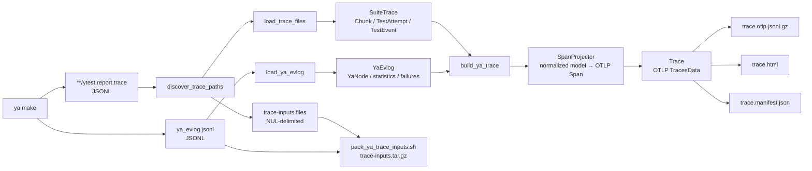

# Ya trace to OTLP conversion

This document describes how the production `scripts.tracing` package
reconstructs an OpenTelemetry trace from files produced by `ya make`. The main entry point is
[`ya_trace_report.py`](ya_trace_report.py); parsing and normalization live in
[`yatrace`](yatrace), OTLP projection uses
[`SpanProjector`](projector.py), and bundle output is handled by
[`trace_report.py`](trace_report.py) and shell scripts in this directory.

The implementation is self-contained; its production code and tests use the
same OTLP semantics and data flow.

The converter is a post-processor, not live instrumentation. It runs after
`ya make` and combines two complementary sources:

- `ytest.report.trace` describes logical test results: suites, chunks, test
  attempts, statuses, logs, and cumulative test-stage durations.
- `ya_evlog.jsonl` describes physical execution: ya phases, graph workers,
  worker subphases, failures, cache statistics, and ya's reported critical
  path.

Either source may be absent. An event log alone is useful for a build, while
test trace files alone still produce suites, chunks, tests, and inferred test
stages.

## End-to-end flow



The core pipeline is deliberately short:

```text
raw JSON → normalized ya model → bound OTLP projection → standard OTLP
```

Facts such as node kind, test identity, chunk membership, test attempts, and
merged metrics are computed once during loading. Projection reads those facts;
it does not reconstruct a second graph of wrappers, candidates, and plans.

## Time units and `Ns`

OTLP requires `start_time_unix_nano`, `end_time_unix_nano`, and event times in
Unix nanoseconds. Ya inputs do not all use that unit:

| Source field | Input unit | Conversion |
| --- | --- | --- |
| `ytest.report.trace.timestamp` | Unix seconds | `Ns.from_s(value)` |
| Test `value.time` | seconds | `Ns.from_s_or_zero(value)` |
| Event-log `value.time=[start,end]` | Unix seconds | `Ns.from_s(start/end)` |
| Critical-path `start_ts`, `end_ts`, `elapsed` | milliseconds | `Ns.from_ms(...)` or seconds for attributes |
| CLI `--attempt-start-ns`, `--attempt-end-ns` | Unix nanoseconds | `Ns(value)` |

[`Ns`](otlp/time.py) is an `int` subtype that documents and validates a
non-negative nanosecond value. [`Interval`](otlp/time.py) contains two `Ns`
values and provides the operations used throughout matching and clipping:
`len(interval)`, `clamp`, `overlap`, `boundary_distance`, and `intersection`.

For example:

```text
107.0 seconds × 1,000,000,000 = 107,000,000,000 ns
1.2 seconds   × 1,000,000,000 =   1,200,000,000 ns
800 ms        × 1,000,000     =     800,000,000 ns
```
