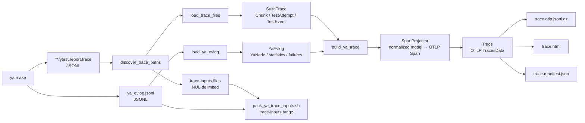
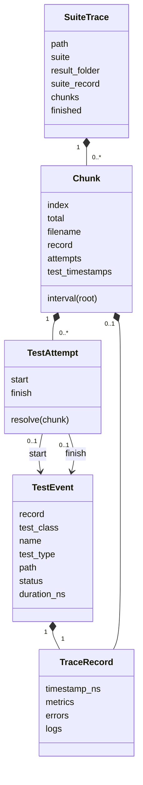
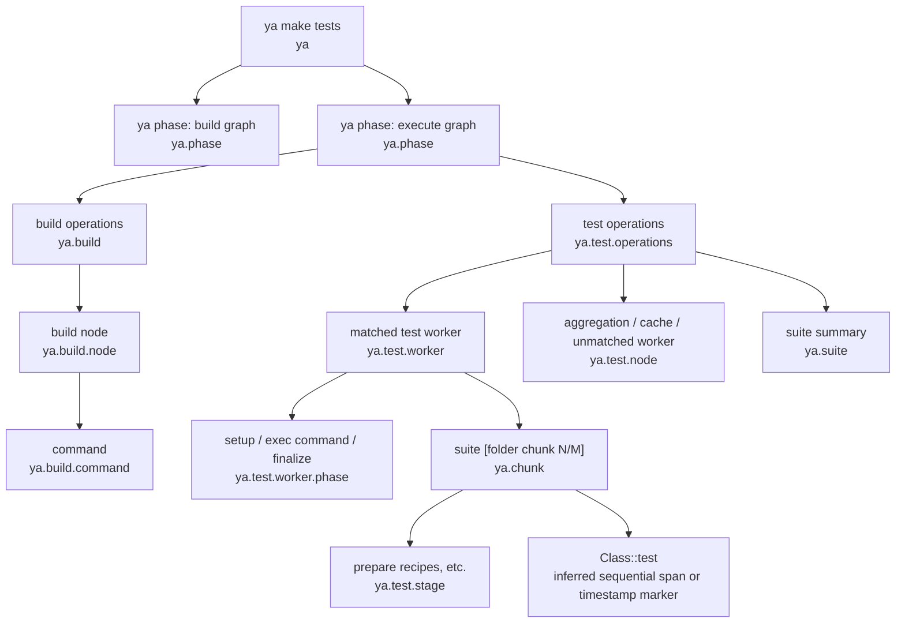

# Ya trace to OTLP conversion

This document describes how the production `scripts.tracing` package
reconstructs an OpenTelemetry trace from files produced by `ya make`. The main entry point is
[`ya_trace_report.py`](ya_trace_report.py); parsing and normalization live in
[`yatrace`](yatrace), OTLP projection uses
[`SpanProjector`](projector.py), and bundle output is handled by
[`trace_report.py`](trace_report.py) and shell scripts in this directory.

The implementation is self-contained; its production code and tests use the
same OTLP semantics and data flow.

The converter is a post-processor, not live instrumentation. It runs after
`ya make` and combines two complementary sources:

- `ytest.report.trace` describes logical test results: suites, chunks, test
  results, statuses, logs, and cumulative test-stage durations.
- `ya_evlog.jsonl` describes physical execution: ya phases, graph workers,
  worker subphases, failures, cache statistics, and ya's reported critical
  path.

Either source may be absent. An event log alone is useful for a build, while
test trace files alone still produce suites, chunks, test results, and
inferred test stages.

## End-to-end flow



The core pipeline is deliberately short:

```text
raw JSON → normalized ya model → bound OTLP projection → standard OTLP
```

Facts such as node kind, test identity, chunk membership, test attempts, and
merged metrics are computed once during loading. Projection reads those facts;
it does not reconstruct a second graph of wrappers, candidates, and plans.

## Time units and `Ns`

OTLP requires `start_time_unix_nano`, `end_time_unix_nano`, and event times in
Unix nanoseconds. Ya inputs do not all use that unit:

| Source field | Input unit | Conversion |
| --- | --- | --- |
| `ytest.report.trace.timestamp` | Unix seconds | `Ns.from_s(value)` |
| Test `value.time` | seconds | `Ns.from_s_or_zero(value)` |
| Event-log `value.time=[start,end]` | Unix seconds | `Ns.from_s(start/end)` |
| Critical-path `start_ts`, `end_ts`, `elapsed` | milliseconds | `Ns.from_ms(...)` or seconds for attributes |
| CLI `--attempt-start-ns`, `--attempt-end-ns` | Unix nanoseconds | `Ns(value)` |

[`Ns`](otlp/time.py) is an `int` subtype that documents and validates a
non-negative nanosecond value. [`Interval`](otlp/time.py) contains two `Ns`
values and provides the operations used throughout matching and clipping:
`len(interval)`, `clamp`, `overlap`, `boundary_distance`, and `intersection`.

For example:

```text
107.0 seconds × 1,000,000,000 = 107,000,000,000 ns
1.2 seconds   × 1,000,000,000 =   1,200,000,000 ns
800 ms        × 1,000,000     =     800,000,000 ns
```

## Input 1: `ytest.report.trace`

[`discover_trace_paths`](yatrace/trace_collection.py) recursively finds regular
files named `ytest.report.trace` below `--ya-out`. Symlinks and paths resolving
outside the output root are rejected. For retries, files older than the
attempt start, minus a five-second filesystem timestamp margin, are ignored.

The conventional path carries stable suite identity:

```text
<ya-out>/<suite>/test-results/<result-folder>/ytest.report.trace
```

For example:

```text
out/cloud/blockstore/libs/root_kms/impl/client_ut/
    test-results/unittest/ytest.report.trace

test.suite              = cloud/blockstore/libs/root_kms/impl/client_ut
ya.test_results.folder  = unittest
```

Only four record names participate in conversion:

| Record | Normalized information |
| --- | --- |
| `suite-event` | Suite snapshots, errors, metrics, and timestamps |
| `chunk-event` | Chunk identity, interval metrics, errors, logs, and metrics |
| `subtest-started` | Test identity and an observed start |
| `subtest-finished` | Test identity, result, duration, errors, logs, and record timestamp |

A simplified file contains the following records. They are shown pretty-printed
here; the actual JSONL file stores one record per line.

```json
{
  "name": "subtest-started",
  "timestamp": 107.0,
  "value": {
    "class": "ClientTest",
    "subtest": "Encrypt",
    "chunk_index": 0,
    "nchunks": 1,
    "type": "unittest",
    "path": "cloud/blockstore/libs/root_kms/impl/client_ut"
  }
}

{
  "name": "subtest-finished",
  "timestamp": 108.2,
  "value": {
    "class": "ClientTest",
    "subtest": "Encrypt",
    "chunk_index": 0,
    "nchunks": 1,
    "type": "unittest",
    "path": "cloud/blockstore/libs/root_kms/impl/client_ut",
    "status": "good",
    "time": 1.2
  }
}

{
  "name": "chunk-event",
  "timestamp": 109.0,
  "value": {
    "chunk_index": 0,
    "nchunks": 1,
    "metrics": {
      "suite_start_timestamp": 105,
      "suite_finish_timestamp": 109,
      "suite_prepare_recipes_(seconds)": 0.8
    }
  }
}
```

Start records produced directly by some test runners, or preserved when a test
is interrupted, may contain only `class` and `subtest`. The loader therefore
treats chunk, type, and path metadata on starts as optional and inherits it from
the matching finish when available.

### Normalization during loading

[`load_trace_files`](yatrace/trace_loader.py) uses a small private `_Event` only
while reading one file. Before returning, it converts raw events into the public
normalized model:



Normalization performs the work that projection would otherwise repeat:

1. Suite and chunk snapshots are merged in source order. Later scalar fields
   win; `logs`, `metrics`, and distinct errors are combined.
2. Test events are grouped by `(class, name)` before chunk routing. Starts and
   finishes are paired using compatible chunk, type, and path metadata, then
   inferred start time and source order as tie-breakers.
3. A paired attempt inherits its chunk identity from the available records. A
   missing chunk filename is a wildcard and an explicit filename is preferred;
   conflicting identities remain unassigned.
4. Metadata-incompatible records remain in one routing group so conflicts are
   visible, but are materialized as separate start-only and finish-only
   attempts instead of a falsely complete attempt.
5. The preferred finish is selected once. `deselected`/`not_launched` records
   do not incorrectly replace a usable finish or reuse a conflicting start.
6. Logs, errors, metrics, status code, duration, and all fallback timestamps
   become typed fields on `TraceRecord`, `TestEvent`, and `Chunk`.

Malformed JSON records are skipped and counted. Each loaded trace remembers
its count so the root span can set
`ya.trace.malformed_json_record.count` and
`ya.trace.input.incomplete=true`.

## Input 2: ya event log

[`load_ya_evlog`](yatrace/evlog_loader.py) recognizes:

| Namespace/event | Result |
| --- | --- |
| `stages` / `stage-finished` | Top-level ya phase node |
| `worker_threads` / `node-finished` | Build or test graph node |
| `worker_threads` / `node-detailed` | `setup`, `exec_cmd`, `post_cmd`, `node_result`, or `finalize` detail |
| `dump_debug` / `log`, key `stats` | Cache, execution, language, and critical-path statistics |
| `devtools.ya.build.reports.failed_node_info` / `node-failed` | Failed UID and optional process exit code |

Malformed JSON records are skipped without stopping later valid records. Their
count is reported as `ya.evlog.malformed_json_record.count`; the root also sets
`ya.trace.input.incomplete=true` when either trace or event-log input contains
malformed JSON.

Example, shown pretty-printed rather than in the event log's one-record-per-line
form:

```json
{
  "namespace": "stages",
  "event": "stage-finished",
  "value": {
    "name": "dispatch_build",
    "tag": "dispatch_build",
    "time": [
      104,
      110
    ]
  }
}

{
  "thread_name": "worker-1",
  "namespace": "worker_threads",
  "event": "node-finished",
  "value": {
    "uid": "test-node-1",
    "name": "Run(test-node-1$(BUILD_ROOT)/cloud/blockstore/libs/root_kms/impl/client_ut/test-results/unittest/meta.json)",
    "tag": "TS",
    "time": [
      105.5,
      109.2
    ]
  }
}

{
  "thread_name": "worker-1",
  "namespace": "worker_threads",
  "event": "node-detailed",
  "value": {
    "name": "exec_cmd",
    "tag": "exec_cmd",
    "time": [
      106.0,
      108.8
    ]
  }
}
```

Every accepted stage, worker, and detail becomes one
[`YaNode`](yatrace/node.py). `YaNode.from_raw` derives these fields once:

```text
Interval, kind, tool, thread, UID, output paths, cache source,
test (suite, result-folder) identity, chunk index, test size, details
```

Details are attached to the most recently finished node on the same worker
thread and kept only if their interval is contained by the node interval.

Important classifications include:

| Form | `YaNode.kind` |
| --- | --- |
| `TS`, `TM`, `TL`, `YT` with test-result output | `test_execute` |
| `TL` without test-result output | `test_list` |
| `TA` / `TR` | `test_aggregate` / `test_merge` |
| `restore[...]`, `restore_from_dist_cache[...]` | `cache_restore` or `test_cache_restore` |
| `result[...]` | `materialize` or `test_materialize` |
| cache-put wrappers | `cache_store` or `test_cache_store` |
| `Run(...)` outside test results | `execute` |
| other test/build records | test or build orchestration |

`YaEvlog.from_raw` freezes the nodes and failures and constructs
`YaBuildStatistics` and `YaCriticalPath`. Projection remains outside these
models.

## Bound OTLP projection

[`SpanProjector`](projector.py) carries the context repeated by every span:

```text
Trace + trace ID + resource + instrumentation scope + parent span ID
```

Its small API makes parentage explicit:

```python
root = projector.emit(...)
children = projector.under(root)
tests = children.scoped("ya.test")
test_span = tests.emit(...)
```

- `span_id(*identity)` derives a deterministic eight-byte ID.
- `under(span)` returns a context bound to that parent.
- `scoped(name)` returns a context bound to an OTLP instrumentation scope.
- `make(...)` constructs a span without inserting it.
- `emit(...)` constructs and inserts a span into `Trace`.

Trace and span IDs use SHA-256 over length- and type-framed identity parts.
Framing prevents ambiguous concatenations such as `("ab", "c")` and
`("a", "bc")` from producing the same input bytes.

The local [`otlp`](otlp) package wraps official
`opentelemetry-proto-json` messages. `Trace`, `SpanProjector`, `Ns`, and
`ResourceAttributes` are convenience APIs; the stored objects are ordinary
OTLP `TracesData`, `Resource`, `InstrumentationScope`, and `Span` messages.

## Projection pass 1: logical tests

[`build_ya_trace`](yatrace/projection.py) creates the root span and invokes
[`YaTraceSpanProjector`](yatrace/trace_spans.py) for every `SuiteTrace`.

| Normalized source | OTLP scope | Span name |
| --- | --- | --- |
| CLI invocation | `ya` | `ya make tests` or `ya make build` |
| `SuiteTrace.suite_record` | `ya.suite` | `<suite> [<folder> suite]` |
| `Chunk` | `ya.chunk` | `<suite> [<folder> chunk N/M]` |
| Finished `TestAttempt` | `ya.test` | `<class>::<test>` |
| `suite_*_(seconds)` metric | `ya.test.stage` | `test stage: <stage>` |

### Chunk interval resolution

`Chunk.interval(root)` prefers `suite_start_timestamp` and
`suite_finish_timestamp`. `wall_time` can recover a missing endpoint and can
refine second-rounded start/finish values using the chunk record timestamp.
Test timestamps and the root interval are fallbacks. The final interval is
always clamped to the root `ya make` interval.

### Inferred test spans and result markers

Final `ytest.report.trace` files report a test duration but no trustworthy
absolute test interval. Their `subtest-finished.timestamp` records when the
result was written to the report, which can be later than the chunk interval.
For flat, complete results whose total reported duration fits inside the chunk,
The converter lays tests out sequentially in report-record order. It uses
`suite_delay_until_first_test_secs - suite_binary_startup_secs` as the sequence
offset when available, capped so the sequence fits; otherwise it right-aligns
the sequence to the chunk end. These spans carry `test.timing.inferred=true`
and `test.timing.source=chunk-order-and-reported-duration`.

This is not valid for every runner. Go parent tests include their subtests'
durations, and other runners may produce a duration sum larger than the chunk.
Nested, overflowing, or incomplete results therefore remain zero-duration
markers at their report-record timestamps. A missing timestamp falls back to
the chunk end and is marked with `ya.test.result.timestamp.inferred=true`.

Both representations preserve the measured duration in
`test.duration.reported_seconds`; the HTML duration column always shows that
value. Status, metrics, errors, and log paths remain span attributes. A failing
or incomplete result also marks the chunk as failed.

### Test-stage spans

A chunk metric such as

```json
{
  "suite_prepare_recipes_(seconds)": 0.8
}
```

produces both a normalized chunk metric and a child span:

```text
name                                  test stage: prepare recipes
scope                                 ya.test.stage
duration                              0.8 s
ya.test.stage.name                    prepare_recipes
ya.test.stage.reported_seconds        0.8
ya.test.stage.timing.source           ya-chunk-cumulative-stage-duration
test.timing.inferred                  true
```

Ya reports stage durations but not their absolute timestamps. The converter lays these
spans sequentially from the chunk start in metric insertion order. Their
durations are real reported values; their waterfall positions are inferred.
The chunk records the reported total and its residual against chunk wall time.

## Projection pass 2: event-log execution

[`project_evlog`](yatrace/evlog.py) adds physical execution spans and matches
them to the logical test tree.



Only recognized top-level stages are rendered. `dispatch_build` bounds the
reported test hierarchy and becomes the parent of build/test operations. If it
is missing, the root interval and root parent are used.

### Matching workers to chunks

[`YaTestOperations`](yatrace/test_operations.py) creates a `TestChunk` view for
each `ya.chunk` span and directly matches test-execution `YaNode` indexes to
chunk indexes:

1. Prefer exact `(suite, result-folder, chunk-index)` extracted from the
   worker's `$(BUILD_ROOT)/.../test-results/...` output.
2. Reject explicit incompatible identities or chunk indexes.
3. Rank remaining candidates by identity match, index match, interval overlap,
   and inverse boundary distance.
4. Remove the selected chunk so matching is one-to-one.

A matched worker becomes the chunk's parent. Worker identity is copied to the
chunk, and `test.size` is copied to the chunk and its test results. The worker
interval is the envelope of the reported worker and chunk intervals; the
unadjusted duration remains in `ya.test.worker.reported_seconds`.

Unmatched executions and aggregation, merge, cache, materialization, and other
test graph nodes remain visible as `ya.test.node` spans.

### Build operations

[`YaBuildOperations`](yatrace/build_operations.py) works directly with
normalized `YaNode` indexes. `build operations` is the envelope of cache
restore, execution, and materialization workers, not the full invocation.

Selected nodes become `ya.build.node`; selected `exec_cmd` details become
`ya.build.command`. Aggregate attributes include counts by kind, cumulative
worker/command seconds, tools, cache statistics, failures, and time to the
first test worker. Cumulative seconds may exceed wall time because workers run
in parallel.

Large graphs are capped. Failed and critical-path nodes are protected first;
the longest remaining nodes fill the budget. Ordinary cache-store nodes omitted
by policy are counted separately from nodes dropped by this limit, so total
nodes equal rendered, policy-omitted, and limit-dropped nodes. These counts stay
on the operation/root attributes.

### Critical path and longest tests

The converter imports ya's `statistics.critical_path`; it does not recompute the graph's
critical path.

- Build entries prefer UID matches, then compatible timing/tool matches.
- Test entries are matched to a test worker and then to a chunk. Because ya's
  evidence is chunk-granular, the chunk and its tests are marked with
  `granularity=test-chunk` and `inferred=true`.

Finally, the ten longest complete and launched tests receive
`ya.test.duration.rank=1..10`, ranked by `test.duration.reported_seconds`
rather than the marker or inferred interval.

## Worked conversion example

Assume the raw examples above and a root attempt interval of `100–110` seconds.
The normalized logical values are approximately:

```text
SuiteTrace
  suite:         cloud/blockstore/libs/root_kms/impl/client_ut
  result_folder: unittest
  chunks:
    - Chunk(index=0, total=1, interval=105–109 s)
      attempts:
        - TestAttempt(
            start=ClientTest::Encrypt at 107.0 s,
            finish=ClientTest::Encrypt at 108.2 s, status=good,
          )
      metrics:
        suite_prepare_recipes_(seconds): 0.8

YaNode
  kind:          test_execute
  tool:          TS
  interval:      105.5–109.2 s
  uid:           test-node-1
  test_identity: (cloud/blockstore/libs/root_kms/impl/client_ut, unittest)
  test_size:     small
  details:
    - exec_cmd, 106.0–108.8 s
```

Before event-log enrichment:

```text
ya make tests                                                   10.0 s  [ya]
└── cloud/blockstore/libs/root_kms/impl/client_ut
    [unittest chunk 1/1]                                         4.0 s  [ya.chunk]
    ├── test stage: prepare recipes                              0.8 s  [ya.test.stage]
    └── ClientTest::Encrypt                             1.2 s reported  [ya.test]
```

After matching the worker:

```text
ya make tests                                                   10.0 s  [ya]
└── ya phase: execute graph                                      6.0 s  [ya.phase]
    └── test operations                                          4.2 s  [ya.test.operations]
        └── test worker: ... [unittest chunk 1/1]                 4.2 s  [ya.test.worker]
            ├── worker phase: exec command                        2.8 s  [ya.test.worker.phase]
            └── ... [unittest chunk 1/1]                          4.0 s  [ya.chunk]
                ├── test stage: prepare recipes                   0.8 s  [ya.test.stage]
                └── ClientTest::Encrypt                  1.2 s reported  [ya.test]
```

The stage's `105.0–105.8` placement is inferred from cumulative duration. With
no first-test-delay metric, the single test is right-aligned to the chunk as
`107.8–109.0`; that placement is inferred, while its `1.2`-second duration is
reported. The worker expands from its reported `105.5–109.2` interval to
`105.0–109.2` so it contains the chunk.

The field-level mapping is:

| Raw input | Normalized model | OTLP result |
| --- | --- | --- |
| trace path before `/test-results/` | `SuiteTrace.suite` | `test.suite` on suite/chunk |
| `unittest` result folder | `SuiteTrace.result_folder` | `ya.test_results.folder` |
| `chunk_index=0`, `nchunks=1` | `Chunk(index=0,total=1)` | chunk attributes and `chunk 1/1` label |
| finish record order | `TestAttempt.finish.record.order` | sequential position inside the chunk |
| `status=good` | `TestEvent(status="good",status_code=1)` | span status and `test.status=good` |
| `time=1.2` | `duration_ns=1200000000` | inferred span length and `test.duration.reported_seconds=1.2` |
| prepare-recipes metric `0.8` | chunk metric | inferred 0.8-second stage span |
| worker output path | `YaNode.test_identity` | worker-to-chunk association |
| tag `TS` | `kind=test_execute`, `size=small` | worker/chunk/test attributes |

An abbreviated standard OTLP proto-JSON inferred test span is shown below. IDs
are illustrative; real span IDs are deterministic for the resource, attempt,
and test identity.

```json
{
  "scope": {"name": "ya.test"},
  "span": {
    "traceId": "1d5814f955403040cb496052675e42f9",
    "spanId": "6aec930ba5b3332a",
    "parentSpanId": "af6df7293dc72727",
    "name": "ClientTest::Encrypt",
    "kind": 1,
    "startTimeUnixNano": "107800000000",
    "endTimeUnixNano": "109000000000",
    "attributes": [
      {"key": "test.status", "value": {"stringValue": "good"}},
      {"key": "test.duration.reported_seconds", "value": {"doubleValue": 1.2}},
      {"key": "test.timing.inferred", "value": {"boolValue": true}},
      {"key": "test.timing.source", "value": {"stringValue": "chunk-order-and-reported-duration"}},
      {"key": "ya.test.result.timestamp.source", "value": {"stringValue": "subtest-finished.timestamp"}}
    ],
    "status": {"code": 1}
  }
}
```

The actual file uses the standard nesting
`TracesData.resourceSpans[].scopeSpans[].spans[]`. `scope` and `span` are shown
side by side only to keep the example readable.

## Resource attributes, statuses, and output

[`build_resource_attributes`](ya_trace_report.py) combines GitHub environment
metadata with ya invocation attributes:

```text
service.name, github.repository, github.run.id, github.sha,
ci.component, ci.build.preset, ci.build.target,
ci.test.target, ci.test.type, ci.test.size,
ci.ya.retry, ci.ya.operation,
ci.artifact.test_log.url_prefix, ci.artifact.test_data.url_prefix
```

The effective result code sets the root status. Suite/chunk/test statuses come
from test errors and results; worker/build statuses also use failed-node UIDs
and exit codes. OTLP status codes are `UNSET=0`, `OK=1`, and `ERROR=2`.

[`write_trace_bundle`](trace_report.py) writes:

| File | Purpose |
| --- | --- |
| `trace.otlp.jsonl.gz` | Gzip-compressed standard OTLP proto-JSON |
| `trace.html` | Self-contained browser report with an embedded compact model |
| `trace.manifest.json` | Bundle schema, file names, counts, bounds, and metadata |

The JSONL file contains complete `TracesData` objects, normally in batches of
5,000 spans. JSONL is only framing; each line remains standard OTLP. Readers
merge resource/scope groups and validate IDs, time ranges, duplicates, and
parent cycles.

Safe log paths below `$(BUILD_ROOT)` are stored as relative span attributes.
Sanitized public log/test-data base URLs are stored on each OTLP resource. This
lets a combined report resolve paths using the resource of the selected span,
including when components and retries use different locations. Renderer CLI
prefixes remain a fallback for older OTLP bundles. Only HTTP(S) prefixes without
credentials, queries, fragments, or NUL bytes are retained; relative artifact
paths are validated and encoded in the browser before a link is created.

## Raw-input bundle and nonblocking CI behavior

Python writes only `trace-inputs.files`, a NUL-delimited list of selected trace
paths relative to `ya-out`. It never invokes `tar`.

[`pack_ya_trace_inputs.sh`](pack_ya_trace_inputs.sh) creates
`trace-inputs.tar.gz` in shell code. It uses `--null` and
`--verbatim-files-from` so newlines, leading dashes, and other unusual path
characters are treated literally. Trace files are stored below `ya-out/`; the
event log is stored at the archive root. No separate raw-input manifest is
needed because conversion metadata already lives in the OTLP/report manifest.

[`render_ya_trace_bundle.sh`](render_ya_trace_bundle.sh) is the shared command
used by both build and test actions. It:

1. removes stale trace outputs;
2. runs the Python converter;
3. runs the shell packer even if Python failed;
4. emits GitHub warnings, links, and outputs according to available files;
5. returns success for renderer/packer failures so diagnostics cannot change
   the build/test result.

If Python fails before writing its path list, the packer independently finds
`ytest.report.trace` files so the raw evidence can still be uploaded.

## Running the converter directly

Install requirements and expose `.github` as the Python package root:

```bash
pip install -r .github/scripts/requirements.txt
export PYTHONPATH="$PWD/.github${PYTHONPATH:+:$PYTHONPATH}"
```

Run only the Python conversion:

```bash
python3 -m scripts.tracing.ya_trace_report \
  --ya-out /path/to/ya-out \
  --evlog /path/to/ya_evlog.jsonl \
  --output-dir /path/to/trace-summary \
  --attempt-start-ns 1753952400000000000 \
  --attempt-end-ns 1753952700000000000 \
  --exit-code 0 \
  --result-code 0 \
  --component cloud/blockstore \
  --build-preset relwithdebinfo \
  --test-target cloud/blockstore \
  --retry 1 \
  --operation tests
```

Or use the same nonblocking bundle command as CI:

```bash
bash .github/scripts/tracing/render_ya_trace_bundle.sh \
  --report-dir /path/to/trace-summary \
  --ya-out /path/to/ya-out \
  --evlog /path/to/ya_evlog.jsonl \
  --warning-title "Trace report" \
  --html-url https://artifacts.example/trace.html \
  --otlp-url https://artifacts.example/trace.otlp.jsonl.gz \
  --inputs-url https://artifacts.example/trace-inputs.tar.gz \
  -- \
  --attempt-start-ns 1753952400000000000 \
  --attempt-end-ns 1753952700000000000 \
  --exit-code 0 \
  --component cloud/blockstore \
  --operation tests
```
