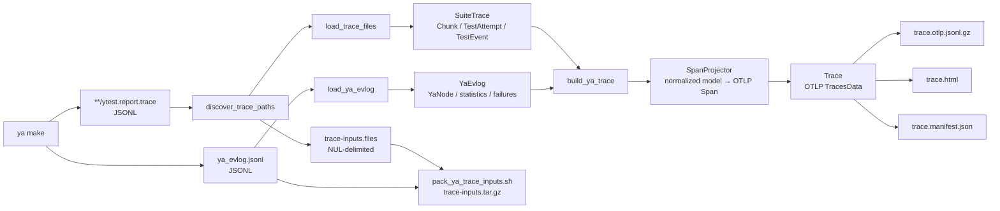
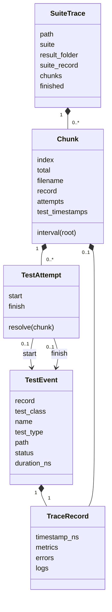

# Ya trace to OTLP conversion

This document describes how the production `scripts.tracing` package
reconstructs an OpenTelemetry trace from files produced by `ya make`. The main entry point is
[`ya_trace_report.py`](ya_trace_report.py); parsing and normalization live in
[`yatrace`](yatrace), OTLP projection uses
[`SpanProjector`](projector.py), and bundle output is handled by
[`trace_report.py`](trace_report.py) and shell scripts in this directory.

The implementation is self-contained; its production code and tests use the
same OTLP semantics and data flow.

The converter is a post-processor, not live instrumentation. It runs after
`ya make` and combines two complementary sources:

- `ytest.report.trace` describes logical test results: suites, chunks, test
  results, statuses, logs, and cumulative test-stage durations.
- `ya_evlog.jsonl` describes physical execution: ya phases, graph workers,
  worker subphases, failures, cache statistics, and ya's reported critical
  path.

Either source may be absent. An event log alone is useful for a build, while
test trace files alone still produce suites, chunks, test results, and
inferred test stages.

## End-to-end flow



The core pipeline is deliberately short:

```text
raw JSON → normalized ya model → bound OTLP projection → standard OTLP
```

Facts such as node kind, test identity, chunk membership, test attempts, and
merged metrics are computed once during loading. Projection reads those facts;
it does not reconstruct a second graph of wrappers, candidates, and plans.

## Time units and `Ns`

OTLP requires `start_time_unix_nano`, `end_time_unix_nano`, and event times in
Unix nanoseconds. Ya inputs do not all use that unit:

| Source field | Input unit | Conversion |
| --- | --- | --- |
| `ytest.report.trace.timestamp` | Unix seconds | `Ns.from_s(value)` |
| Test `value.time` | seconds | `Ns.from_s_or_zero(value)` |
| Event-log `value.time=[start,end]` | Unix seconds | `Ns.from_s(start/end)` |
| Critical-path `start_ts`, `end_ts`, `elapsed` | milliseconds | `Ns.from_ms(...)` or seconds for attributes |
| CLI `--attempt-start-ns`, `--attempt-end-ns` | Unix nanoseconds | `Ns(value)` |

[`Ns`](otlp/time.py) is an `int` subtype that documents and validates a
non-negative nanosecond value. [`Interval`](otlp/time.py) contains two `Ns`
values and provides the operations used throughout matching and clipping:
`len(interval)`, `clamp`, `overlap`, `boundary_distance`, and `intersection`.

For example:

```text
107.0 seconds × 1,000,000,000 = 107,000,000,000 ns
1.2 seconds   × 1,000,000,000 =   1,200,000,000 ns
800 ms        × 1,000,000     =     800,000,000 ns
```

## Input 1: `ytest.report.trace`

[`discover_trace_paths`](yatrace/trace_collection.py) recursively finds regular
files named `ytest.report.trace` below `--ya-out`. Symlinks and paths resolving
outside the output root are rejected. For retries, files older than the
attempt start, minus a five-second filesystem timestamp margin, are ignored.

The conventional path carries stable suite identity:

```text
<ya-out>/<suite>/test-results/<result-folder>/ytest.report.trace
```

For example:

```text
out/cloud/blockstore/libs/root_kms/impl/client_ut/
    test-results/unittest/ytest.report.trace

test.suite              = cloud/blockstore/libs/root_kms/impl/client_ut
ya.test_results.folder  = unittest
```

Only four record names participate in conversion:

| Record | Normalized information |
| --- | --- |
| `suite-event` | Suite snapshots, errors, metrics, and timestamps |
| `chunk-event` | Chunk identity, interval metrics, errors, logs, and metrics |
| `subtest-started` | Test identity and an observed start |
| `subtest-finished` | Test identity, result, duration, errors, logs, and record timestamp |

A simplified file contains the following records. They are shown pretty-printed
here; the actual JSONL file stores one record per line.

```json
{
  "name": "subtest-started",
  "timestamp": 107.0,
  "value": {
    "class": "ClientTest",
    "subtest": "Encrypt",
    "chunk_index": 0,
    "nchunks": 1,
    "type": "unittest",
    "path": "cloud/blockstore/libs/root_kms/impl/client_ut"
  }
}

{
  "name": "subtest-finished",
  "timestamp": 108.2,
  "value": {
    "class": "ClientTest",
    "subtest": "Encrypt",
    "chunk_index": 0,
    "nchunks": 1,
    "type": "unittest",
    "path": "cloud/blockstore/libs/root_kms/impl/client_ut",
    "status": "good",
    "time": 1.2
  }
}

{
  "name": "chunk-event",
  "timestamp": 109.0,
  "value": {
    "chunk_index": 0,
    "nchunks": 1,
    "metrics": {
      "suite_start_timestamp": 105,
      "suite_finish_timestamp": 109,
      "suite_prepare_recipes_(seconds)": 0.8
    }
  }
}
```

Start records produced directly by some test runners, or preserved when a test
is interrupted, may contain only `class` and `subtest`. The loader therefore
treats chunk, type, and path metadata on starts as optional and inherits it from
the matching finish when available.

### Normalization during loading

[`load_trace_files`](yatrace/trace_loader.py) uses a small private `_Event` only
while reading one file. Before returning, it converts raw events into the public
normalized model:



Normalization performs the work that projection would otherwise repeat:

1. Suite and chunk snapshots are merged in source order. Later scalar fields
   win; `logs`, `metrics`, and distinct errors are combined.
2. Test events are grouped by `(class, name)` before chunk routing. Starts and
   finishes are paired using compatible chunk, type, and path metadata, then
   inferred start time and source order as tie-breakers.
3. A paired attempt inherits its chunk identity from the available records. A
   missing chunk filename is a wildcard and an explicit filename is preferred;
   conflicting identities remain unassigned.
4. Metadata-incompatible records remain in one routing group so conflicts are
   visible, but are materialized as separate start-only and finish-only
   attempts instead of a falsely complete attempt.
5. The preferred finish is selected once. `deselected`/`not_launched` records
   do not incorrectly replace a usable finish or reuse a conflicting start.
6. Logs, errors, metrics, status code, duration, and all fallback timestamps
   become typed fields on `TraceRecord`, `TestEvent`, and `Chunk`.

Malformed JSON records are skipped and counted. Each loaded trace remembers
its count so the root span can set
`ya.trace.malformed_json_record.count` and
`ya.trace.input.incomplete=true`.
