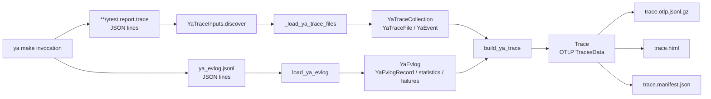
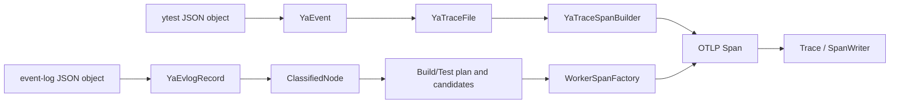
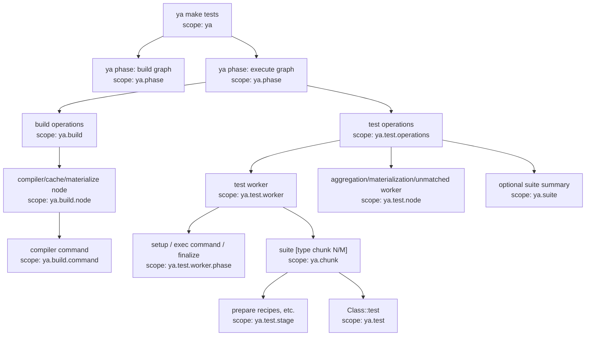
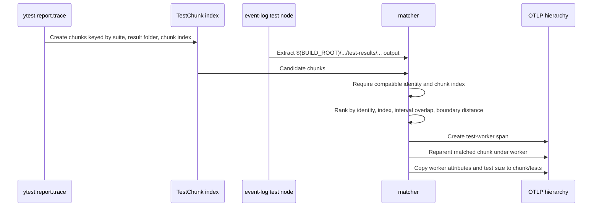

# V1 ya trace to OTLP conversion

This document describes how the original Python implementation in this
directory turns the files
produced by `ya make` into an OpenTelemetry trace. It covers the conversion path
implemented by [`ya_trace_report.py`](ya_trace_report.py) and the
[`yatrace`](yatrace) package. Workflow-level trace merging and the browser UI are
outside its main scope.

The build/test actions now invoke the production
[`tracing`](../tracing) implementation. V1 remains executable and is useful
as a reference implementation and as an external comparison oracle. Nothing in
this document describes the production implementation's internals; see
[`../tracing/YA_TRACE_TO_OTLP.md`](../tracing/YA_TRACE_TO_OTLP.md) for those.

The converter is a post-processor, not live instrumentation. It reconstructs a
trace after `ya make` finishes from two complementary sources:

- `ytest.report.trace` files describe logical test results: suites, chunks,
  individual tests, statuses, logs, and cumulative test-stage metrics.
- the ya event log (`--evlog`) describes execution: top-level ya phases, build
  graph workers, test workers, worker subphases, failures, cache statistics, and
  ya's reported critical path.

Either source can be absent. A build can be rendered from the event log without
test trace files, and test chunks can be rendered without event-log enrichment.

## End-to-end flow



At a high level, conversion has two passes:

1. Test trace files create the logical suite/chunk/test hierarchy.
2. The event log adds physical execution spans and statistics, matches workers
   to chunks, and reparents the logical hierarchy under the matching workers.

The result uses canonical types from `opentelemetry-proto-json`. The local
[`otlp`](otlp) package is a convenience layer around `TracesData`, `Span`,
`Resource`, and `InstrumentationScope`; it is not a separate span wire format.

The characteristic v1 pipeline retains the parsed input records and derives
several projection-specific views later:



For example, `YaTraceSpanBuilder` regroups `YaEvent` values into chunks and
attempts while projecting them, and event-log projection wraps
`YaEvlogRecord` in `ClassifiedNode` before constructing build/test operation
plans. This is the main architectural difference from v2, which normalizes
these facts once during loading and projects the normalized model directly.

## Inputs

### Time units

OTLP timestamps are Unix nanoseconds, while ya inputs use seconds or
milliseconds:

| Source | Input unit | V1 conversion |
| --- | --- | --- |
| `ytest.report.trace.timestamp` | Unix seconds | `Ns.from_s(...)` in `YaEvent.from_raw` |
| Test `value.time` | seconds | `Ns.from_s_or_zero(...)` during timing resolution |
| Event-log `value.time` | Unix seconds | `Ns.from_s(...)` in `YaEvlogRecord` |
| Critical-path timestamps/durations | milliseconds | `Ns.from_ms(...)` or division by 1,000 for second-valued attributes |
| CLI attempt bounds | Unix nanoseconds | `Ns(...)` |

[`Ns`](otlp/time.py) is a non-negative `int` subtype used to make the unit
visible in expressions. OTLP is the reason nanoseconds are the internal common
unit; the converter does not claim that ya originally measured every field in
nanoseconds.

### `ytest.report.trace`

[`YaTraceInputs`](yatrace/trace_inputs.py) recursively discovers regular files
named `ytest.report.trace` under `--ya-out`. For the conventional path

```text
<ya-out>/<suite>/test-results/<result-folder>/ytest.report.trace
```

the path supplies two identifiers used throughout matching and rendering:

```text
test.suite              = <suite>
ya.test_results.folder  = <result-folder>
```

For example:

```text
out/cloud/blockstore/libs/root_kms/impl/client_ut/
    test-results/unittest/ytest.report.trace

test.suite              = cloud/blockstore/libs/root_kms/impl/client_ut
ya.test_results.folder  = unittest
```

Each non-empty line is parsed independently. Only these record names are used:

| ya record | Information used |
| --- | --- |
| `suite-event` | Suite errors and metrics |
| `chunk-event` | Chunk identity, interval metrics, errors, logs, and metrics |
| `subtest-started` | Individual test identity and observed start |
| `subtest-finished` | Individual test identity, result, duration, errors, logs, and observed finish |

Repeated suite and chunk snapshots are merged. Later scalar values win, while
`logs`, `metrics`, and distinct errors are combined. Malformed JSON lines are
skipped and counted on the root span.

A simplified trace file might contain the following records. They are shown
pretty-printed here; the actual JSONL file stores one record per line.

```json
{
  "name": "subtest-started",
  "timestamp": 107.0,
  "value": {
    "class": "ClientTest",
    "subtest": "Encrypt",
    "chunk_index": 0,
    "nchunks": 1,
    "type": "unittest",
    "path": "cloud/blockstore/libs/root_kms/impl/client_ut"
  }
}

{
  "name": "subtest-finished",
  "timestamp": 108.2,
  "value": {
    "class": "ClientTest",
    "subtest": "Encrypt",
    "chunk_index": 0,
    "nchunks": 1,
    "type": "unittest",
    "path": "cloud/blockstore/libs/root_kms/impl/client_ut",
    "status": "good",
    "time": 1.2
  }
}

{
  "name": "chunk-event",
  "timestamp": 109.0,
  "value": {
    "chunk_index": 0,
    "nchunks": 1,
    "metrics": {
      "suite_start_timestamp": 105,
      "suite_finish_timestamp": 109,
      "suite_prepare_recipes_(seconds)": 0.8
    }
  }
}
```

Timestamps and durations in this file are in seconds. They are converted to the
nanosecond-based [`Ns`](otlp/time.py) type immediately.

### Ya event log

[`load_ya_evlog`](yatrace/evlog_loader.py) reads the optional event log and keeps
four categories of information:

| Namespace/event | Converted data |
| --- | --- |
| `stages` / `stage-finished` | Top-level ya phase interval |
| `worker_threads` / `node-finished` | Build or test graph worker interval |
| `worker_threads` / `node-detailed` | `setup`, `exec_cmd`, `post_cmd`, `node_result`, or `finalize` subphase |
| `dump_debug` / `log`, key `stats` | Cache, execution-stage, language, and critical-path statistics |
| `devtools.ya.build.reports.failed_node_info` / `node-failed` | Failed node UID and optional exit code |

For example, shown pretty-printed rather than in the event log's one-record-per-line
form:

```json
{
  "namespace": "stages",
  "event": "stage-finished",
  "value": {
    "name": "dispatch_build",
    "tag": "dispatch_build",
    "time": [
      104,
      110
    ]
  }
}

{
  "thread_name": "worker-1",
  "namespace": "worker_threads",
  "event": "node-finished",
  "value": {
    "uid": "test-node-1",
    "name": "Run(test-node-1$(BUILD_ROOT)/cloud/blockstore/libs/root_kms/impl/client_ut/test-results/unittest/meta.json)",
    "tag": "TS",
    "time": [
      105.5,
      109.2
    ]
  }
}

{
  "thread_name": "worker-1",
  "namespace": "worker_threads",
  "event": "node-detailed",
  "value": {
    "name": "exec_cmd",
    "tag": "exec_cmd",
    "time": [
      106.0,
      108.8
    ]
  }
}
```

Worker details are associated with the most recently finished node on the same
thread and are retained only when their interval is inside that node.

The loader creates `YaEvlogRecord` values. During enrichment, each record is
wrapped by `ClassifiedNode`; classification delegates back to derived
properties on the record. `WorkerSpanFactory` then turns the classified node
and its detail records into OTLP spans. The parsed model itself does not create
OTLP attributes or spans.

The test/build classification is derived from node tags and output paths. Some
important examples are:

| Event-log form | Classification |
| --- | --- |
| `TS`, `TM`, `TL`, or `YT` with a test-result output | Test execution (`small`, `medium`, `large`, or unclassified size) |
| `TL` without a test-result output | Test-list result |
| `TA` | Test result aggregation |
| `TR` | Test result merge |
| `restore[<tool>]` or `restore_from_dist_cache[<tool>]` | Local or distributed cache restore |
| `result[<tool>]` | Result materialization |
| `put_in_cache[<tool>]`, `put_in_dist_cache[<tool>]` | Cache store |
| `Run(...)` | Build execution |
| Other non-test nodes | Build orchestration |

## Span construction

### First pass: logical test results

[`YaTraceSpanBuilder`](yatrace/trace_spans.py) converts every
[`YaTraceFile`](yatrace/trace_file.py). Its primary mapping is:

| Source | OTLP instrumentation scope | Span name |
| --- | --- | --- |
| Invocation arguments | `ya` | `ya make tests` or `ya make build` |
| `suite-event` | `ya.suite` | `<suite> [<result-folder> suite]` |
| `chunk-event` plus its test events | `ya.chunk` | `<suite> [<result-folder> chunk N/M]` |
| Started/finished event pair | `ya.test` | `<class>::<subtest>` |
| `suite_*_(seconds)` chunk metric | `ya.test.stage` | `test stage: <metric name>` |

Instrumentation scope groups span kinds in OTLP; it does not establish the
parent/child relationship. Hierarchy is established by `parent_span_id`.

#### Chunk timing

The preferred chunk bounds are `suite_start_timestamp` and
`suite_finish_timestamp`. `wall_time` can recover or improve a missing or
second-rounded boundary. If metrics are incomplete, event timestamps are used;
the attempt interval is the final fallback. Every resulting interval is clamped
to the root `ya make` interval.

#### Individual test timing

[`YaTestTiming`](yatrace/test_timing.py) explicitly records how a test interval
was obtained:

| Available data | Result | `test.timing.source` |
| --- | --- | --- |
| Start and finish events | Their timestamps, clamped to the chunk | `subtest-events` |
| Start only | Start to chunk end; marked incomplete | `subtest-start-and-chunk-end` |
| Finish plus duration | Finish minus `time` | `finish-event-and-test-duration` |
| Only test in chunk plus first-test delay metrics | Inferred first-test start plus `time` | `chunk-delay-and-test-duration` |

An inferred interval gets `test.timing.inferred=true`. A missing finish also
gets `test.incomplete=true` and an error status. `deselected` and
`not_launched` results may still have spans, but their start events are ignored
and they are excluded from longest-test ranking.

#### Test-stage timing

A metric such as

```json
{
  "suite_prepare_recipes_(seconds)": 0.8
}
```

becomes both:

```text
ya.chunk.metric.suite_prepare_recipes_seconds = 0.8
```

and a child span:

```text
name                                  test stage: prepare recipes
scope                                 ya.test.stage
duration                              0.8 s
ya.test.stage.name                    prepare_recipes
ya.test.stage.timing.source           ya-chunk-cumulative-stage-duration
test.timing.inferred                  true
```

These metrics contain durations, not observed start/end timestamps. The
converter therefore lays them out sequentially from the chunk start, in source
metric order. Their lengths are useful; their absolute placement is inferred.
The chunk records the total reported stage time and the residual difference
from its wall time.

### Second pass: event-log enrichment

[`YaEvlog.build_spans`](yatrace/evlog.py) adds the physical execution view.

Recognized top-level stages become `ya.phase` spans. In particular,
`dispatch_build` becomes the parent of the generated build and test-operation
groups. If it is absent, those groups are attached directly to the root.



Some span types are optional, so a real trace will usually contain only a
subset of this tree.

#### Matching test workers to chunks

The two input formats do not carry a shared foreign key in every record. The
converter reconstructs the association as follows:



Matching is one-to-one. The strongest key is
`(<suite>, <result-folder>, <chunk-index>)`, parsed from the worker output path.
When identity is unavailable, interval overlap is used. Boundary distance
breaks otherwise similar matches.

The `ya.test.worker` interval is the envelope containing both the event-log
worker interval and the reported chunk interval. The original worker duration
is kept in `ya.test.worker.reported_seconds`, and
`ya.test.worker.timeline.adjusted` tells whether the envelope had to grow.
Unmatched test execution nodes and test aggregation, merge, cache, and
materialization nodes remain visible as `ya.test.node` spans.

#### Build operations and statistics

Non-test worker nodes are grouped under `ya.build`. This span is the envelope of
cache restore, execution, and materialization worker activity; it is not the
duration of the entire `ya make` invocation. The root span is the full
invocation interval.

Each selected worker becomes `ya.build.node`, and its `exec_cmd` detail can
become `ya.build.command`. Aggregate attributes include node counts by kind,
cumulative worker/command time, tool counts, failure counts, and the delay from
the build envelope to the first test worker. Cumulative time can exceed wall
time because parallel workers overlap.

Ya's statistics record supplies cache and graph data such as:

```text
ya.build.cache.considered_task.hit.ratio
ya.build.cache.considered_task.hit.count
ya.build.cache.considered_task.miss.count
ya.build.task.avoided.ratio
ya.build.task.reused_or_avoided.ratio
ya.build.dist_cache.get.bytes
ya.build.execution.stage.<name>.seconds
ya.build.execution.total.seconds
```

Graph-wide statistics are attached to the `dispatch_build` phase when it
exists, otherwise to the root. Worker-derived aggregates and build critical-path
summaries are attached to `build operations`.

To keep very large traces usable, build node and command spans are capped. The
selection protects failed and critical-path nodes, then prefers the longest
remaining nodes. Counts of rendered and dropped spans remain as attributes.

#### Critical path and longest tests

The converter imports `statistics.critical_path` reported by ya; it does not
recompute a critical path from the graph.

- Build entries are matched to build nodes, preferably by UID and then by
  timing/tool similarity. Matching nodes get `ya.build.critical_path=true` and
  the reported index/duration.
- Test entries are matched to a test worker and then to a chunk. Because the ya
  data identifies a chunk rather than an individual test, the chunk and all its
  child test spans are marked. These attributes explicitly say
  `granularity=test-chunk` and `inferred=true`.

After enrichment, the ten longest complete, launched `ya.test` spans get
`ya.test.duration.rank=1..10`. This ranking is computed from the reconstructed
test intervals, not from worker or chunk duration.

## Worked conversion example

Using the simplified `ytest.report.trace` example above and a root interval of
100–110 seconds produces this logical tree before event-log enrichment:

```text
ya make tests                                            10.0 s  [ya]
└── cloud/blockstore/libs/root_kms/impl/client_ut
    [unittest chunk 1/1]                                  4.0 s  [ya.chunk]
    ├── test stage: prepare recipes                       0.8 s  [ya.test.stage, inferred placement]
    └── ClientTest::Encrypt                               1.2 s  [ya.test]
```

The important field-level conversions are:

| Input | OTLP result |
| --- | --- |
| trace path before `/test-results/` | chunk attribute `test.suite` |
| trace result folder `unittest` | chunk attribute `ya.test_results.folder` |
| `chunk_index=0`, `nchunks=1` | chunk attributes plus display label `chunk 1/1` |
| start `107.0`, finish `108.2` | test timestamps `107000000000` and `108200000000` |
| status `good` | test status code `OK` and `test.status=good` |
| duration `time=1.2` | fallback timing evidence; observed timestamps take precedence here |
| `suite_prepare_recipes_(seconds)=0.8` | normalized metric attribute plus inferred 0.8-second stage span |

An abbreviated OTLP JSON representation of the test span is:

```json
{
  "scope": {
    "name": "ya.test"
  },
  "span": {
    "traceId": "1d5814f955403040cb496052675e42f9",
    "spanId": "6aec930ba5b3332a",
    "parentSpanId": "af6df7293dc72727",
    "name": "ClientTest::Encrypt",
    "kind": 1,
    "startTimeUnixNano": "107000000000",
    "endTimeUnixNano": "108200000000",
    "attributes": [
      {
        "key": "test.framework",
        "value": {
          "stringValue": "ya"
        }
      },
      {
        "key": "test.suite",
        "value": {
          "stringValue": "ClientTest"
        }
      },
      {
        "key": "test.name",
        "value": {
          "stringValue": "Encrypt"
        }
      },
      {
        "key": "test.status",
        "value": {
          "stringValue": "good"
        }
      },
      {
        "key": "test.timing.source",
        "value": {
          "stringValue": "subtest-events"
        }
      }
    ],
    "status": {
      "code": 1
    }
  }
}
```

The actual file nests scopes and spans in the standard hierarchy
`TracesData.resourceSpans[].scopeSpans[].spans[]`; `scope` and `span` are shown
side by side above only to keep the example compact. IDs are deterministic
SHA-256-derived values, so identical identity inputs produce stable trace and
span IDs.

If the example event-log test worker is also present, enrichment changes the
parentage to:

```text
ya phase: execute graph                                  6.0 s  [ya.phase]
└── test operations                                      4.2 s  [ya.test.operations]
    └── test worker: ... [unittest chunk 1/1]             4.2 s  [ya.test.worker]
        ├── worker phase: exec command                    2.8 s  [ya.test.worker.phase]
        └── ... [unittest chunk 1/1]                      4.0 s  [ya.chunk]
            ├── test stage: prepare recipes               0.8 s  [ya.test.stage]
            └── ClientTest::Encrypt                       1.2 s  [ya.test]
```

## OTLP resource, status, and output format

All spans for one conversion share resource attributes assembled by
`build_resource_attributes`. These include GitHub run/commit metadata from the
environment and invocation metadata such as component, build preset, targets,
test type/size, retry number, and `ci.ya.operation`.

The effective command result sets the root status. Individual suite, chunk,
test, worker, and build-node statuses are derived from ya errors, test statuses,
and failed-node UIDs. OTLP status codes are `UNSET=0`, `OK=1`, and `ERROR=2`.

[`write_trace_bundle`](trace_report.py) writes:

| File | Purpose |
| --- | --- |
| `trace.otlp.jsonl.gz` | Portable, gzip-compressed OTLP proto-JSON |
| `trace.html` | Self-contained static view of the same trace |
| `trace.manifest.json` | Bundle schema, filenames, span/trace counts, bounds, and metadata |

Every line of the OTLP file is a complete `TracesData` JSON object. Large
traces are batched, normally at 5,000 spans per line, and readers merge the
objects again. This is NDJSON framing around standard OTLP proto-JSON, not a
change to the objects themselves.

Runner-local absolute log paths are not placed in spans. Safe paths below
`$(BUILD_ROOT)` are stored as relative attributes. Public log and test-data base
URLs are supplied only to the HTML renderer, which combines them at render time.

The v1 CLI also writes `trace-inputs.manifest.json` and the NUL-delimited
`trace-inputs.files`. Its shell packer
[`pack_ya_trace_inputs.sh`](pack_ya_trace_inputs.sh) can use those files to
create a separate raw-input archive. That archive is for later reprocessing and
is not part of OTLP. The active build/test actions use the v2 bundle command,
which has a different raw-input packaging contract.

## Running the converter directly

Install the shared script requirements and make `.github` importable:

```bash
pip install -r .github/scripts/requirements.txt
export PYTHONPATH="$PWD/.github${PYTHONPATH:+:$PYTHONPATH}"
```

Then run the module after `ya make` has produced its output and event log:

```bash
python3 -m scripts.tracingv1.ya_trace_report \
  --ya-out /path/to/ya-out \
  --evlog /path/to/ya_evlog.jsonl \
  --output-dir /path/to/trace-summary \
  --attempt-start-ns 1753952400000000000 \
  --attempt-end-ns 1753952700000000000 \
  --exit-code 0 \
  --result-code 0 \
  --component cloud/blockstore \
  --build-preset relwithdebinfo \
  --test-target cloud/blockstore \
  --retry 1 \
  --operation tests
```

`--attempt-start-ns` and `--attempt-end-ns` are Unix timestamps in nanoseconds
and define the root interval to which reconstructed spans are clamped. For test
retries, discovery excludes trace files older than the attempt start (with a
small filesystem timestamp margin), because retries reuse the same ya output
directory and otherwise report files left by earlier attempts.

The command above runs v1 directly. The current build and test actions invoke
v2 instead; they keep trace generation nonblocking so trace failures cannot
change the build or test result.

## Code map

| Component | Responsibility |
| --- | --- |
| [`ya_trace_report.py`](ya_trace_report.py) | CLI, resource metadata, root span, orchestration, longest-test ranking |
| [`yatrace/trace_inputs.py`](yatrace/trace_inputs.py) | Safe discovery and raw-input bundle description |
| [`yatrace/trace_loader.py`](yatrace/trace_loader.py) | JSONL loading and input limits |
| [`yatrace/event.py`](yatrace/event.py) | Logical ya event model, merging, identities, status, errors, and log paths |
| [`yatrace/event_export.py`](yatrace/event_export.py) | Convert logical event values into OTLP attributes |
| [`yatrace/trace_file.py`](yatrace/trace_file.py) | Trace-file identity, chunk grouping, chunk interval resolution |
| [`yatrace/trace_spans.py`](yatrace/trace_spans.py) | Suite, chunk, test, and inferred test-stage spans |
| [`yatrace/test_timing.py`](yatrace/test_timing.py) | Individual test interval inference |
| [`yatrace/evlog_loader.py`](yatrace/evlog_loader.py) | Event-log parsing and selection |
| [`yatrace/evlog_record.py`](yatrace/evlog_record.py) | Parsed worker interval and derived classification properties |
| [`yatrace/node.py`](yatrace/node.py) | `ClassifiedNode` wrapper used by operation planning |
| [`yatrace/worker_spans.py`](yatrace/worker_spans.py) | Worker, worker-phase, build-node, and command span construction |
| [`yatrace/test_operations.py`](yatrace/test_operations.py) | Worker-to-chunk matching and test hierarchy enrichment |
| [`yatrace/build_operations.py`](yatrace/build_operations.py) | Build envelope, node/command selection, build spans |
| [`yatrace/statistics.py`](yatrace/statistics.py) | Cache, graph, execution, and aggregate build attributes |
| [`yatrace/critical_path.py`](yatrace/critical_path.py) | Ya critical-path parsing and span matching |
| [`otlp`](otlp) | Proto-backed OTLP attributes, time types, spans, resources, trace grouping |
| [`trace_io.py`](trace_io.py) | Batched OTLP JSONL read/write |
| [`trace_report.py`](trace_report.py) | Static HTML rendering and bundle output |
