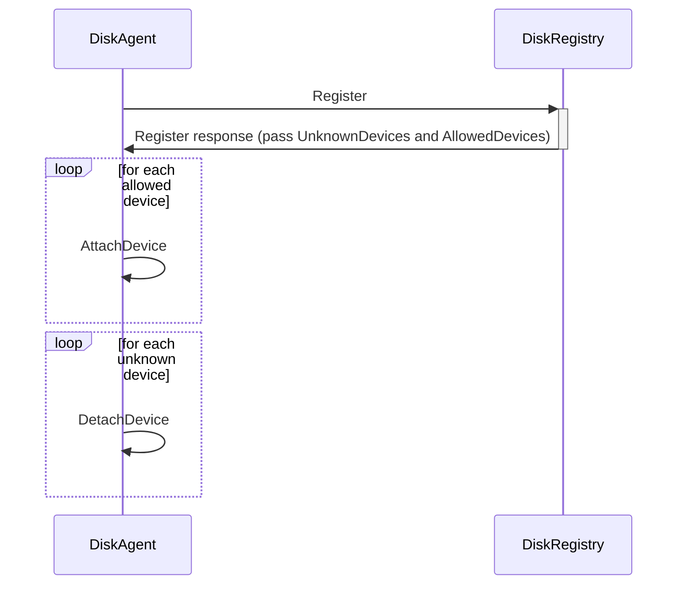
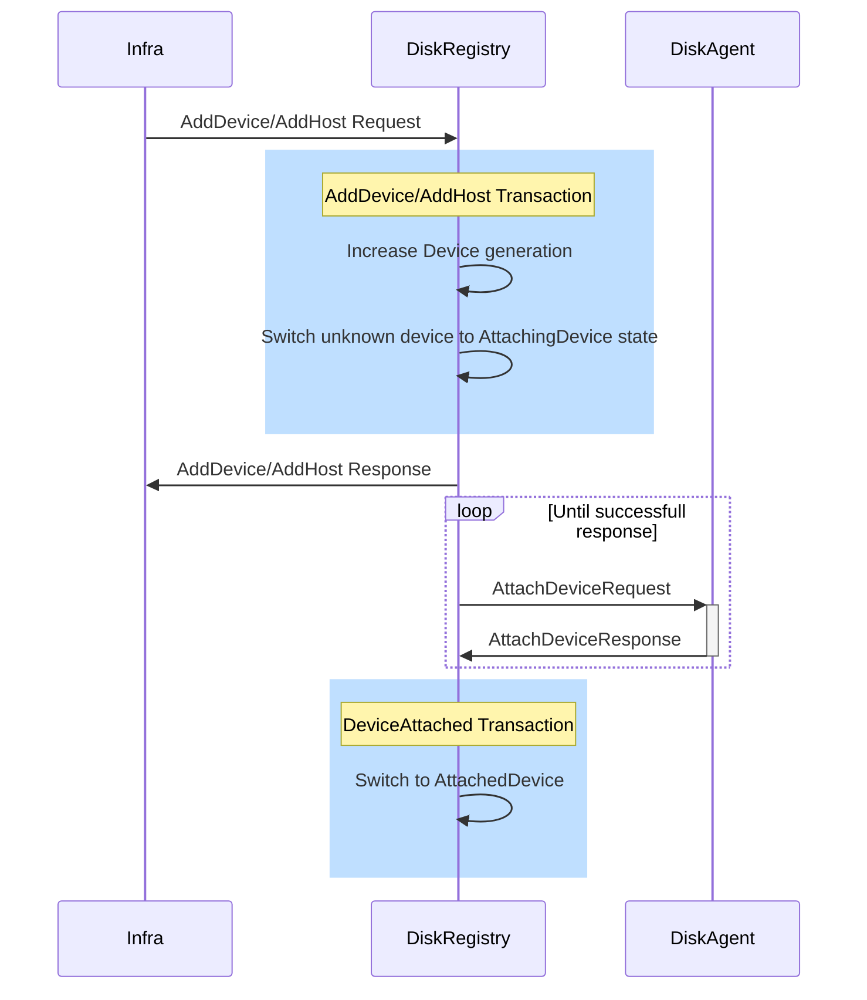
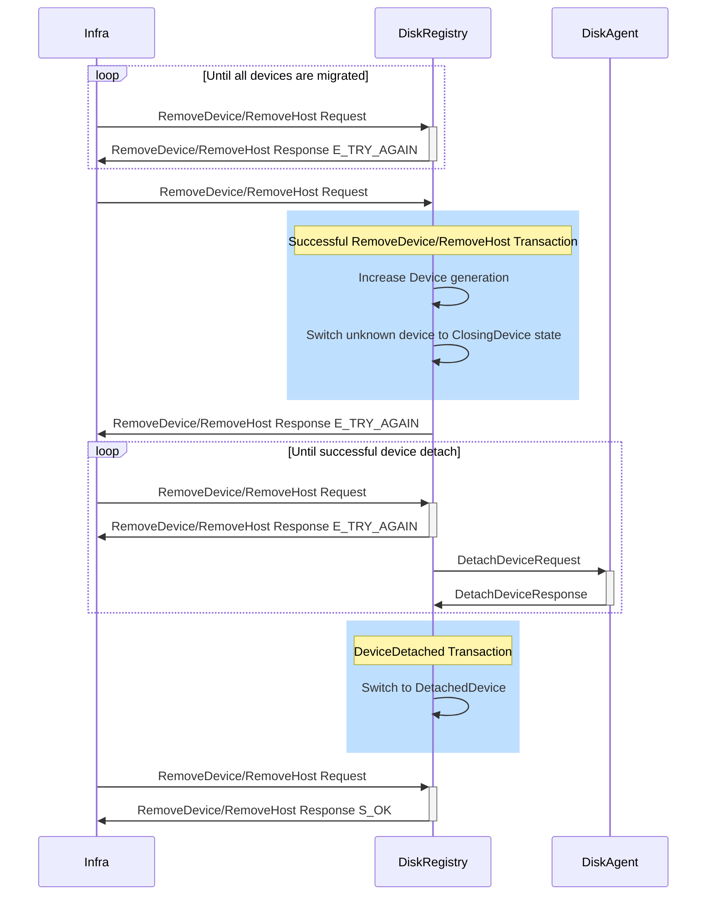

# Attach and detach devices in Disk Agent on CMS actions.

## Problem

Right now, the Disk Agent attaches all file devices at startup and holds a file descriptor until the process stops. Some infrastructure automation doesn't work because our process holds a file descriptor on non-allowed files. Because of this, infrastructure has to restart the agent to manipulate these devices (which are not placed into operation by CMS actions).

Also, in the future, we want hot reload device replacement, where infrastructure can replace broken devices without disk agent restarts.

## Overview

We can add the ability to attach and detach devices in the Disk Agent in runtime and attach and detach devices on CMS events.

## Detailed Design

### Concurrent attach detach requests

To avoid bugs, when the Disk Registry thinks that the Disk Agent has attached a device, but because of a race condition, the device is detached, we should handle all attach or detach requests to devices with some generation number. We can keep a counter in RAM for all devices lets call it DeviceGeneration, and increment it with each CMS action like AddHost/AddDevice or RemoveDevice/RemoveHost. When attaching or closing devices via TEvAttachDeviceRequest/TEvDetachDeviceRequest, or as a result of registration, we should pass device and Disk Registry tablet generations. A device generation needs to order attach and detach requests sent in one DR generation. In this way, we can order all attach and detach requests and reject outdated ones.

### Agent start and registration

First of all, we need to introduce API for attaching and closing devices in the Disk Agent. When the Disk Agent starts, it will scan all devices and attach them as usual. Then the DA will try to register in the Disk Registry. The Disk Registry will provide information about which devices need to be attached or detached by the Disk Agent in response to registration. After that, the Disk Agent should detach the corresponding devices. We attach all devices at startup to ensure that data plane works normally if the Disk Registry is down or unavailable. In the future, we can also introduce a local cache to avoid attaching unknown devices at start.

This also guarantees that Disk Agent will eventually receive the right configuration and attach all the correct devices.

### AddHost/AddDevice

First of all, we should introduce some new states for the device.
- AttachingDevice: Disk Agent should attach this device. Disk Registry should try to send AttachDeviceRequest to the Disk Agent. Disk Registry can't allocate disks on this device.
- AttachedDevice: Disk Agent should attach this device. Disk Registry can allocate disks on this device.
- ClosingDevice: Disk Agent should detach this device. Disk Registry should try to send DetachDeviceRequest to the Disk Agent. Disk Registry can't allocate disks on this device.
- DetachedDevice: Disk Agent should detach this device. Disk Registry can't allocate disks on this device.

So, Add actions will be executed in two stages:
- In the first stage, we execute a transaction, increase the device generation, and mark the device as AttachingDevice. After that, we can reply to the infrastructure that the device is in operation, but it is not allowed to allocate disks yet.
- In second stage, we asynchronously send an AttachDeviceRequest to the Disk Agent. Only after a successful response, we can execute another transaction to mark the device as AttachedDevice. After that we can start to allocate disks on the device.

These two steps are necessary to ensure that the Disk Agent will not detach the devices, even if some disks have been allocated on them.

### RemoveDevice/RemoveHost

In the same way, we execute RemoveDevice/RemoveHost in two stages:

- In the first stage, we perform a transaction to check that all devices have been migrated, and if so, we increase the DeviceGeneration and mark them as ClosingDevices. After that, no disks will be allocated on these devices.
- In the second stage, we try to send a DetachDeviceRequest to the disk agent. Only after receiving a successful response, do we mark the device as a DetachedDevice.
- After this, we can respond to subsequent RemoveDevice/RemoveHost requests with S_OK.

Right now, we respond with E_TRY_AGAIN to RemoveDevice/RemovedHost requests until all devices are migrated. After adding Attach Detach devices feature, we should respond with E_TRY_AGAIN until all the devices are detached.

### Suspended or broken devices

As a first approximation, we will not introduce any specific logic for attaching or closing when the device is broken or suspended. There's no need for that right now.
