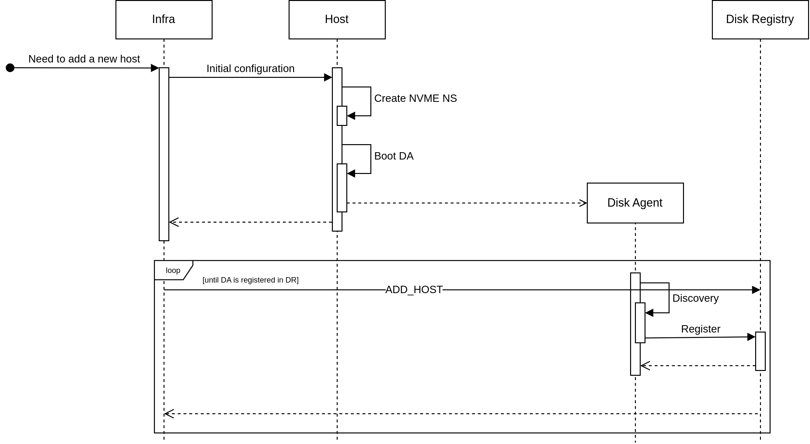
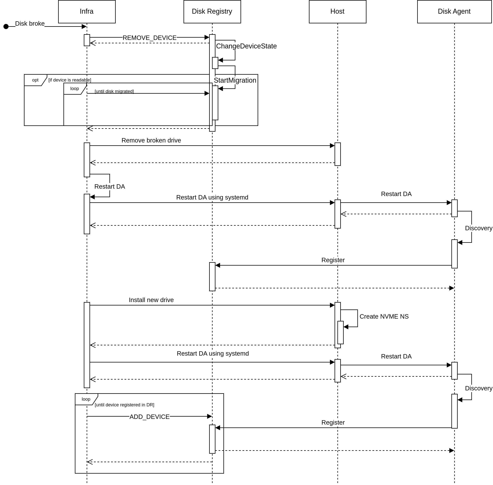
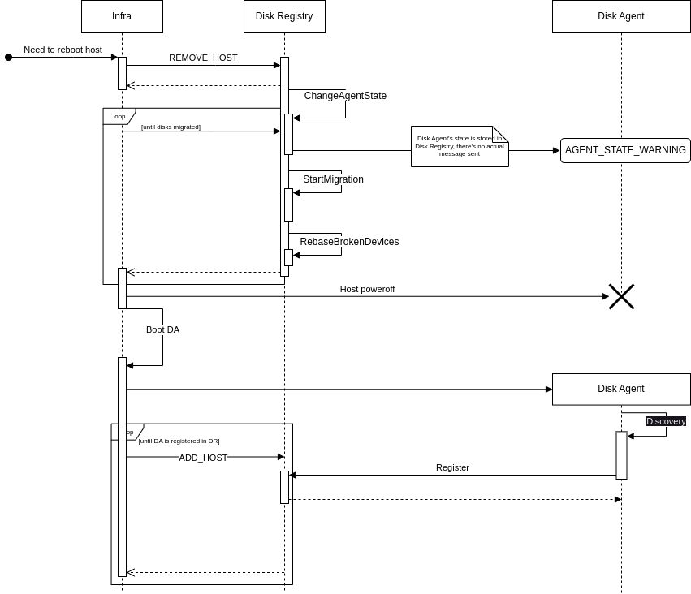

# The sequence of NRD insertion

Symbols and terms:

1. `NRD` is a nonreplicated disk or a mirrored disk replica that consists of one or more devices. It has `STORAGE_MEDIA_SSD_NONREPLICATED` [media kind](https://github.com/ydb-platform/nbs/blob/main/cloud/storage/core/protos/media.proto#L16)
1. `DA` - Disk Agent
1. `DR` - Disk Registry
1. `Infra` - infrastructure team
1. `REMOVE_(DEVICE|HOST)`, `ADD_(DEVICE|HOST)` - [requests](https://github.com/ydb-platform/nbs/blob/281d5149a922c25106cffe47ef341c172df6cafa/cloud/blockstore/public/api/protos/cms.proto ) to Disk Registry
1. Device is a physical disk or a part of a physical disk.
1. `Discovery` is the process at the start of the disk agent, when it finds disks and virtually slices them into pieces (for network drives, it is always 93GiB)

## Adding a new host to the cluster

### Text description

1. The disk on the host is "sliced" into one "NVME"-namespace, which is sliced into different devices
1. `DA` is booted as a part of host startup
1. `DA` makes `Discovery`
1. `DA` is registered in `DR`
1. All this time, `infra` sends `ADD_HOST` requests from `DR` once in a while, until at some point it returns success

### Diagram

## Broken disk

### Text description

1. The disk is broken
    1. It is not completely broken, i.e. it is readable. `REMOVE_DEVICE` is sent to the `DR` with the path to the broken disk (e.g. `/dev/disk/by-partlabel/NBSNVME01`), pending migration of all the devices of this disk (in the meantime `DA` responses with `TRY_AGAIN`)
    1. It is completely broken (the OS does not see it, nothing can be read from it) - it is impossible to migrate devices. `Infra` cannot obtain the path to the broken disk and send `REMOVE_DEVICE`.
1. The broken disk is physically removed from the host
1. `Infra` reboots `DA` on the host so that it releases the broken path. The new disk would then be accessible at the same path
1. New disk is physically installed to replace the broken one
1. `Infra` reboots `DA` on the host, which causes `Discovery`, which finds the new disk on the host and then registers it in `DR`
1. `Infra` sends `ADD_DEVICE` to `DR`

### Diagram

## Host maintenance

### Text description

1. `Infra` sends `REMOVE_HOST`, which puts the `DA` in the `WARNING` state (from the point of view of `DR`), forcing devices to migrate from this `DA`
1. After waiting for the migration of all the devices from the host, `Infra` shuts down the host
1. Move out the all broken devices (Device that in error state) to another 'fake' host.
1. When the host is ready, `Infra` boots the `DA` as a part of host startup
1. When booted, `DA` performs `Discovery`, finding a new disk on the host and then registers it in `DR`
1. All this time, `infra` sends `ADD_HOST` requests from `DR` once in a while, until at some point it returns success

### Diagram

