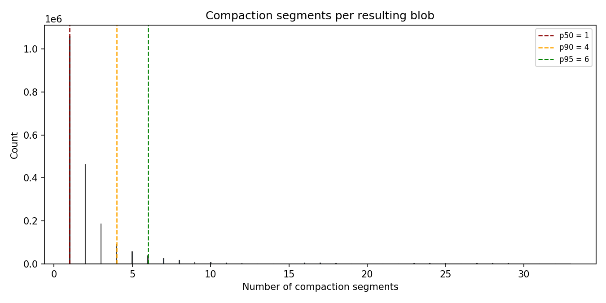
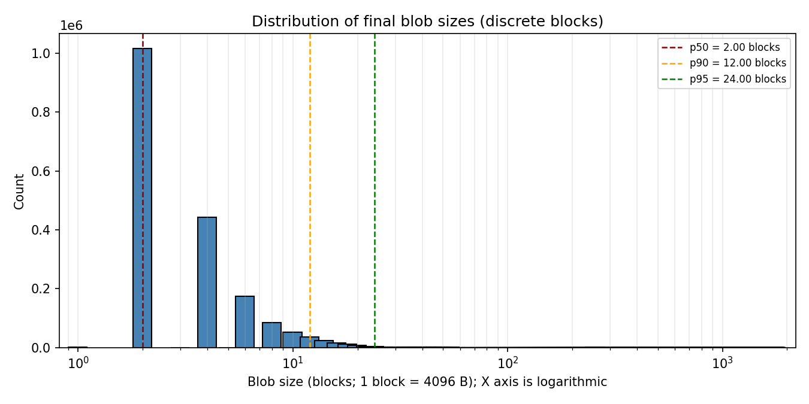
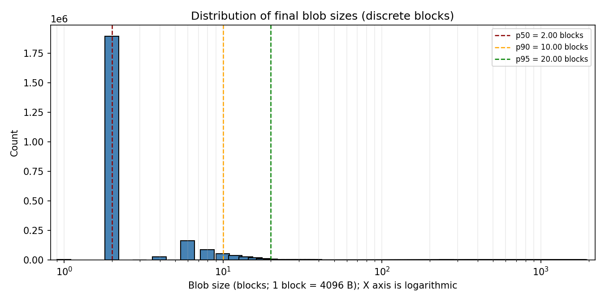
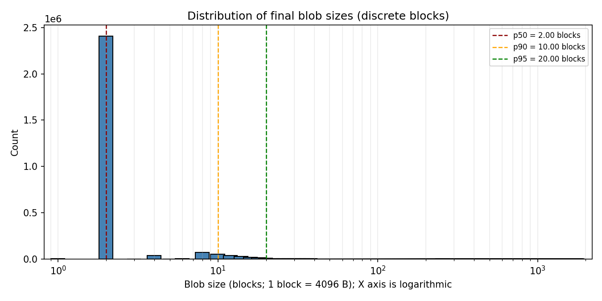

# Block Mask Optimization

## Problem

Reading block masks consumes a significant amount of CPU time during compaction transactions.

Block masks are used to track blobs whose blocks have been overwritten by other blobs. Once a block mask becomes full, the corresponding blob is added to the cleanup queue.

However, if a blob lies entirely within a single compaction range, compaction will rewrite it into a new blob anyway. In that case, reading its block mask is unnecessary.

## Proposed Optimization

Skip block mask reads for blobs that lie entirely within a single compaction range. We can identify such blobs using metadata already stored in the merge index, and by extending the mixed index with additional alignment information.

## Detailed Design

### Merged blobs

For merged blobs, the required information is already available. The merge index stores mappings of the form `[RangeStart, RangeEnd] -> [BlobId, ...]`. To determine whether a merged blob lies entirely within one compaction range, we only need to inspect the key.

### Mixed blobs

Mixed blobs are more complicated. The mixed index stores mappings of the form `[BlockIndex] -> [BlobId, Offset, ...]`. Even if we read all mixed blocks within a compaction range, we still cannot determine whether the same blob also has blocks in other ranges.

To solve this, we can add a new column to the mixed index, for example `BlobAlignment`:

- if a blob lies entirely within one compaction range, `BlobAlignment` is equal to the compaction range size;
- otherwise, `BlobAlignment` is `0`.

Then, while reading blocks during compaction, we can determine whether a blob is fully contained within a single compaction range and skip reading its block mask.

Even with this design alone, we can avoid a large fraction of block mask reads. I ran `pgbench` on a PostgreSQL cluster backed by network SSD disks, measured the number of compaction ranges touched by each flushed blob, and obtained the following results:

Most flushed blobs are contained within a single compaction range, and the overwhelming majority contain 12 blocks or fewer.

### Optional blob splitting

We can go further and split blobs that span only a small number of compaction ranges, provided the original blob is already small.

For example, we can split only when the original blob and every resulting sub-blob are either all larger than 256 KiB or all smaller than 256 KiB. The 256 KiB threshold comes from the [BlobStorage threshold for huge blobs on SSD](https://github.com/ydb-platform/ydb/blob/645ff364ef1cac6489b2282df24f7d7b4997d25e/ydb/core/blobstorage/vdisk/common/vdisk_config.cpp#L143). All blobs smaller than this threshold are similarly inefficient for BlobStorage, so this value is a reasonable cutoff for splitting.

I also measured the resulting blob size distribution when splitting blobs that span two or three compaction ranges.

#### Split for 2 compaction ranges

#### Split for 3 compaction ranges

The number of blobs larger than 256 KiB changes only slightly. In practice, only blobs containing 4 or 6 blocks disappear. With this split strategy, almost 90% of blobs become small enough to fit entirely within a single compaction range, while the number of blobs larger than 256 KiB remains roughly unchanged.

## Performance

Ran several tests for this optimization.

First, I brought two disks to the same compaction score and then started `fio`:

`fio --rw=randwrite --name=randwrite --filename=/dev/disk/by-id/virtio-blockmask --direct=1 --bs=4k --ioengine=libaio --iodepth=32 --group_reporting --size=512GB --rate_iops=4500`

Compaction score:

Compaction time percentiles:

p50:

p90:

p99:

Execution CPU time of the compaction transaction:

These results show a substantial performance improvement for compaction.
