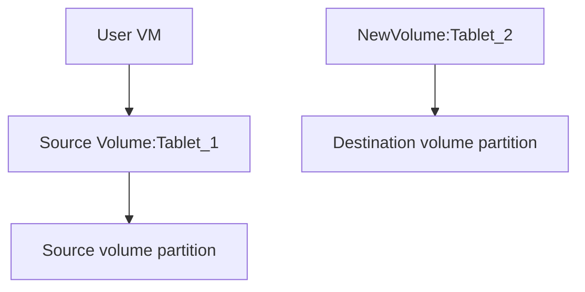
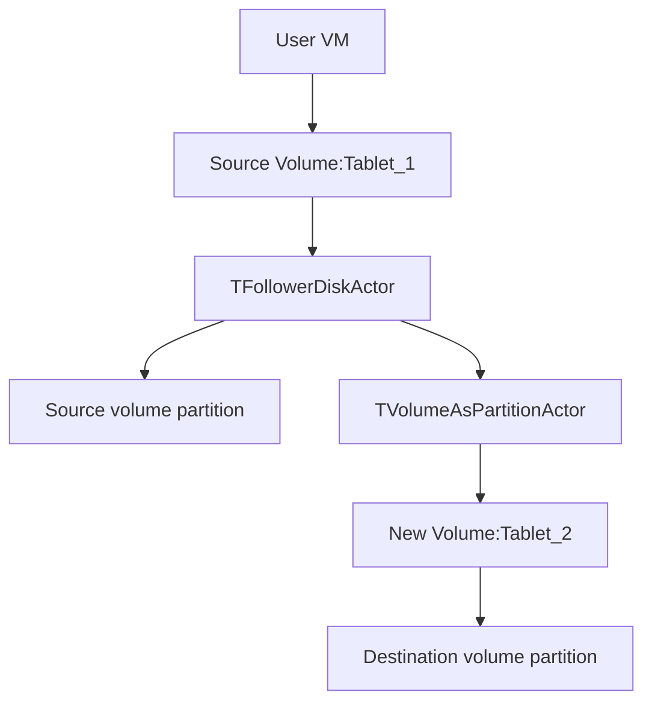
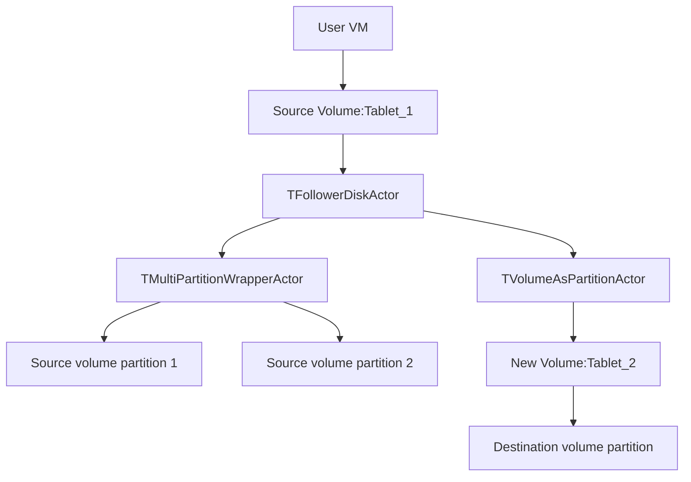
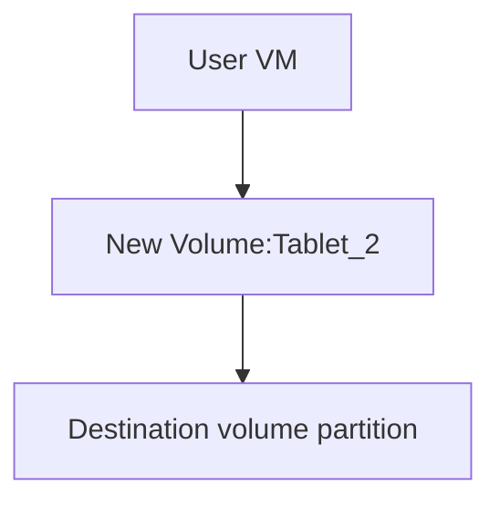

# Changing volume media-type on-fly

## General information

Currently, the volume media-type is set when creating it. Sometimes it is necessary to change the media-type to better meet the requirements of speed and reliability. This section describes how to do this without stopping the disk operation.

## Detailed Design
1. Create a new volume with a desired media type. The name of the created disk contains the suffix "-copy"
2. Store the volume-id of the newly created disk in the source volume metadata. Store the name of the source disk in the tag 'source-disk-id' of the created disk.
3. Create the TFollowerDiskActor actor based on TNonreplicatedPartitionMigrationCommonActor.
4. As the source partition for TFollowerDiskActor, give the source disk partition.
5. As the destination partition for TFollowerDiskActor, give the TVolumeAsPartitionActor, which wraps the newly created volume.
6. Perform data migration as usual
7. Transfer leadership to new volume.
8. Reconnect user to new volume.
9. Delete the source disk.

Step 1. Create new volume.

Step 2. Data transfer.

Data transfer for multipartition source

Step 3. Modify scheme shard and destroy source tablets.

