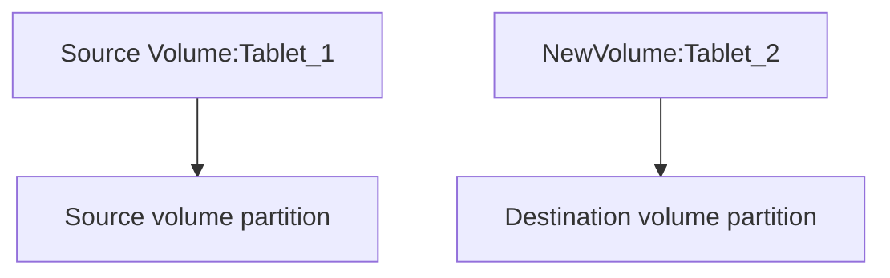
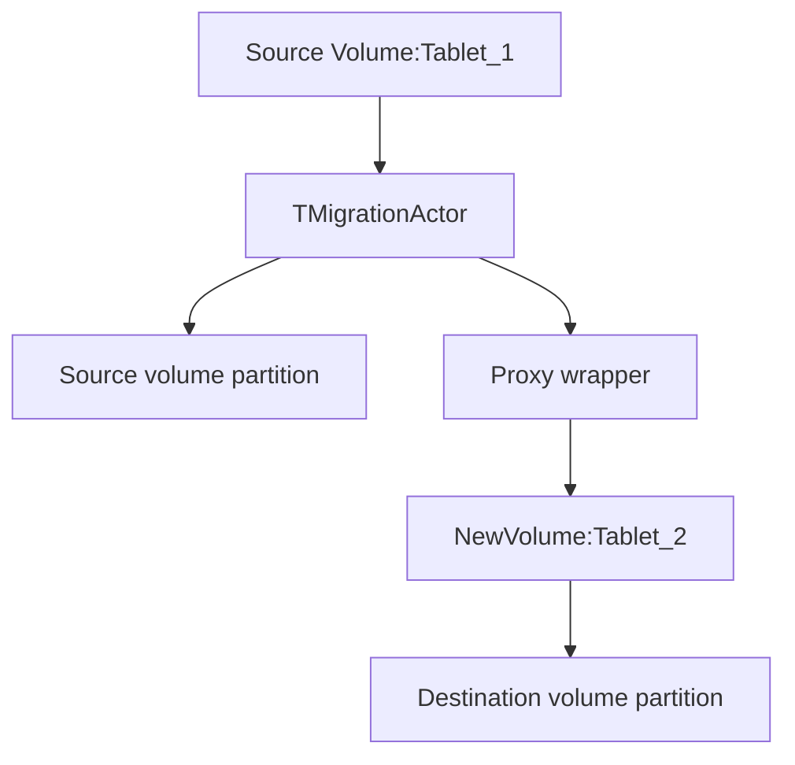
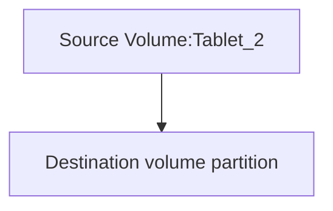

# Changing volume media-type on-fly

## General information

Currently, the volume media-type is set when creating it. Sometimes it is necessary to change the media-type to better meet the requirements of speed and reliability. This section describes how to do this without stopping the disk operation.

## Detailed Design
1. Create a new volume with a desired media type.
2. Store the volume-id of the newly created disk in the source volume metadata.
3. Create the TMigrationActor actor based on TNonreplicatedPartitionMigrationCommonActor.
4. As the source partition for TMigrationActor, give the source disk partition.
5. As the destination partition for TMigrationActor, give the proxy partition, which wraps the newly created volume.
6. Perform data migration as usual
7. Make changes to the SchemeShard so that when volume restart, a tablet of new volume will be created.
8. Delete the source disk.

Step 1. Create new volume.

Step 2. Data transfer.

Step 3. Modify scheme shard and destroy source tablets.

