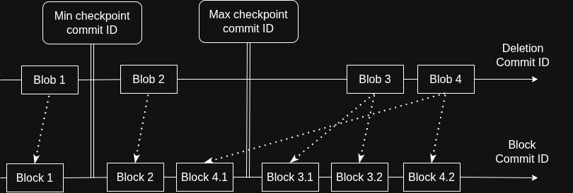

# Checkpoint-aware cleanup

Applies to blobstorage-based disks.

## Problem

Classic cleanup can delete only blobs that were added to the cleanup queue before the oldest live checkpoint. In other words, it can delete only blobs whose _deletion commit ID_ is smaller than the commit ID of the oldest checkpoint. While any checkpoint exists, blobs with greater deletion commit IDs remain in the queue, so used space continues to grow until the checkpoints are deleted.

## Solution

Checkpoint-aware cleanup scans the entire cleanup queue and can delete blobs that were added to the cleanup queue after a live checkpoint. Before deleting a blob, cleanup ensures that no live checkpoint can still need it. Other blobs remain in the queue until some checkpoints are deleted.

A blob is deleted if either of the following conditions is true:

1. It was added to the cleanup queue before every live checkpoint (`deletionCommitId < minCheckpointCommitId`). This is safe because the blob is fully covered by blobs visible to all checkpoints.
2. The blob's data cannot be observed by any checkpoint:
   - The blob is a mixed blob, and every block in the blob was written after every live checkpoint (`min(BlockCommitId) > maxCheckpointCommitId`).
   - The blob is a mixed blob, and it was written after every live checkpoint (`blobCommitId > maxCheckpointCommitId`). This is safe even if the merged blob overwrites blocks with smaller commit IDs.

Otherwise, the blob is skipped.

Example: see the diagram. Checkpoint-aware cleanup deletes blob 1 and blob 3, but keeps blob 2 because of block 2 and blob 4 because of block 4.1. Classic cleanup deletes only blob 1.

Note that this algorithm is conservative: a blob can be kept even if no current checkpoint actually needs it. In the diagram, blob 2 is kept, but it is not needed for either the minimum checkpoint or the maximum checkpoint. However, it might be needed for a checkpoint between the minimum and maximum checkpoints, if one exists.

## Milestone

Cleanup runs in batches (`MaxBlobsToCleanup`). After each batch, the last processed queue position is stored in the partition metadata as `CleanupMilestone`, together with the `(min, max)` checkpoint commit IDs for which that position is valid.

The next batch continues after the milestone, so skipped blobs are not scanned again. If the checkpoint set changes, the milestone is reset, and the queue is scanned from the beginning.

`CleanupThreshold` counts items after the milestone, so skipped blobs do not keep retriggering cleanup.

## Enablement

Disabled by default. Enable with either of the following:

- the storage config option `CheckpointAwareCleanupEnabled`
- the `CheckpointAwareCleanup` feature flag, per cloud, folder, or disk
