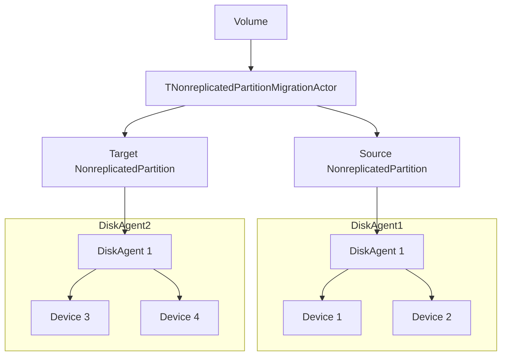
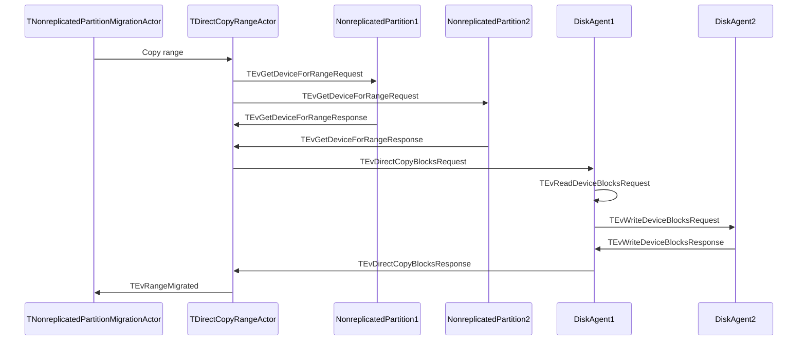

# Direct data copying between disk agents

## General information

Currently, a volume is used to transfer data to a new replica or shadow disk. It reads from one DiskAgent and writes data to another DiskAgent. This doubles the amount of data transmitted over the network compared to the approach when data is transferred from one DiskAgent to another directly.

## Detailed Design

The TCopyRangeActor that copies the data has a source and target actors. It reads from one and writes to the other. We need to mimic this actor by TDirectCopyRangeActor and collect the necessary information about the source and target devices. And then forward this information to the source or destination DiskAgent.
It is more convenient to perform operation on the source DiskAgent, in this case it will manage the throttling itself. Sometimes it is impossible to read or write data with a single request if it on border of two devices, in this case we will perform copying using the previous mechanism, via TCopyRangeActor.

To collect information about devices from the source and target actors, we will make a new GetDeviceForRange request. This request should be able to handle all types of nonrepl partitions and return the DiskAgent, device uuid, and offset on this device. If it is impossible to get such information, then it should return E_ABORT, which means fallback to TCopyRangeActor.
Next, we send the new message TEvDirectCopyBlocksRequest to the source DiskAgent and wait for execution. The  source DiskAgent should read the data and send a request to write it to the target DiskAgent. If an error has occurred, it is handled in the usual way at the TNonreplicatedPartitionMigrationCommonActor level.
The TEvDirectCopyBlocksRequest message contains all the necessary information about where to read from and where to write data. In some cases, the source and target device may be located on the same DiskAgent, in which case there is no need for network data transfer.

