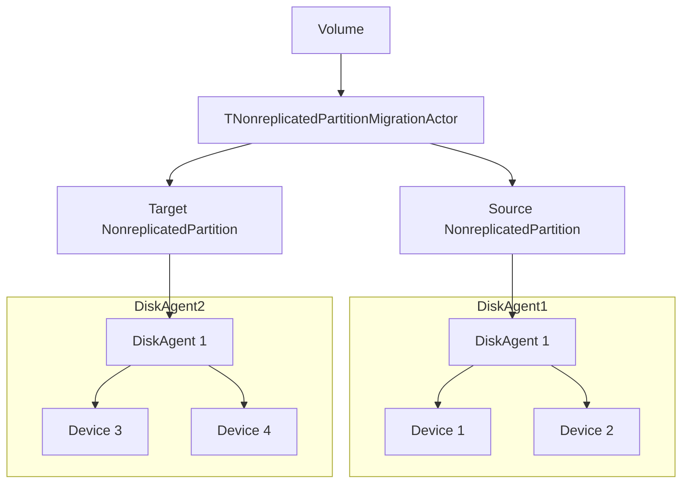
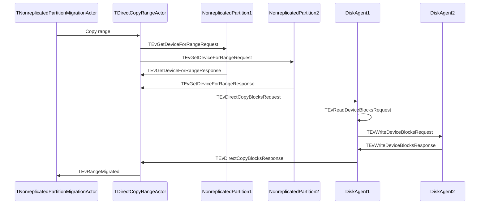

# Direct data copying between disk agents

## General information

Currently, a volume is used to transfer data to a new replica or shadow disk. This involves reading from one disk agent and writing data to another disk agent. This process doubles the amount of data transmitted over the network compared to transferring data directly from one disk agent to another.

## Detailed Design

The TCopyRangeActor, which copies data, has a source and a target actor. It reads data from the source and writes it to the target. We need to replicate this functionality with TDirectCopyRangeActor by collecting the necessary information about the source and destination devices. Then, we can forward this information to either the source or destination disk agent.
It is more efficient to perform operations on the source disk agent, as it will handle throttling on its own. Sometimes, it is not possible to read or write data in a single request when it is on the border of two devices. In this case, we will use the previous mechanism via TCopyRangeActor to perform the copying.

To collect information about devices from the source and target actors, we will send a new GetDeviceForRange request. This request should be able to handle all types of partitions and return the DiskAgent, device UUID, and offset for this device. If it is not possible to obtain this information, it should return an error code E_ABORTED, indicating that we should fallback to TCopyRangeActor.

Next, we send a new message called TEvDirectCopyBlocksRequest to the source DiskAgent and wait for its execution. The source DiskAgent should then read the data and send a request to write it to the target DiskAgent. If an error occurs, it will be handled at the TNonreplicatedPartitionMigrationCommonActor level as usual.
The TEvDirectCopyBlocksRequest message contains all the necessary information about where to read from and where to write the data. In some cases, the source and target devices may be located on the same DiskAgent, so there is no need for data transfer over a network.

