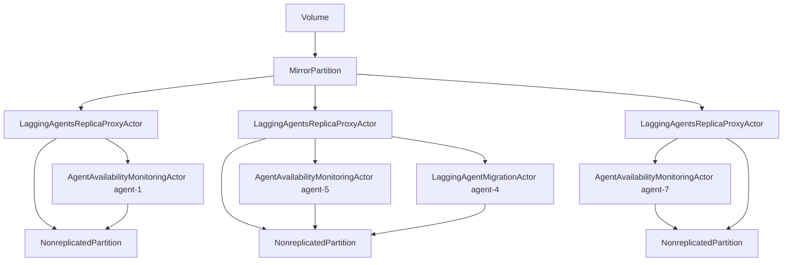
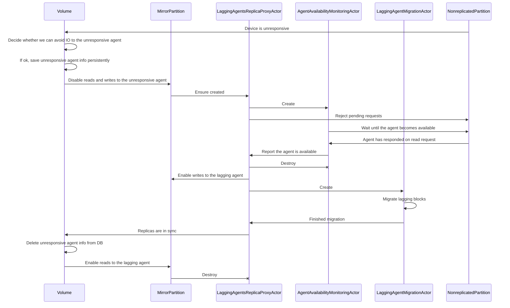

# Dynamic mirroring of IO requests in mirror-[2,3] disks proposal

## Problem

Right now, mirror disks work on top of nonreplicated partitions. Write requests are simply copied for each replica. Read requests performed on one of the replicas chosen by round-robin.
If one of the agents becomes unavailable due to e.g. host or network malfunction, all writes are blocked and the bandwidth of reads is reduced by several orders of magnitude. IO unlocks either because the agent became online again or the DiskRegistry declared the host unavailable and reallocated the volume (with the subsequent start of the migration).

## Overview

The reads issue can be solved easily by removing the unavailable agent from the round-robin. Writes, on the other hand, are a little bit trickier. Our suggestion — is to continue to write on two good replicas and store a dirty blocks map while the agent is unavailable. If it becomes online after just a small delay, we will migrate dirty blocks from the good replicas.

Since we deal with nonreplicated disks, we can't afford to store the map in the persistent DB. We will store the fact (and indexes of the lagging agents) that a disk is not mirroring its IO to all replicas. If this flag is set at the start of the service, the replication (migration in terms of our code base) process will be started. The `VolumeActor` will store the data and decide whether it's possible to ignore a bad replica.

`NonreplicatedPartition` is already tracking the response times of devices. An agent will be declared as unavailable once one of its devices has not responded for some time. The plan right now is to start from 5 seconds and slowly bring it down to values that are unnoticeable to users.

Note that we assume that if one of the agent devices becomes unresponsive, it probably means that the others are too. There is no such guarantee, of course. Technically, long response times could indicate a faulty SSD. But in that case, the DR will notice that, replace faulty devices with fresh ones, and reallocate the volume. The volume then fills up those fresh devices with actual data.
The major benefit of such an assumption is that when all of the replica devices of an agent belong to a single SSD, user IO will hiccup only once.

## Goals

Ultimately, we wish that the user will not notice a situation when one of the devices per row is unavailable.
Imagine Mirror-3 disk with 5 devices. The disk devices belong to 8 different agents. Agents 1, 5, and 7 are unavailable, agent 4 has become online after a short period of network issues. The rest are ok.

| Replica 0    | Replica 1   | Replica 2 |
| ------------ | ----------- | --------- |
| Agent-1 X    | Agent-3 ✓   | Agent-6 ✓ |
| Agent-2 ✓    | Agent-3 ✓   | Agent-7 X |
| Agent-2 ✓    | Agent-4 ↻   | Agent-8 ✓ |
| Agent-2 ✓    | Agent-4 ↻   | Agent-8 ✓ |
| Agent-2 ✓    | Agent-5 X   | Agent-8 ✓ |

In this state, no matter the block index, a write operation will be performed on two good devices. This is sufficient for us to guarantee data safety.

## Detailed Design

There will be 3 new entities:
1) `LaggingAgentsReplicaProxyActor`
2) `AgentAvailabilityMonitoringActor`
3) `LaggingAgentMigrationActor`

In the example above, architecture schema will look like this:

### LaggingAgentsReplicaProxyActor

This actor proxies all IO messages between MirrorPartition and `NonreplicatedPartition`. Its purpose is to manage lagging agents in one of the replicas.
A lagging agent can be either unresponsive or replicating.

- In the unresponsive state:
    - `AgentAvailabilityMonitoringActor` is created.
    - Doesn't accept reads.
    - Writes that hit unavailable agent instantly replied with `S_OK` and their range is stored in the dirty block map.
    - Writes that hit 2 agents and one of them is available are split into two parts. The range of the unavailable one is stored in the map. The second one is proxied to `NonreplicatedPartition`.
    - Writes that hit available agents are just proxied to the `NonreplicatedPartition`.
    - Ultimately, waiting for one of the two events: the volume reallocates and creates a migration partition, or `AgentAvailabilityMonitoringActor` notifies that the agent has become available. The second event switches state to the replicating.

- In the replicating state:
    - `LaggingAgentMigrationActor` is created.
    - Doesn't accept reads.
    - Writes are proxied to `LaggingAgentMigrationActor`.

There can be 0-1 instances of `LaggingAgentsReplicaProxyActor` per `NonreplicatedPartition`. The presence of the `LaggingAgentsReplicaProxyActor` indicates that the replica has agents that lag behind. `LaggingAgentsReplicaProxyActor` manages the lifetimes of `AgentAvailabilityMonitoringActor` and `LaggingAgentMigrationActor` entities.

Since the dirty block map will not be stored persistently, we must handle lagging replica on restart of a partition, volume, or a whole service. In this case, the replication is started. Devices that are lagging behind will be marked as "fresh" and the migration process will start automatically. However, there will be one improvement. `TCopyRangeActor` will check the checksums of block ranges before actual replication, as a lot of data remains the same.
The "freshness" of the devices should be propagated to the DiskRegistry. This will eliminate the possibility of discarding two replicas with the actual data.

### AgentAvailabilityMonitoringActor

This is simple actor that periodically reads a block with a small timeout. Once it is succeded, it notifies the `LaggingAgentsReplicaProxyActor` which in response will destroy the `AgentAvailabilityMonitoringActor` and create a `LaggingAgentMigrationActor`.

### LaggingAgentMigrationActor

`LaggingAgentMigrationActor` is an actor that migrates dirty block map (collected by `LaggingAgentsReplicaProxyActor`) from 2 available agents to the lagging one. It inherits from `TNonreplicatedPartitionMigrationCommonActor` since it already has most of the necessary functionality:
- Copies from one actor to the other
- Does copying by blocks map
- Proxies user writes to the `NonreplicatedPartition`
- Prioritizes migration over user writes

### Sequence diagram

Example of a sequence diagram when one of the devices becomes unresponsive:

