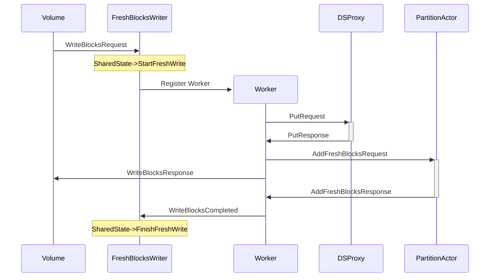

# Fresh Blocks Writer

## Problem

Currently, for YDB disks, all read/write requests go through the Partition tablet.

At the same time, the partition tablet performs read transactions from the local database during reads and asynchronous operations (Cleanup, Compaction). That is, while the Execute transaction is running, the entire tablet is blocked and cannot process writes, even those that go to fresh and do not require writing to the index.

These on-CPU transaction stages can easily take 5–10 ms to complete.

Because of this, when Compaction begins, latency doubles and becomes highly unstable.

## Solution

Introduce a partition proxy that handles all fresh requests. There is no interaction with the partition from request execution start until the response is sent to the volume.

## Detailed Design

### WriteBlocks

With this scheme we expect actor mailboxes to have FIFO guarantees, so if `ctx.Send` preserves order, the actor receives events in the same order. We send `AddFreshBlocksRequest` to the partition strictly **before** replying to the volume, so fresh blocks are added to the cache strictly **before** the partition can receive a read request that must observe those blocks. We therefore do not wait for any events from the partition from the moment the request is received until the reply is sent to the volume.

### Synchronization

Synchronization of trim and commit barriers is done with shared state. All needed actions happen in the `StartFreshWrite` and `FinishFreshWrite` methods.

In the `StartFreshWrite` method we do the following under one lock:
1. Generate a new commit ID
2. Acquire Trim Barrier
3. Acquire Commit Barrier

Generating a new commit ID and acquiring the trim barrier should be done atomically to prevent trimming in-flight requests. If these operations happen not atomically, such a situation is possible:

1. FBW: Generate new commit ID: commit-id-2
2. Partition: Get TrimFreshLogToCommitId: commit-id-2
3. FBW: Acquire Trim Barrier: commit-id-2
4. Partition: mark all fresh blobs until commit-id-2 for garbage collection

So if restart is happening after it, we will lose data.

Generating a new commit ID and acquiring the commit barrier should be done atomically too, to prevent overwriting fresh writes with a compaction blob. If these operations happen not atomically, such a situation is possible:

1. fbw: gen commit-id-1
2. part: run compaction
3. part: gen commit-id-2
4. part: look into commit-queue - no barriers! launch compaction!
5. fbw: acquire barrier for commit-id-1 - but it's too late
6. fbw: complete fresh block writing
7. part + compaction actor: overwrite fbw data with old data but a higher commit-id - commit-id-2.

On finishing a fresh write we should release all trim and commit barriers and then process the checkpoint and commit queue. During compaction or checkpoint creation we should wait for all in-flight commits to complete, so after finishing a fresh write we execute all waiting transactions.

