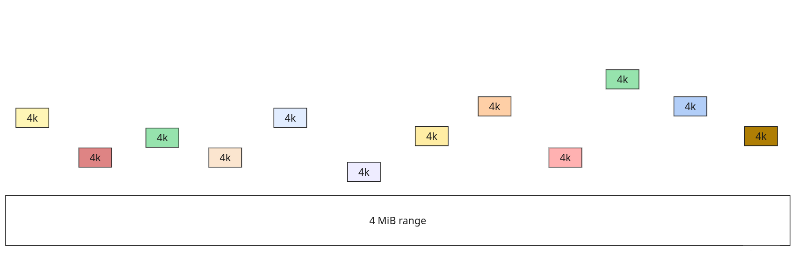
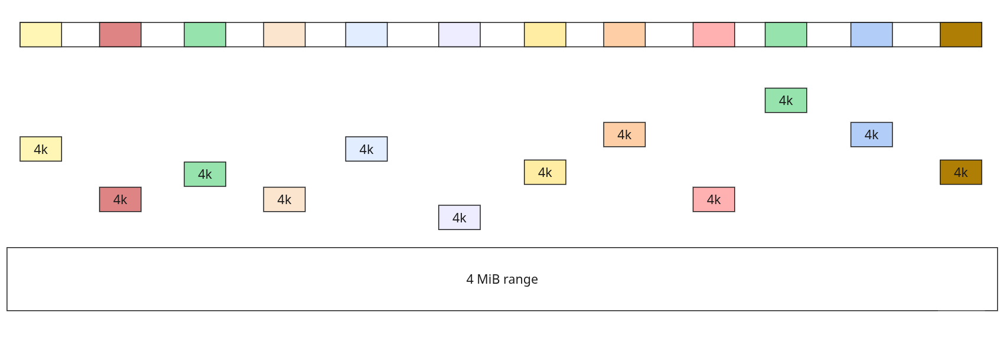
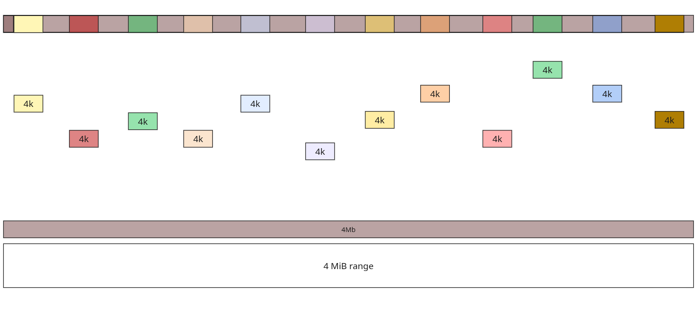
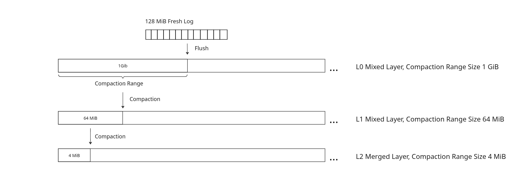
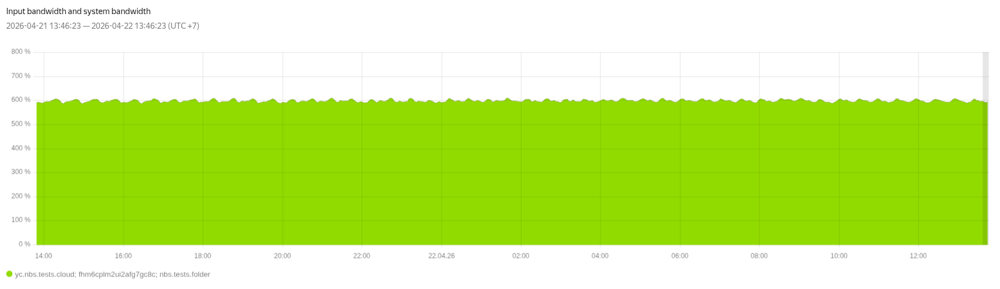

## Problem

Our current compaction is very local: 4 MiB regions only.
For a 512 GiB disk under random 4 KiB writes, a flush from Fresh usually places no more than one block into each 4 MiB range. With the current compaction threshold (e.g. compact when a range accumulates 20 blobs), we often reach compaction with many tiny, sparse blobs:



In this state, compaction needs 70+ random 4 KiB reads and then writes a new blob. Before data reaches merged/mixed layers, aggregation is weak, so we have little chance to read in larger chunks. Sustaining high throughput on 4 KiB reads is much harder than on ~256 KiB reads.



Another issue: sparse updates can force rewrites of already well-aggregated blobs.
Example: if a range already contains large blob and receives 70 tiny ones, we can end up with:



To compact 280 KiB of useful updates, we may rewrite 4 MiB of data, which is expensive.

### Goal

During EternalLoad / random-write workloads, we want compaction to:

1. Read larger chunks.
2. Reduce the number of tiny blobs in BlobStorage.
3. Avoid rewriting large, already-local blobs when compacting sparse updates.

## Proposed Solution

### Architecture



1. **Fresh channel**: 128 MiB, with support for large writes (metadata in Fresh, data in merged).
2. **L0 mixed**: regional compaction with 1 GiB regions.
3. **L1 mixed**: regional compaction with 64 MiB regions.
4. **L2 merged**: current merged layer with 4 MiB regional compaction.

Each level (L0, L1, L2) has its own `CompactionMap` to track blob count and liveness.

### Why 128 MiB in Fresh

For random 4 KiB writes on a 512 GiB disk, a 128 MiB flush gives on average ~256 KiB per 1 GiB region after sharding by region boundaries.

If we want to minimize non-huge blobs even further, the threshold can be raised to ~150-160 MiB:

- at 128 MiB, roughly half of blobs may still be below the huge-blob threshold (256 KiB),
- at 160 MiB, the fraction of such "bad" blobs is estimated at ~3%.

For mostly idle disks, 128 MiB may be too memory-expensive.
A time-based flush fallback is recommended: if there was no flush for `N` seconds, flush accumulated data even if size threshold is not reached.

Question: Question: We can lower the minimum huge blob size for SSD groups. If we lower it to 128 KiB, almost all blobs will be larger than 128Kib.

## Data Flow (512 GiB Disk, Random 4 KiB Rewrites)

Assume the workload rewrites the whole disk with random 4 KiB writes, then repeats.

1. **Fresh**: writes go to Fresh as today.
2. **Flush Fresh at 128 MiB**:
   - aggregate small blobs,
   - split by 1 GiB regions,
   - write to L0.
   - for random writes this gives ~256 KiB per 1 GiB region on average.
3. **Compact L0** when a region accumulates 16 blobs:
   - split by 64 MiB boundaries and push to L1,
   - expected average: ~256 KiB per 64 MiB region.
4. **Compact L1** similarly (threshold 16):
   - split by 4 MiB boundaries and push to L2,
   - expected average: ~256 KiB per 4 MiB region.

## Additional Heuristics

### 1) Keep data on current level if promotion quality is poor

A promotion threshold is needed.
If splitting by next-level boundaries would produce too many tiny blobs (<256 KiB), compact and keep data on the current level instead of pushing it down.

### 2) Avoid rewriting already-good large blobs

If a blob is:

- large enough (>256 KiB),
- narrow/local enough for the next level,
- mostly live,

then we can move only index metadata to the next level and skip physical blob rewrite.

## Write Amplification

For random 4 KiB writes, before we reach ~256 KiB average data per 4 MiB range, expected WA is about **5-6**:

1. write to Fresh: `+1 WA`
2. flush to L0: `+1 WA` (~256 KiB per 1 GiB)
3. flush to L1: `+1 WA` (~256 KiB per 64 MiB)
4. flush to L2: `+1 WA` (~256 KiB per 4 MiB)
5. rewrite blobs from the previous rewrite cycle in 4 MiB ranges: `+1..2 WA`

### WA estimate for current scheme

Let:

- compaction trigger in a 4 MiB range be `k` blobs,
- each source blob contain one 4 KiB update (sparse random write case),
- one compaction rewrite `(1 MiB + k * 4 KiB)`.

Then for one full rewrite cycle:

```
Compactions per 4 MiB range = 4 MiB / (k * 4 KiB)

WA ~= (4 MiB / (k * 4 KiB)) * (1 MiB + k * 4 KiB) / 4 MiB + 2
   = 2 + (1024 * (1 + k/256)) / (4 * k)
```

Examples:

- `SSDMaxBlobsPerRange = 70` -> WA ~`6.65`
- `SSDMaxBlobsPerRange = 20` -> WA ~`15.8`

So increasing `k` reduces WA, but also increases the number of tiny blobs before compaction, which hurts compaction bandwidth and CPU efficiency.

### EternalLoad WA result



The key point: WA remains comparable, but BlobStorage usage becomes much more efficient:

- larger blobs are written,
- compaction reads whole blobs instead of many tiny fragments,
- higher compaction bandwidth becomes achievable.
- each blob usually fits within a single compaction range, so different ranges can be compacted in parallel more easily.

## Different compaction range sizes

We can tune **L0** and **L1** compaction range sizes to trade off:

- **Fresh buffer size** (how much data accumulates before the first regional split),
- **RAM per L0 / L1 compaction job**,
- **average output blob size** (targeting at least ~256 KiB per step, as elsewhere in this doc).

Reasonable grids:

- **L0** compaction regions: 1 GiB, 2 GiB, 4 GiB
- **L1** compaction regions: 64 MiB, 128 MiB

### Minimum blob-count thresholds (fanout)

To keep ~256 KiB average payload per child region when promoting from L0 to L1, the **L0 blob-count threshold** should be at least `L0CompactionRangeSize / L1CompactionRangeSize` (one output slice per L1 child region). The **L1 blob-count threshold** toward the 4 MiB merged layer should be at least `L1CompactionRangeSize / 4 MiB`.

**L0 minimum blob-count threshold** (rows = L0 region size, columns = L1 region size):

| L0 size / L1 size | 64 MiB | 128 MiB |
|------------------:|-------:|--------:|
| 1 GiB             | 16     | 8       |
| 2 GiB             | 32     | 16      |
| 4 GiB             | 64     | 32      |

### Approximate RAM for one L0 compaction

Same geometry; figures are **order-of-magnitude** estimates (aligned with the “~8 MiB for 1 GiB / 16-way” discussion in Open Questions):

| L0 size / L1 size | 64 MiB | 128 MiB |
|------------------:|-------:|--------:|
| 1 GiB                  | ~8 MiB | ~4 MiB  |
| 2 GiB                  | ~16 MiB | ~8 MiB |
| 4 GiB                  | ~32 MiB | ~16 MiB |

### Fresh flush size vs L0 region size

To preserve ~256 KiB **per 1 GiB** of L0 coverage after a flush, scale Fresh inversely with L0 region width (512 GiB disk example):

| L0 region | Fresh flush size |
|----------:|:-----------------|
| 1 GiB     | 128 MiB          |
| 2 GiB     | 64 MiB           |
| 4 GiB     | 32 MiB           |

### Approximate RAM for one L1 compaction

| L1 region | RAM per compaction (approx.) |
|----------:|:----------------------------|
| 64 MiB    | ~8 MiB                      |
| 128 MiB   | ~16 MiB                     |

### Example configuration

**L0 = 4 GiB**, **L1 = 64 MiB**: small Fresh footprint (**32 MiB**), moderate L1 compaction RAM (**~8 MiB** per job), but each **L0** compaction is heavier (**~32 MiB** RAM per job). On a 512 GiB volume there are only **128** L0 regions, so total L0 parallelism stays bounded—you rarely need “all ranges at once” compaction on L0.

## Disks larger than 512GiB

Partition for every 512GiB or Data-volume trigger for top layer

## Garbage compaction

Mixed layers stay **sparse**: they hold relatively few live blocks compared to the full disk. To drive **garbage-aware** compaction (e.g. trigger or prioritize by garbage fraction), we need a compact **per-block view** of what is live in those layers.

For a **512 GiB** volume, mixed layers cap out around **32 GiB** of user data. At **4 KiB** per logical block that is **8 388 608** block indices.

By **used block map** we mean an in-RAM **set of used block indices** (e.g. a hash set keyed by 32-bit block index). With **~4 bytes per entry** in the worst case (one index per live block in mixed layers), the structure is on the order of **8 388 608 × 4 B ≈ 32 MiB ≈ 30 MiB** RAM—small next to compaction working sets. (A real hash table has extra overhead for buckets/pointers; the footprint stays in the same ballpark until load factors or larger values per key.)

With this set maintained incrementally on writes, **garbage / coverage statistics can be updated without an extra BlobStorage read on every write**; BS reads remain on the compaction path.

## Some corner cases

### Low-write-rate disks (~100 IOPS)

For the top layer, replace blob-count trigger with a data-volume trigger (e.g. compact when 4-16 MiB is accumulated).

This should eventually aggregate enough tiny blobs into normal-size blobs before promoting downward, while keeping small-blob count bounded.

If we flush 8 MiB, each 1 GiB range gets ~16 KiB on average, i.e.:

- at most 256 blobs per 1 GiB range,
- at most 131072 small blobs overall.

Compared to current behavior (~9175040 tiny blobs), this is ~70x fewer blobs and larger average blob size (16 KiB vs 4 KiB).
