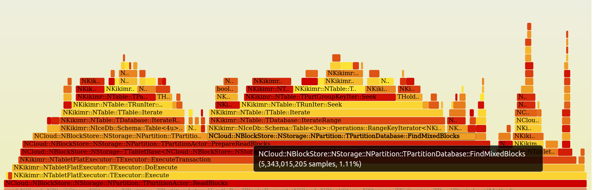
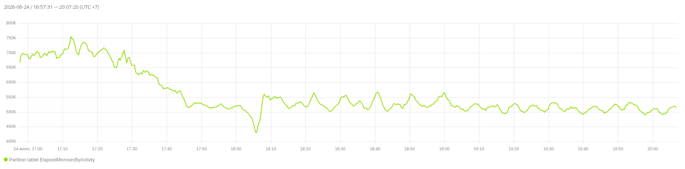

# Mixed Index Blocks Filter

## Context

The mixed index is sparse, but `ReadBlocks` still has to inspect it for every
requested block.  This makes negative lookups needlessly expensive: only about
6% of blocks are present in the mixed index, while mixed-index lookup is a substantial
part of the read transaction CPU time.



`TMixedBlocksFilter` is an in-memory, compressed-bitmask filter that lets the
read path skip a mixed-index lookup when the requested block is known not to
be present for the requested commit ID.  It is not a Bloom filter: a negative
result is exact for the range/commit-ID conditions described below.  A positive
result means *may be present* and must be confirmed by the existing mixed
index.

The prototype reduced partition-tablet CPU consumption by
28% for a 4 KiB random read/write workload and used approximately 10 MiB of
RAM for a 512 GiB disk.



## Goals and non-goals

Goals:

- Avoid mixed-index scans for blocks which cannot be found there.
- Preserve the visibility semantics of reads at historical commit IDs.
- Allow a compacted range to discard obsolete filter bits without racing
  concurrent writes.
- Remain conservative whenever the filter has incomplete knowledge.

Non-goals:

- Replacing the mixed index or changing its source-of-truth role.
- Returning a list of mixed blocks.  The filter only answers whether a lookup
  is necessary.
- Tracking deletes precisely.  Keeping an obsolete `1` only produces an extra
  lookup, so it is safe.

## Data model

The partition's logical block space is divided into fixed-size compaction ranges.

The filter holds the following state:

| State | Meaning |
| --- | --- |
| `Blocks` | A compressed bitmap indexed by logical block index.  A set bit means that the block may have a mixed-index entry at or after the range's baseline commit ID. |
| `CommitIdsPerRange[r]` | Optional baseline commit ID for range `r`.  No value means that the range has not been initialized and must be treated as unknown. |
| Per-range compaction queue | In-flight compactions, in increasing commit-ID order, plus the blocks written at or after each compaction's commit ID. |

For a range with baseline `R`, its bitmap bits describe the mixed-index state
only for reads at commit IDs `C >= R`.  They say nothing about earlier
snapshots.  This limitation is what permits compaction to replace all bits in
one range rather than retaining its full history.

## Read-path contract

Before querying the mixed index, the read path calls
`MayHaveBlocksInMixedIndex(readRange, readCommitId)`.

For every block `b` in the read range, let `r` be its filter range and let
`R` be `CommitIdsPerRange[r]`.

| Condition | Result for `b` | Reason |
| --- | --- | --- |
| `R` is absent | may have | The range has no trusted baseline. |
| `readCommitId < R` | may have | The bitmap was rebuilt at `R` and may have discarded entries visible to this older read. |
| `Blocks[b]` is set | may have | An entry may be visible in the mixed index. |
| Otherwise | known absent | The block cannot have a mixed-index entry visible at this commit ID. |

The method returns `true` as soon as any block may have an entry, and `false`
only when every block is known absent.  Thus `false` permits the caller to
skip the mixed-index lookup for the whole requested range.  `true` never
changes read results; it merely retains the existing lookup.

In particular, reads below a range baseline are deliberately conservative even
when the corresponding bitmap bit is clear.  This is essential for checkpoints
and any other historical reads.

## Updating the filter for mixed writes

When a block enters the mixed index with commit ID `W`, determine its range
`r` and baseline `R`:

```text
if R is absent or W >= R:
    set Blocks[block]
else:
    leave Blocks[block] unchanged
```

The equality boundary is intentional.  A block written at the range baseline
is visible to a read at that same commit ID and must not be filtered out.

Writes older than an established baseline are not represented by the current
bitmap.  A read that could observe them has `readCommitId < R`, which takes the
conservative path above.

## Compaction

A compaction of range `r` has a compaction commit ID `K`.  On success the
compaction has incorporated the range's mixed state through its snapshot, so
the range can receive a new baseline `K`.  The replacement bitmap must retain
writes that were not included in that compacted state. We should also compact
all mixed blocks from range, this allows us to leave only bits for blocks with
commitId larger or equal `K`.

### Lifecycle

1. **Start.** `StartCompactionRange(r, K)` appends an in-flight record for
   `K`.  Records for the same range are ordered by strictly increasing commit
   ID.
2. **Concurrent writes.** When a mixed block is added with commit ID `W`, add
   its block index to every in-flight record for the same range whose
   compaction commit ID is at most `W`.  In particular, a write at `W == K` is
   retained for compaction `K`, matching the filter's inclusive visibility
   boundary.
3. **Finish.** For the oldest queued compaction, clear all `Blocks` bits in
   its range, set the bits recorded for that compaction, set
   `CommitIdsPerRange[r] = K`, and remove the completed record from the queue.
4. **Fail.** Remove the oldest in-flight record without changing the global
   bitmap or the range baseline.

The state published at successful completion is therefore:

```text
Blocks for r = { blocks written to mixed index with commit ID >= K
                 while compaction K was in flight }
CommitIdsPerRange[r] = K
```

This means that all pre-compaction bits can be dropped (because we will compact
ALL mixed blocks from range), while writes at or after the compaction boundary
remain discoverable.  The per-range queue is needed because a later compaction
may be queued before an earlier one finishes. Each write is recorded for every
eligible queued compaction, so completing them in commit order preserves the
same invariant after every completion.

## Initialization and persistence

An uninitialized range always returns *may have*, so enabling the filter cannot
hide data during startup, migration, or partial recovery.  Once the bitmap and
the per-range baseline commit IDs have been restored, the range can provide
negative answers.

Bitmap and per-range baseline commit IDs can be stored like Compaction map in local db
and loaded asynchroniosly after tablet start. While compaction map is loading we reject
all add blobs requests for not initialized ranges, we can do similar thing while loading
blocks filter. If we received add blobs request for not initialized range, we reject such
request and try to load this range out of order. So all concurent writes will be rejected
and map loading can be made simple.

## Integration

The filter belongs ahead of the existing mixed-index lookup in the `ReadBlocks`
path:

```text
ReadBlocks(range, commitId)
    |
    +-- filter says "known absent" --> skip mixed index
    |
    +-- filter says "may have" ----> existing mixed-index lookup
```
