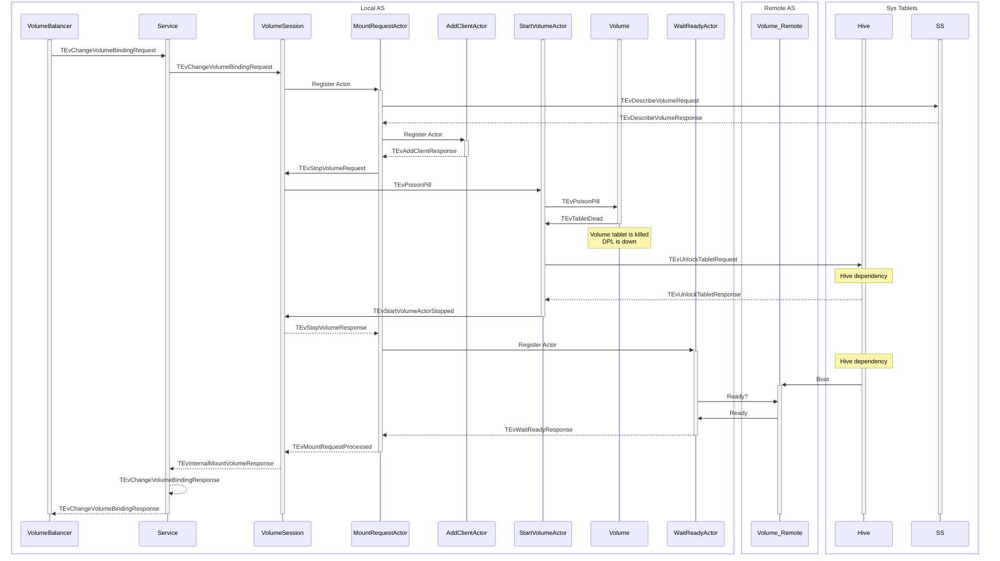
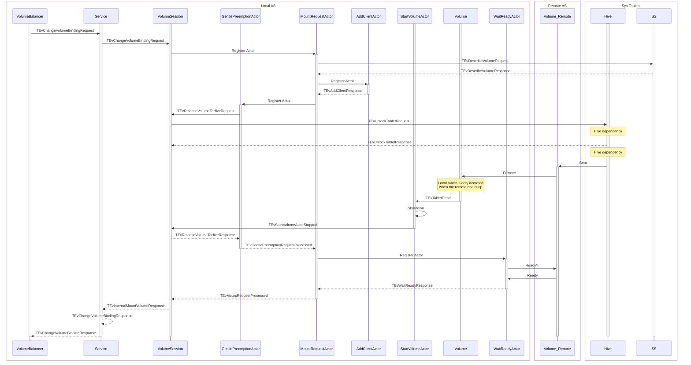

# Volume Balancer

## Reworked volume preemption mechanism

New volume preemption is intended to prevent volume balancer from breaking
well-mounted disks during Hive downtime

Original implementation of ChangeVolumeBinding uses unsafe local-to-remote
remount algorithm

1. Stop volume tablet
2. Release tablet lock in Hive
3. Wait for Hive to boot new tablet
   which kills local volume tablet before knowing the Hive is able to boot it
   remotely

New algorithm transfers the responsibility of local tablet killing to the Hive itself drastically reducing chances of
leaving volume in down state

Remote-to-local migration already uses safe operation order and is not changed:

1. Lock volume tablet in hive
2. Boot volume tablet locally

Both migration operations are wrapped into timed retry-on-error loops inside of
GentlePreemptionActor,
which helps to contain inconsistencies inside a mount request and keep client
session up

Staying inside a mount request for a long time may by itself cause DPL lock
on TSession level due to regular remount being placed in queue.
This risk is already covered by introducing a non-blocking remount mode into
TSession (see `cloud/blockstore/config/client.proto::EnableNonBlockingRemount`).