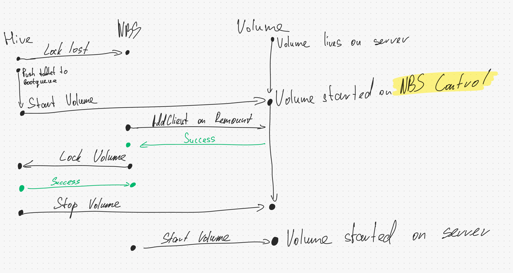

The workflow of working with locks:

- The lock is maintained as long as there is a connection via the pipe to HIVE

- When the pipe is broken, the locks enter a "RECONNECT" state, and NBS re-requests the locks from HIVE

- There is a timeout for the re-request, which is 30 seconds

- If the locks are not updated within the timeout, a LockLost is generated

- Additionally, if there is an error in re-requesting locks from HIVE, we generate a synthetic LockLost (as we assume the error can only occur due to the loss of locks)

___

LockLost processing scheme:

In case the lock is updated before HIVE starts the tablet on control, it will not do so (it will remove the tablet from the bootQueue):

Otherwise, the tablet will be started in control, and the tablet on the host will be terminated by StateStorage (due to an obsolete generation). However, in this case, the critical section also passes quickly since AddClient will successfully execute on the tablet from control:

