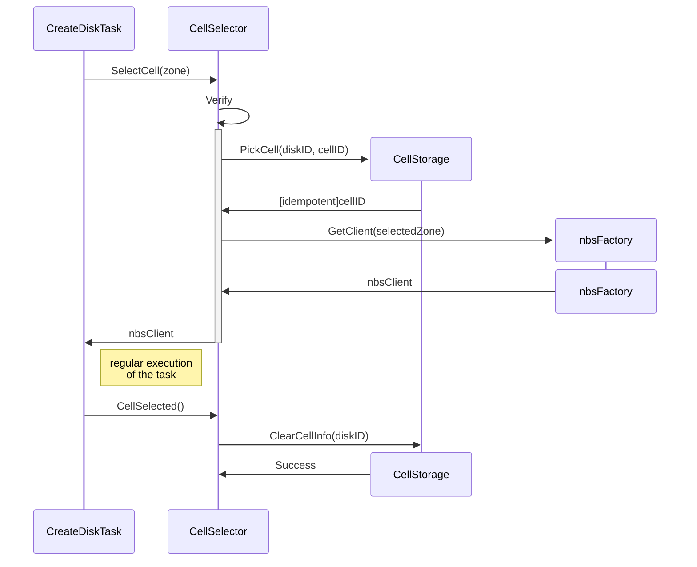
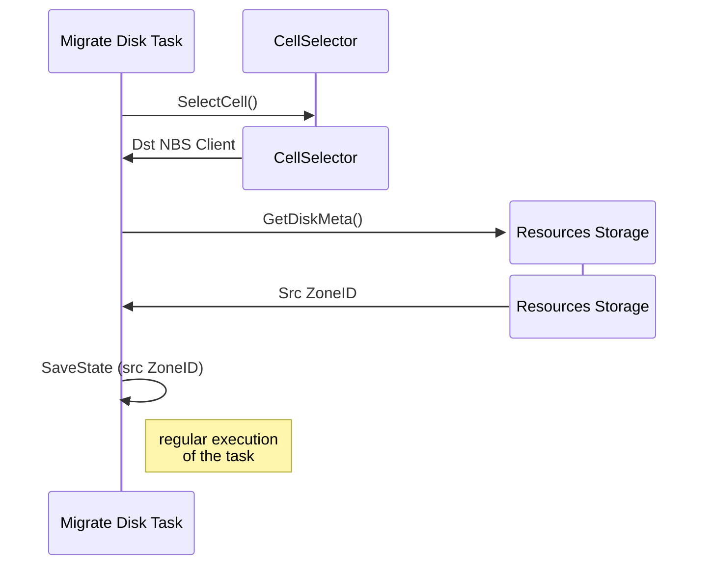
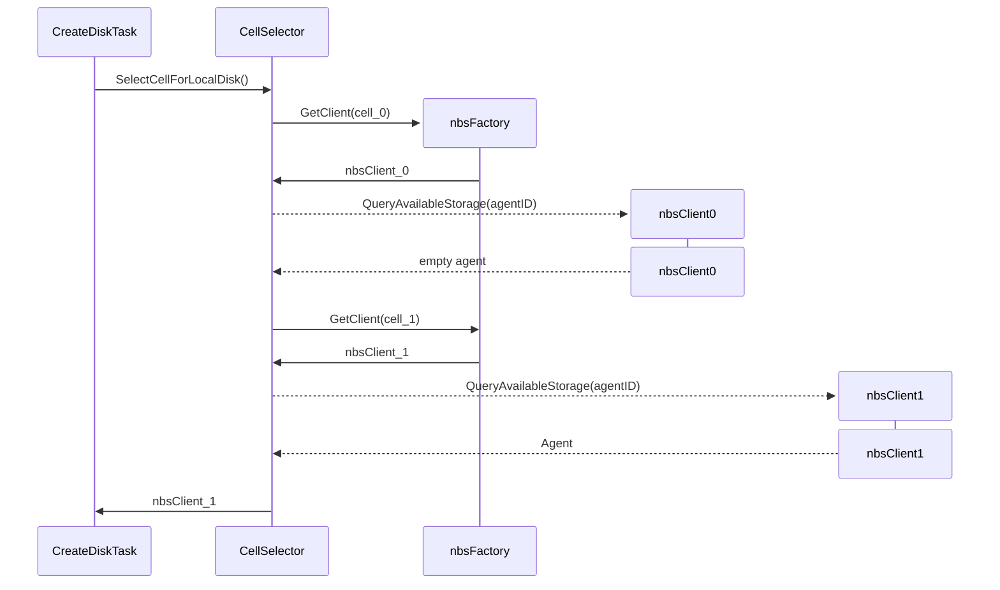

# Disk Manager cells mechanism

## Problem
We need to support scaling (division into cells) of the NBS service transparently for users and compute.
Disk Manager should be able to choose which cell is most advantageous to create a disk in and be able to support all disk operations in cells.

## Detailed Design

### Contracts

`cellSelector.SelectCell` idempotently returns nbsClient for most suitable Cell ID by given zone. If the zone is not divided into cells, or cells are not allowed for the folder, or cells config is not set, returns the original zone nbsClient.

`cellSelector.SelectCellForLocalDisk` finds the only correct cell, where requested `Agent` is located. If the zone is not divided into cells, or cells are not allowed for the folder, or cells config is not set, returns the original zone nbsClient.

### How to get cluster capacity information

... TBD

### How to select shard for non local disks

We add a new component to Disk Manager: cellSelector. Through configuration, it receives information about which cells belong to which zone, for example:

```
Cells: {
    key: "zone-a"
    value: {
        Cells: [
            "zone-a-cell1",
            "zone-a"
        ]
    }
}
```

Each zone is one of its own Cells.

#### SelectCell:



For any task, that called from Disk Manager API we should get correct `zoneID` from `diskMeta`.

For example, Migrate Disk Task:



### SelectCellForLocalDisk



If there is no available agents in any zone, we should return an `errors.NewInterruptExecutionError()`.
