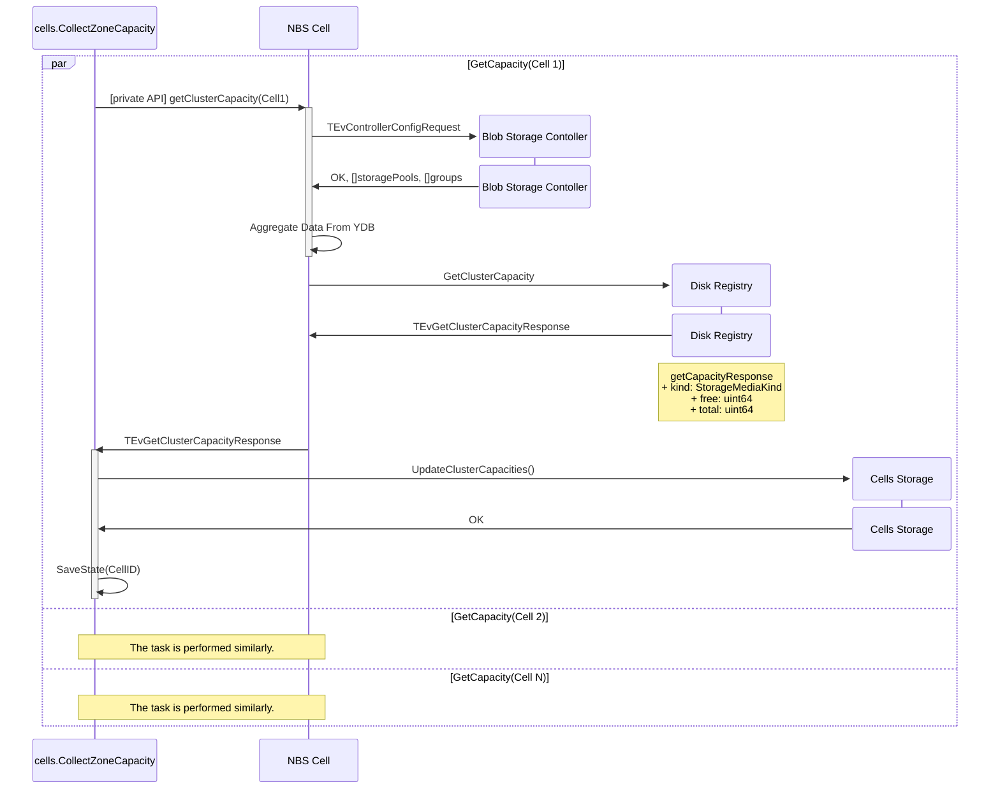
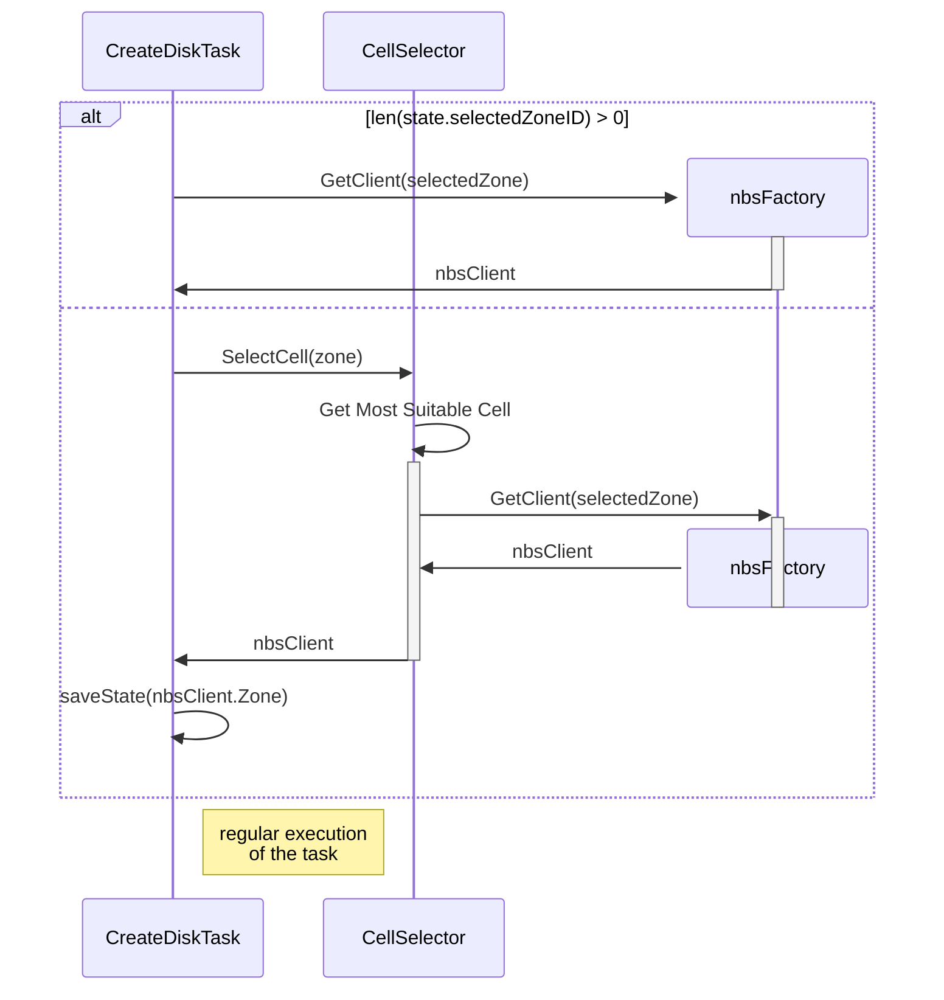
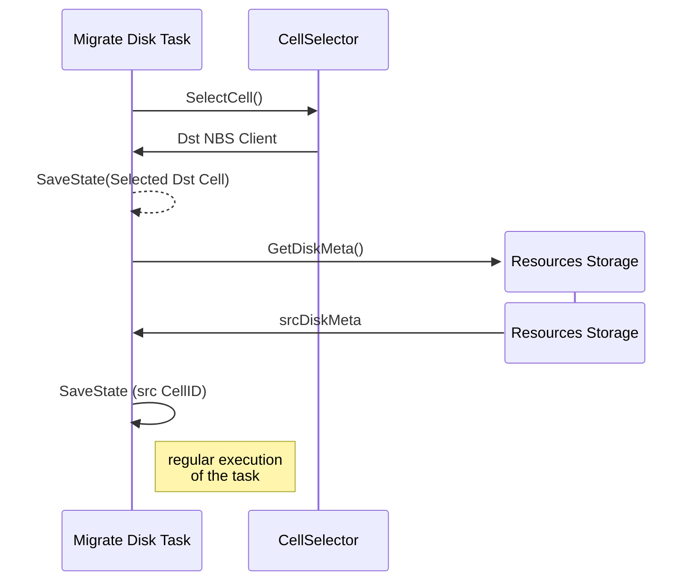
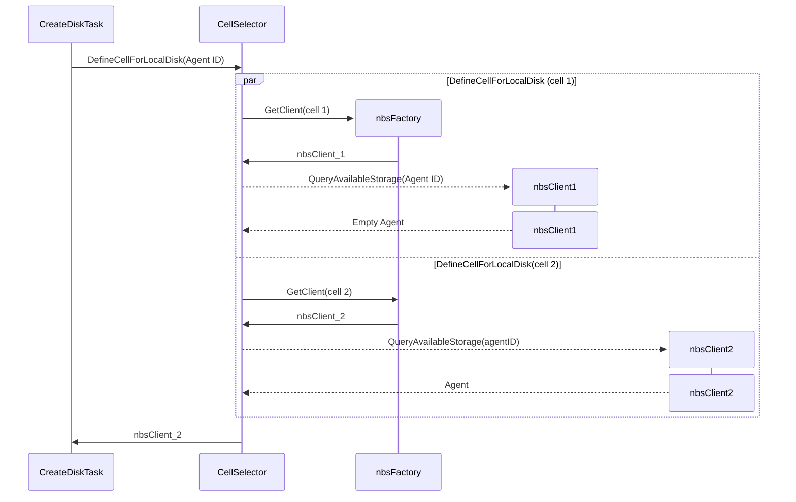

# Disk Manager cells mechanism

## Problem
We need to support scaling (division into cells) of the NBS service transparently for users and compute.
Disk Manager should be able to choose which cell is most advantageous to create a disk in and be able to support all disk operations in cells.

## Detailed Design

### Contracts

`cellSelector.SelectCell` idempotently returns nbsClient for most suitable Cell ID by given zone. If the zone is not divided into cells, or cells are not allowed for the folder, or cells config is not set, returns the original zone nbsClient.

`cellSelector.SelectCellForLocalDisk` finds the only correct cell, where requested `Agent` is located. If the zone is not divided into cells, or cells are not allowed for the folder, or cells config is not set, returns the original zone nbsClient.

### How to get cluster capacity information

To get data about Cell capacity, we will create a `cells.CollectZoneCapacity` task that will be schedulled by default once per hour. Period is configurable.
It will iterate through each of the Cells and get data from the `getClusterCapacity` handler.
After each step, we add the processed cellID to the task state, because on retry we want to avoid repeated calls to the `getClusterCapacity` handler.
If we get an error from the `getClusterCapacity` handler, we ignore it and move to the next Cell. In metrics, we increment the error counter to then set up an alert on this counter.
Repeated calls to `getClusterCapacity` can lead to a sharp increase in load on BSC.



### How to select shard

We add a new component to Disk Manager: cellSelector. Through configuration, it receives information about which cells belong to which zone, for example:

```
Cells: {
    key: "zone-a"
    value: {
        Cells: [
            "zone-a-cell1",
            "zone-a"
        ]
    }
}
Cells: {
    key: "zone-b"
    value: {
        Cells: [
            "zone-b"
        ]
    }
}
```

Each zone is one of its own Cells.

#### SelectCell:

When selecting a Cell for creating a non-local disk, we first rely on the configuration. If the Folder from the request is allowed, we select the least occupied cell from the requested zone and bind it in CellStorage.
If cells config is not set, we return nbsClient for the requested zone.



For any task, that called from Disk Manager's Disks API we should get correct `zoneID` from `diskMeta`.

**Tasks list**

- alter_disk_task
- delete_disk_task (Unnecessary, due to getting correct zoneID from `storage.DeleteDisk`)
- migrate_disk_task
- resize_disk_task
- crete_image_from_disk_task
- create_snapshot_from_disk_task
- stat_disk_task (Should be created. There is no task for `DiskService.Stat` request currently)
- describe_disk_task (Should be created. There is no task for `DiskService.Describe` request currently)

For example, Migrate Disk Task:



### SelectCellForLocalDisk

Getting QueryAvailableStorage(AgentID) for each cell in parallel.



If there are no available agents in any zone, we should return an `errors.NewInterruptExecutionError()`.
