# Disk Manager Pools

Pools keep reusable base disks for images.

NBS supports copy-on-write overlay disks: an overlay disk can use a base disk
checkpoint as its read-only source and store only its own changes. Disk Manager
pools pre-create reusable base disks for image-backed disk creation. Many
overlay disks can share the same base disk, so disk-from-image creation can be
faster than creating a full copy for every disk.

A pool is scoped to one `(image_id, zone_id)`. It tracks the base disks that can
serve overlays for that image in that zone and the slot/unit counters used to
decide when more base disks should be scheduled.

The core code is in [internal/pkg/services/pools](../../../cloud/disk_manager/internal/pkg/services/pools).
The storage interface is in
[storage.go](../../../cloud/disk_manager/internal/pkg/services/pools/storage/storage.go). The YDB
implementation is split between
[storage_ydb.go](../../../cloud/disk_manager/internal/pkg/services/pools/storage/storage_ydb.go)
and
[storage_ydb_impl.go](../../../cloud/disk_manager/internal/pkg/services/pools/storage/storage_ydb_impl.go).
The storage structs, table definitions, status values, unit accounting, and
pool transition logic are in
[common.go](../../../cloud/disk_manager/internal/pkg/services/pools/storage/common.go).

## Pool Model

The pool has a desired state and a current state.

Desired state is stored in `configs`. Current accounting is stored in `pools`.
The scheduler compares them.

Code:
[configure_pool_task.go](../../../cloud/disk_manager/internal/pkg/services/pools/configure_pool_task.go),
[storage_ydb_impl.go](../../../cloud/disk_manager/internal/pkg/services/pools/storage/storage_ydb_impl.go),
[config.proto](../../../cloud/disk_manager/internal/pkg/services/pools/config/config.proto).

### `configs`

`configs` is the desired configuration for one image/zone pool. This is the
schema entry used by configuration and by the base disk scheduler.

| Column | Type | Meaning |
| --- | --- | --- |
| `image_id` | `Utf8` | Image id. Part of the primary key. |
| `zone_id` | `Utf8` | Zone id. Part of the primary key. |
| `kind` | `Int64` | Deprecated pool kind dimension. Part of the primary key. New code writes `0`. |
| `capacity` | `Uint64` | Desired spare capacity in slots. |
| `image_size` | `Uint64` | `0` for default-sized base disks, or the image size for image-sized base disks. |

Primary key: `(image_id, zone_id, kind)`.

`capacity` is the desired number of spare overlay-disk reservations for this
pool. One overlay disk reserves one slot, so `capacity=1000` means "keep enough
base disk slot capacity for about 1000 future overlay disks in this image/zone".

### `pools`

`pools` is current accounting for one `(image_id, zone_id)`. This is the schema
entry used whenever the code decides whether the pool has enough capacity.

| Column | Type | Meaning |
| --- | --- | --- |
| `image_id` | `Utf8` | Image id. Part of the primary key. |
| `zone_id` | `Utf8` | Zone id. Part of the primary key. |
| `size` | `Uint64` | Current spare slot capacity already accounted by base disks. This is compared with `configs.capacity`. |
| `free_units` | `Uint64` | Current free weighted units on base disks that still belong to the pool. |
| `acquired_units` | `Uint64` | Weighted units currently consumed by overlays placed on pool base disks. |
| `base_disks_inflight` | `Uint64` | Base disks in `scheduling` or `creating`. |
| `lock_id` | `Utf8` | ID of the task that currently locks the pool. |
| `status` | `Int64` | `ready` or `deleted`. |
| `created_at` | `Timestamp` | Pool row creation time. `pools.OptimizeBaseDisks` uses it for age checks. |

Primary key: `(image_id, zone_id)`.

`pool.size` is the spare slot capacity that can still accept future overlay
reservations. Scheduling a base disk adds that base disk's free slot count
immediately, even before the physical NBS disk is ready. Acquiring an overlay
consumes spare capacity, so the base disk transition decreases `pool.size`.
Releasing the overlay adds the capacity back if the base disk still belongs to
the pool.

A unit is the weighted accounting cost of an overlay reservation. It is derived
from overlay disk size and disk kind in
[computeAllottedUnits](../../../cloud/disk_manager/internal/pkg/services/pools/storage/common.go#L738):
one unit size is 32 GiB, SSD overlays are weighted more heavily than HDD
overlays, and every acquired slot reserves at least one unit.

`acquired_units` is the weighted overlay load already placed on base disks from
this pool. `pools.OptimizeBaseDisks` uses it as the usage signal for choosing
between default-sized and image-sized base disks.

`lock_id` stores the task id that locked the pool, usually the
`pools.RetireBaseDisks` task id. While it is set, `DeletePool` interrupts
instead of deleting the pool. `UnlockPool` clears the field only when the caller
provides the same lock id.

The scheduler compares desired spare capacity with current pool accounting:

```text
configs.capacity - pools.size
```

Pending acquire tasks do not count as a capacity deficit. Only state already
written into `base_disks` and `slots` affects `pools.size`.

## Base Disks, Slots, and Units

A base disk is an NBS disk populated from image storage or from another base
disk. A slot is one reservation on a base disk for one overlay disk. The pool
uses slots as the countable placement capacity for overlays: a base disk with
640 free slots can accept up to 640 overlay reservations by slot count, unless
it runs out of units first. One overlay disk reserves one slot and some number
of units.

Code:
[common.go](../../../cloud/disk_manager/internal/pkg/services/pools/storage/common.go),
[create_base_disk_task.go](../../../cloud/disk_manager/internal/pkg/services/pools/create_base_disk_task.go),
[acquire_base_disk_task.go](../../../cloud/disk_manager/internal/pkg/services/pools/acquire_base_disk_task.go),
[release_base_disk_task.go](../../../cloud/disk_manager/internal/pkg/services/pools/release_base_disk_task.go).

### `base_disks`

`base_disks` is the source of truth for every base disk. This is the schema
entry used by scheduling, creation, acquire, release, rebase, retirement, and
deletion.

| Column | Type | Meaning |
| --- | --- | --- |
| `id` | `Utf8` | Base disk id. Primary key. |
| `image_id` | `Utf8` | Image id for the pool this base disk belongs to. |
| `zone_id` | `Utf8` | Zone id for the pool this base disk belongs to. |
| `src_disk_zone_id` | `Utf8` | Source disk zone for replacement base disks cloned during retirement. Empty for base disks created from image storage. |
| `src_disk_id` | `Utf8` | Source disk id for replacement base disks cloned during retirement. |
| `src_disk_checkpoint_id` | `Utf8` | Source checkpoint for replacement base disks cloned during retirement. |
| `checkpoint_id` | `Utf8` | Base disk checkpoint id. The code uses the image id as checkpoint id. |
| `create_task_id` | `Utf8` | Task id of `pools.CreateBaseDisk` after scheduling. |
| `image_size` | `Uint64` | Image size mode captured when this base disk was generated. |
| `size` | `Uint64` | Physical base disk size. `0` means default base disk size. |
| `active_slots` | `Uint64` | Overlay slots currently reserved on this base disk. |
| `max_active_slots` | `Uint64` | Slot limit for this base disk. |
| `active_units` | `Uint64` | Weighted units currently reserved by overlays. |
| `units` | `Uint64` | Weighted unit limit for this base disk. |
| `from_pool` | `Bool` | Whether this base disk contributes capacity to a live pool. |
| `retiring` | `Bool` | Whether overlay slots are being moved away from this base disk. |
| `deleted_at` | `Timestamp` | Timestamp set when physical deletion is recorded. |
| `status` | `Int64` | `scheduling`, `creating`, `ready`, `deleting`, `deleted`, or `creation_failed`. |

Primary key: `id`.

Base disk states:

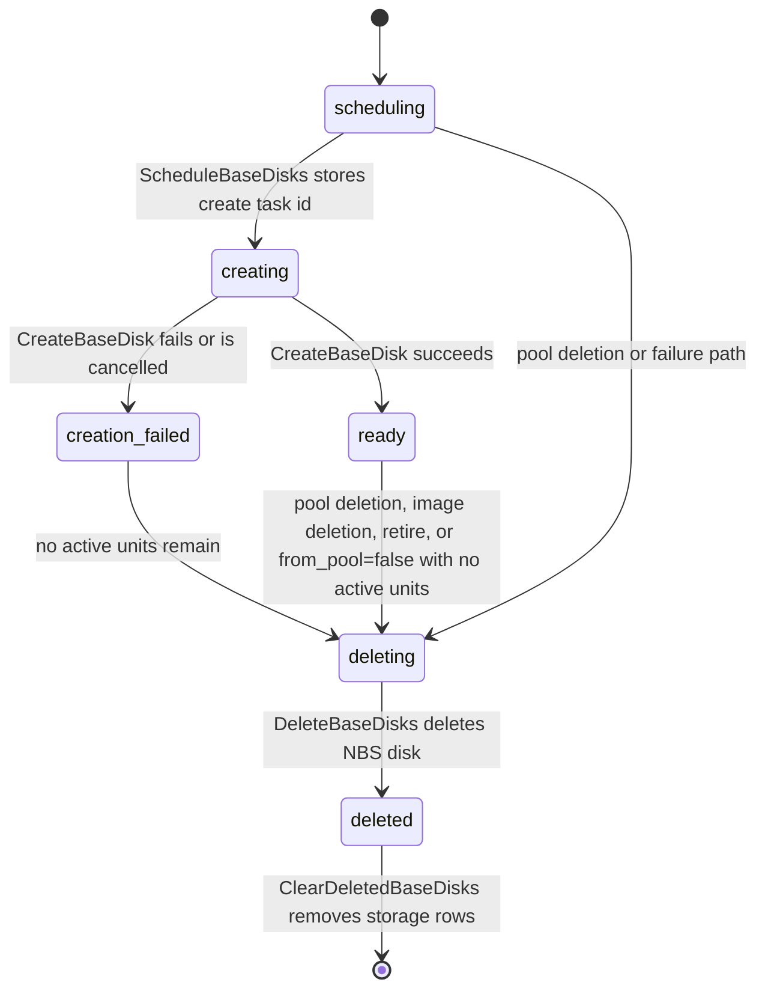

In code, a doomed base disk is a disk whose status is `deleting`, `deleted`, or
`creation_failed`. `freeSlots()` returns zero for doomed disks, so they do not
contribute capacity to the pool.

`creation_failed` is one doomed state. It can still temporarily have active
units if an overlay acquired a slot while the base disk was `creating`. When
those active units are released, invariants move it to `deleting`.

### `slots`

`slots` is the source of truth for overlay reservations. This is the schema
entry used by acquire, release, rebase, relocation, and released-slot cleanup.

| Column | Type | Meaning |
| --- | --- | --- |
| `overlay_disk_id` | `Utf8` | Overlay disk id. Primary key. |
| `overlay_disk_kind` | `Int64` | Overlay disk kind used for unit accounting. |
| `overlay_disk_size` | `Uint64` | Overlay disk size used for unit accounting. |
| `base_disk_id` | `Utf8` | Current source base disk. |
| `image_id` | `Utf8` | Image id for the current source slot. |
| `zone_id` | `Utf8` | Zone id for the current source slot. |
| `status` | `Int64` | `acquired` or `released`. |
| `allotted_slots` | `Uint64` | Number of source slots reserved by this overlay disk. Normal acquired slots reserve `1`. |
| `allotted_units` | `Uint64` | Number of source units reserved by this overlay disk. |
| `released_at` | `Timestamp` | Timestamp for released slot tombstones. |
| `target_zone_id` | `Utf8` | Target zone during rebase or relocation. |
| `target_base_disk_id` | `Utf8` | Target base disk during rebase or relocation. |
| `target_allotted_slots` | `Uint64` | Number of target slots temporarily reserved during rebase or relocation. |
| `target_allotted_units` | `Uint64` | Number of target units temporarily reserved during rebase or relocation. |
| `generation` | `Uint64` | Slot generation used to reject stale rebase completions. |

Primary key: `overlay_disk_id`.

Every overlay disk reserves exactly one source slot:

```go
slot.allottedSlots = 1
disk.activeSlots++
```

It also reserves units:

```go
slot.allottedUnits = computeAllottedUnits(slot)
disk.activeUnits += slot.allottedUnits
```

Units are weighted by overlay size and disk kind. The unit size is 32 GiB, SSD
overlays are multiplied by 5, and overlay demand is divided by the
`overlayDiskOversubscription=30` factor. In code, HDD overlays reserve
`ceil((overlay_size / 32GiB) / 30)` units, SSD overlays reserve
`ceil(5 * (overlay_size / 32GiB) / 30)` units, and every overlay reserves at
least one unit. The constants are defined next to `generateBaseDisk`, and the
formula is in
[computeAllottedUnits](../../../cloud/disk_manager/internal/pkg/services/pools/storage/common.go#L738).
For image-sized base disks, `generateBaseDisk` also applies
`baseDiskOverSubscription=2` while computing the base disk unit budget.

Default configuration:

| Config | Default | Meaning |
| --- | --- | --- |
| `MaxActiveSlots` | `640` | Max overlay slots on one default base disk. |
| `MaxBaseDiskUnits` | `640` | Max weighted units on one default base disk. |
| `MaxBaseDisksInflight` | `5` | Max base disks in `scheduling` or `creating` for one pool. |

With the default base disk mode, one base disk has 640 slots and 640 units.
With image-sized base disks, `generateBaseDisk` derives the physical size and
unit count from the image size, clamps units to `[30, MaxBaseDiskUnits]`, and
sets:

```text
max_active_slots = min(units, MaxActiveSlots)
```

A base disk has no free slots if it is deleting/deleted/creation_failed, if it
does not belong to the pool, if units are exhausted, or if the slot count is
exhausted.

## Derived Tables and Invariants

The secondary tables are indexes for faster access. They are maintained from
`base_disks` and `slots`, so code should check or rebuild them from those source
rows when consistency matters.

| Table | What it indexes | Used by |
| --- | --- | --- |
| `scheduling` | Base disks whose create task still needs to be scheduled or confirmed. | `pools.ScheduleBaseDisks` |
| `free` | Base disks that currently have at least one free slot. | Acquire, rebase, relocation |
| `released` | Released slot tombstones ordered by release time. | `pools.ClearReleasedSlots` |
| `overlay_disk_ids` | Overlay disk ids attached to each base disk. | Retirement and rebase |
| `deleting` | Base disks whose physical NBS disk should be deleted. | `pools.DeleteBaseDisks` |
| `deleted` | Base disks already deleted in NBS and waiting for row cleanup. | `pools.ClearDeletedBaseDisks` |

Code:
[common.go](../../../cloud/disk_manager/internal/pkg/services/pools/storage/common.go),
[storage_ydb_impl.go](../../../cloud/disk_manager/internal/pkg/services/pools/storage/storage_ydb_impl.go),
[consistency_check.go](../../../cloud/disk_manager/internal/pkg/services/pools/storage/consistency_check.go).

Important invariants:

* `base_disks` and `slots` are the source rows.
* `free`, `scheduling`, `deleting`, `deleted`, `released`, and
  `overlay_disk_ids` are indexes maintained from source row updates.
* A base disk that is not `from_pool` contributes zero free slots.
* A doomed base disk contributes zero free slots.
* A base disk from a deleted pool is forced out of the pool by setting
  `from_pool=false`.
* A `creation_failed` base disk with no active units becomes `deleting`.
* A non-pool base disk with no active units becomes `deleting`.
* An existing base disk is not allowed to move from not-inflight back to
  inflight.
* `base_disks_inflight` increases only when a new base disk enters
  `scheduling` or `creating`, and decreases when it leaves those states.
* `pool.size`, `pool.free_units`, and `pool.acquired_units` are updated through
  the base disk transition mechanism described below.

A base disk transition is an old/new pair: the base disk row before an operation
and the base disk row after that operation. Storage uses that pair to derive the
pool counter changes. The central path is
[updateBaseDisks](../../../cloud/disk_manager/internal/pkg/services/pools/storage/storage_ydb_impl.go#L755),
which is called through helpers such as `updateBaseDisk`,
`updateBaseDisksAndSlots`, and `updateBaseDiskAndSlot` from acquire, release,
rebase, creation, deletion, and retirement paths.

The transition pipeline for a base disk update is:

* [`updateBaseDisks`](../../../cloud/disk_manager/internal/pkg/services/pools/storage/storage_ydb_impl.go#L755)
  filters unchanged transitions, then calls
  [`applyBaseDiskInvariants`](../../../cloud/disk_manager/internal/pkg/services/pools/storage/storage_ydb_impl.go#L651).
* `applyBaseDiskInvariants` loads the current pool row, forces base disks out of
  deleted pools, applies base disk invariants, calls
  [`computePoolAction`](../../../cloud/disk_manager/internal/pkg/services/pools/storage/common.go#L345),
  and applies the resulting counter diff.
* `updateBaseDisks` then updates the derived indexes:
  [`scheduling`](../../../cloud/disk_manager/internal/pkg/services/pools/storage/storage_ydb_impl.go#L774),
  [`deleting`](../../../cloud/disk_manager/internal/pkg/services/pools/storage/storage_ydb_impl.go#L779),
  [`deleted`](../../../cloud/disk_manager/internal/pkg/services/pools/storage/storage_ydb_impl.go#L784),
  and [`free`](../../../cloud/disk_manager/internal/pkg/services/pools/storage/storage_ydb_impl.go#L789).
* Finally it writes the new pool counters through
  [`updatePoolsTable`](../../../cloud/disk_manager/internal/pkg/services/pools/storage/storage_ydb_impl.go#L717)
  and upserts the changed `base_disks` rows.

The core pool action for a normal base disk transition is:

```go
sizeDiff = newBaseDisk.freeSlots() - oldBaseDisk.freeSlots()
freeUnitsDiff = newBaseDisk.freeUnits() - oldBaseDisk.freeUnits()
acquiredUnitsDiff = newBaseDisk.activeUnits - oldBaseDisk.activeUnits
```

So acquire/release do not own separate pool counter operations. Acquire changes
`active_slots` and `active_units` on a base disk; release changes them back.
Then the transition code compares old and new `freeSlots()`, `freeUnits()`, and
`activeUnits` and applies the resulting `poolAction`.

## APIs and Tasks

The pool API is private. Public image and disk APIs reach it indirectly through
tasks; operators can also invoke private pool operations directly through
`PrivateService` or `disk-manager-admin`.

In public flows, pools are used during image creation, disk-from-image creation,
image deletion, and disk deletion. For disk-from-image creation, the disk service
uses the pool only when
[`isOverlayDiskAllowed`](../../../cloud/disk_manager/internal/pkg/services/disks/service.go#L302)
returns true. That requires a supported disk kind, 4 KiB block size, disk size no
larger than 4 TiB, `force_not_layered=false`, no disk/image encryption, an
existing pool config for the image/zone, and folder/config checks from
[`DisksConfig`](../../../cloud/disk_manager/internal/pkg/services/disks/config/config.proto#L15).
If any check fails, `CreateDisk` schedules the regular
[`disks.CreateDiskFromImage`](../../../cloud/disk_manager/internal/pkg/services/disks/service.go#L399)
copy path instead of
[`disks.CreateOverlayDisk`](../../../cloud/disk_manager/internal/pkg/services/disks/service.go#L387).

Code:
[private_service.proto](../../../cloud/disk_manager/internal/api/private_service.proto),
[service.go](../../../cloud/disk_manager/internal/pkg/services/pools/service.go),
[register.go](../../../cloud/disk_manager/internal/pkg/services/pools/register.go).

| API or task | Request fields | Main effect |
| --- | --- | --- |
| [`PrivateService.ConfigurePool`](../../../cloud/disk_manager/internal/api/private_service.proto#L28) / [`pools.ConfigurePool`](../../../cloud/disk_manager/internal/pkg/services/pools/service.go#L73), task [`Run`](../../../cloud/disk_manager/internal/pkg/services/pools/configure_pool_task.go#L63) | `image_id`, `zone_id`, `capacity`, `use_image_size` | Writes or updates `configs`. |
| [`PrivateService.DeletePool`](../../../cloud/disk_manager/internal/api/private_service.proto#L30) / [`pools.DeletePool`](../../../cloud/disk_manager/internal/pkg/services/pools/service.go#L90), task [`Run`](../../../cloud/disk_manager/internal/pkg/services/pools/delete_pool_task.go#L45) | `image_id`, `zone_id` | Deletes one pool config and removes free empty base disks from the pool. |
| [`PrivateService.AcquireBaseDisk`](../../../cloud/disk_manager/internal/api/private_service.proto#L16) / [`pools.AcquireBaseDisk`](../../../cloud/disk_manager/internal/pkg/services/pools/service.go#L20), task [`Run`](../../../cloud/disk_manager/internal/pkg/services/pools/acquire_base_disk_task.go#L39) | `src_image_id`, `overlay_disk_id`, `overlay_disk_kind`, `overlay_disk_size` | Reserves one slot for an overlay disk and returns base disk id/checkpoint. |
| [`PrivateService.ReleaseBaseDisk`](../../../cloud/disk_manager/internal/api/private_service.proto#L18) / [`pools.ReleaseBaseDisk`](../../../cloud/disk_manager/internal/pkg/services/pools/service.go#L38), task [`Run`](../../../cloud/disk_manager/internal/pkg/services/pools/release_base_disk_task.go#L54) | `disk_id` | Releases the overlay slot and restores base disk/pool accounting. |
| [`PrivateService.RebaseOverlayDisk`](../../../cloud/disk_manager/internal/api/private_service.proto#L20) / [`pools.RebaseOverlayDisk`](../../../cloud/disk_manager/internal/pkg/services/pools/service.go#L55), task [`Run`](../../../cloud/disk_manager/internal/pkg/services/pools/rebase_overlay_disk_task.go#L92) | `disk_id`, `base_disk_id`, `target_base_disk_id`, `slot_generation` | Performs NBS rebase and finalizes a slot move. |
| [`PrivateService.RetireBaseDisk`](../../../cloud/disk_manager/internal/api/private_service.proto#L22) / [`pools.RetireBaseDisk`](../../../cloud/disk_manager/internal/pkg/services/pools/service.go#L129), task [`Run`](../../../cloud/disk_manager/internal/pkg/services/pools/retire_base_disk_task.go#L42) | `base_disk_id`, optional `src_disk_id` | Moves overlays away from one base disk and marks it retiring. |
| [`PrivateService.RetireBaseDisks`](../../../cloud/disk_manager/internal/api/private_service.proto#L24) / [`pools.RetireBaseDisks`](../../../cloud/disk_manager/internal/pkg/services/pools/service.go#L144), task [`Run`](../../../cloud/disk_manager/internal/pkg/services/pools/retire_base_disks_task.go#L42) | `image_id`, `zone_id`, `use_base_disk_as_src`, `use_image_size` | Retires all base disks for one image/zone. |
| [`PrivateService.OptimizeBaseDisks`](../../../cloud/disk_manager/internal/api/private_service.proto#L26) / [`pools.OptimizeBaseDisks`](../../../cloud/disk_manager/internal/pkg/services/pools/service.go#L159), task [`Run`](../../../cloud/disk_manager/internal/pkg/services/pools/optimize_base_disks_task.go#L37) | empty | Switches eligible pools between default-sized and image-sized mode, then retires old base disks. |
| Internal [`pools.ImageDeleting`](../../../cloud/disk_manager/internal/pkg/services/pools/service.go#L105), task [`Run`](../../../cloud/disk_manager/internal/pkg/services/pools/image_deleting_task.go#L45) | `image_id` | Marks pool state for image deletion before image storage is deleted. |
| Regular [`pools.ScheduleBaseDisks`](../../../cloud/disk_manager/internal/pkg/services/pools/schedule_base_disks_task.go#L30) | none | Converts configured capacity deficit into `pools.CreateBaseDisk` tasks. |
| Task [`pools.CreateBaseDisk`](../../../cloud/disk_manager/internal/pkg/services/pools/create_base_disk_task.go#L48) | base disk id, source image/disk, checkpoint id, size mode | Creates and fills a base disk, then marks it ready. |
| Regular [`pools.DeleteBaseDisks`](../../../cloud/disk_manager/internal/pkg/services/pools/delete_base_disks_task.go#L42) | none | Deletes physical NBS disks listed in `deleting`. |
| Regular [`pools.ClearDeletedBaseDisks`](../../../cloud/disk_manager/internal/pkg/services/pools/clear_deleted_base_disks_task.go#L29) | none | Removes expired deleted base disk rows. |
| Regular [`pools.ClearReleasedSlots`](../../../cloud/disk_manager/internal/pkg/services/pools/clear_released_slots_task.go#L29) | none | Removes expired released slot tombstones. |

The main callers are:

| Caller | Pool operation |
| --- | --- |
| [`images.CreateImage*`](../../../cloud/disk_manager/internal/pkg/services/images/common.go#L131) | Calls `ConfigurePool` after image metadata/snapshot creation when pooled image config is present. |
| [`images.DeleteImage`](../../../cloud/disk_manager/internal/pkg/services/images/common.go#L19) | Calls `ImageDeleting`, schedules `RetireBaseDisks`, then deletes the image snapshot. |
| [`disks.CreateOverlayDisk`](../../../cloud/disk_manager/internal/pkg/services/disks/create_overlay_disk_task.go#L50) | Calls `AcquireBaseDisk` before creating the NBS overlay disk. |
| [`disks.DeleteDisk`](../../../cloud/disk_manager/internal/pkg/services/disks/delete_disk_task.go#L128) and [`CreateOverlayDisk.Cancel`](../../../cloud/disk_manager/internal/pkg/services/disks/create_overlay_disk_task.go#L152) | Calls `ReleaseBaseDisk` for overlay disks created from images. |
| [`disks.MigrateDisk`](../../../cloud/disk_manager/internal/pkg/services/disks/migrate_disk_task.go#L245) relocation | Uses pool relocation/rebase storage paths and finalizes with `OverlayDiskRebasedTx`. |

## Image Creation and Pool Configuration

Pools can be configured in two ways:

* automatically during public image creation, from image service config;
* explicitly through the private API or `disk-manager-admin configure-pool`.

Code:
[images/common.go](../../../cloud/disk_manager/internal/pkg/services/images/common.go),
[images/service.go](../../../cloud/disk_manager/internal/pkg/services/images/service.go),
[configure_pool_task.go](../../../cloud/disk_manager/internal/pkg/services/pools/configure_pool_task.go),
[storage_ydb_impl.go](../../../cloud/disk_manager/internal/pkg/services/pools/storage/storage_ydb_impl.go),
[common.go](../../../cloud/disk_manager/internal/pkg/services/pools/storage/common.go),
[create_base_disk_task.go](../../../cloud/disk_manager/internal/pkg/services/pools/create_base_disk_task.go).

### Explicit configuration

`ConfigurePool(image_id, zone_id, capacity, use_image_size)` schedules
`pools.ConfigurePool`.

The task always reads image metadata to validate that the image exists and is
ready. If `use_image_size=false`, it stores `configs.image_size=0`; this is a
sentinel for the default base disk size mode. If `use_image_size=true`, it
stores the image metadata size in `configs.image_size`, which means "size future
base disks from this image's logical size". Then storage upserts the `configs`
row.

The stored image size is the snapshot/image logical size written by image
creation. The default-sized mode is not a different image size; it is the
special value `image_size=0`. The two modes affect base disk creation like this:

| Config mode | `generateBaseDisk` result | `CreateBaseDisk` result |
| --- | --- | --- |
| `image_size=0` | `baseDisk.size=0`, `units=MaxBaseDiskUnits`, `max_active_slots=MaxActiveSlots`. | Creates the default 4 TiB SSD base disk from `defaultBaseDiskBlockCount * 4096`. |
| `image_size>0` | Rounds image size up to 32 GiB, stores that as `baseDisk.size`, computes units from rounded image size, and sets slots to `min(units, MaxActiveSlots)`. | Creates an SSD base disk with `BaseDiskSize / 4096` blocks. |

Code links: `ConfigurePool` reads image metadata in
[configure_pool_task.go](../../../cloud/disk_manager/internal/pkg/services/pools/configure_pool_task.go),
base disk shape is computed in
[generateBaseDisk](../../../cloud/disk_manager/internal/pkg/services/pools/storage/common.go),
and the NBS disk block count is chosen in
[create_base_disk_task.go](../../../cloud/disk_manager/internal/pkg/services/pools/create_base_disk_task.go).

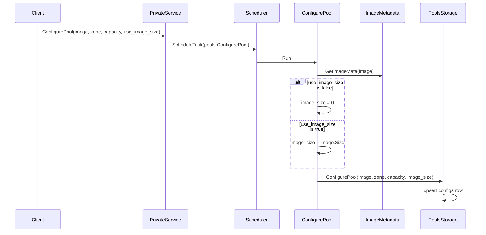

### Automatic configuration during image creation

Image creation configures pools automatically when either the create-image
request has `pooled=true` or `ImagesConfig.ConfigurePoolsByDefault` is enabled.
In that case `images.service` copies `ImagesConfig.DefaultDiskPoolConfigs` into
the image task request. Each config entry supplies the `zone_id` and `capacity`
for one pool. If `DefaultDiskPoolConfigs` is empty, no pool is configured.

After the image snapshot and image metadata are created, the image task
schedules one `pools.ConfigurePool` task per copied `DiskPool`. The automatic
path passes `capacity` from `DefaultDiskPoolConfigs` and does not pass
`UseImageSize`, so these pools use `image_size=0` unless a later explicit
configuration or optimization changes them.

If the configured capacity is `0`, the row is still useful: it marks the pool as
configured but on-demand. The first acquire that finds no usable base disk
changes that existing zero-capacity config to `capacity=1`.

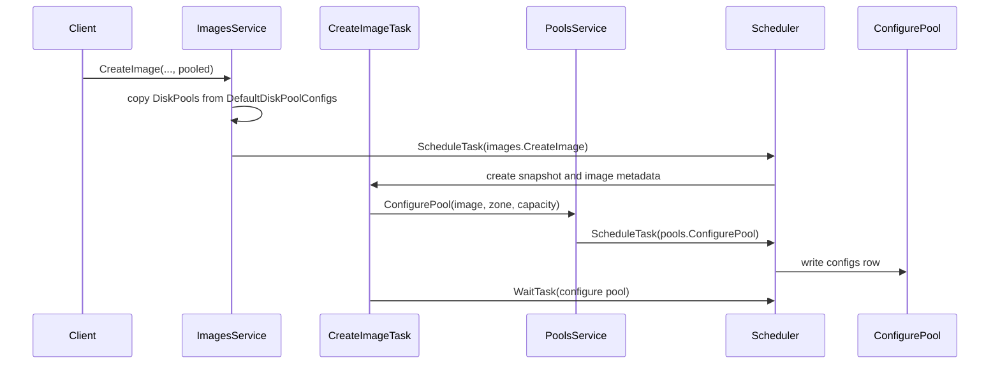

### On-demand configuration

If an overlay acquire finds no usable base disk, storage calls
`createPoolIfNecessary`. A configured pool with `capacity=0` is treated as
on-demand and is changed to `capacity=1` by writing the `configs` row. This
does not acquire a slot; it only gives the regular scheduler one slot of desired
capacity so it can create the first base disk.

This path does not set `image_size`, so it uses default-sized base disks.

On-demand configuration is intentionally small. It is useful for correctness,
but it is not a good way to absorb a large burst of overlay creations.

## Scheduling Base Disks

`pools.ScheduleBaseDisks` is a regular task. By default it runs every minute
with one scheduler instance in flight.

Code:
[schedule_base_disks_task.go](../../../cloud/disk_manager/internal/pkg/services/pools/schedule_base_disks_task.go),
[storage_ydb_impl.go](../../../cloud/disk_manager/internal/pkg/services/pools/storage/storage_ydb_impl.go),
[register.go](../../../cloud/disk_manager/internal/pkg/services/pools/register.go).

Schema entry used here:

| Table | Columns | Primary key | Derived from | Meaning |
| --- | --- | --- | --- | --- |
| `scheduling` | `image_id: Utf8`, `zone_id: Utf8`, `base_disk_id: Utf8` | `(image_id, zone_id, base_disk_id)` | `base_disks.status == scheduling` | A base disk row exists, but the create task id still needs to be scheduled or confirmed. |

The scheduler does this:

1. Read pool configs with non-zero capacity.
2. Read base disks in the `scheduling` table.
3. Return already-scheduling base disks so create tasks are scheduled
   idempotently.
4. For every pool with no already-scheduling base disk, compare
   `pool.size` with `config.capacity`.
5. Generate enough base disks to cover the slot deficit, capped by
   `MaxBaseDisksInflight - pool.base_disks_inflight`.
6. Write new base disks in `scheduling` state.
7. Immediately increase `pool.size`, `pool.free_units`, and
   `pool.base_disks_inflight`.
8. Schedule `pools.CreateBaseDisk` for each returned base disk.
9. Mark each scheduled base disk as `creating` and store its create task id.

The sizing formula is:

```text
wantToCreate =
    ceil((config.capacity - pool.size) / baseDiskTemplate.freeSlots())

willCreate =
    min(wantToCreate, MaxBaseDisksInflight - pool.baseDisksInflight)
```

If `pool.size >= config.capacity`, no new base disk is generated.

When a new base disk is generated, storage immediately accounts it:

```go
pool.size += willCreate * baseDiskTemplate.freeSlots()
pool.freeUnits += willCreate * baseDiskTemplate.freeUnits()
pool.baseDisksInflight += willCreate
```

This is reservation accounting. The scheduler should not keep creating the same
missing capacity while the base disk task is still running.

The capacity can overshoot because base disks are indivisible. With default
base disks and capacity `1000`, the first fill creates two base disks:

```text
ceil(1000 / 640) = 2
pool.size = 1280
```

With on-demand capacity `1`, the first fill creates one base disk:

```text
ceil(1 / 640) = 1
pool.size = 640
```

`MaxBaseDisksInflight=5` is only a cap. It does not mean "always create five".

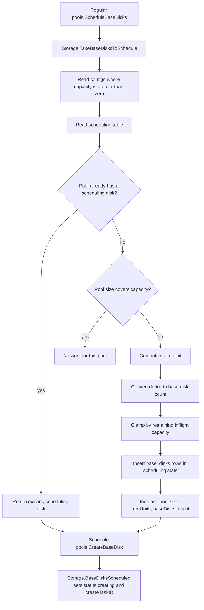

## Base Disk Creation

`pools.CreateBaseDisk` creates the NBS disk, transfers data, creates the base
disk checkpoint, and marks the base disk `ready`.

Code:
[create_base_disk_task.go](../../../cloud/disk_manager/internal/pkg/services/pools/create_base_disk_task.go),
[storage_ydb_impl.go](../../../cloud/disk_manager/internal/pkg/services/pools/storage/storage_ydb_impl.go).

Base disk size is decided before `pools.CreateBaseDisk` runs:

1. `TakeBaseDisksToSchedule` reads `configs.image_size`.
2. `generateBaseDisk` builds a base disk template.
3. If `image_size=0`, the template stores `size=0`. `CreateBaseDisk` interprets
   that as the default size: `1 << 30` blocks of 4096 bytes, which is 4 TiB.
4. If `image_size>0`, `generateBaseDisk` rounds the image size up to a 32 GiB
   boundary and stores that value in `size`. `CreateBaseDisk` creates exactly
   that many bytes by dividing `BaseDiskSize` by the 4096-byte block size.

If the base disk has `SrcDisk`, data is copied from that source disk checkpoint
instead of from image storage. Retirement uses this when the replacement
base disk should be cloned from the old base disk. That lets the system drain an
old base disk even when image storage should no longer be the source of new
replacement disks, for example during image deletion or optimization. If
`SrcDisk` is empty, data is copied from image storage.


Overlay acquires can reserve slots on base disks in `creating` state. If that
happens, the acquire task waits for the base disk create task before returning
success to the overlay create task.

## Acquiring and Releasing Slots

`pools.AcquireBaseDisk` is scheduled when an overlay disk needs a base disk.

Code:
[acquire_base_disk_task.go](../../../cloud/disk_manager/internal/pkg/services/pools/acquire_base_disk_task.go),
[release_base_disk_task.go](../../../cloud/disk_manager/internal/pkg/services/pools/release_base_disk_task.go),
[storage_ydb_impl.go](../../../cloud/disk_manager/internal/pkg/services/pools/storage/storage_ydb_impl.go),
[common.go](../../../cloud/disk_manager/internal/pkg/services/pools/storage/common.go).

Schema entry used by acquire:

| Table | Columns | Primary key | Derived from | Meaning |
| --- | --- | --- | --- | --- |
| `free` | `image_id: Utf8`, `zone_id: Utf8`, `base_disk_id: Utf8` | `(image_id, zone_id, base_disk_id)` | `base_disks.freeSlots() != 0` | The base disk currently has capacity that acquire may try to reserve. |

Acquire does this:

1. Look for an existing acquired slot for the overlay disk. If it exists, return
   it. This makes acquire idempotent.
2. Read base disks from the `free` index for the image/zone.
3. Accept only base disks in `creating` or `ready`.
4. Create a `slots` row.
5. Add one active slot and computed active units to the base disk.
6. Update pool accounting from the base disk transition.
7. If the chosen base disk is still `creating`, wait for its create task.
8. If no base disk can be used, change an existing zero-capacity pool config to
   `capacity=1` if needed, then return `InterruptExecutionError`.

For a normal acquire, the accounting looks like this:

```text
old activeSlots = 0
old freeSlots   = 640

acquire:
  allottedSlots = 1
  activeSlots   = 1

new freeSlots   = 639
sizeDiff        = 639 - 640 = -1
pool.size       = pool.size - 1
```

If the acquire exhausts units, `freeSlots()` becomes `0`, so the size decrease
can be larger than `-1`. That is expected because the base disk no longer has
any usable free capacity even if the raw slot count is not fully used.

If acquire fails before a slot is reserved, there is no base disk transition and
`pool.size` is not changed.

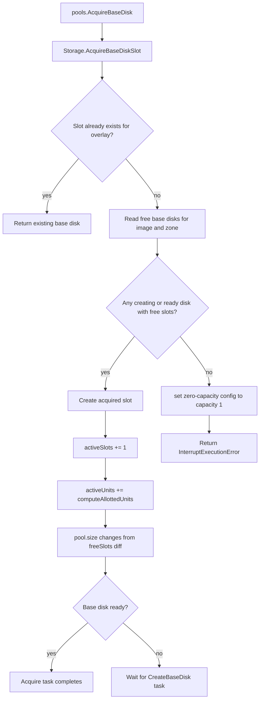

Release marks the slot `released`, releases source units and slots, and also
releases target units and slots if a rebase or relocation target was already
reserved. Released slot rows are kept as tombstones for a short time to avoid
races between overlay deletion and recreation with the same disk id.

Schema entry used by release cleanup:

| Table | Columns | Primary key | Derived from | Meaning |
| --- | --- | --- | --- | --- |
| `released` | `released_at: Timestamp`, `overlay_disk_id: Utf8` | `(released_at, overlay_disk_id)` | `slots.status == released` | Lets `pools.ClearReleasedSlots` scan old slot tombstones by timestamp. |

### Overlay Disk API Flow

The disk service acquires a pool slot before creating the NBS overlay disk.
The acquire response gives it the base disk id and checkpoint id.

Deleting an overlay disk releases the pool slot after deleting the NBS overlay
disk. Cancelling overlay creation also releases the slot if one was reserved.

Code:
[create_overlay_disk_task.go](../../../cloud/disk_manager/internal/pkg/services/disks/create_overlay_disk_task.go).

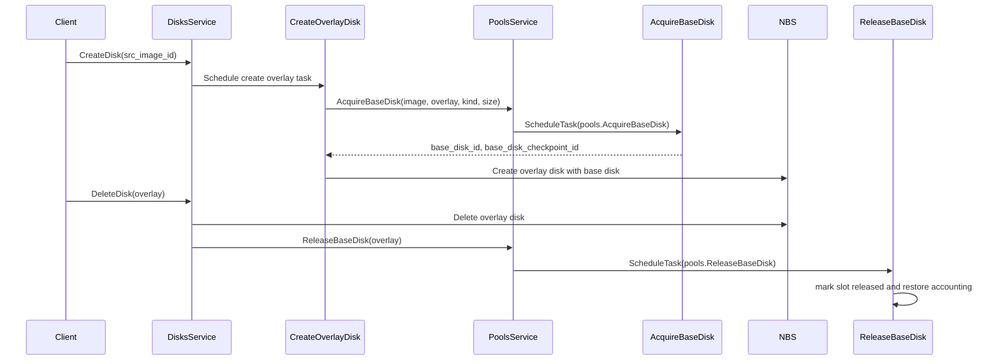

## Rebase and Retirement

Rebase moves an overlay slot from one base disk to another.

Retirement is the mechanism for removing old base disks without breaking
overlay disks that still depend on them. It drains base disks: every overlay
slot currently placed on the retiring base disk gets a target slot on another
base disk, then an NBS rebase moves the overlay to that target. After all source
slots are gone, the old base disk can be deleted.

There are two task levels:

* `pools.RetireBaseDisk` drains one base disk.
* `pools.RetireBaseDisks` lists the ready base disks for one `(image_id,
  zone_id)` and schedules `RetireBaseDisk` for each of those listed base disks.

`RetireBaseDisks` is the pool-wide drain task. It lists the current ready base
disks for one `(image_id, zone_id)`, schedules `RetireBaseDisk` for each listed
base disk, and lets the asynchronous deletion pipeline remove drained base disks
later. If existing target capacity is insufficient, retirement creates
replacement base disks for the rebased overlays; those replacements are outside
the listed base-disk set being retired.

Common reasons:

* Image deletion: active overlays may still depend on base disks created from the
  image. Retirement moves those existing overlays to replacement base disks
  created from an old base disk source, so image storage and unused pool base
  disks can be removed without breaking the overlays.
* Explicit/private retirement: an operator can drain selected base disks from
  the private API or admin CLI.
* Base disk optimization: `pools.OptimizeBaseDisks` changes the desired base
  disk size mode and retires the old base disks so replacements use the new
  mode.

For image deletion, this is a cleanup and reshaping step. Deleting the pool
removes the config row, so no new spare capacity is maintained, but existing
overlays could still keep old pool base disks alive. The image deletion flow
schedules `RetireBaseDisks` with
[`UseBaseDiskAsSrc=true`](../../../cloud/disk_manager/internal/pkg/services/images/common.go#L117)
and [`UseImageSize=imageMeta.Size`](../../../cloud/disk_manager/internal/pkg/services/images/common.go#L118).
When retirement needs a replacement base disk, it creates one from the old base
disk source and uses that image size
([`retireBaseDisk`](../../../cloud/disk_manager/internal/pkg/services/pools/storage/storage_ydb_impl.go#L3186),
[`generateBaseDisk`](../../../cloud/disk_manager/internal/pkg/services/pools/storage/storage_ydb_impl.go#L3266)).
That moves existing overlays from old pool-capacity base disks to image-sized
non-pool base disks. Plain `DeletePool` only deletes the pool config and marks
the pool deleted; this image-sized retirement is scheduled by the image deletion
flow.

Code:
[retire_base_disks_task.go](../../../cloud/disk_manager/internal/pkg/services/pools/retire_base_disks_task.go),
[retire_base_disk_task.go](../../../cloud/disk_manager/internal/pkg/services/pools/retire_base_disk_task.go),
[rebase_overlay_disk_task.go](../../../cloud/disk_manager/internal/pkg/services/pools/rebase_overlay_disk_task.go),
[storage_ydb_impl.go](../../../cloud/disk_manager/internal/pkg/services/pools/storage/storage_ydb_impl.go).

Schema entry used here:

| Table | Columns | Primary key | Derived from | Meaning |
| --- | --- | --- | --- | --- |
| `overlay_disk_ids` | `base_disk_id: Utf8`, `overlay_disk_id: Utf8` | `(base_disk_id, overlay_disk_id)` | Acquired slot source base disks | Lets retirement find overlay disks attached to a base disk. |

Retirement flow for one old base disk:

1. `pools.RetireBaseDisks` lists ready base disks for one image/zone.
2. It schedules one `pools.RetireBaseDisk` task per listed base disk.
3. `RetireBaseDisk` reserves target slots for all acquired slots on the old
   base disk.
4. If existing target base disks do not have enough capacity, storage generates
   replacement base disks.
5. The old base disk is marked `from_pool=false` and `retiring=true`.
6. `RetireBaseDisk` schedules `pools.RebaseOverlayDisk` tasks.
7. Each rebase task calls NBS `Rebase`.
8. Storage finalizes the move by releasing the source reservation and making
   the target reservation primary.
9. When the old base disk has no active units, invariants make it deletable.

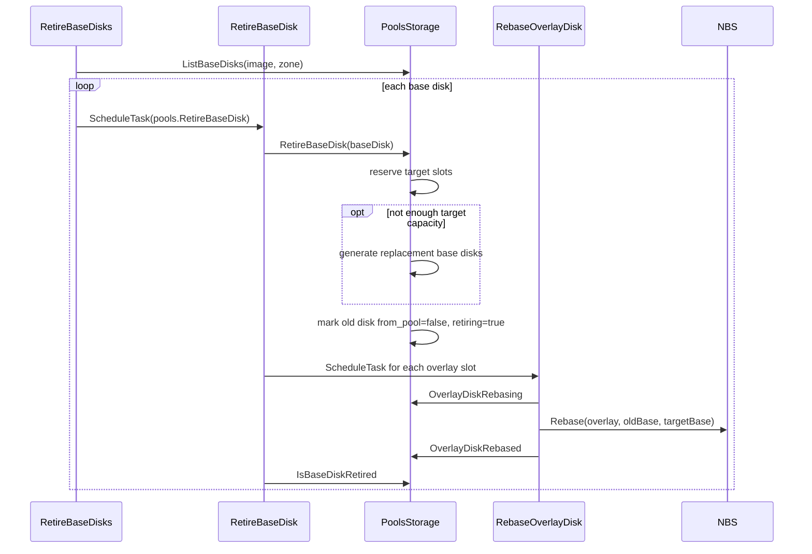

During rebase, one overlay can consume capacity on both source and target base
disks. The target reservation has `target_allotted_slots=1` and target units
computed from the overlay. Finalization releases the source reservation and
promotes the target reservation to the main reservation.

## Base Disk Optimization

`pools.OptimizeBaseDisks` decides whether a ready pool should use default-sized
or image-sized base disks.

The purpose is to keep the base disk shape appropriate for the actual usage of
the pool. `acquired_units` is the signal: it is the weighted amount of overlay
load currently attached to pool base disks. Heavily used images benefit from
default-sized base disks because larger base disks reserve more YDB blob storage
channels and therefore more reserved bandwidth, so shared base-disk reads are
less likely to be throttled. Large pools with low `acquired_units` are better
served by image-sized base disks: they keep the pool configured without
overprovisioning large base disks, channels, and bandwidth for an image that does
not currently have much overlay load. The optimization task switches mode when
`acquired_units` crosses configured thresholds.

Code:
[optimize_base_disks_task.go](../../../cloud/disk_manager/internal/pkg/services/pools/optimize_base_disks_task.go),
[optimize_base_disks_task.proto](../../../cloud/disk_manager/internal/pkg/services/pools/protos/optimize_base_disks_task.proto),
[config.proto](../../../cloud/disk_manager/internal/pkg/services/pools/config/config.proto).

The task runs regularly when `RegularBaseDiskOptimizationEnabled` is true. By
default it runs every 15 minutes and only considers pools older than
`MinOptimizedPoolAge`.

It does not resize existing NBS base disks in place. Instead, it changes the
pool config and then calls `RetireBaseDisks` for that image/zone. The old base
disks are drained through rebase and eventually deleted. Replacement base disks
are created with the new config, so after retirement the pool converges to the
new base disk size mode.

Decision logic:

| Current mode | Condition | New mode |
| --- | --- | --- |
| Image-sized (`poolInfo.ImageSize > 0`) | `AcquiredUnits > ConvertToDefaultSizedBaseDiskThreshold` | Default-sized |
| Default-sized (`poolInfo.ImageSize == 0`) | `AcquiredUnits < ConvertToImageSizedBaseDiskThreshold` | Image-sized |

The thresholds must satisfy:

```text
ConvertToDefaultSizedBaseDiskThreshold >
ConvertToImageSizedBaseDiskThreshold
```

The gap avoids mode flapping.

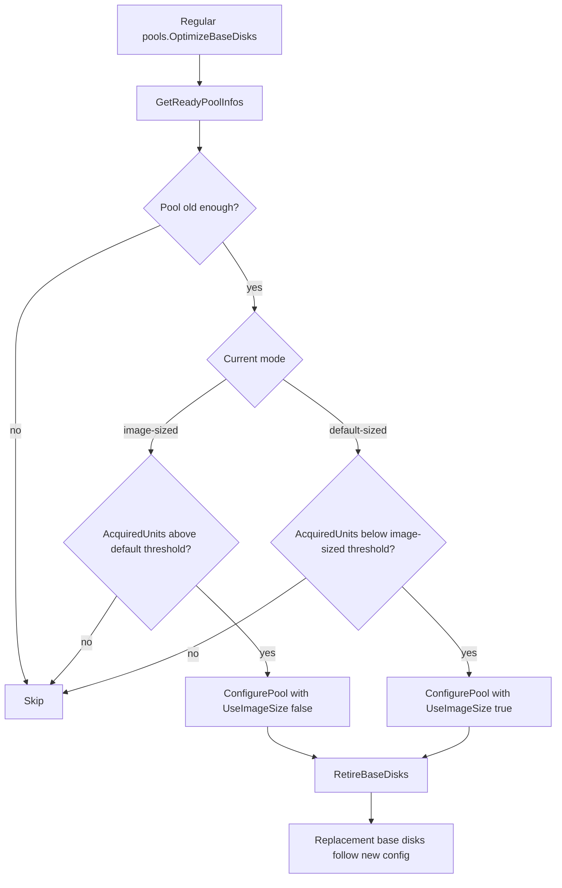

Optimization can change the amount of base disks in the pool because
replacement base disks are packed according to the new slot/unit limits. The old
base disks leave the pool through retirement and deletion.

## Pool and Image Deletion

Deleting a pool stops new spare capacity from being created for that
`(image_id, zone_id)` and removes empty free base disks from the pool. Active
overlays are not broken by deleting the pool; their base disks stay alive until
the overlays are released or rebased away.

Code:
[delete_pool_task.go](../../../cloud/disk_manager/internal/pkg/services/pools/delete_pool_task.go),
[image_deleting_task.go](../../../cloud/disk_manager/internal/pkg/services/pools/image_deleting_task.go),
[delete_base_disks_task.go](../../../cloud/disk_manager/internal/pkg/services/pools/delete_base_disks_task.go),
[clear_deleted_base_disks_task.go](../../../cloud/disk_manager/internal/pkg/services/pools/clear_deleted_base_disks_task.go),
[images/common.go](../../../cloud/disk_manager/internal/pkg/services/images/common.go).

### DeletePool

`pools.DeletePool`:

1. Reads the `pools` row.
2. If the pool is locked, returns `InterruptExecutionError`.
3. Reads free base disks for the pool.
4. Selects free base disks with `active_slots=0`.
5. Deletes the `configs` row.
6. Deletes `free` rows for the pool.
7. Marks the pool `deleted`.
8. Sets `from_pool=false` on selected empty base disks, which makes them
   eligible for deletion through invariants.

Base disks with active slots remain alive. They no longer provide pool capacity,
but they are still needed by existing overlays.

### DeleteImage

Image deletion first tells pools that the image is deleting. Pool storage deletes
all ready pools for the image. The image deletion path also schedules
`RetireBaseDisks` for default pool zones so active overlays can move away from
base disks tied to the deleted image.

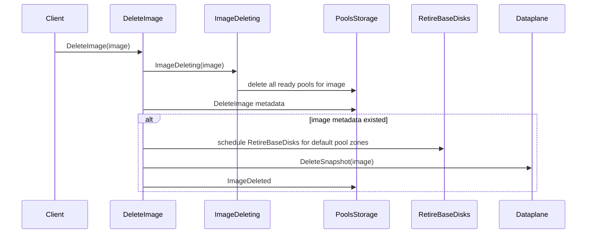

### Physical base disk deletion

Physical deletion is asynchronous:

Schema entries used here:

| Table | Columns | Primary key | Derived from | Meaning |
| --- | --- | --- | --- | --- |
| `deleting` | `base_disk_id: Utf8` | `base_disk_id` | `base_disks.status == deleting` | Base disks whose physical NBS disk should be deleted. |
| `deleted` | `deleted_at: Timestamp`, `base_disk_id: Utf8` | `(deleted_at, base_disk_id)` | `base_disks.status == deleted` | Base disks deleted in NBS but retained until expiration. |

1. A base disk transition moves the disk to `deleting`.
2. The `deleting` index gets a row.
3. Regular `pools.DeleteBaseDisks` reads a limited batch.
4. It calls NBS `Delete`.
5. Storage marks the base disk `deleted` and writes the `deleted` index.
6. Regular `pools.ClearDeletedBaseDisks` removes old deleted rows after
   `DeletedBaseDiskExpirationTimeout`.

```mermaid
flowchart LR
    A[base disk status deleting] --> B[deleting table]
    B --> C[pools.DeleteBaseDisks]
    C --> D[NBS Delete disk]
    D --> E[status deleted and deleted table]
    E --> F[pools.ClearDeletedBaseDisks]
    F --> G[remove base_disks and deleted rows]

    click C "../../../cloud/disk_manager/internal/pkg/services/pools/delete_base_disks_task.go" "DeleteBaseDisks task"
    click E "../../../cloud/disk_manager/internal/pkg/services/pools/storage/storage_ydb_impl.go" "BaseDisksDeleted"
    click F "../../../cloud/disk_manager/internal/pkg/services/pools/clear_deleted_base_disks_task.go" "ClearDeletedBaseDisks task"
```

## Full Lifecycle

The normal lifecycle is:

1. Image is created.
2. Pool config is written for each configured zone.
3. Regular scheduler notices `capacity > pool.size`.
4. Scheduler creates base disk records in `scheduling`.
5. Create tasks create NBS base disks and checkpoints.
6. Overlay creation acquires one slot and some units.
7. Overlay deletion releases the slot and units.
8. Optimization may switch base disk mode and retire old base disks.
9. Rebase moves overlays away from retiring base disks.
10. Image deletion deletes pool configs and retires active base disks.
11. Empty or retired base disks move to `deleting`.
12. Regular delete and clear tasks remove physical disks and old rows.

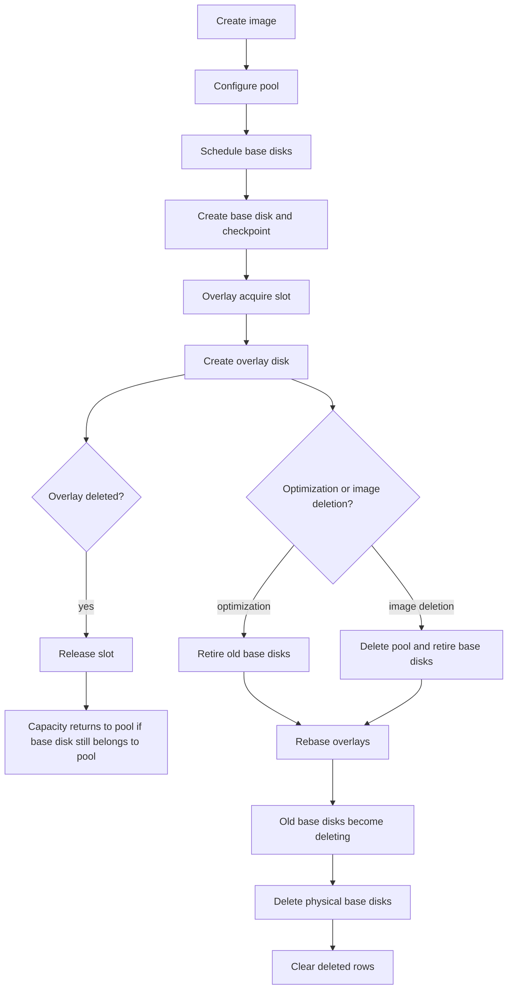

## Capacity Notes

### Capacity is not request backlog

The scheduler only sees configured capacity and current pool accounting:

```text
config.capacity - pool.size
```

It does not count pending overlay create tasks. It does not count pending acquire
tasks that are returning `InterruptExecutionError`. A burst of 1000 overlay
creates does not itself become a 1000-slot deficit. The deficit appears only as
slots are actually acquired and `pool.size` goes down.

### On-demand pools start with capacity 1

If the pool is on-demand, storage writes `capacity=1`. With a default base disk:

```text
ceil(1 / 640) = 1 base disk
```

That one base disk can serve many overlays, but after it is consumed the next
replenishment depends on the next scheduler run and on what `pool.size` says at
that moment.

### Scheduler cadence still matters

Base disk creation can be fast, but new base disk scheduling still goes through
the regular `pools.ScheduleBaseDisks` task. With the default one-minute
interval, a pool that is consumed just after a scheduler run may wait until the
next run before new base disks are scheduled.

## Operational Rules

* Configure `capacity` in slots.
* For default base disks, one base disk is 640 slots with default config.
* For bursty workloads, configure explicit capacity instead of relying on
  on-demand `capacity=1`.
* Watch slots and units. Slots tell how many overlays can fit. Units tell how
  much weighted overlay size can fit.
* `pool.size >= capacity` means the scheduler is satisfied, even if many
  overlay tasks are still waiting and have not reserved slots.
* Fast base disk creation does not remove the `ScheduleBaseDisks` interval.
* Optimization changes future replacement shape. It does not resize an existing
  NBS base disk in place.

## Short Q&A

**Why do pools exist?**

They keep reusable base disks for image-backed overlay disks. Overlay creation
can attach to a base disk checkpoint instead of copying image data into every
new disk.

**Is `pool.size` in slots?**

Yes. `pool.size` is current slot capacity already accounted for the pool.

**Does an overlay disk reserve one slot?**

Yes. One overlay disk reserves exactly one slot on one base disk. It also
reserves units based on overlay size and disk kind.

**How many slots and units are in one base disk?**

With default config and default-sized base disks: 640 slots and 640 units. With
image-sized base disks: units are derived from image size, then clamped, and
slots are `min(units, MaxActiveSlots)`.

**Why can only one base disk be scheduled when `MaxBaseDisksInflight` is 5?**

Because `MaxBaseDisksInflight` is only the upper bound. The scheduler computes
the actual count from the current slot deficit. On-demand capacity is `1`, so
the initial deficit usually maps to one base disk. Also, if the pool already has
a disk in `scheduling`, the scheduler does not generate more for that pool in
that pass.

**When scheduling base disks, do we increase `pool.size`?**

Yes. Scheduling immediately reserves capacity in `pool.size`, `free_units`, and
`base_disks_inflight`. This prevents repeated scheduling for the same deficit
while creation is still running.

**When acquiring a base disk slot, do we decrease `pool.size`?**

Yes, but indirectly. Acquire changes the base disk's `active_slots` and
`active_units`. Pool accounting then applies the difference between old and new
`freeSlots()`. A normal acquire decreases `pool.size` by 1.

**Do pending acquire tasks count as capacity deficit?**

No. Only successful slot reservations affect `pool.size`. Pending tasks that
are spinning on `InterruptExecutionError` do not reduce `pool.size`.

**If pool capacity is 1000, will the scheduler keep filling until
`pool.size >= 1000`?**

Yes. It keeps scheduling according to `capacity - pool.size`, capped by
inflight limits and affected by scheduler cadence. With default base disks it
will overshoot to a multiple of 640 slots.

**When is pool config `image_size` set?**

Explicit `ConfigurePool(..., use_image_size=true)` sets it from image metadata.
Optimization can also reconfigure a pool into image-sized mode. The automatic
image creation path configures default-sized pools unless reconfigured later.

**Does optimization change existing base disks?**

Not in place. It changes pool config and retires old base disks. Replacement
base disks are created with the new sizing mode.

**Why can tasks wait even when base disk creation is fast?**

Because waiting is not only about physical creation time. It can come from the
regular scheduler interval, on-demand capacity being only `1`, the inflight cap,
or a base disk stuck in `scheduling` before it becomes `creating` or `ready`.
