# Disk Manager Pools

Pools keep reusable base disks for images.

An overlay disk created from an image does not need to copy all image data into
its own disk. It can point to a base disk checkpoint and store only its own
changes on top. The pool subsystem keeps enough base disks ready, or close to
ready, so overlay disk creation can use those base disks instead of creating a
full copy every time.

A pool belongs to one `(image_id, zone_id)` pair. It answers one question: how
many overlay disks can still be created from this image in this zone without
first creating more base disk capacity?

The core code is in [internal/pkg/services/pools](../../../cloud/disk_manager/internal/pkg/services/pools).
The storage interface is in
[storage.go](../../../cloud/disk_manager/internal/pkg/services/pools/storage/storage.go). The YDB
implementation is split between
[storage_ydb.go](../../../cloud/disk_manager/internal/pkg/services/pools/storage/storage_ydb.go)
and
[storage_ydb_impl.go](../../../cloud/disk_manager/internal/pkg/services/pools/storage/storage_ydb_impl.go).
The storage structs, table definitions, status values, unit accounting, and
pool transition logic are in
[common.go](../../../cloud/disk_manager/internal/pkg/services/pools/storage/common.go).

## Pool Model

The pool has a desired state and a current state.

Desired state is stored in `configs`. Current accounting is stored in `pools`.
The scheduler compares them.

Code:
[configure_pool_task.go](../../../cloud/disk_manager/internal/pkg/services/pools/configure_pool_task.go),
[storage_ydb_impl.go](../../../cloud/disk_manager/internal/pkg/services/pools/storage/storage_ydb_impl.go),
[config.proto](../../../cloud/disk_manager/internal/pkg/services/pools/config/config.proto).

### `configs`

`configs` is the desired configuration for one image/zone pool. This is the
schema entry used by configuration and by the base disk scheduler.

| Column | Type | Meaning |
| --- | --- | --- |
| `image_id` | `Utf8` | Image id. Part of the primary key. |
| `zone_id` | `Utf8` | Zone id. Part of the primary key. |
| `kind` | `Int64` | Deprecated pool kind dimension. Part of the primary key. New code writes `0`. |
| `capacity` | `Uint64` | Desired spare capacity in slots. |
| `image_size` | `Uint64` | `0` for default-sized base disks, or the image size for image-sized base disks. |

Primary key: `(image_id, zone_id, kind)`.

`capacity` is in slots. It is not bytes, units, base disks, or number of API
requests.

### `pools`

`pools` is current accounting for one `(image_id, zone_id)`. This is the schema
entry used whenever the code decides whether the pool has enough capacity.

| Column | Type | Meaning |
| --- | --- | --- |
| `image_id` | `Utf8` | Image id. Part of the primary key. |
| `zone_id` | `Utf8` | Zone id. Part of the primary key. |
| `size` | `Uint64` | Current free or reserved pool slot capacity. This is compared with `configs.capacity`. |
| `free_units` | `Uint64` | Current free weighted units on base disks that still belong to the pool. |
| `acquired_units` | `Uint64` | Weighted units reserved by overlay slots. |
| `base_disks_inflight` | `Uint64` | Base disks in `scheduling` or `creating`. |
| `lock_id` | `Utf8` | Pool lock used by retirement and deletion paths. |
| `status` | `Int64` | `ready` or `deleted`. |
| `created_at` | `Timestamp` | Pool creation time, used by optimization age checks. |

Primary key: `(image_id, zone_id)`.

`pool.size` is in slots. Scheduling a base disk increases it by that base disk's
free slot count. Acquiring an overlay slot decreases it through base disk
transition accounting. Releasing an overlay slot increases it through the same
transition accounting.

That means the scheduler is not looking at "how many create disk requests are
waiting". It is looking at:

```text
configs.capacity - pools.size
```

Pending acquire tasks do not count as a capacity deficit. Only state already
written into `base_disks` and `slots` affects `pools.size`.

## Base Disks, Slots, and Units

A base disk is an NBS disk populated from an image snapshot or from another base
disk. Overlay disks acquire slots on base disks. One overlay disk consumes one
slot and some number of units.

Code:
[common.go](../../../cloud/disk_manager/internal/pkg/services/pools/storage/common.go),
[create_base_disk_task.go](../../../cloud/disk_manager/internal/pkg/services/pools/create_base_disk_task.go),
[acquire_base_disk_task.go](../../../cloud/disk_manager/internal/pkg/services/pools/acquire_base_disk_task.go),
[release_base_disk_task.go](../../../cloud/disk_manager/internal/pkg/services/pools/release_base_disk_task.go).

### `base_disks`

`base_disks` is the source of truth for every base disk. This is the schema
entry used by scheduling, creation, acquire, release, rebase, retirement, and
deletion.

| Column | Type | Meaning |
| --- | --- | --- |
| `id` | `Utf8` | Base disk id. Primary key. |
| `image_id` | `Utf8` | Image id for the pool this base disk belongs to. |
| `zone_id` | `Utf8` | Zone id for the pool this base disk belongs to. |
| `src_disk_zone_id` | `Utf8` | Source disk zone for replacement base disks cloned during retirement. Empty for image snapshot base disks. |
| `src_disk_id` | `Utf8` | Source disk id for replacement base disks cloned during retirement. |
| `src_disk_checkpoint_id` | `Utf8` | Source checkpoint for replacement base disks cloned during retirement. |
| `checkpoint_id` | `Utf8` | Base disk checkpoint id. The code uses the image id as checkpoint id. |
| `create_task_id` | `Utf8` | Task id of `pools.CreateBaseDisk` after scheduling. |
| `image_size` | `Uint64` | Image size mode captured when this base disk was generated. |
| `size` | `Uint64` | Physical base disk size. `0` means default base disk size. |
| `active_slots` | `Uint64` | Overlay slots currently reserved on this base disk. |
| `max_active_slots` | `Uint64` | Slot limit for this base disk. |
| `active_units` | `Uint64` | Weighted units currently reserved by overlays. |
| `units` | `Uint64` | Weighted unit limit for this base disk. |
| `from_pool` | `Bool` | Whether this base disk contributes capacity to a live pool. |
| `retiring` | `Bool` | Whether overlay slots are being moved away from this base disk. |
| `deleted_at` | `Timestamp` | Timestamp set when physical deletion is recorded. |
| `status` | `Int64` | `scheduling`, `creating`, `ready`, `deleting`, `deleted`, or `creation_failed`. |

Primary key: `id`.

Base disk states:

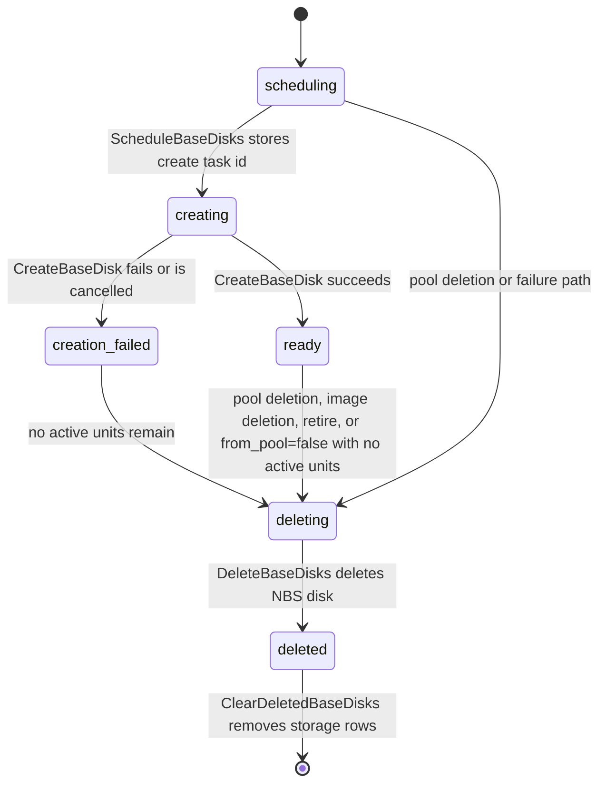

`creation_failed` is treated as doomed capacity. It can still temporarily have
active units if an overlay acquired a slot while the base disk was `creating`.
When those active units are released, invariants move it to `deleting`.

### `slots`

`slots` is the source of truth for overlay reservations. This is the schema
entry used by acquire, release, rebase, relocation, and released-slot cleanup.

| Column | Type | Meaning |
| --- | --- | --- |
| `overlay_disk_id` | `Utf8` | Overlay disk id. Primary key. |
| `overlay_disk_kind` | `Int64` | Overlay disk kind used for unit accounting. |
| `overlay_disk_size` | `Uint64` | Overlay disk size used for unit accounting. |
| `base_disk_id` | `Utf8` | Current source base disk. |
| `image_id` | `Utf8` | Image id for the current source slot. |
| `zone_id` | `Utf8` | Zone id for the current source slot. |
| `status` | `Int64` | `acquired` or `released`. |
| `allotted_slots` | `Uint64` | Current source slot reservation. |
| `allotted_units` | `Uint64` | Current source unit reservation. |
| `released_at` | `Timestamp` | Timestamp for released slot tombstones. |
| `target_zone_id` | `Utf8` | Target zone during rebase or relocation. |
| `target_base_disk_id` | `Utf8` | Target base disk during rebase or relocation. |
| `target_allotted_slots` | `Uint64` | Target slot reservation during rebase or relocation. |
| `target_allotted_units` | `Uint64` | Target unit reservation during rebase or relocation. |
| `generation` | `Uint64` | Slot generation used to reject stale rebase completions. |

Primary key: `overlay_disk_id`.

Every overlay disk takes exactly one slot:

```go
slot.allottedSlots = 1
disk.activeSlots++
```

It also takes units:

```go
slot.allottedUnits = computeAllottedUnits(slot)
disk.activeUnits += slot.allottedUnits
```

Units are weighted by overlay size and disk kind. SSD overlays are more
expensive than HDD overlays. The default unit size is 32 GiB. The code uses
oversubscription, so units are not raw bytes; they are a scheduling/accounting
weight.

Default configuration:

| Config | Default | Meaning |
| --- | --- | --- |
| `MaxActiveSlots` | `640` | Max overlay slots on one default base disk. |
| `MaxBaseDiskUnits` | `640` | Max weighted units on one default base disk. |
| `MaxBaseDisksInflight` | `5` | Max base disks in `scheduling` or `creating` for one pool. |

With the default base disk mode, one base disk has 640 slots and 640 units.
With image-sized base disks, `generateBaseDisk` derives the physical size and
unit count from the image size, clamps units to `[30, MaxBaseDiskUnits]`, and
sets:

```text
max_active_slots = min(units, MaxActiveSlots)
```

A base disk has no free slots if it is deleting/deleted/creation_failed, if it
does not belong to the pool, if units are exhausted, or if the slot count is
exhausted.

## Derived Tables and Invariants

The secondary tables are derived indexes. They make regular tasks and acquire
paths cheap, but they should not be treated as independent truth. Their schema
entries are listed once in the sections that use them: `scheduling` in base disk
scheduling, `free` and `released` in acquire/release, `overlay_disk_ids` in
rebase/retirement, and `deleting`/`deleted` in physical deletion.

Code:
[common.go](../../../cloud/disk_manager/internal/pkg/services/pools/storage/common.go),
[storage_ydb_impl.go](../../../cloud/disk_manager/internal/pkg/services/pools/storage/storage_ydb_impl.go),
[consistency_check.go](../../../cloud/disk_manager/internal/pkg/services/pools/storage/consistency_check.go).

Important invariants:

* `base_disks` and `slots` are the source rows.
* `free`, `scheduling`, `deleting`, `deleted`, `released`, and
  `overlay_disk_ids` are updated from transitions.
* A base disk that is not `from_pool` contributes zero free slots.
* A doomed base disk contributes zero free slots.
* A base disk from a deleted pool is forced out of the pool by setting
  `from_pool=false`.
* A `creation_failed` base disk with no active units becomes `deleting`.
* A non-pool base disk with no active units becomes `deleting`.
* An existing base disk is not allowed to move from not-inflight back to
  inflight.
* `base_disks_inflight` increases only when a new base disk enters
  `scheduling` or `creating`, and decreases when it leaves those states.
* `pool.size`, `pool.free_units`, and `pool.acquired_units` are computed from
  base disk transition diffs. They are not independently decremented by the
  acquire task or incremented by the release task.

The transition pipeline for a base disk update is:

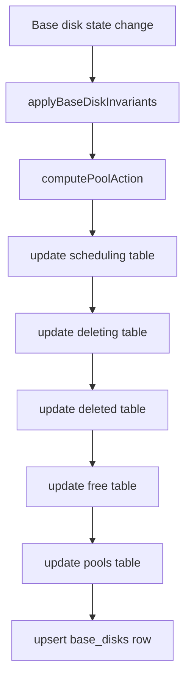

The core pool action for a normal base disk transition is:

```go
sizeDiff = newBaseDisk.freeSlots() - oldBaseDisk.freeSlots()
freeUnitsDiff = newBaseDisk.freeUnits() - oldBaseDisk.freeUnits()
acquiredUnitsDiff = newBaseDisk.activeUnits - oldBaseDisk.activeUnits
```

This is why there is no separate "decrease pool size" operation in acquire
code. The acquire changes `active_slots` and `active_units` on a base disk. The
pool update is then derived from how many free slots and units the base disk had
before and after the transition.

## APIs and Tasks

External users usually call image and disk APIs. Pool APIs are internal/private
operations scheduled as tasks.

Code:
[private_service.proto](../../../cloud/disk_manager/internal/api/private_service.proto),
[service.go](../../../cloud/disk_manager/internal/pkg/services/pools/service.go),
[register.go](../../../cloud/disk_manager/internal/pkg/services/pools/register.go).

| API or task | Request fields | Main effect |
| --- | --- | --- |
| `PrivateService.ConfigurePool` / `pools.ConfigurePool` | `image_id`, `zone_id`, `capacity`, `use_image_size` | Writes or updates `configs`. |
| `PrivateService.DeletePool` / `pools.DeletePool` | `image_id`, `zone_id` | Deletes one pool config and removes free empty base disks from the pool. |
| `PrivateService.AcquireBaseDisk` / `pools.AcquireBaseDisk` | `src_image_id`, `overlay_disk_id`, `overlay_disk_kind`, `overlay_disk_size` | Reserves one slot for an overlay disk and returns base disk id/checkpoint. |
| `PrivateService.ReleaseBaseDisk` / `pools.ReleaseBaseDisk` | `disk_id` | Releases the overlay slot and restores base disk/pool accounting. |
| `PrivateService.RebaseOverlayDisk` / `pools.RebaseOverlayDisk` | `disk_id`, `base_disk_id`, `target_base_disk_id`, `slot_generation` | Performs NBS rebase and finalizes a slot move. |
| `PrivateService.RetireBaseDisk` / `pools.RetireBaseDisk` | `base_disk_id`, optional `src_disk_id` | Moves overlays away from one base disk and marks it retiring. |
| `PrivateService.RetireBaseDisks` / `pools.RetireBaseDisks` | `image_id`, `zone_id`, `use_base_disk_as_src`, `use_image_size` | Retires all base disks for one image/zone. |
| `PrivateService.OptimizeBaseDisks` / `pools.OptimizeBaseDisks` | empty | Switches eligible pools between default-sized and image-sized mode, then retires old base disks. |
| Regular `pools.ScheduleBaseDisks` | none | Converts configured capacity deficit into `pools.CreateBaseDisk` tasks. |
| Regular `pools.DeleteBaseDisks` | none | Deletes physical NBS disks listed in `deleting`. |
| Regular `pools.ClearDeletedBaseDisks` | none | Removes expired deleted base disk rows. |
| Regular `pools.ClearReleasedSlots` | none | Removes expired released slot tombstones. |

The main callers are:

| Caller | Pool operation |
| --- | --- |
| `images.CreateImage*` | Calls `ConfigurePool` after image metadata/snapshot creation when pooled image config is present. |
| `images.DeleteImage` | Calls `ImageDeleting`, schedules `RetireBaseDisks`, then deletes the image snapshot. |
| `disks.CreateOverlayDisk` | Calls `AcquireBaseDisk` before creating the NBS overlay disk. |
| `disks.DeleteDisk` and overlay-create cancellation | Calls `ReleaseBaseDisk` for overlay disks created from images. |
| Disk migration/relocation | Uses pool relocation/rebase storage paths and finalizes with `OverlayDiskRebasedTx`. |

## Image Creation and Pool Configuration

An image can configure pools automatically during image creation, or a caller can
configure a pool explicitly through the private API.

Code:
[images/common.go](../../../cloud/disk_manager/internal/pkg/services/images/common.go),
[images/service.go](../../../cloud/disk_manager/internal/pkg/services/images/service.go),
[configure_pool_task.go](../../../cloud/disk_manager/internal/pkg/services/pools/configure_pool_task.go),
[storage_ydb_impl.go](../../../cloud/disk_manager/internal/pkg/services/pools/storage/storage_ydb_impl.go).

### Explicit configuration

`ConfigurePool(image_id, zone_id, capacity, use_image_size)` schedules
`pools.ConfigurePool`.

The task reads image metadata. If `use_image_size=false`, it writes
`image_size=0`. If `use_image_size=true`, it writes the image metadata size.
Then storage upserts the `configs` row.

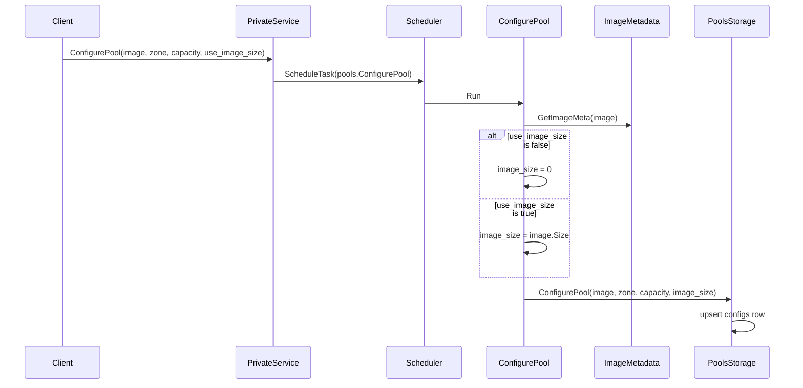

### Automatic configuration during image creation

Image creation can configure pools automatically. `images.service` fills
`DiskPools` from `DefaultDiskPoolConfigs` when the request is pooled or when
`ConfigurePoolsByDefault` is enabled. After the image is created, the image task
schedules one `pools.ConfigurePool` task per zone.

The automatic image creation path does not pass `UseImageSize`, so these pools
are configured with `image_size=0` unless a later explicit configuration or
optimization changes them.

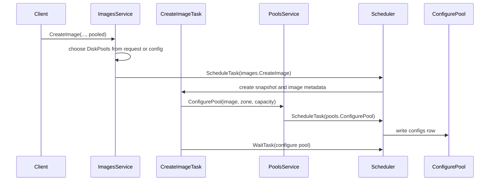

### On-demand configuration

If an overlay acquire finds no usable base disk, storage calls
`createPoolIfNecessary`. A configured pool with `capacity=0` is treated as
on-demand and is changed to `capacity=1`.

This path does not set `image_size`, so it uses default-sized base disks.

On-demand configuration is intentionally small. It is useful for correctness,
but it is not a good way to absorb a large burst of overlay creations.

## Scheduling Base Disks

`pools.ScheduleBaseDisks` is a regular task. By default it runs every minute
with one scheduler instance in flight.

Code:
[schedule_base_disks_task.go](../../../cloud/disk_manager/internal/pkg/services/pools/schedule_base_disks_task.go),
[storage_ydb_impl.go](../../../cloud/disk_manager/internal/pkg/services/pools/storage/storage_ydb_impl.go),
[register.go](../../../cloud/disk_manager/internal/pkg/services/pools/register.go).

Schema entry used here: `scheduling(image_id: Utf8, zone_id: Utf8,
base_disk_id: Utf8)`, with primary key
`(image_id, zone_id, base_disk_id)`. It is derived from
`base_disks.status == scheduling` and means that a base disk row exists but the
create task id still needs to be scheduled or confirmed.

The scheduler does this:

1. Read pool configs with non-zero capacity.
2. Read base disks in the `scheduling` table.
3. Return already-scheduling base disks so create tasks are scheduled
   idempotently.
4. For every pool with no already-scheduling base disk, compare
   `pool.size` with `config.capacity`.
5. Generate enough base disks to cover the slot deficit, capped by
   `MaxBaseDisksInflight - pool.base_disks_inflight`.
6. Write new base disks in `scheduling` state.
7. Immediately increase `pool.size`, `pool.free_units`, and
   `pool.base_disks_inflight`.
8. Schedule `pools.CreateBaseDisk` for each returned base disk.
9. Mark each scheduled base disk as `creating` and store its create task id.

The sizing formula is:

```text
wantToCreate =
    ceil((config.capacity - pool.size) / baseDiskTemplate.freeSlots())

willCreate =
    min(wantToCreate, MaxBaseDisksInflight - pool.baseDisksInflight)
```

If `pool.size >= config.capacity`, no new base disk is generated.

When a new base disk is generated, storage immediately accounts it:

```go
pool.size += willCreate * baseDiskTemplate.freeSlots()
pool.freeUnits += willCreate * baseDiskTemplate.freeUnits()
pool.baseDisksInflight += willCreate
```

This is reservation accounting. The scheduler should not keep creating the same
missing capacity while the base disk task is still running.

The capacity can overshoot because base disks are indivisible. With default
base disks and capacity `1000`, the first fill creates two base disks:

```text
ceil(1000 / 640) = 2
pool.size = 1280
```

With on-demand capacity `1`, the first fill creates one base disk:

```text
ceil(1 / 640) = 1
pool.size = 640
```

`MaxBaseDisksInflight=5` is only a cap. It does not mean "always create five".

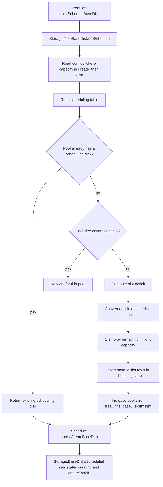

## Base Disk Creation

`pools.CreateBaseDisk` creates the NBS disk, transfers data, creates the base
disk checkpoint, and marks the base disk `ready`.

Code:
[create_base_disk_task.go](../../../cloud/disk_manager/internal/pkg/services/pools/create_base_disk_task.go),
[storage_ydb_impl.go](../../../cloud/disk_manager/internal/pkg/services/pools/storage/storage_ydb_impl.go).

If the base disk has `SrcDisk`, data is copied from that source disk. This is
used during retirement when replacements are cloned from existing base disks.
Otherwise data is copied from the image snapshot.

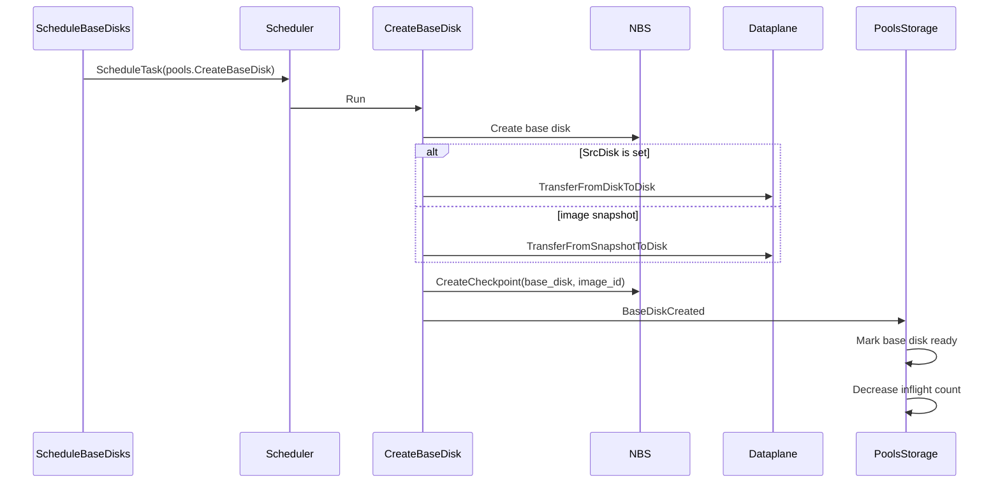

Overlay acquires can reserve slots on base disks in `creating` state. If that
happens, the acquire task waits for the base disk create task before returning
success to the overlay create task.

## Acquiring and Releasing Slots

`pools.AcquireBaseDisk` is scheduled when an overlay disk needs a base disk.

Code:
[acquire_base_disk_task.go](../../../cloud/disk_manager/internal/pkg/services/pools/acquire_base_disk_task.go),
[release_base_disk_task.go](../../../cloud/disk_manager/internal/pkg/services/pools/release_base_disk_task.go),
[storage_ydb_impl.go](../../../cloud/disk_manager/internal/pkg/services/pools/storage/storage_ydb_impl.go),
[common.go](../../../cloud/disk_manager/internal/pkg/services/pools/storage/common.go).

Schema entry used by acquire: `free(image_id: Utf8, zone_id: Utf8,
base_disk_id: Utf8)`, with primary key `(image_id, zone_id, base_disk_id)`.
It is derived from `base_disks.freeSlots() != 0` and means that the base disk
currently has capacity that acquire may try to reserve.

Acquire does this:

1. Look for an existing acquired slot for the overlay disk. If it exists, return
   it. This makes acquire idempotent.
2. Read base disks from the `free` index for the image/zone.
3. Accept only base disks in `creating` or `ready`.
4. Create a `slots` row.
5. Add one active slot and computed active units to the base disk.
6. Update pool accounting from the base disk transition.
7. If the chosen base disk is still `creating`, wait for its create task.
8. If no base disk can be used, configure on-demand capacity if needed and
   return `InterruptExecutionError`.

For a normal acquire, the accounting looks like this:

```text
old activeSlots = 0
old freeSlots   = 640

acquire:
  allottedSlots = 1
  activeSlots   = 1

new freeSlots   = 639
sizeDiff        = 639 - 640 = -1
pool.size       = pool.size - 1
```

If the acquire exhausts units, `freeSlots()` becomes `0`, so the size decrease
can be larger than `-1`. That is expected because the base disk no longer has
any usable free capacity even if the raw slot count is not fully used.

If acquire fails before a slot is reserved, there is no base disk transition and
`pool.size` is not changed.

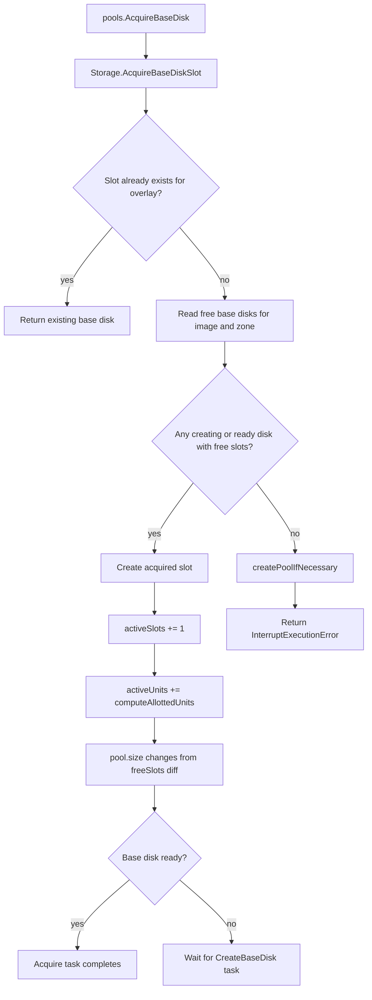

Release marks the slot `released`, releases source units and slots, and also
releases target units and slots if a rebase or relocation target was already
reserved. Released slot rows are kept as tombstones for a short time to avoid
races between overlay deletion and recreation with the same disk id.

Schema entry used by release cleanup: `released(released_at: Timestamp,
overlay_disk_id: Utf8)`, with primary key `(released_at, overlay_disk_id)`.
It is derived from `slots.status == released` and lets
`pools.ClearReleasedSlots` scan old slot tombstones by timestamp.

### Overlay Disk API Flow

The disk service acquires a pool slot before creating the NBS overlay disk.
The acquire response gives it the base disk id and checkpoint id.

Deleting an overlay disk releases the pool slot after deleting the NBS overlay
disk. Cancelling overlay creation also releases the slot if one was reserved.

Code:
[create_overlay_disk_task.go](../../../cloud/disk_manager/internal/pkg/services/disks/create_overlay_disk_task.go).

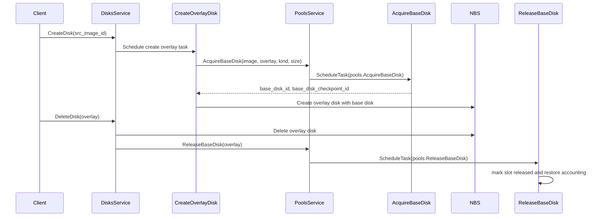

## Rebase and Retirement

Rebase moves an overlay slot from one base disk to another.

Retirement uses rebase to drain a base disk before deleting it or before
switching the pool to a different base disk size mode.

Code:
[retire_base_disks_task.go](../../../cloud/disk_manager/internal/pkg/services/pools/retire_base_disks_task.go),
[retire_base_disk_task.go](../../../cloud/disk_manager/internal/pkg/services/pools/retire_base_disk_task.go),
[rebase_overlay_disk_task.go](../../../cloud/disk_manager/internal/pkg/services/pools/rebase_overlay_disk_task.go),
[storage_ydb_impl.go](../../../cloud/disk_manager/internal/pkg/services/pools/storage/storage_ydb_impl.go).

Schema entry used here: `overlay_disk_ids(base_disk_id: Utf8,
overlay_disk_id: Utf8)`, with primary key `(base_disk_id, overlay_disk_id)`.
It is derived from acquired slot source base disks and lets retirement find
overlay disks attached to a base disk.

Retirement flow:

1. `pools.RetireBaseDisks` lists base disks for one image/zone.
2. It schedules one `pools.RetireBaseDisk` task per base disk.
3. `RetireBaseDisk` reserves target slots for all acquired slots on the old
   base disk.
4. If existing target base disks do not have enough capacity, storage generates
   replacement base disks.
5. The old base disk is marked `from_pool=false` and `retiring=true`.
6. `RetireBaseDisk` schedules `pools.RebaseOverlayDisk` tasks.
7. Each rebase task calls NBS `Rebase`.
8. Storage finalizes the move by releasing the source reservation and making
   the target reservation primary.
9. When the old base disk has no active units, invariants make it deletable.

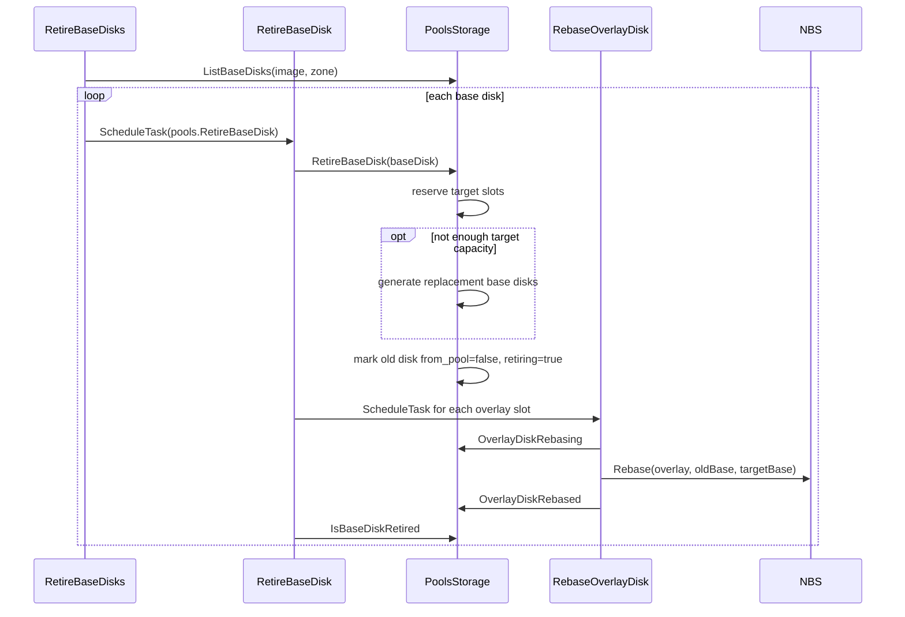

During rebase, one overlay can consume capacity on both source and target base
disks. The target reservation has `target_allotted_slots=1` and target units
computed from the overlay. Finalization releases the source reservation and
promotes the target reservation to the main reservation.

## Base Disk Optimization

`pools.OptimizeBaseDisks` decides whether a ready pool should use default-sized
or image-sized base disks.

Code:
[optimize_base_disks_task.go](../../../cloud/disk_manager/internal/pkg/services/pools/optimize_base_disks_task.go),
[optimize_base_disks_task.proto](../../../cloud/disk_manager/internal/pkg/services/pools/protos/optimize_base_disks_task.proto),
[config.proto](../../../cloud/disk_manager/internal/pkg/services/pools/config/config.proto).

The task runs regularly when `RegularBaseDiskOptimizationEnabled` is true. By
default it runs every 15 minutes and only considers pools older than
`MinOptimizedPoolAge`.

It does not resize existing NBS base disks in place.

It changes the pool config, then retires the old base disks. Replacement base
disks are created later using the new config.

Decision logic:

| Current mode | Condition | New mode |
| --- | --- | --- |
| Image-sized (`poolInfo.ImageSize > 0`) | `AcquiredUnits > ConvertToDefaultSizedBaseDiskThreshold` | Default-sized |
| Default-sized (`poolInfo.ImageSize == 0`) | `AcquiredUnits < ConvertToImageSizedBaseDiskThreshold` | Image-sized |

The thresholds must satisfy:

```text
ConvertToDefaultSizedBaseDiskThreshold >
ConvertToImageSizedBaseDiskThreshold
```

The gap avoids mode flapping.

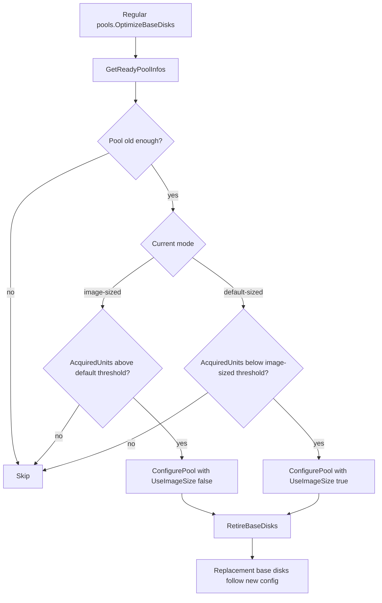

Optimization can change the amount of base disks in the pool because
replacement base disks are packed according to the new slot/unit limits. The old
base disks leave the pool through retirement and deletion.

## Pool and Image Deletion

Deleting a pool stops new spare capacity from being created for that
`(image_id, zone_id)` and removes empty free base disks from the pool. Active
overlays are not broken by deleting the pool; their base disks stay alive until
the overlays are released or rebased away.

Code:
[delete_pool_task.go](../../../cloud/disk_manager/internal/pkg/services/pools/delete_pool_task.go),
[image_deleting_task.go](../../../cloud/disk_manager/internal/pkg/services/pools/image_deleting_task.go),
[delete_base_disks_task.go](../../../cloud/disk_manager/internal/pkg/services/pools/delete_base_disks_task.go),
[clear_deleted_base_disks_task.go](../../../cloud/disk_manager/internal/pkg/services/pools/clear_deleted_base_disks_task.go),
[images/common.go](../../../cloud/disk_manager/internal/pkg/services/images/common.go).

### DeletePool

`pools.DeletePool`:

1. Reads the `pools` row.
2. If the pool is locked, returns `InterruptExecutionError`.
3. Reads free base disks for the pool.
4. Selects free base disks with `active_slots=0`.
5. Deletes the `configs` row.
6. Deletes `free` rows for the pool.
7. Marks the pool `deleted`.
8. Sets `from_pool=false` on selected empty base disks, which makes them
   eligible for deletion through invariants.

Base disks with active slots remain alive. They no longer provide pool capacity,
but they are still needed by existing overlays.

### DeleteImage

Image deletion first tells pools that the image is deleting. Pool storage deletes
all ready pools for the image. The image deletion path also schedules
`RetireBaseDisks` for default pool zones so active overlays can move away from
base disks tied to the deleted image.

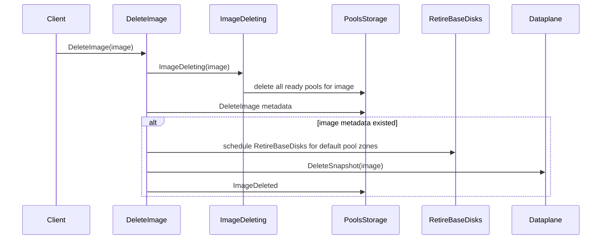

### Physical base disk deletion

Physical deletion is asynchronous:

Schema entries used here:

| Table | Columns | Primary key | Derived from | Meaning |
| --- | --- | --- | --- | --- |
| `deleting` | `base_disk_id: Utf8` | `base_disk_id` | `base_disks.status == deleting` | Base disks whose physical NBS disk should be deleted. |
| `deleted` | `deleted_at: Timestamp`, `base_disk_id: Utf8` | `(deleted_at, base_disk_id)` | `base_disks.status == deleted` | Base disks deleted in NBS but retained until expiration. |

1. A base disk transition moves the disk to `deleting`.
2. The `deleting` index gets a row.
3. Regular `pools.DeleteBaseDisks` reads a limited batch.
4. It calls NBS `Delete`.
5. Storage marks the base disk `deleted` and writes the `deleted` index.
6. Regular `pools.ClearDeletedBaseDisks` removes old deleted rows after
   `DeletedBaseDiskExpirationTimeout`.

```mermaid
flowchart LR
    A[base disk status deleting] --> B[deleting table]
    B --> C[pools.DeleteBaseDisks]
    C --> D[NBS Delete disk]
    D --> E[status deleted and deleted table]
    E --> F[pools.ClearDeletedBaseDisks]
    F --> G[remove base_disks and deleted rows]

    click C "../../../cloud/disk_manager/internal/pkg/services/pools/delete_base_disks_task.go" "DeleteBaseDisks task"
    click E "../../../cloud/disk_manager/internal/pkg/services/pools/storage/storage_ydb_impl.go" "BaseDisksDeleted"
    click F "../../../cloud/disk_manager/internal/pkg/services/pools/clear_deleted_base_disks_task.go" "ClearDeletedBaseDisks task"
```

## Full Lifecycle

The normal lifecycle is:

1. Image is created.
2. Pool config is written for each configured zone.
3. Regular scheduler notices `capacity > pool.size`.
4. Scheduler creates base disk records in `scheduling`.
5. Create tasks create NBS base disks and checkpoints.
6. Overlay creation acquires one slot and some units.
7. Overlay deletion releases the slot and units.
8. Optimization may switch base disk mode and retire old base disks.
9. Rebase moves overlays away from retiring base disks.
10. Image deletion deletes pool configs and retires active base disks.
11. Empty or retired base disks move to `deleting`.
12. Regular delete and clear tasks remove physical disks and old rows.

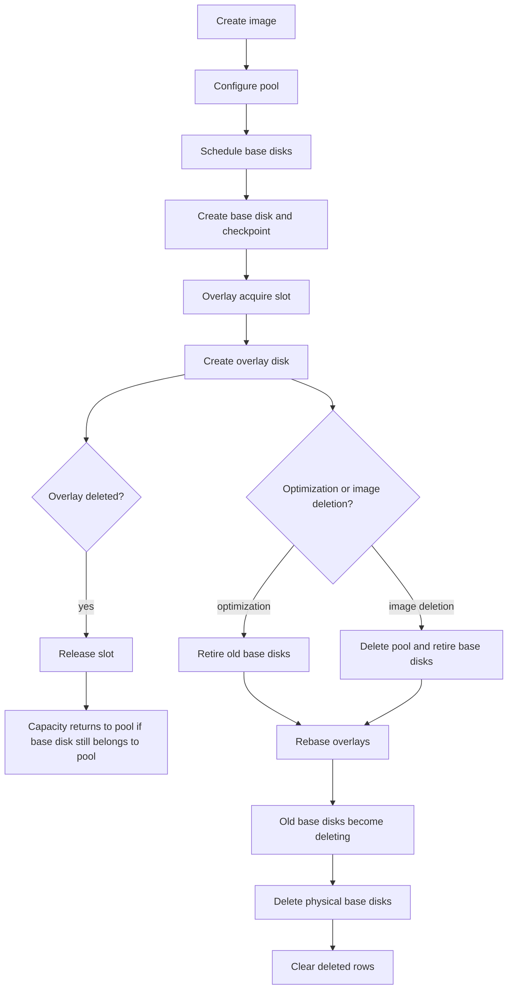

## Performance Bottlenecks

### Capacity is not request backlog

The scheduler only sees configured capacity and current pool accounting:

```text
config.capacity - pool.size
```

It does not count pending overlay create tasks. It does not count pending acquire
tasks that are returning `InterruptExecutionError`. A burst of 1000 overlay
creates does not itself become a 1000-slot deficit. The deficit appears only as
slots are actually acquired and `pool.size` goes down.

### On-demand pools start with capacity 1

If the pool is on-demand, storage writes `capacity=1`. With a default base disk:

```text
ceil(1 / 640) = 1 base disk
```

That one base disk can serve many overlays, but after it is consumed the next
replenishment depends on the next scheduler run and on what `pool.size` says at
that moment.

### MaxBaseDisksInflight is a cap, not a batch size

The default `MaxBaseDisksInflight` is 5. The scheduler still creates only the
number needed by the current capacity deficit.

If the deficit is one base disk, one base disk is scheduled. If the deficit is
ten base disks and no disks are inflight, five are scheduled.

### A scheduling disk can serialize a pool

`TakeBaseDisksToSchedule` first reads the `scheduling` table. If a pool already
has a base disk in `scheduling`, the scheduler returns that disk for idempotent
task scheduling and skips generating more for that pool in that pass.

That is useful for avoiding duplicate create tasks. It can also serialize
progress if a base disk remains in `scheduling` longer than expected.

### Creating is usable, scheduling is not

New base disks can appear in the `free` index while they are still
`scheduling`. Acquire reads `free`, but accepts only `creating` or `ready` base
disks.

So a base disk stuck in `scheduling` can look like capacity in indexes but still
not be acquirable.

### Scheduler cadence still matters when creation is fast

Base disk creation can take only seconds, but `ScheduleBaseDisks` is a regular
task. The default interval is one minute. If the pool is fully consumed right
after a scheduler pass, new capacity may wait for the next pass.

### Units can exhaust before slots

Every overlay takes one slot, but units depend on size and disk kind. Large SSD
overlays can exhaust `active_units` before `active_slots` reaches
`max_active_slots`.

When units are exhausted, `freeSlots()` returns zero and the base disk no longer
contributes to `pool.size` or the `free` index.

### Rebase and optimization create extra work

Optimization changes config and retires old base disks. Retirement reserves
target capacity and schedules one rebase task per overlay slot.

During rebase, source and target reservations can exist at the same time. This
temporarily increases capacity pressure and task load.

### Deletion is deliberately delayed

Deleting a pool or retiring a base disk does not immediately remove every row
and NBS disk. Deletion goes through regular tasks, batch limits, and expiration
timeouts.

Deletion lag does not mean capacity is usable. Base disks outside the pool or in
deleting/deleted states contribute zero free slots.

## Operational Rules

* Configure `capacity` in slots.
* For default base disks, one base disk is 640 slots with default config.
* For bursty workloads, configure explicit capacity instead of relying on
  on-demand `capacity=1`.
* Watch slots and units. Slots tell how many overlays can fit. Units tell how
  much weighted overlay size can fit.
* `pool.size >= capacity` means the scheduler is satisfied, even if many
  overlay tasks are still waiting and have not reserved slots.
* Fast base disk creation does not remove scheduler interval, inflight cap, or
  `scheduling` state effects.
* Optimization changes future replacement shape. It does not resize an existing
  NBS base disk in place.

## Short Q&A

**Why do pools exist?**

They keep reusable base disks for image-backed overlay disks. Overlay creation
can attach to a base disk checkpoint instead of copying image data into every
new disk.

**Is `pool.size` in slots?**

Yes. `pool.size` is current free or reserved slot capacity for the pool.

**Does an overlay disk take one slot?**

Yes. One overlay disk takes exactly one slot on one base disk. It also takes
some units based on overlay size and disk kind.

**How many slots and units are in one base disk?**

With default config and default-sized base disks: 640 slots and 640 units. With
image-sized base disks: units are derived from image size, then clamped, and
slots are `min(units, MaxActiveSlots)`.

**Why can only one base disk be scheduled when `MaxBaseDisksInflight` is 5?**

Because `MaxBaseDisksInflight` is only the upper bound. The scheduler computes
the actual count from the current slot deficit. On-demand capacity is `1`, so
the initial deficit usually maps to one base disk. Also, if the pool already has
a disk in `scheduling`, the scheduler does not generate more for that pool in
that pass.

**When scheduling base disks, do we increase `pool.size`?**

Yes. Scheduling immediately reserves capacity in `pool.size`, `free_units`, and
`base_disks_inflight`. This prevents repeated scheduling for the same deficit
while creation is still running.

**When acquiring a base disk slot, do we decrease `pool.size`?**

Yes, but indirectly. Acquire changes the base disk's `active_slots` and
`active_units`. Pool accounting then applies the difference between old and new
`freeSlots()`. A normal acquire decreases `pool.size` by 1.

**Do pending acquire tasks count as capacity deficit?**

No. Only successful slot reservations affect `pool.size`. Pending tasks that
are spinning on `InterruptExecutionError` do not reduce `pool.size`.

**If pool capacity is 1000, will the scheduler keep filling until
`pool.size >= 1000`?**

Yes. It keeps scheduling according to `capacity - pool.size`, capped by
inflight limits and affected by scheduler cadence. With default base disks it
will overshoot to a multiple of 640 slots.

**When is pool config `image_size` set?**

Explicit `ConfigurePool(..., use_image_size=true)` sets it from image metadata.
Optimization can also reconfigure a pool into image-sized mode. The automatic
image creation path configures default-sized pools unless reconfigured later.

**Does optimization change existing base disks?**

Not in place. It changes pool config and retires old base disks. Replacement
base disks are created with the new sizing mode.

**Why can tasks wait even when base disk creation is fast?**

Because waiting is not only about physical creation time. It can come from the
regular scheduler interval, on-demand capacity being only `1`, the inflight cap,
or a base disk stuck in `scheduling` before it becomes `creating` or `ready`.
