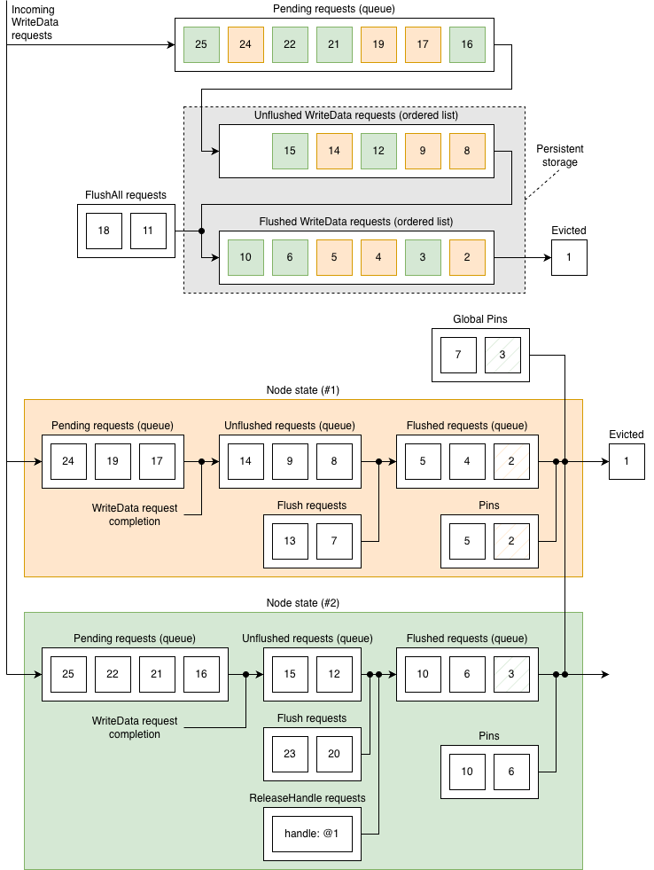
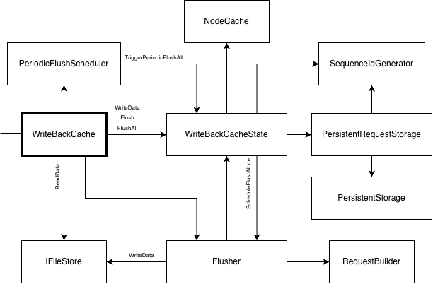

# WriteBackCache

Write-back cache is used to speed up execution of write requests at client side
by reporting them as completed for a client but continuing processing them in
background.

## Basic principles

1. Write-back cache is not allowed to break data consistency. Clients should
observe identical results with and without using write-back cache.

2. Service restart or client reconnect should not lead to data loss. The state
of the write-back cache should be backed by a storage that has lifetime not
less than the lifetime of a client.

3. Write-back cache is not a read cache - write requests should be flushed and
evicted from cache as quick as possible.

## Public Interface

### WriteData

```
TFuture<TWriteDataResponse> WriteData(
    TCallContextPtr callContext,
    std::shared_ptr<TWriteDataRequest> request);
```
Tries to store `request` in the persistent storage and returns immediately with
a completed future if it was successfully stored.

If there is not enough space in the persistent storage, then `request` is put
into a pending queue and the future is completed with:
- success when `request` is moved from the pending queue to the persistent
storage;
- error when `request` is dropped due to flush failure - the flush error is
propagated to the response

### ReadData

```
TFuture<TReadDataResponse> ReadData(
    TCallContextPtr callContext,
    std::shared_ptr<TReadDataRequest> request);
```
Executes `request` and augments the response with the cached data at request
completion.

Note: in order to avoid race condition, the unflushed data associated with the
node `nodeId` is pinned until `ReadData` completes. It does not prevent cached
data from flushing but keeps the cached data alive.

Race condition example:

1. Client writes some data.

2. Client initiates read.

3. The data is flushed and evicted from cache.

4. Read may return unflushed data.


### FlushNodeData

```
TFuture<TError> FlushNodeData(ui64 nodeId);
```

Returns a future that is completed when all `WriteData` requests associated with
the node `nodeId` and initiated before this call are flushed. This also applies
to requests in the pending queue.

An error is returned if an attempt to flush any of the `WriteData` requests has
failed. This does not lead to data loss. Flush may be retried.

Client-side example:

1. Client writes some data.

2. Client calls `fsync`.

3. Flush fails due to lack of free space.

4. Client gets `ENOSPC` error from `fsync`.

5. Client deletes some data.

6. Client calls `fsync` and it succeeds.


### FlushAllData

```
TFuture<TError> FlushAllData();
```

Returns a future that is completed when all `WriteData` requests for all nodes
initiated before this call are flushed. This also applies to requests in the
pending queue.

Failure to flush any node data will return in `FlushAllData` error.


### ReleaseHandle

```
TFuture<TError> ReleaseHandle(ui64 nodeId, ui64 handle);
```

Ensures that handle `handle` is safe to be destroyed. It does not destroy
handle inself — it should be done by the caller code after either successful
or unsuccessful result of ReleaseHandle.

Returns a future that is completed when all `WriteData` requests associated with
the node `nodeId` and `handle` are flushed. This also applies
to requests in the pending queue. Unlike `FlushNodeData`, unsuccessful flush
does immediately imply `ReleaseHandle` failure.

When ALL handles associated with the node `nodeId` are subject to release and
flush has failed:
- All `ReleaseHandle` requests for the node `nodeId` are failed;
- All pending requests for the node `nodeId` are dropped and failed;
- All cached data for the node `nodeId` is dropped.

Client-side example:

1. Client opens two handles for a node and writes some data using both of them.

2. Client calls `close` for the first handle.

3. Flush fails, `close` hangs.

4. Client calls `close` for the second handle.

5. Flush fails again, both `close` calls return an error.


### AcquireNodeStateRef, ReleaseNodeStateRef

```
ui64 AcquireNodeStateRef();
void ReleaseNodeStateRef(ui64 refId);
```

Pins and unpins cached data for all nodes preventing the flushed data to be
evicted from the persistent storage. Used in `ReadDir` and `Lookup` in order
to prevent returning wrong node size due to race condition.

All WriteData requests flushed **after** acquiring pin will remain in the
persistent storage until the pin is released. WriteData requests that are
already flushed will not be affected.


### GetCachedDataEndOffset

```
ui64 GetCachedDataEndOffset(ui64 nodeId);
```

Finds the end offset of the cached data associated with the node `nodeId`. Used
to adjust node size in `GetAttr`, `ReadDir` and `Lookup` requests.


## State

Each `WriteData`, `Flush` and `FlushAll` request is assigned an unique strictly
increased value — `SequenceId`.

`WriteData` request can be in one of the following states:
- `Pending`: the request is waiting to be stored in the persistent storage;
- `Unflushed`: the request is stored in the persistent storage but is not
flushed yet;
- `Flushed`: the request is flushed but still resides in the persistent storage;
- `Evicted`: the request has left the cache.

The processing of `WriteData` requests is strictly ordered:
- Any `Pending` request should have higher `SequenceId` than any
`Unflushed` or `Flushed` request.
- (per node) Any `Unflushed` request should have higher `SequenceId`
than any `Flushed` request.
- (per node) Any `Flushed` request should have higher `SequenceId`
than any `Evicted` request.

Cached data is calculated by applying `Unflushed` and `Flushed` requests on top
of each other in the increasing order of `SequenceId`.

`Flush` (`FlushAll`) request is completed when there are no `Pending` or
`Unflushed` requests with higher `SequenceId` associated with the node (among
all nodes).

`Flushed` request becomes `Evicted` when there are no `Pin` associated with the
corresponding node or global `Pin` that have less or equal `SequenceId`.

`ReleaseHandle` request is completed when there are no `Pending` or `Unflushed`
requests associated with the node/handle pair.




### Data consistency

Let be:

- `W[k]` — a `WriteData` request;
- `W[i..j]` — a result of sequenced execution of `W[i], W[i+1], ..., W[j]`;
- `S[k] = W[1..k]` — the server state, no other states are allowed;
- `C[k] = W[1..k]` — the client state, no other states are allowed.

Client data consistency rule:

- A client performing `ReadData` request is allowed to observe only one of the
states `C[k]`, `k_min <= k <= k_max`, where `k_min` is the order of the most
recent `WriteData` request reported as completed at the moment the read
has started and `k_max` is the most recent `WriteData` request reported as
completed at the moment the read has completed.

Idempotency property:

- `W[1..i] * W[j..n] = W[1..n]` if `i >= j` — this means that the requests may
be repeatedly applied without affecting the final state.

Server data consistency rule:

- Let `W[i..j]` be the cached data. The server state may be any of
`S[i-1], S[i], ..., S[j]`.

State restoration rule:

- Returning requests from `Flushed` and `Evicted` states to `Unflushed` does
not break data consistency if the order is maintained.


## Implementation




### PersistentStorage

Write-back cache stores `WriteData` requests in `FileRingBuffer` — memory-mapped
file with FIFO logic.

`PersistentStorage` is an abstraction over `FileRingBuffer` that allows to
remove entries from any position. The actual removal from `FileRingBuffer`
happens when the removed entry becomes head of the queue.

Note: the information about the removed entries is not stored persistently.
Restarting write-back cache will cause resurrection of the removed entries if
they were not actually removed from `FileRingBuffer`.

This does not break state consistency: since the requests are stored in
`FileRingBuffer` in a strictly increasing order, no intermediate `WriteData`
requests will be lost and the order will be maintained.


### PersistentRequestStorage

An abstration over `PersistentStorage` that:

- Manipulates the requests, not byte sequences;
- Manages three lists for `Pending`, `Unflushed` and `Flushed` requests.


### SequenceIdGenerator

- Counter shared between components.


### NodeCache

- Manages `Unflushed` and `Flushed` request queues per node;
- Represents cached data using disjoint interval tree (efficient O(log N)
implementation).


### WriteBackCacheState

- Holds the entire write-back cache state;
- Checks if nodes are to be flusher and notifies about it.


### Flusher

- Executes mutiple `WriteData` requests in parallel;
- Reports the flush progression to `WriteBackCacheState`


### RequestBuilder

- Optimizes `WriteData` requests by merging them;
- Limits the amount of request to be executed in a single flush iteration.


### PeriodicFlushScheduler

Periodically triggers flushing all unflushed data.


## Direct reads and writes

### Linux behavior

All read/write requests are sequenced, newest requests should observe the
effects of completed previous requests no matter of whether O_DIRECT flag is
set or not.

Flag `O_DIRECT` only instructs that the data cannot be read from or written to
a cache, for example, for filemap:

* Direct read: the cached data is flushed then the request is processed:
https://github.com/torvalds/linux/blob/30f09200cc4aefbd8385b01e41bde2e4565a6f0e/mm/filemap.c#L2907

* Direct write: the cache is invalidated then the request is processed:
https://github.com/torvalds/linux/blob/30f09200cc4aefbd8385b01e41bde2e4565a6f0e/mm/filemap.c#L4181

For FUSE:

* Direct reads trigger flushing guest write-back cache:
https://github.com/torvalds/linux/blob/c875a6c3246713a018d8b7b143deb3ebaeecaf1c/fs/fuse/file.c#L1677

Note: `O_DIRECT` flag is a non-POSIX feature so we should follow Linux behavior.


### Implementation in WriteBackCache

Read and write operations with `O_DIRECT` flag set should never enter
WriteBackCache. The caller code (`TFileSystem`) should ensure that the cache
is empty and then execute the operation directly.

#### WriteData

Call `FlushNodeData` then call `WriteData` (directly to the Session) if flush was successful.

Note: it is guaranteed by an RW lock that no cached WriteData request can be
received while there are direct writes in progress.

https://github.com/torvalds/linux/blob/c537e12daeecaecdcd322c56a5f70659d2de7bde/fs/fuse/file.c#L1494

#### ReadData

Call `FlushNodeData` then call `ReadData` (directly to the Session) if flush was
successful.

Note: the kernel does not guarantee mutual exclusion or coherence between
overlapping direct reads and writes. A client making writes while a read
operation is in progress may observe partially written data (and this is
POSIX-compliant).
