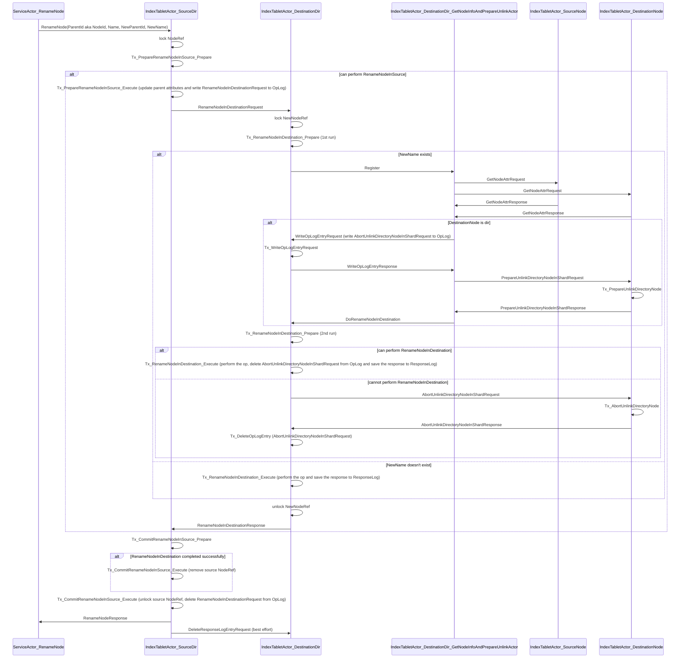
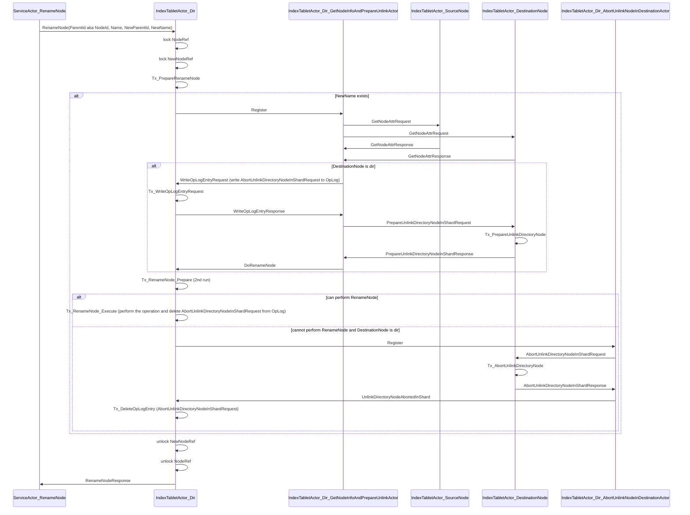

# RenameNode with directories in shards

The feature itself is implemented here: https://github.com/ydb-platform/nbs/issues/2674

With this feature RenameNode operation becomes a lot more complex because it might require a cross-shard transaction which might be impossible to execute either in the shard in charge of the source directory or in the shard in charge of the parent directory.

Because of this we need to do something similar to 2PC. A simplified outline of what happens:
1. RenameNodeRequest is initially sent to the shard in charge of the source parent dir
2. Source shard checks whether it can perform the op on its side, takes all the required locks and sends the request to the destination shard
3. The destination shard checks whether it can perform the op on its side, performs the op and saves the response persistently to its localdb to make sure that potential RenameNodeInDestinationRequest retries are idempotent
4. Source shard performs the op on its side, releases the locks and tells the destination shard that it can delete the saved response

But there're a lot of details which make the actual logic more complex, e.g. if `NewName` in the destination dir points to a directory then we should atomically check whether it's empty and, if it is, lock it to prevent new node-ref creation. The logic is described in detail in the following 2 sequence diagrams.

## Some terminology
* In this doc we call the directory pointed to by `ParentId` (or `NodeId`) as "source directory" and the directory pointed to by `NewParentId` as "destination directory".
* Source/destination nodes are the nodes pointed to by the `ParentId/Name` and `NewParentId/NewName` node-refs respectively.
* Source/destination shards are the shards in charge of the source/destination directories.

## Crash recovery
* We save `RenameNodeInDestinationRequest` to tablet `OpLog` to make sure to complete the whole transaction upon source shard crash and reboot.
* We save `RenameNodeInDestinationResponse` to tablet `ResponseLog` to make sure that the destination shard doesn't repeat an already completed `RenameNodeInDestination` operation (that's what was called "idempotency" earlier in this doc).
* We save `AbortUnlinkDirectoryNodeInShardRequest` to tablet `OpLog` to make sure that in any case when we could've sent a `PrepareUnlinkDirectoryNodeInShardRequest` to the shard in charge of the destination node, we will abort it in case of crash and reboot. Here we rely on the fact that directory hardlinks cannot exist so the only shard that can be sending Prepare/AbortUnlinkDirectoryNodeInShardRequest for this node is the destination shard which performs this operation under the `NewParentId/NewName` node-ref lock.

## RenameNode: ParentNode managed by one shard, NewParentNode managed by another shard

## RenameNode: ParentNode and NewParentNode managed by the same shard

