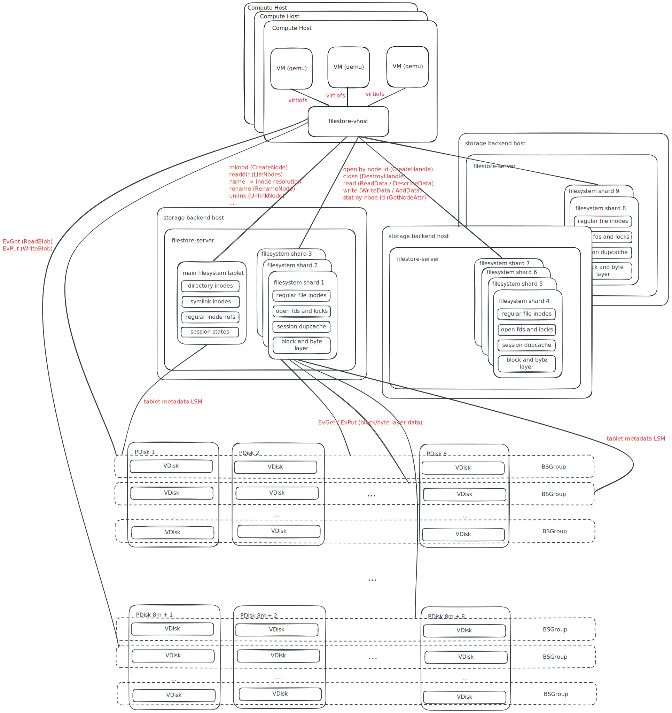

# Filestore Design

## Overview

## Components

### filestore-vhost
Serves filesystems to VMs via virtiofs. Each VM<->filesystem connection is represented by a unix socket via which memfd to VM memory is shared.
By virtiofs we mean the protocol, not the original implementation (not virtiofsd). It's basically:
* FUSE as the API and request format
* vhost as the transport between the VM and filestore-vhost

FUSE lowlevel API to filesystem backend API mapping can be found here: https://github.com/ydb-platform/nbs/blob/b6ac88b9743b9cf8f6b5c1ba989c51fe2fa96128/cloud/filestore/libs/vfs_fuse/loop.cpp#L1039

Each VM<->filesystem connection is stateful represented by a "session" structure. The session is persistently stored in the filesystem backend and contains:
* kernel opaque state
* a set of open file fds (file handles)
* a set of file locks
* duplicate request cache used to implement request idempotency

filestore-vhost communicates with the filesystem backend represented by a set of "tablets" running on a logically separate set of servers which store their state in a distributed storage (YDB BlobStorage, NOT YDB database).
filestore-vhost exchanges mostly metadata information with the tablets and tries to read/write the actual filedata directly from/to YDB BlobStorage groups.

### filestore-server
Runs tablet code. A non-sharded filesystem is represented by a single tablet which manages the whole persistent state of the filesystem.
A sharded filesystem is represented by N + 1 tablets:
* 1 tablet (aka "main" tablet, "leader" tablet, "master" tablet) manages the directory structure of the filesystem
* N tablets (aka "shards") manage regular file inodes and data

Shard tablets can serve the following requests:
* GetNodeAttr (stat syscall family) by inode id
* CreateHandle (open syscall family) by inode id
* DescribeData/ReadData and GenerateBlobIds/AddData/WriteData (read/write syscall family)
* DestroyHandle (close)

Main tablet can serve all other requests. For the operations targeting regular inodes (i.e. files) the request is processed by both the main tablet and one of the shards:
* CreateNode - name entry is created in the directory and regular inode is created in one of the shards, shards are selected in a round-robin manner
* CreateHandle by parent inode id + child name - main tablet does name -> shard name resolution and then CreateHandle by inode id is sent to the proper shard
* CreateHandle with O_CREAT flag is served similarly to a combination of CreateNode + CreateHandle without O_CREAT
* RenameNode - name manipulations are done in the main tablet and, if the destination name exists, an UnlinkNode request is sent to the corresponding shard
* UnlinkNode - name is removed from the corresponding directory and an UnlinkNode request is sent to the corresponding shard
* GetNodeAttr by parent inode id + child name - main tablet does name -> shard name resolution and then GetNodeAttr by inode id is sent to the proper shard
* ListNodes - main tablet does the name listing, performs names -> shard names resolution and then GetNodeAttrBatch requests are sent to the proper shards

All multi-tablet transactions are done via a redo log.

Which means that:
* read/write/close are linearly scalable if done to multiple files
* open/stat are scalable apart from the name -> shard name resolution (which is generally done via an in-memory cache in the main tablet)
* openat which uses a long path is not really scalable since it has to perform a lot of path element resolutions which are done by the main tablet
* readdir is not scalable
