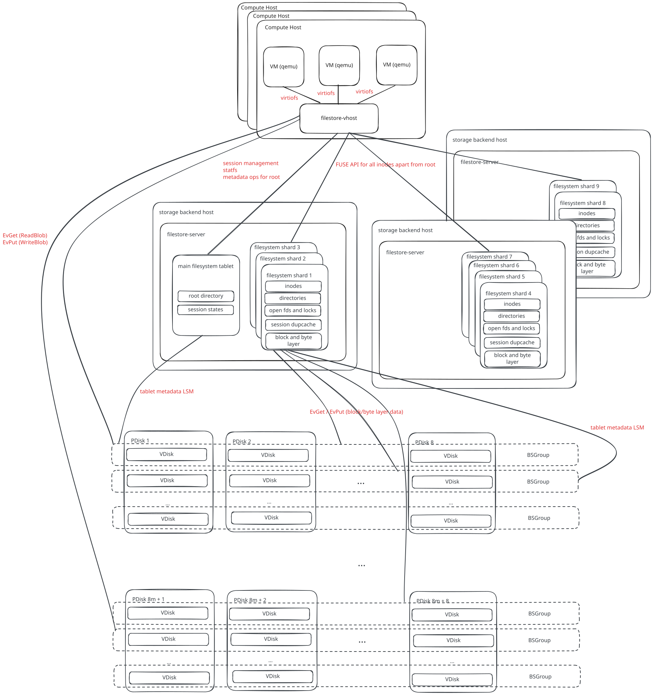
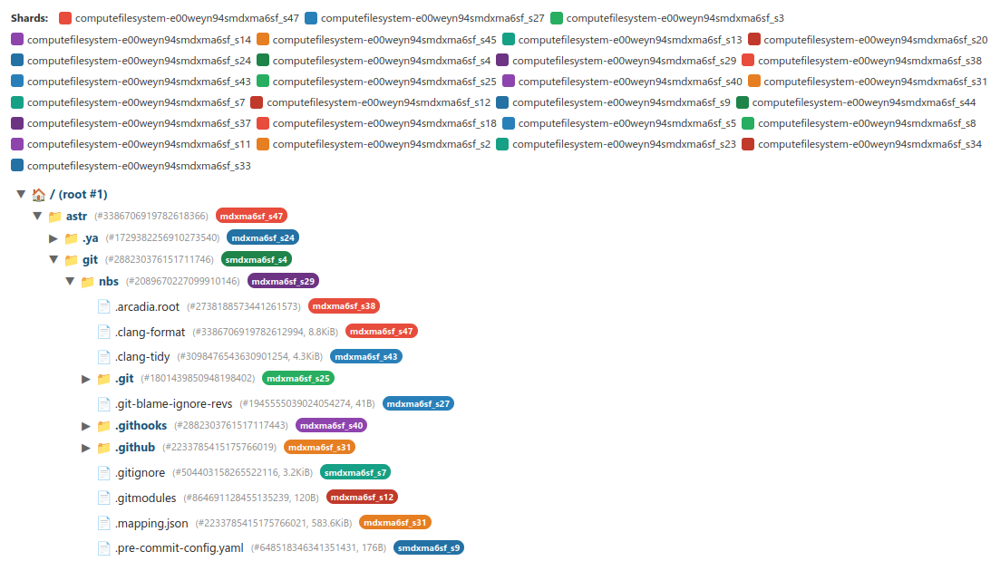

# Filestore Design

## Overview

## Components

### filestore-vhost
Serves filesystems to VMs via virtiofs. Each VM<->filesystem connection is represented by a unix socket via which memfd to VM memory is shared.
By virtiofs we mean the protocol, not the original implementation (not virtiofsd). It's basically:
* FUSE as the API and request format
* vhost as the transport between the VM and filestore-vhost

FUSE lowlevel API to filesystem backend API mapping can be found here: https://github.com/ydb-platform/nbs/blob/0e2d41366b34052be891368ab3b99ab79dccf9fe/cloud/filestore/libs/vfs_fuse/loop.cpp#L1639

Each VM<->filesystem connection is stateful and is represented by a "session" structure. The session is persistently stored in the filesystem backend and contains:
* kernel opaque state
* a set of open file fds (file handles)
* a set of file locks
* duplicate request cache used to implement request idempotency

filestore-vhost communicates with the filesystem backend represented by a set of "tablets" running on a logically separate set of servers which store their state in a distributed storage (YDB BlobStorage, NOT YDB database).
filestore-vhost exchanges mostly metadata information with the tablets and tries to read/write the actual filedata directly from/to YDB BlobStorage groups.

See a detailed description of `virtiofs <-> filestore-vhost` communication [here](./virtiofs-vhost-communication.md)

### filestore-server
Runs tablet code. A non-sharded filesystem is represented by a single tablet which manages the whole persistent state of the filesystem.
A sharded filesystem is represented by N + 1 tablets:
* 1 tablet (aka "main" tablet, "leader" tablet, "master" tablet) manages the root directory structure and serves `statfs` requests, session management requests and root directory management requests
* N tablets (aka "shards") manage all the other inodes apart from the root directory inode and the directory contents of the directory inodes apart from the root directory contents

Example:

* root always has `NodeId=1` and is managed by the main tablet
* the other directories are managed by different shards, e.g.:
    * right under the root we have a directory called `astr` (`NodeId=3386706919782618366`) managed by shard `s47`
    * inside it we have a directory called `git` (`NodeId=288230376151711746`) managed by shard `s4`
    * directory `nbs` (`NodeId=2089670227099910146`) managed by shard `s29`
    * all the name to node ref mappings inside the `nbs` directory are managed by `s29` as well
    * all the inodes and directory contents of the subdirectories of `nbs` are managed by different shards

Sessions are established and destroyed via the main filesystem tablet but the set of open file handles, locks and duplicate request cache is spread across all filesystem shards - each shard being in charge of the entities related to the inodes managed by that shard.

When an inode is created, the shard which would be in charge if this inode is selected in round-robin manner among the shards that have enough space. So we basically end up spreading the inodes more or less equally among all shards. The only caveat is that upon resize shards may be added but the inodes will not be automatically redistributed - i.e. the inodes that had existed before the resize op happened will still be managed by the shards where they were initially created. New inodes will be spread across the whole new set of shards.

Each filestore-server can run tablets belonging to many different logical filesystems. The diagram shows only one logical filesystem for simplicity.

Any tablet can serve any filestore public API requests that map to FUSE calls with `statfs` being the only exception - it's currently served only by the main tablet. The shard that's going to process the request is selected based on the inode id supplied in the request:
* for the requests that have parent inode id + child name parameter pairs this would be the shard in charge of the parent inode (i.e. parent directory)
* for the requests that have only inode id this would be the shard in charge of the inode itself
* for the requests that have file handle id in the param list this would be the shard in charge of the inode pointed to by this handle

Shard id is encoded in the high 16 bits of the inode and handle ids. Each inode id and each handle id is 64 bits.

Main API calls:
* `GetNodeAttr` (`stat` syscall family and also FUSE `lookup`) by inode id
* `CreateHandle` (`open` syscall family) by inode id
* `DescribeData`/`ReadData` and `GenerateBlobIds`/`AddData`/`WriteData` (`read`/`write` syscall family)
* `DestroyHandle` (`close`)
* `CreateNode` - name entry is created in the directory and regular inode is created in one of the shards, shards are selected in a round-robin manner
* `CreateHandle` by parent inode id + child name - the shard in charge of the parent directory does name -> shard name resolution and then CreateHandle by inode id is sent to the proper shard
* `CreateHandle` with `O_CREAT` flag is served similarly to a combination of `CreateNode` + `CreateHandle` without `O_CREAT`
* `RenameNode` - name manipulations are done in the shards in charge of the parent directories and, if the destination name exists, an `UnlinkNode` request is sent to the corresponding shard
* `UnlinkNode` - name is removed from the corresponding directory and an `UnlinkNode` request is sent to the corresponding shard
* `GetNodeAttr` by parent inode id + child name - the shard in charge of the parent directory does name -> shard name resolution and then `GetNodeAttr` by inode id is sent to the proper shard
* `ListNodes` - the shard in charge of the directory does the name listing, performs names -> shard names resolution and then `GetNodeAttrBatch` requests are sent to the proper shards

All multi-tablet transactions are done via a redo log. Cross-shard `RenameNode` operation is performed by a variant of the 2PC algorithm.

Which means that:
* `read`/`write`/`close`/`stat` are linearly scalable if done to multiple files
* all the other operations (aka metadata operations) are scalable as long as they're done in different directories
* if lots of operations are performed on the names in a single directory, then the name-related parts of the operations would be served by the same shard
* single-directory operation performance scalability issue is currently mitigated by keeping all directory entries in shard in-memory caches
* single-file read/write operation performance scalability issue is currently mitigated by trying to keep the whole index of each hot file in shard in-memory caches

`ior`-based and `mdtest`-based tests confirm single logical filesystem linear scalability and the most recent proven performance numbers reached in a real cluster look like this:

| test name | number of clients | test case | request size or type | result |
| --------- | ----------------- | --------- | -------------------- | ------ |
| IOR aggregated read/write | 200 VMs | Max read bandwidth | 1 MiB | 1.9 TiB/s |
| IOR aggregated read/write | 200 VMs | Max write bandwidth | 1 MiB | 1.5 TiB/s |
| IOR aggregated read/write | 200 VMs | Max read IOPS | 4 KiB | 15M IOPS |
| IOR aggregated read/write | 200 VMs | Max write IOPS | 4 KiB | 7M IOPS |
| Mdtest files | 200 VMs | Create files | Files | 1.6M IOPS |
| Mdtest files | 200 VMs | Stat files | Files | 9.53M IOPS |
| Mdtest files | 200 VMs | Delete files | Files | 2.32M IOPS |
| Mdtest directories | 200 VMs | Create directories | Directories | 2.44M IOPS |
| Mdtest directories | 200 VMs | Stat directories | Directories | 9.6M IOPS |
| Mdtest directories | 200 VMs | Rename directories | Directories | 2.9M IOPS |
| Mdtest directories | 200 VMs | Delete directories | Directories | 2.33M IOPS |

### storage layer
Currently only YDB BlobStorage-based storage is supported. We use block4+2 storage group configuration. Storage layer is represented by:
* a set of storage nodes with physical disks
* PDisk component which runs on top of each physical disk and allows data allocation in 128MiB chunks
* each PDisk can host multiple (usually 8 or 16) VDisks
* VDisks are organized into BSGroups of 8, each group consists of VDisks running on top of PDisks belonging to storage nodes in different failure domains (usually failure domain == network switch)
* each BSGroup allows reading/writing/deleting immutable blobs, read == "EvGet", write == "EvPut", delete == "EvCollectGarbage"
* each blob is addressed by a peculiar BlobId identifier which consists of <TabletID, CommitId, Channel, Cookie, BlobSize, PartId>, PartId is 0 on tablet level, example: 789::4288010::216::1::1232896::0
