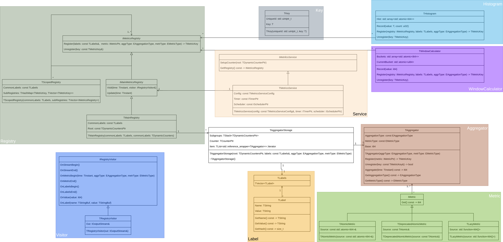
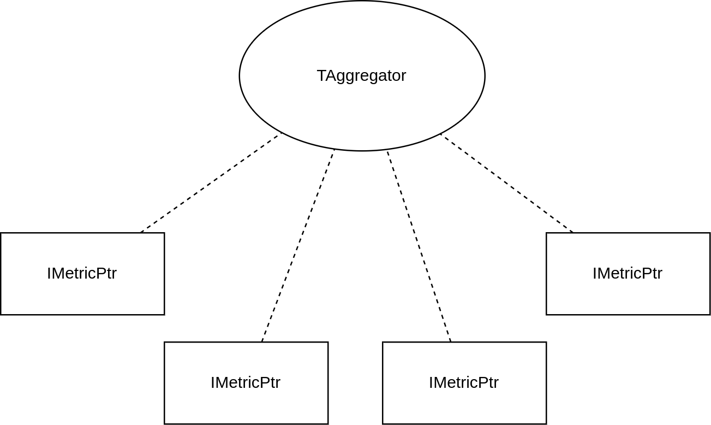
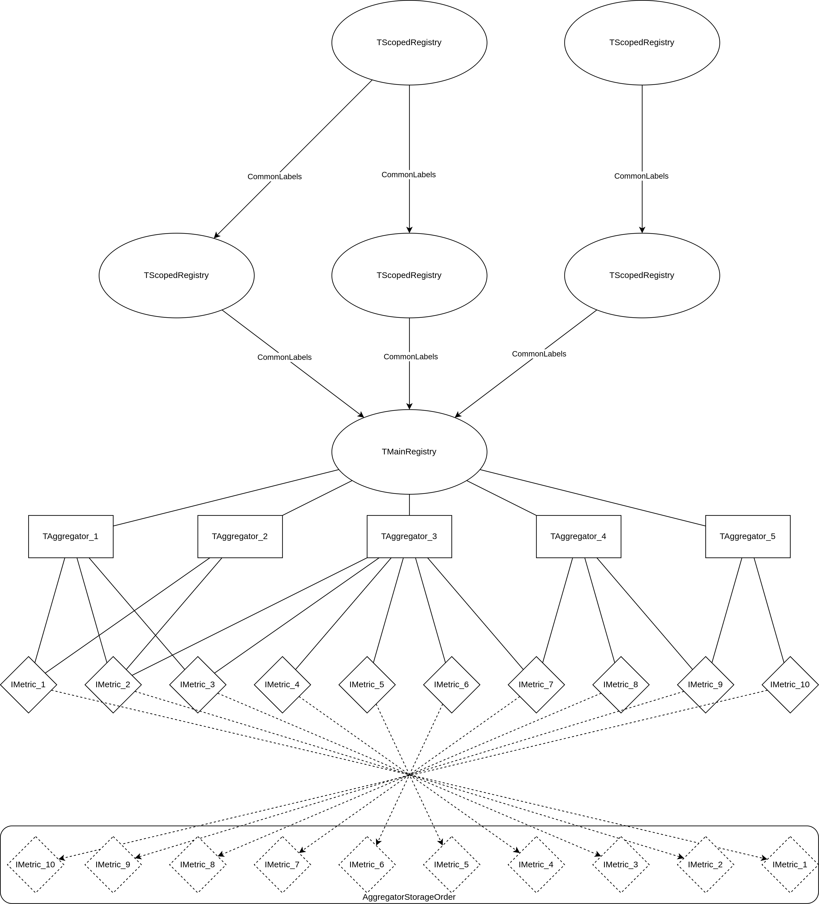

# Metrics in Filestore
Metrics in Filestore were implemented differently from Blockstore. The main wishes for the implementation were:
* Ability to register user storage as a metric;
* Automatically aggregate metrics if their paths are completely the same;
* Automatically deregister metrics if they are no longer needed, and use [RAII](https://en.cppreference.com/w/cpp/language/raii) for deregistration.


## Overview



## Components


### Metric
* [metric.h](https://github.com/ydb-platform/nbs/tree/76cdf0574aa062c09a9cc4e68e639867f4a70297/cloud/filestore/libs/diagnostics/metrics/metric.h)
* [metric.cpp](https://github.com/ydb-platform/nbs/tree/76cdf0574aa062c09a9cc4e68e639867f4a70297/cloud/filestore/libs/diagnostics/metrics/metric.cpp)
* [metric_ut.cpp](https://github.com/ydb-platform/nbs/tree/76cdf0574aa062c09a9cc4e68e639867f4a70297/cloud/filestore/libs/diagnostics/metrics/metric_ut.cpp)
* [metric_ut_stress.cpp](https://github.com/ydb-platform/nbs/tree/76cdf0574aa062c09a9cc4e68e639867f4a70297/cloud/filestore/libs/diagnostics/metrics/metric_ut_stress.cpp)

[IMetric](https://github.com/ydb-platform/nbs/tree/76cdf0574aa062c09a9cc4e68e639867f4a70297/cloud/filestore/libs/diagnostics/metrics/metric.h#L14) is the interface that is used in [TAggregator](https://github.com/ydb-platform/nbs/tree/76cdf0574aa062c09a9cc4e68e639867f4a70297/cloud/filestore/libs/diagnostics/metrics/aggregator.h#L15). [Get()](https://github.com/ydb-platform/nbs/tree/76cdf0574aa062c09a9cc4e68e639867f4a70297/cloud/filestore/libs/diagnostics/metrics/metric.h#L18) can be called in multithreaded environment, so it must be thread-safe, and must not change the state of the object. [IMetric](https://github.com/ydb-platform/nbs/tree/76cdf0574aa062c09a9cc4e68e639867f4a70297/cloud/filestore/libs/diagnostics/metrics/metric.h#L14) doesn't store the user's ```source``` but only holds a constant reference to it, so **_source_ is not allowed to be destroyed before IMetric is destroyed**. Library users are expected to use [std::atomic](https://github.com/ydb-platform/nbs/tree/76cdf0574aa062c09a9cc4e68e639867f4a70297/cloud/filestore/libs/diagnostics/metrics/metric.h#L28) as a ```source```, but there are options with [TAtomic](https://github.com/ydb-platform/nbs/tree/76cdf0574aa062c09a9cc4e68e639867f4a70297/cloud/filestore/libs/diagnostics/metrics/metric.h#L29) and [std::function](https://github.com/ydb-platform/nbs/tree/76cdf0574aa062c09a9cc4e68e639867f4a70297/cloud/filestore/libs/diagnostics/metrics/metric.h#L30). **In case of std::function, it is up to the user to ensure that the operator() call is atomic.**


### Labels
* [label.h](https://github.com/ydb-platform/nbs/tree/76cdf0574aa062c09a9cc4e68e639867f4a70297/cloud/filestore/libs/diagnostics/metrics/label.h)
* [label.cpp](https://github.com/ydb-platform/nbs/tree/76cdf0574aa062c09a9cc4e68e639867f4a70297/cloud/filestore/libs/diagnostics/metrics/label.cpp)
* [label_ut.cpp](https://github.com/ydb-platform/nbs/tree/76cdf0574aa062c09a9cc4e68e639867f4a70297/cloud/filestore/libs/diagnostics/metrics/label_ut.cpp)

[TLabel](https://github.com/ydb-platform/nbs/tree/76cdf0574aa062c09a9cc4e68e639867f4a70297/cloud/filestore/libs/diagnostics/metrics/label.h#L12) is a [name](https://github.com/ydb-platform/nbs/tree/76cdf0574aa062c09a9cc4e68e639867f4a70297/cloud/filestore/libs/diagnostics/metrics/label.h#L15)-[value](https://github.com/ydb-platform/nbs/tree/76cdf0574aa062c09a9cc4e68e639867f4a70297/cloud/filestore/libs/diagnostics/metrics/label.h#L16) sensor pair. The class is used to register counters in monitoring library. Each [TLabel](https://github.com/ydb-platform/nbs/tree/76cdf0574aa062c09a9cc4e68e639867f4a70297/cloud/filestore/libs/diagnostics/metrics/label.h#L12) must [generate a hash base on Name and Value](https://github.com/ydb-platform/nbs/tree/76cdf0574aa062c09a9cc4e68e639867f4a70297/cloud/filestore/libs/diagnostics/metrics/label.cpp#L27) and return it from the [GetHash()](https://github.com/ydb-platform/nbs/tree/76cdf0574aa062c09a9cc4e68e639867f4a70297/cloud/filestore/libs/diagnostics/metrics/label.h#L23). [TLabel](https://github.com/ydb-platform/nbs/tree/76cdf0574aa062c09a9cc4e68e639867f4a70297/cloud/filestore/libs/diagnostics/metrics/label.h#L12) shall be combined into a TVector\<TLabel\> == [TLabels](https://github.com/ydb-platform/nbs/tree/76cdf0574aa062c09a9cc4e68e639867f4a70297/cloud/filestore/libs/diagnostics/metrics/label.h#L36) chain. Each [TLabels](https://github.com/ydb-platform/nbs/tree/76cdf0574aa062c09a9cc4e68e639867f4a70297/cloud/filestore/libs/diagnostics/metrics/label.h#L36) [generates a hash based on the hashes of all of its elements in predefined order](https://github.com/ydb-platform/nbs/tree/76cdf0574aa062c09a9cc4e68e639867f4a70297/cloud/filestore/libs/diagnostics/metrics/label.cpp#L55). The generated hash is used in [sensor registration](https://github.com/ydb-platform/nbs/tree/76cdf0574aa062c09a9cc4e68e639867f4a70297/cloud/filestore/libs/diagnostics/metrics/registry.cpp#L122) в [IMetricsRegistry](https://github.com/ydb-platform/nbs/tree/76cdf0574aa062c09a9cc4e68e639867f4a70297/cloud/filestore/libs/diagnostics/metrics/registry.h#L19).


### Key
* [key.h](https://github.com/ydb-platform/nbs/tree/76cdf0574aa062c09a9cc4e68e639867f4a70297/cloud/filestore/libs/diagnostics/metrics/key.h)
* [key.cpp](https://github.com/ydb-platform/nbs/tree/76cdf0574aa062c09a9cc4e68e639867f4a70297/cloud/filestore/libs/diagnostics/metrics/key.cpp)
* [key_ut.cpp](https://github.com/ydb-platform/nbs/tree/76cdf0574aa062c09a9cc4e68e639867f4a70297/cloud/filestore/libs/diagnostics/metrics/key_ut.cpp)

[TKey](https://github.com/ydb-platform/nbs/tree/76cdf0574aa062c09a9cc4e68e639867f4a70297/cloud/filestore/libs/diagnostics/metrics/key.h#L41) is a helper class, that used as a key for [registration](https://github.com/ydb-platform/nbs/tree/76cdf0574aa062c09a9cc4e68e639867f4a70297/cloud/filestore/libs/diagnostics/metrics/registry.h#L23)/[deregistration](https://github.com/ydb-platform/nbs/tree/76cdf0574aa062c09a9cc4e68e639867f4a70297/cloud/filestore/libs/diagnostics/metrics/registry.h#L44) of metrics. One of the fields of this class is [unique identifier](https://github.com/ydb-platform/nbs/tree/76cdf0574aa062c09a9cc4e68e639867f4a70297/cloud/filestore/libs/diagnostics/metrics/key.h#L46). In the library, this identifier is equal to the [address of the object](https://github.com/ydb-platform/nbs/tree/76cdf0574aa062c09a9cc4e68e639867f4a70297/cloud/filestore/libs/diagnostics/metrics/registry.cpp#L197), that created this key. This is necessary, because even if several different objects generate the same key, their unique identifiers would be different and as a consequence such keys could not be used in other objects for deregistration of metrics (see [test](https://github.com/ydb-platform/nbs/tree/76cdf0574aa062c09a9cc4e68e639867f4a70297/cloud/filestore/libs/diagnostics/metrics/key_ut.cpp#L67)). TKey<ui64> == [TMetricKey](https://github.com/ydb-platform/nbs/tree/76cdf0574aa062c09a9cc4e68e639867f4a70297/cloud/filestore/libs/diagnostics/metrics/key.h#L86) is a specification for ui64 type.

[TFreeKey](https://github.com/ydb-platform/nbs/tree/76cdf0574aa062c09a9cc4e68e639867f4a70297/cloud/filestore/libs/diagnostics/metrics/key.h#L16) is a class that generates unique keys. The usual usage pattern is to [privately inherit](https://github.com/ydb-platform/nbs/tree/76cdf0574aa062c09a9cc4e68e639867f4a70297/cloud/filestore/libs/diagnostics/metrics/registry.cpp#L137) from this class and call the [GenerateNextFreeKey()](https://github.com/ydb-platform/nbs/tree/76cdf0574aa062c09a9cc4e68e639867f4a70297/cloud/filestore/libs/diagnostics/metrics/registry.cpp#L197) method. Calling the [GenerateNextFreeKey()](https://github.com/ydb-platform/nbs/tree/76cdf0574aa062c09a9cc4e68e639867f4a70297/cloud/filestore/libs/diagnostics/metrics/key.h#L26) method is not thread-safe, so call it only when [the lock is taken](https://github.com/ydb-platform/nbs/tree/76cdf0574aa062c09a9cc4e68e639867f4a70297/cloud/filestore/libs/diagnostics/metrics/registry.cpp#L175). Current implementation of this class [monotonically increases counter](https://github.com/ydb-platform/nbs/tree/76cdf0574aa062c09a9cc4e68e639867f4a70297/cloud/filestore/libs/diagnostics/metrics/key.h#L28). TFreeKey<ui64> == [TMetricNextFreeKey](https://github.com/ydb-platform/nbs/tree/76cdf0574aa062c09a9cc4e68e639867f4a70297/cloud/filestore/libs/diagnostics/metrics/key.h#L32) is specification for ui64 type.


### Aggregator


* [aggregator.h](https://github.com/ydb-platform/nbs/tree/76cdf0574aa062c09a9cc4e68e639867f4a70297/cloud/filestore/libs/diagnostics/metrics/aggregator.h)
* [aggregator.cpp](https://github.com/ydb-platform/nbs/tree/76cdf0574aa062c09a9cc4e68e639867f4a70297/cloud/filestore/libs/diagnostics/metrics/aggregator.cpp)
* [aggregator_ut.cpp](https://github.com/ydb-platform/nbs/tree/76cdf0574aa062c09a9cc4e68e639867f4a70297/cloud/filestore/libs/diagnostics/metrics/aggregator_ut.cpp)
* [aggregator_ut_stress.cpp](https://github.com/ydb-platform/nbs/tree/76cdf0574aa062c09a9cc4e68e639867f4a70297/cloud/filestore/libs/diagnostics/metrics/aggregator_ut_stress.cpp)

[TAggregator](https://github.com/ydb-platform/nbs/tree/76cdf0574aa062c09a9cc4e68e639867f4a70297/cloud/filestore/libs/diagnostics/metrics/aggregator.h#L15) is the heart of the library. This class is necessary for aggregating the values of the counters. When creating an object of this class, the aggregator needs to be passed [an aggregation type](https://github.com/ydb-platform/nbs/tree/76cdf0574aa062c09a9cc4e68e639867f4a70297/cloud/filestore/libs/diagnostics/metrics/public.h#L11) and [metric type](https://github.com/ydb-platform/nbs/tree/76cdf0574aa062c09a9cc4e68e639867f4a70297/cloud/filestore/libs/diagnostics/metrics/public.h#L19). You can register metrics into this class using the [Register()](https://github.com/ydb-platform/nbs/tree/76cdf0574aa062c09a9cc4e68e639867f4a70297/cloud/filestore/libs/diagnostics/metrics/aggregator.h#L32) and receive [TMetricKey](https://github.com/ydb-platform/nbs/tree/76cdf0574aa062c09a9cc4e68e639867f4a70297/cloud/filestore/libs/diagnostics/metrics/key.h#L86). [TMetricKey](https://github.com/ydb-platform/nbs/tree/76cdf0574aa062c09a9cc4e68e639867f4a70297/cloud/filestore/libs/diagnostics/metrics/key.h#L86) is needed to call [Unregister()](https://github.com/ydb-platform/nbs/tree/76cdf0574aa062c09a9cc4e68e639867f4a70297/cloud/filestore/libs/diagnostics/metrics/aggregator.h#L35). When you call [Aggregate()](https://github.com/ydb-platform/nbs/tree/76cdf0574aa062c09a9cc4e68e639867f4a70297/cloud/filestore/libs/diagnostics/metrics/aggregator.h#L37) you receive the aggregated value. This method can be called from different threads, so it is thread-safe, and does not change the state of the object. This class is in [NImpl](https://github.com/ydb-platform/nbs/tree/76cdf0574aa062c09a9cc4e68e639867f4a70297/cloud/filestore/libs/diagnostics/metrics/aggregator.h#L11) namespace and only used inside [IMetricRegistry](https://github.com/ydb-platform/nbs/tree/76cdf0574aa062c09a9cc4e68e639867f4a70297/cloud/filestore/libs/diagnostics/metrics/registry.cpp#L36). **An external user should not do anything with this class.** If there is a need to add a new aggregation type, you should add it to [enum](https://github.com/ydb-platform/nbs/tree/76cdf0574aa062c09a9cc4e68e639867f4a70297/cloud/filestore/libs/diagnostics/metrics/public.h#L11) and [metric type](https://github.com/ydb-platform/nbs/tree/76cdf0574aa062c09a9cc4e68e639867f4a70297/cloud/filestore/libs/diagnostics/metrics/public.h#L19) and implement the [aggregation](https://github.com/ydb-platform/nbs/tree/76cdf0574aa062c09a9cc4e68e639867f4a70297/cloud/filestore/libs/diagnostics/metrics/aggregator.cpp#L48) function for it.


### Registry


* [registry.h](https://github.com/ydb-platform/nbs/tree/76cdf0574aa062c09a9cc4e68e639867f4a70297/cloud/filestore/libs/diagnostics/metrics/registry.h)
* [registry.cpp](https://github.com/ydb-platform/nbs/tree/76cdf0574aa062c09a9cc4e68e639867f4a70297/cloud/filestore/libs/diagnostics/metrics/registry.cpp)
* [registry_ut.cpp](https://github.com/ydb-platform/nbs/tree/76cdf0574aa062c09a9cc4e68e639867f4a70297/cloud/filestore/libs/diagnostics/metrics/registry_ut.cpp)
* [registry_ut_stress.cpp](https://github.com/ydb-platform/nbs/tree/76cdf0574aa062c09a9cc4e68e639867f4a70297/cloud/filestore/libs/diagnostics/metrics/registry_ut_stress.cpp)

[IMainMetricsRegistry](https://github.com/ydb-platform/nbs/tree/76cdf0574aa062c09a9cc4e68e639867f4a70297/cloud/filestore/libs/diagnostics/metrics/registry.h#L47) is a registry for storing a pair of [TLabels](https://github.com/ydb-platform/nbs/tree/76cdf0574aa062c09a9cc4e68e639867f4a70297/cloud/filestore/libs/diagnostics/metrics/label.h#L36) and [IMetric](https://github.com/ydb-platform/nbs/tree/76cdf0574aa062c09a9cc4e68e639867f4a70297/cloud/filestore/libs/diagnostics/metrics/metric.h#L14). With each [TLabels](https://github.com/ydb-platform/nbs/tree/76cdf0574aa062c09a9cc4e68e639867f4a70297/cloud/filestore/libs/diagnostics/metrics/label.h#L36) [TAggregator](https://github.com/ydb-platform/nbs/tree/76cdf0574aa062c09a9cc4e68e639867f4a70297/cloud/filestore/libs/diagnostics/metrics/aggregator.h#L15) is associated with its [EAggregationType](https://github.com/ydb-platform/nbs/tree/76cdf0574aa062c09a9cc4e68e639867f4a70297/cloud/filestore/libs/diagnostics/metrics/public.h#L11) and [EMetricType](https://github.com/ydb-platform/nbs/tree/76cdf0574aa062c09a9cc4e68e639867f4a70297/cloud/filestore/libs/diagnostics/metrics/public.h#L19). If the user inserts a new [TLabels](https://github.com/ydb-platform/nbs/tree/76cdf0574aa062c09a9cc4e68e639867f4a70297/cloud/filestore/libs/diagnostics/metrics/label.h#L36), [a new object](https://github.com/ydb-platform/nbs/tree/76cdf0574aa062c09a9cc4e68e639867f4a70297/cloud/filestore/libs/diagnostics/metrics/registry.cpp#L178) of type [TAggregator](https://github.com/ydb-platform/nbs/tree/76cdf0574aa062c09a9cc4e68e639867f4a70297/cloud/filestore/libs/diagnostics/metrics/aggregator.h#L15) is created, on which the new [IMetric](https://github.com/ydb-platform/nbs/tree/76cdf0574aa062c09a9cc4e68e639867f4a70297/cloud/filestore/libs/diagnostics/metrics/metric.h#L14) [is registered](https://github.com/ydb-platform/nbs/tree/76cdf0574aa062c09a9cc4e68e639867f4a70297/cloud/filestore/libs/diagnostics/metrics/registry.cpp#L194). If the insertion is already in existing [TLabels](https://github.com/ydb-platform/nbs/tree/76cdf0574aa062c09a9cc4e68e639867f4a70297/cloud/filestore/libs/diagnostics/metrics/label.h#L36), the [EAggregationType](https://github.com/ydb-platform/nbs/tree/76cdf0574aa062c09a9cc4e68e639867f4a70297/cloud/filestore/libs/diagnostics/metrics/public.h#L11) and [EMetricType](https://github.com/ydb-platform/nbs/tree/76cdf0574aa062c09a9cc4e68e639867f4a70297/cloud/filestore/libs/diagnostics/metrics/public.h#L19) [are checked to see if they match](https://github.com/ydb-platform/nbs/tree/76cdf0574aa062c09a9cc4e68e639867f4a70297/cloud/filestore/libs/diagnostics/metrics/registry.cpp#L191). If these parameters do not match, the program crashes. If all checks are successful, the [IMetric](https://github.com/ydb-platform/nbs/tree/76cdf0574aa062c09a9cc4e68e639867f4a70297/cloud/filestore/libs/diagnostics/metrics/metric.h#L14) [is registered](https://github.com/ydb-platform/nbs/tree/76cdf0574aa062c09a9cc4e68e639867f4a70297/cloud/filestore/libs/diagnostics/metrics/registry.cpp#L194) on the [TAggregator](https://github.com/ydb-platform/nbs/tree/76cdf0574aa062c09a9cc4e68e639867f4a70297/cloud/filestore/libs/diagnostics/metrics/aggregator.h#L15) object. Every [UpdateInterval](https://github.com/ydb-platform/nbs/tree/76cdf0574aa062c09a9cc4e68e639867f4a70297/cloud/filestore/libs/diagnostics/metrics/service.h#L15) an [Update()](https://github.com/ydb-platform/nbs/tree/76cdf0574aa062c09a9cc4e68e639867f4a70297/cloud/filestore/libs/diagnostics/metrics/registry.h#L53) [call is made](https://github.com/ydb-platform/nbs/tree/76cdf0574aa062c09a9cc4e68e639867f4a70297/cloud/filestore/libs/diagnostics/metrics/service.cpp#L92), which [aggregrates the values](https://github.com/ydb-platform/nbs/tree/76cdf0574aa062c09a9cc4e68e639867f4a70297/cloud/filestore/libs/diagnostics/metrics/registry.cpp#L248) in all [TAggregator](https://github.com/ydb-platform/nbs/tree/76cdf0574aa062c09a9cc4e68e639867f4a70297/cloud/filestore/libs/diagnostics/metrics/aggregator.h#L15) objects. In this case, [TAggregator](https://github.com/ydb-platform/nbs/tree/76cdf0574aa062c09a9cc4e68e639867f4a70297/cloud/filestore/libs/diagnostics/metrics/aggregator.h#L15) objects [are bypassed in reverse insertion order](https://github.com/ydb-platform/nbs/tree/76cdf0574aa062c09a9cc4e68e639867f4a70297/cloud/filestore/libs/diagnostics/metrics/registry.cpp#L187), since the values of older aggreggators may depend on newer ones. For tests, a [Visit](https://github.com/ydb-platform/nbs/tree/76cdf0574aa062c09a9cc4e68e639867f4a70297/cloud/filestore/libs/diagnostics/metrics/registry.h#L52) method is added that takes an [IRegistryVisitor](https://github.com/ydb-platform/nbs/tree/76cdf0574aa062c09a9cc4e68e639867f4a70297/cloud/filestore/libs/diagnostics/metrics/visitor.h#L14) by reference, and calls its methods for each counter in the desired order.. **It is assumed that an object of type IMainMetricsregistry should be one for the whole process.**

When calling the [Unregister()](https://github.com/ydb-platform/nbs/tree/76cdf0574aa062c09a9cc4e68e639867f4a70297/cloud/filestore/libs/diagnostics/metrics/registry.h#L44), the counter is deregistered by the passed [TMetricKey](https://github.com/ydb-platform/nbs/tree/76cdf0574aa062c09a9cc4e68e639867f4a70297/cloud/filestore/libs/diagnostics/metrics/key.h#L86). It is impossible to register a counter in one object and deregister it in another (there is a [test](https://github.com/ydb-platform/nbs/tree/76cdf0574aa062c09a9cc4e68e639867f4a70297/cloud/filestore/libs/diagnostics/metrics/registry_ut.cpp#L985)). Deregistration also happens when destroying [IMetricsRegistry](https://github.com/ydb-platform/nbs/tree/76cdf0574aa062c09a9cc4e68e639867f4a70297/cloud/filestore/libs/diagnostics/metrics/registry.cpp#L302) and [IMainMetricsRegistry](https://github.com/ydb-platform/nbs/tree/76cdf0574aa062c09a9cc4e68e639867f4a70297/cloud/filestore/libs/diagnostics/metrics/registry.cpp#L162), so it is **recommended not to call the Unregister() method explicitly, but to destroy the object**. During deregistration, [the counters passed by the user are removed](https://github.com/ydb-platform/nbs/tree/76cdf0574aa062c09a9cc4e68e639867f4a70297/cloud/filestore/libs/diagnostics/metrics/registry.cpp#L213) from the corresponding [TAggregator](https://github.com/ydb-platform/nbs/tree/76cdf0574aa062c09a9cc4e68e639867f4a70297/cloud/filestore/libs/diagnostics/metrics/aggregator.h#L15). As long as there is at least one [IMetric](https://github.com/ydb-platform/nbs/tree/76cdf0574aa062c09a9cc4e68e639867f4a70297/cloud/filestore/libs/diagnostics/metrics/metric.h#L14) in the [TAggregator](https://github.com/ydb-platform/nbs/tree/76cdf0574aa062c09a9cc4e68e639867f4a70297/cloud/filestore/libs/diagnostics/metrics/aggregator.h#L15), then it sends values to the metrics library. As soon as the last counter in the [TAggregator](https://github.com/ydb-platform/nbs/tree/76cdf0574aa062c09a9cc4e68e639867f4a70297/cloud/filestore/libs/diagnostics/metrics/aggregator.h#L15) has been deleted, the counters in the [metrics library are deregistered](https://github.com/ydb-platform/nbs/tree/76cdf0574aa062c09a9cc4e68e639867f4a70297/cloud/filestore/libs/diagnostics/metrics/registry.cpp#L75). In this way all allocated subgroups of counters will be [automatically deleted](https://github.com/ydb-platform/nbs/tree/76cdf0574aa062c09a9cc4e68e639867f4a70297/cloud/filestore/libs/diagnostics/metrics/registry.cpp#L88), if there are no alive [TAggregator](https://github.com/ydb-platform/nbs/tree/76cdf0574aa062c09a9cc4e68e639867f4a70297/cloud/filestore/libs/diagnostics/metrics/aggregator.h#L15) left on them.

[IMetricsRegistry](https://github.com/ydb-platform/nbs/tree/76cdf0574aa062c09a9cc4e68e639867f4a70297/cloud/filestore/libs/diagnostics/metrics/registry.h#L19) is an interface that lacks [Update()](https://github.com/ydb-platform/nbs/tree/76cdf0574aa062c09a9cc4e68e639867f4a70297/cloud/filestore/libs/diagnostics/metrics/registry.h#L53) and [Visit()](https://github.com/ydb-platform/nbs/tree/76cdf0574aa062c09a9cc4e68e639867f4a70297/cloud/filestore/libs/diagnostics/metrics/registry.h#L52) methods. **Users should only use this interface.**. To make things easier [it is possible to create](https://github.com/ydb-platform/nbs/tree/76cdf0574aa062c09a9cc4e68e639867f4a70297/cloud/filestore/libs/diagnostics/metrics/registry.h#L62) a [TScopedRegistry](https://github.com/ydb-platform/nbs/tree/76cdf0574aa062c09a9cc4e68e639867f4a70297/cloud/filestore/libs/diagnostics/metrics/registry.cpp#L276), into which [TLabels](https://github.com/ydb-platform/nbs/tree/76cdf0574aa062c09a9cc4e68e639867f4a70297/cloud/filestore/libs/diagnostics/metrics/label.h#L36) and [TVector\<IMetricsRegistry\>](https://github.com/ydb-platform/nbs/tree/76cdf0574aa062c09a9cc4e68e639867f4a70297/cloud/filestore/libs/diagnostics/metrics/registry.cpp#L292) are passed. In this case, the [TLabels](https://github.com/ydb-platform/nbs/tree/76cdf0574aa062c09a9cc4e68e639867f4a70297/cloud/filestore/libs/diagnostics/metrics/label.h#L36) are [CommonLabels](https://github.com/ydb-platform/nbs/tree/76cdf0574aa062c09a9cc4e68e639867f4a70297/cloud/filestore/libs/diagnostics/metrics/registry.cpp#L283) and [will be added to the beginning](https://github.com/ydb-platform/nbs/tree/76cdf0574aa062c09a9cc4e68e639867f4a70297/cloud/filestore/libs/diagnostics/metrics/registry.cpp#L316) of the [TLabels](https://github.com/ydb-platform/nbs/tree/76cdf0574aa062c09a9cc4e68e639867f4a70297/cloud/filestore/libs/diagnostics/metrics/label.h#L36) passed to the [Register()](https://github.com/ydb-platform/nbs/tree/76cdf0574aa062c09a9cc4e68e639867f4a70297/cloud/filestore/libs/diagnostics/metrics/registry.h#L24). The counters for the updated labels passed by metrics type and aggregation type [will be registered in all passed](https://github.com/ydb-platform/nbs/tree/76cdf0574aa062c09a9cc4e68e639867f4a70297/cloud/filestore/libs/diagnostics/metrics/registry.cpp#L314) [IMetricsRegistry](https://github.com/ydb-platform/nbs/tree/76cdf0574aa062c09a9cc4e68e639867f4a70297/cloud/filestore/libs/diagnostics/metrics/registry.h#L19). It is also possible to explicitly call [Unregister()](https://github.com/ydb-platform/nbs/tree/76cdf0574aa062c09a9cc4e68e639867f4a70297/cloud/filestore/libs/diagnostics/metrics/registry.h#L44) for the key obtained from the [Register()](https://github.com/ydb-platform/nbs/tree/76cdf0574aa062c09a9cc4e68e639867f4a70297/cloud/filestore/libs/diagnostics/metrics/registry.h#L23). [Deregistration also occurs at the moment of TScopedRegistry destruction](https://github.com/ydb-platform/nbs/tree/76cdf0574aa062c09a9cc4e68e639867f4a70297/cloud/filestore/libs/diagnostics/metrics/registry.cpp#L302), so it is **recommended not to call Unregister() method explicitly, but to destroy the object**.


### Visitor
* [visitor.h](https://github.com/ydb-platform/nbs/tree/76cdf0574aa062c09a9cc4e68e639867f4a70297/cloud/filestore/libs/diagnostics/metrics/visitor.h)
* [visitor.cpp](https://github.com/ydb-platform/nbs/tree/76cdf0574aa062c09a9cc4e68e639867f4a70297/cloud/filestore/libs/diagnostics/metrics/visitor.cpp)
* [visitor_ut.cpp](https://github.com/ydb-platform/nbs/tree/76cdf0574aa062c09a9cc4e68e639867f4a70297/cloud/filestore/libs/diagnostics/metrics/visitor_ut.cpp)

[IRegistryVisitor](https://github.com/ydb-platform/nbs/tree/76cdf0574aa062c09a9cc4e68e639867f4a70297/cloud/filestore/libs/diagnostics/metrics/visitor.h#L14) is an interface for traversing a set of [TLabels](https://github.com/ydb-platform/nbs/tree/76cdf0574aa062c09a9cc4e68e639867f4a70297/cloud/filestore/libs/diagnostics/metrics/label.h#L36) and [TAggregator](https://github.com/ydb-platform/nbs/tree/76cdf0574aa062c09a9cc4e68e639867f4a70297/cloud/filestore/libs/diagnostics/metrics/aggregator.h#L15) inside [IMainMetricsRegistry](https://github.com/ydb-platform/nbs/tree/76cdf0574aa062c09a9cc4e68e639867f4a70297/cloud/filestore/libs/diagnostics/metrics/registry.h#L47). [OnStreamBegin()](https://github.com/ydb-platform/nbs/tree/76cdf0574aa062c09a9cc4e68e639867f4a70297/cloud/filestore/libs/diagnostics/metrics/registry.cpp#L220) is called at the start of metrics traversal, [OnMetricBegin()](https://github.com/ydb-platform/nbs/tree/76cdf0574aa062c09a9cc4e68e639867f4a70297/cloud/filestore/libs/diagnostics/metrics/registry.cpp#L223) is called for each pair of [TLabels](https://github.com/ydb-platform/nbs/tree/76cdf0574aa062c09a9cc4e68e639867f4a70297/cloud/filestore/libs/diagnostics/metrics/label.h#L36) and [TAggregator](https://github.com/ydb-platform/nbs/tree/76cdf0574aa062c09a9cc4e68e639867f4a70297/cloud/filestore/libs/diagnostics/metrics/aggregator.h#L15), [OnLabelsBegin()](https://github.com/ydb-platform/nbs/tree/76cdf0574aa062c09a9cc4e68e639867f4a70297/cloud/filestore/libs/diagnostics/metrics/registry.cpp#L228) is called before traversing [TLabels](https://github.com/ydb-platform/nbs/tree/76cdf0574aa062c09a9cc4e68e639867f4a70297/cloud/filestore/libs/diagnostics/metrics/label.h#L36), [OnLabel()](https://github.com/ydb-platform/nbs/tree/76cdf0574aa062c09a9cc4e68e639867f4a70297/cloud/filestore/libs/diagnostics/metrics/registry.cpp#L230) is called after each [TLabel](https://github.com/ydb-platform/nbs/tree/76cdf0574aa062c09a9cc4e68e639867f4a70297/cloud/filestore/libs/diagnostics/metrics/label.h#L12) of [TLabels](https://github.com/ydb-platform/nbs/tree/76cdf0574aa062c09a9cc4e68e639867f4a70297/cloud/filestore/libs/diagnostics/metrics/label.h#L36), [OnLabelsEnd()](https://github.com/ydb-platform/nbs/tree/76cdf0574aa062c09a9cc4e68e639867f4a70297/cloud/filestore/libs/diagnostics/metrics/registry.cpp#L232) is called after traversing [TLabels](https://github.com/ydb-platform/nbs/tree/76cdf0574aa062c09a9cc4e68e639867f4a70297/cloud/filestore/libs/diagnostics/metrics/label.h#L36) before [OnValue()](https://github.com/ydb-platform/nbs/tree/76cdf0574aa062c09a9cc4e68e639867f4a70297/cloud/filestore/libs/diagnostics/metrics/registry.cpp#L234) call, [OnMetricEnd()](https://github.com/ydb-platform/nbs/tree/76cdf0574aa062c09a9cc4e68e639867f4a70297/cloud/filestore/libs/diagnostics/metrics/registry.cpp#L236) is called after the [OnValue()](https://github.com/ydb-platform/nbs/tree/76cdf0574aa062c09a9cc4e68e639867f4a70297/cloud/filestore/libs/diagnostics/metrics/registry.cpp#L234) call, [OnStreamEnd()](https://github.com/ydb-platform/nbs/tree/76cdf0574aa062c09a9cc4e68e639867f4a70297/cloud/filestore/libs/diagnostics/metrics/registry.cpp#L239) is called after traversing all the metrics.


### Service
* [service.h](https://github.com/ydb-platform/nbs/tree/76cdf0574aa062c09a9cc4e68e639867f4a70297/cloud/filestore/libs/diagnostics/metrics/service.h)
* [service.cpp](https://github.com/ydb-platform/nbs/tree/76cdf0574aa062c09a9cc4e68e639867f4a70297/cloud/filestore/libs/diagnostics/metrics/service.cpp)
* [service_ut.cpp](https://github.com/ydb-platform/nbs/tree/76cdf0574aa062c09a9cc4e68e639867f4a70297/cloud/filestore/libs/diagnostics/metrics/service_ut.cpp)

[IMetricsService](https://github.com/ydb-platform/nbs/tree/76cdf0574aa062c09a9cc4e68e639867f4a70297/cloud/filestore/libs/diagnostics/metrics/service.h#L20) is a service that, at the start ([Start()](https://github.com/ydb-platform/nbs/tree/76cdf0574aa062c09a9cc4e68e639867f4a70297/cloud/filestore/libs/diagnostics/metrics/service.cpp#L42) call), [schedules counters update](https://github.com/ydb-platform/nbs/tree/76cdf0574aa062c09a9cc4e68e639867f4a70297/cloud/filestore/libs/diagnostics/metrics/service.cpp#L46) inside [IMainMetricsRegistry](https://github.com/ydb-platform/nbs/tree/76cdf0574aa062c09a9cc4e68e639867f4a70297/cloud/filestore/libs/diagnostics/metrics/registry.h#L47), and at the stop ([Stop()](https://github.com/ydb-platform/nbs/tree/76cdf0574aa062c09a9cc4e68e639867f4a70297/cloud/filestore/libs/diagnostics/metrics/service.cpp#L49) call) [sets a flag](https://github.com/ydb-platform/nbs/tree/76cdf0574aa062c09a9cc4e68e639867f4a70297/cloud/filestore/libs/diagnostics/metrics/service.cpp#L51) for canceling further scheduling. As long as the service is not destroyed, metrics can be shipped to fetchers. As soon as the service is destroyed, it destroys its [IMainMetricsRegistry](https://github.com/ydb-platform/nbs/tree/76cdf0574aa062c09a9cc4e68e639867f4a70297/cloud/filestore/libs/diagnostics/metrics/registry.h#L47). If no other Registry holds strong references to it, then all counters are automatically deregistered and stop being shipped.


### Histogram
* [histogram.h](https://github.com/ydb-platform/nbs/tree/76cdf0574aa062c09a9cc4e68e639867f4a70297/cloud/filestore/libs/diagnostics/metrics/histogram.h)
* [histogram.cpp](https://github.com/ydb-platform/nbs/tree/76cdf0574aa062c09a9cc4e68e639867f4a70297/cloud/filestore/libs/diagnostics/metrics/histogram.cpp)
* [histogram_ut.cpp](https://github.com/ydb-platform/nbs/tree/76cdf0574aa062c09a9cc4e68e639867f4a70297/cloud/filestore/libs/diagnostics/metrics/histogram_ut.cpp)
* [histogram_ut_stress.cpp](https://github.com/ydb-platform/nbs/tree/76cdf0574aa062c09a9cc4e68e639867f4a70297/cloud/filestore/libs/diagnostics/metrics/histogram_ut_stress.cpp)

[THistogram](https://github.com/ydb-platform/nbs/tree/76cdf0574aa062c09a9cc4e68e639867f4a70297/cloud/filestore/libs/diagnostics/metrics/histogram.h#L430) is an add-on to the metric system, which is a wrapper over a histogram. A histogram is an [array of atomics](https://github.com/ydb-platform/nbs/tree/76cdf0574aa062c09a9cc4e68e639867f4a70297/cloud/filestore/libs/diagnostics/metrics/histogram.h#L436) that are [registered](https://github.com/ydb-platform/nbs/tree/76cdf0574aa062c09a9cc4e68e639867f4a70297/cloud/filestore/libs/diagnostics/metrics/histogram.h#L459) when the [Register()](https://github.com/ydb-platform/nbs/tree/76cdf0574aa062c09a9cc4e68e639867f4a70297/cloud/filestore/libs/diagnostics/metrics/histogram.h#L449) is called in the passed [IMetricsRegistry](https://github.com/ydb-platform/nbs/tree/76cdf0574aa062c09a9cc4e68e639867f4a70297/cloud/filestore/libs/diagnostics/metrics/registry.h#L19) with the specified [TLabels](https://github.com/ydb-platform/nbs/tree/76cdf0574aa062c09a9cc4e68e639867f4a70297/cloud/filestore/libs/diagnostics/metrics/label.h#L36). An arbitrary [aggregation function](https://github.com/ydb-platform/nbs/tree/76cdf0574aa062c09a9cc4e68e639867f4a70297/cloud/filestore/libs/diagnostics/metrics/public.h#L11) can be used during registration. However, each bucket is [registered as a derivative counter](https://github.com/ydb-platform/nbs/tree/76cdf0574aa062c09a9cc4e68e639867f4a70297/cloud/filestore/libs/diagnostics/metrics/histogram.h#L463). If you need some general statistics about the histogram, then you need to collect it either in user code, or move the common parts as a separate type, similar to THistogram.

When calling the [Unregister()](https://github.com/ydb-platform/nbs/tree/76cdf0574aa062c09a9cc4e68e639867f4a70297/cloud/filestore/libs/diagnostics/metrics/histogram.h#L477), the counter is unregistered using the passed  [TMetricKey](https://github.com/ydb-platform/nbs/tree/76cdf0574aa062c09a9cc4e68e639867f4a70297/cloud/filestore/libs/diagnostics/metrics/key.h#L86). Deregistration also occurs when [THistogram](https://github.com/ydb-platform/nbs/tree/76cdf0574aa062c09a9cc4e68e639867f4a70297/cloud/filestore/libs/diagnostics/metrics/histogram.h#L430) is destroyed, so **it is recommended not to call the Unregister() method explicitly, but to destroy the object**. It is also worth remembering that an object of this type stores strong references to objects of the [IMetricsRegistry](https://github.com/ydb-platform/nbs/tree/76cdf0574aa062c09a9cc4e68e639867f4a70297/cloud/filestore/libs/diagnostics/metrics/registry.h#L19) type passed to the [Register()](https://github.com/ydb-platform/nbs/tree/76cdf0574aa062c09a9cc4e68e639867f4a70297/cloud/filestore/libs/diagnostics/metrics/histogram.h#L449).


### WindowCalculator
* [window_calculator.h](https://github.com/ydb-platform/nbs/tree/76cdf0574aa062c09a9cc4e68e639867f4a70297/cloud/filestore/libs/diagnostics/metrics/window_calculator.h)
* [window_calculator.cpp](https://github.com/ydb-platform/nbs/tree/76cdf0574aa062c09a9cc4e68e639867f4a70297/cloud/filestore/libs/diagnostics/metrics/window_calculator.cpp)
* [window_calculator_ut.cpp](https://github.com/ydb-platform/nbs/tree/76cdf0574aa062c09a9cc4e68e639867f4a70297/cloud/filestore/libs/diagnostics/metrics/window_calculator_ut.cpp)
* [window_calculator_ut_stress.cpp](https://github.com/ydb-platform/nbs/tree/76cdf0574aa062c09a9cc4e68e639867f4a70297/cloud/filestore/libs/diagnostics/metrics/window_calculator_ut_stress.cpp)

[TWindowCalculator](https://github.com/ydb-platform/nbs/tree/76cdf0574aa062c09a9cc4e68e639867f4a70297/cloud/filestore/libs/diagnostics/metrics/window_calculator.h#L22) is an add-on to the metrics system, which evaluates the counter value in the window. By default, [atomic buckets](https://github.com/ydb-platform/nbs/tree/76cdf0574aa062c09a9cc4e68e639867f4a70297/cloud/filestore/libs/diagnostics/metrics/window_calculator.h#L28) are used, the number of which is specified by the [type parameter](https://github.com/ydb-platform/nbs/tree/76cdf0574aa062c09a9cc4e68e639867f4a70297/cloud/filestore/libs/diagnostics/metrics/window_calculator.h#L21). [Each bucket element is registered](https://github.com/ydb-platform/nbs/tree/76cdf0574aa062c09a9cc4e68e639867f4a70297/cloud/filestore/libs/diagnostics/metrics/window_calculator.h#L59) when the [Register()](https://github.com/ydb-platform/nbs/tree/76cdf0574aa062c09a9cc4e68e639867f4a70297/cloud/filestore/libs/diagnostics/metrics/window_calculator.h#L50) is called on the passed [IMetricsRegistry](https://github.com/ydb-platform/nbs/tree/76cdf0574aa062c09a9cc4e68e639867f4a70297/cloud/filestore/libs/diagnostics/metrics/registry.h#L19) object by [TLabels](https://github.com/ydb-platform/nbs/tree/76cdf0574aa062c09a9cc4e68e639867f4a70297/cloud/filestore/libs/diagnostics/metrics/label.h#L36). You can select any [aggregation function](https://github.com/ydb-platform/nbs/tree/76cdf0574aa062c09a9cc4e68e639867f4a70297/cloud/filestore/libs/diagnostics/metrics/public.h#L11). However, it is worth remembering that [counters are registered as absolute values](https://github.com/ydb-platform/nbs/tree/76cdf0574aa062c09a9cc4e68e639867f4a70297/cloud/filestore/libs/diagnostics/metrics/window_calculator.h#L59). This type is useful when, for example, you need to calculate the maximum for the last 15 seconds (to do this, call [Register()](https://github.com/ydb-platform/nbs/tree/76cdf0574aa062c09a9cc4e68e639867f4a70297/cloud/filestore/libs/diagnostics/metrics/window_calculator.h#L50) with the [EAggregationType::AT_MAX](https://github.com/ydb-platform/nbs/tree/76cdf0574aa062c09a9cc4e68e639867f4a70297/cloud/filestore/libs/diagnostics/metrics/public.h#L16) parameter).

When calling the [Unregister()](https://github.com/ydb-platform/nbs/tree/76cdf0574aa062c09a9cc4e68e639867f4a70297/cloud/filestore/libs/diagnostics/metrics/window_calculator.h#L73), the counter is unregistered using the passed  [TMetricKey](https://github.com/ydb-platform/nbs/tree/76cdf0574aa062c09a9cc4e68e639867f4a70297/cloud/filestore/libs/diagnostics/metrics/key.h#L86). Deregistration also occurs when [TWindowCalculator](https://github.com/ydb-platform/nbs/tree/76cdf0574aa062c09a9cc4e68e639867f4a70297/cloud/filestore/libs/diagnostics/metrics/window_calculator.h#L22) is destroyed, so **it is recommended not to call the Unregister() method explicitly, but to destroy the object**. It is also worth remembering that an object of this type stores strong references to objects of the [IMetricsRegistry](https://github.com/ydb-platform/nbs/tree/76cdf0574aa062c09a9cc4e68e639867f4a70297/cloud/filestore/libs/diagnostics/metrics/registry.h#L19) type passed to the [Register()](https://github.com/ydb-platform/nbs/tree/76cdf0574aa062c09a9cc4e68e639867f4a70297/cloud/filestore/libs/diagnostics/metrics/window_calculator.h#L50).

### Operations
* [operations.h](https://github.com/ydb-platform/nbs/tree/76cdf0574aa062c09a9cc4e68e639867f4a70297/cloud/filestore/libs/diagnostics/metrics/operations.h)
* [operations.cpp](https://github.com/ydb-platform/nbs/tree/76cdf0574aa062c09a9cc4e68e639867f4a70297/cloud/filestore/libs/diagnostics/metrics/operations.cpp)
* [operations_ut.cpp](https://github.com/ydb-platform/nbs/tree/76cdf0574aa062c09a9cc4e68e639867f4a70297/cloud/filestore/libs/diagnostics/metrics/operations_ut.cpp)
* [operations_ut_stress.cpp](https://github.com/ydb-platform/nbs/tree/76cdf0574aa062c09a9cc4e68e639867f4a70297/cloud/filestore/libs/diagnostics/metrics/operations_ut_stress.cpp)

Since atomics are used inside metrics, but they are not used for synchronization, we can weaken the guarantees when writing and reading from them. For these purposes, [operations](https://github.com/ydb-platform/nbs/tree/76cdf0574aa062c09a9cc4e68e639867f4a70297/cloud/filestore/libs/diagnostics/metrics/operations.h) have been created that work more efficiently, because they use relaxed memory order for c++ atomics. It is preferable to use the functions from this file when writing code.


## Usage example


### Initializing the service
```cpp
auto service = NMetrics::CreateMetricsService(
  NMetrics::TMetricsServiceConfig{
    .UpdateInterval = TDuration::Seconds(5)
  },
  Timer,
  Scheduler);

service->Start();

// Остановка сервиса
service->Stop();
```


### Creating a ScopedRegistry
```cpp
auto storageRegistry = NMetrics::CreateScopedMetricsRegistry(
  {
    NMetrics::CreateLabel("component", "storage")
  },
  service->GetRegistry());

auto storageFsRegistry = NMetrics::CreateScopedMetricsRegistry(
  {
    NMetrics::CreateLabel("component", "storage_fs"),
    NMetrics::CreateLabel("host", "cluster")
  },
  storageRegistry);

// {counters: filestore}, {component: storage_fs}, {host: cluster}, {filesystem: test_filesystem}
FsRegistry = NMetrics::CreateScopedMetricsRegistry(
  {
    NMetrics::CreateLabel("filesystem", "test_filesystem")
  },
  storageFsRegistry);

// {counters: filestore}, {component: storage}, {type: ssd}
// {counters: filestore}, {component: storage_fs}, {host: cluster}, {filesystem: test_filesystem}
AggregatableFsRegistry = NMetrics::CreateScopedMetricsRegistry(
  {},
  {
    NMetrics::CreateScopedMetricsRegistry(
      {
        NMetrics::CreateLabel("type", "ssd")
      },
      storageRegistry),
    FsRegistry
  });
```


### Registration of counters
```cpp
std::atomic<i64> UsedQuota{0};
NMetrics::TDefaultWindowCalculator MaxUsedQuota{0};
NMetrics::THistogram<NMetrics::EHistUnit::HU_TIME_MICROSECONDS> RequestsPostponed;

// {counters: filestore}, {component: storage}, {type: ssd}, {sensor: UsedQuota}
// {counters: filestore}, {component: storage_fs}, {host: cluster}, {filesystem: test_filesystem}, {sensor: UsedQuota}
AggregatableFsRegistry->Register(
  {
    CreateSensor("UsedQuota")
  },
  UsedQuota,
  EAggregationType::AT_SUM,
  EMetricType::MT_DERIVATE);

// {counters: filestore}, {component: storage}, {type: ssd}, {sensor: UsedQuota}
// {counters: filestore}, {component: storage_fs}, {host: cluster}, {filesystem: test_filesystem}, {sensor: UsedQuota}
MaxUsedQuota.Register(
  AggregatableFsRegistry,
  {
    CreateSensor("MaxUsedQuota")
  },
  EAggregationType::AT_MAX);

// {counters: filestore}, {component: storage_fs}, {host: cluster}, {filesystem: test_filesystem}, {request: total}, {histogram: ThrottlerDelay}, {sensor: 1us}
// {counters: filestore}, {component: storage_fs}, {host: cluster}, {filesystem: test_filesystem}, {request: total}, {histogram: ThrottlerDelay}, {sensor: 100us}
// {counters: filestore}, {component: storage_fs}, {host: cluster}, {filesystem: test_filesystem}, {request: total}, {histogram: ThrottlerDelay}, {sensor: 200us}
// {counters: filestore}, {component: storage_fs}, {host: cluster}, {filesystem: test_filesystem}, {request: total}, {histogram: ThrottlerDelay}, {sensor: 300us}
// {counters: filestore}, {component: storage_fs}, {host: cluster}, {filesystem: test_filesystem}, {request: total}, {histogram: ThrottlerDelay}, {sensor: 400us}
// {counters: filestore}, {component: storage_fs}, {host: cluster}, {filesystem: test_filesystem}, {request: total}, {histogram: ThrottlerDelay}, {sensor: 500us}
// {counters: filestore}, {component: storage_fs}, {host: cluster}, {filesystem: test_filesystem}, {request: total}, {histogram: ThrottlerDelay}, {sensor: 600us}
// {counters: filestore}, {component: storage_fs}, {host: cluster}, {filesystem: test_filesystem}, {request: total}, {histogram: ThrottlerDelay}, {sensor: 700us}
// {counters: filestore}, {component: storage_fs}, {host: cluster}, {filesystem: test_filesystem}, {request: total}, {histogram: ThrottlerDelay}, {sensor: 800us}
// {counters: filestore}, {component: storage_fs}, {host: cluster}, {filesystem: test_filesystem}, {request: total}, {histogram: ThrottlerDelay}, {sensor: 900us}
// {counters: filestore}, {component: storage_fs}, {host: cluster}, {filesystem: test_filesystem}, {request: total}, {histogram: ThrottlerDelay}, {sensor: 1000us}
// {counters: filestore}, {component: storage_fs}, {host: cluster}, {filesystem: test_filesystem}, {request: total}, {histogram: ThrottlerDelay}, {sensor: 2000us}
// {counters: filestore}, {component: storage_fs}, {host: cluster}, {filesystem: test_filesystem}, {request: total}, {histogram: ThrottlerDelay}, {sensor: 5000us}
// {counters: filestore}, {component: storage_fs}, {host: cluster}, {filesystem: test_filesystem}, {request: total}, {histogram: ThrottlerDelay}, {sensor: 10000us}
// {counters: filestore}, {component: storage_fs}, {host: cluster}, {filesystem: test_filesystem}, {request: total}, {histogram: ThrottlerDelay}, {sensor: 20000us}
// {counters: filestore}, {component: storage_fs}, {host: cluster}, {filesystem: test_filesystem}, {request: total}, {histogram: ThrottlerDelay}, {sensor: 50000us}
// {counters: filestore}, {component: storage_fs}, {host: cluster}, {filesystem: test_filesystem}, {request: total}, {histogram: ThrottlerDelay}, {sensor: 100000us}
// {counters: filestore}, {component: storage_fs}, {host: cluster}, {filesystem: test_filesystem}, {request: total}, {histogram: ThrottlerDelay}, {sensor: 200000us}
// {counters: filestore}, {component: storage_fs}, {host: cluster}, {filesystem: test_filesystem}, {request: total}, {histogram: ThrottlerDelay}, {sensor: 500000us}
// {counters: filestore}, {component: storage_fs}, {host: cluster}, {filesystem: test_filesystem}, {request: total}, {histogram: ThrottlerDelay}, {sensor: 1000000us}
// {counters: filestore}, {component: storage_fs}, {host: cluster}, {filesystem: test_filesystem}, {request: total}, {histogram: ThrottlerDelay}, {sensor: 2000000us}
// {counters: filestore}, {component: storage_fs}, {host: cluster}, {filesystem: test_filesystem}, {request: total}, {histogram: ThrottlerDelay}, {sensor: 5000000us}
// {counters: filestore}, {component: storage_fs}, {host: cluster}, {filesystem: test_filesystem}, {request: total}, {histogram: ThrottlerDelay}, {sensor: 10000000us}
// {counters: filestore}, {component: storage_fs}, {host: cluster}, {filesystem: test_filesystem}, {request: total}, {histogram: ThrottlerDelay}, {sensor: 35000000us}
// {counters: filestore}, {component: storage_fs}, {host: cluster}, {filesystem: test_filesystem}, {request: total}, {histogram: ThrottlerDelay}, {sensor: >35000000us}
RequestsPostponed.Register(
  FsRegistry,
  {
    CreateLabel("request", "total"),
    CreateLabel("histogram", "ThrottlerDelay")
  });
```


### Writing to counters
```cpp
#include <cloud/filestore/libs/diagnostics/metrics/operations.h>

// {counters: filestore}, {component: storage}, {type: ssd}, {sensor: UsedQuota} -> 123
// {counters: filestore}, {component: storage_fs}, {host: cluster}, {filesystem: test_filesystem}, {sensor: UsedQuota} -> 123
Add(UsedQuota, 123);

// {counters: filestore}, {component: storage}, {type: ssd}, {sensor: UsedQuota} -> 123
// {counters: filestore}, {component: storage_fs}, {host: cluster}, {filesystem: test_filesystem}, {sensor: UsedQuota} -> 123
MaxUsedQuota.Record(123);

// {counters: filestore}, {component: storage_fs}, {host: cluster}, {filesystem: test_filesystem}, {request: total}, {histogram: ThrottlerDelay}, {sensor: 1us} -> 0
// {counters: filestore}, {component: storage_fs}, {host: cluster}, {filesystem: test_filesystem}, {request: total}, {histogram: ThrottlerDelay}, {sensor: 100us} -> 0
// {counters: filestore}, {component: storage_fs}, {host: cluster}, {filesystem: test_filesystem}, {request: total}, {histogram: ThrottlerDelay}, {sensor: 200us} -> 12
// {counters: filestore}, {component: storage_fs}, {host: cluster}, {filesystem: test_filesystem}, {request: total}, {histogram: ThrottlerDelay}, {sensor: 300us} -> 0
// {counters: filestore}, {component: storage_fs}, {host: cluster}, {filesystem: test_filesystem}, {request: total}, {histogram: ThrottlerDelay}, {sensor: 400us} -> 0
// {counters: filestore}, {component: storage_fs}, {host: cluster}, {filesystem: test_filesystem}, {request: total}, {histogram: ThrottlerDelay}, {sensor: 500us} -> 0
// {counters: filestore}, {component: storage_fs}, {host: cluster}, {filesystem: test_filesystem}, {request: total}, {histogram: ThrottlerDelay}, {sensor: 600us} -> 0
// {counters: filestore}, {component: storage_fs}, {host: cluster}, {filesystem: test_filesystem}, {request: total}, {histogram: ThrottlerDelay}, {sensor: 700us} -> 0
// {counters: filestore}, {component: storage_fs}, {host: cluster}, {filesystem: test_filesystem}, {request: total}, {histogram: ThrottlerDelay}, {sensor: 800us} -> 0
// {counters: filestore}, {component: storage_fs}, {host: cluster}, {filesystem: test_filesystem}, {request: total}, {histogram: ThrottlerDelay}, {sensor: 900us} -> 0
// {counters: filestore}, {component: storage_fs}, {host: cluster}, {filesystem: test_filesystem}, {request: total}, {histogram: ThrottlerDelay}, {sensor: 1000us} -> 0
// {counters: filestore}, {component: storage_fs}, {host: cluster}, {filesystem: test_filesystem}, {request: total}, {histogram: ThrottlerDelay}, {sensor: 2000us} -> 0
// {counters: filestore}, {component: storage_fs}, {host: cluster}, {filesystem: test_filesystem}, {request: total}, {histogram: ThrottlerDelay}, {sensor: 5000us} -> 0
// {counters: filestore}, {component: storage_fs}, {host: cluster}, {filesystem: test_filesystem}, {request: total}, {histogram: ThrottlerDelay}, {sensor: 10000us} -> 0
// {counters: filestore}, {component: storage_fs}, {host: cluster}, {filesystem: test_filesystem}, {request: total}, {histogram: ThrottlerDelay}, {sensor: 20000us} -> 0
// {counters: filestore}, {component: storage_fs}, {host: cluster}, {filesystem: test_filesystem}, {request: total}, {histogram: ThrottlerDelay}, {sensor: 50000us} -> 0
// {counters: filestore}, {component: storage_fs}, {host: cluster}, {filesystem: test_filesystem}, {request: total}, {histogram: ThrottlerDelay}, {sensor: 100000us} -> 0
// {counters: filestore}, {component: storage_fs}, {host: cluster}, {filesystem: test_filesystem}, {request: total}, {histogram: ThrottlerDelay}, {sensor: 200000us} -> 0
// {counters: filestore}, {component: storage_fs}, {host: cluster}, {filesystem: test_filesystem}, {request: total}, {histogram: ThrottlerDelay}, {sensor: 500000us} -> 0
// {counters: filestore}, {component: storage_fs}, {host: cluster}, {filesystem: test_filesystem}, {request: total}, {histogram: ThrottlerDelay}, {sensor: 1000000us} -> 0
// {counters: filestore}, {component: storage_fs}, {host: cluster}, {filesystem: test_filesystem}, {request: total}, {histogram: ThrottlerDelay}, {sensor: 2000000us} -> 0
// {counters: filestore}, {component: storage_fs}, {host: cluster}, {filesystem: test_filesystem}, {request: total}, {histogram: ThrottlerDelay}, {sensor: 5000000us} -> 0
// {counters: filestore}, {component: storage_fs}, {host: cluster}, {filesystem: test_filesystem}, {request: total}, {histogram: ThrottlerDelay}, {sensor: 10000000us} -> 0
// {counters: filestore}, {component: storage_fs}, {host: cluster}, {filesystem: test_filesystem}, {request: total}, {histogram: ThrottlerDelay}, {sensor: 35000000us} -> 0
// {counters: filestore}, {component: storage_fs}, {host: cluster}, {filesystem: test_filesystem}, {request: total}, {histogram: ThrottlerDelay}, {sensor: >35000000us} -> 0
RequestsPostponed.Record(TDuration::MilliSeconds(123), 12);
```

