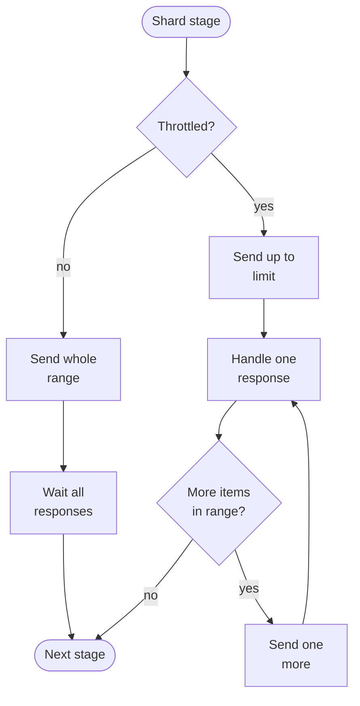
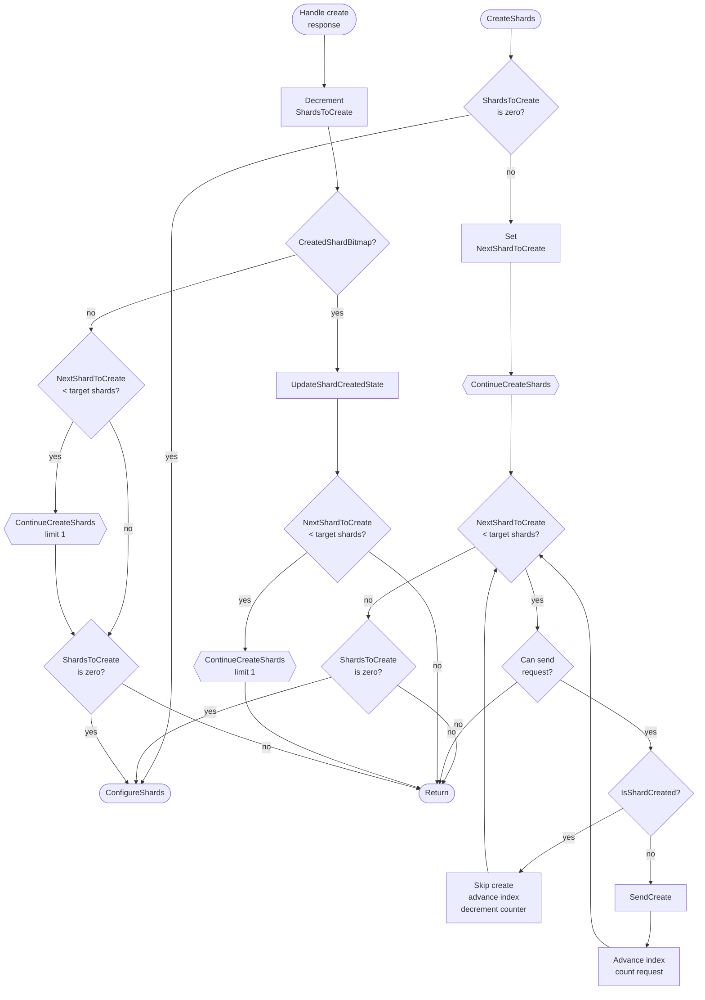
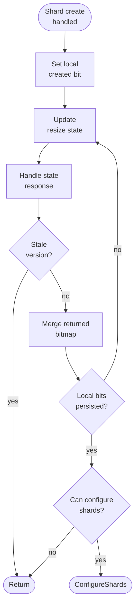

# Filestore Resize Flow

This document describes the resize path implemented by `TAlterFileStoreActor`.
The same actor also handles plain alter requests, but that path is out of scope
here.

The resize operation has two execution modes:
* legacy mode: `MaxShardManagementRequestsInFlight == 0`;
* throttled mode: `MaxShardManagementRequestsInFlight > 0`.

In the diagrams, `Throttled?` means the second condition. Nodes labeled
`throttled/all` are multi-request shard stages:
* in legacy mode, the actor sends the whole shard range at once;
* in throttled mode, the actor sends at most
  `MaxShardManagementRequestsInFlight` requests and sends one more request when
  a response arrives.

Mermaid labels use ` ` to keep nodes readable.

## Shared Concepts

The main filesystem tablet stores the topology: the ordered list of shard
filesystem ids. Creating a shard filesystem in SchemeShard is not the same as
adding it to the topology. A resize can therefore create physical shard
filestores and still fail before the main tablet starts using them.

`ExistingShardIds` is the topology read from the main filesystem tablet before
the current resize attempt. `FileStoreConfig.ShardConfigs` is the target shard
configuration calculated from the resize request, current topology, storage
config, and current main filesystem config.

`ShardsToCreate` is the number of target shards absent from
`ExistingShardIds`. New shard creation starts at index
`ExistingShardIds.size()`.

`Prepare target layout` is a diagram phase, not a single method. It groups:
* `GetStorageStats`: reads `SevenBytesHandlesCount`;
* `GetFileSystemTopology`: reads current topology and topology flags;
* target config calculation: fills main and shard configs, patches feature
  flags, and initializes counters such as `ShardsToCreate`,
  `ShardsToDescribe`, `ShardsToAlter`, `ShardsToConfigure`, and
  `ShouldConfigureMainFileStore`;
* throttled-mode bitmap setup: if the main tablet returned `ResizeState`,
  `SetupCreatedShardBitmap` runs only after the target shard count is known.

Most SchemeShard and tablet request errors make the actor reply with the error
and terminate. `UnsafeChangeTabletState` responses used for resize state are
handled differently in current code: an error is logged and ignored. If the
initial response has no `ResizeState`, the actor treats the main tablet as an
old version and continues without persistent resize-state bitmap.

## Combined State Machine

The high-level order is the same in both modes. Throttled mode differs in two
places:
* shard management stages cap in-flight requests instead of sending the whole
  range at once;
* when the main tablet supports it, shard creation uses persisted
  `ResizeState.CreatedShardBitmap` to skip shards that were already physically
  created by a previous attempt.

```mermaid
flowchart TD
    Start([Resize]) --> DescribeMain["Describe<br/>main FS"]
    DescribeMain --> ThrottledStart{Throttled?}
    ThrottledStart -->|yes| ReadState["Read initial<br/>resize state"]
    ReadState --> PrepareLayout["Prepare<br/>target layout"]
    ThrottledStart -->|no| PrepareLayout

    PrepareLayout --> NeedDescribe{Existing shards<br/>need resize?}
    NeedDescribe -->|yes| DescribeShards{{Describe shard<br/>configs<br/>throttled/all}}
    NeedDescribe -->|no| AlterMain["Alter<br/>main FS"]
    DescribeShards --> AlterMain

    AlterMain --> NeedAlter{Existing shards<br/>need resize?}
    NeedAlter -->|yes| AlterShards{{Alter existing<br/>shards<br/>throttled/all}}
    NeedAlter -->|no| MoreCreate
    AlterShards --> MoreCreate

    MoreCreate{More shards<br/>to create?}
    MoreCreate -->|no| ConfigureStart
    MoreCreate -->|yes| CreateMode{Throttled?}

    CreateMode -->|no| LegacyCreate{{Create missing<br/>shards: all}}
    LegacyCreate --> ConfigureStart

    CreateMode -->|yes| CreateRange{{Process create<br/>range<br/>with limit}}
    CreateRange --> ConfigureStart

    ConfigureStart{Configure<br/>shards?}
    ConfigureStart -->|no| ConfigureMain
    ConfigureStart -->|yes| NewShards{New<br/>shards?}
    NewShards -->|yes| ConfigureNew{{Configure new<br/>shards<br/>throttled/all}}
    ConfigureNew --> ExistingLeft{Existing<br/>shards?}
    ExistingLeft -->|yes| ConfigureOld{{Configure old<br/>shards<br/>throttled/all}}
    ExistingLeft -->|no| ConfigureMain
    NewShards -->|no| ConfigureOld
    ConfigureOld --> ConfigureMain

    ConfigureMain{Configure<br/>main FS?}
    ConfigureMain -->|no| Done([Response])
    ConfigureMain -->|yes| ConfigureMainReq["Configure<br/>main FS"]
    ConfigureMainReq --> Done
```

## Throttled Shard Stages

`DescribeShards`, `AlterShards`, and both `ConfigureShardRange` phases use the
same scheduling shape. `CreateShards` also uses the same limit in throttled
mode, but has additional bitmap handling described separately.

## Throttled Shard Create Range

This is the detail hidden behind `Process create range with limit` in the main
diagram. `IsShardCreated` is an internal check in `ContinueCreateShards`, not a
separate top-level resize phase. Legacy create flow is the simpler
`Create missing shards: all` branch in the main diagram.

## Created-Shard Bitmap Persistence

This is the persistence part of `Process create range with limit` in the main
diagram. It runs only in throttled mode with `CreatedShardBitmap != nullptr`
after a successful shard create response. If a retry skips every missing shard
because all bits were already set in `CreatedShardBitmap`, there is no new
local bit to persist.

## Phase Transitions

| Phase | Actor methods | What happens on success |
| --- | --- | --- |
| Describe main FS | `DescribeMainFileStore`, `HandleDescribeFileStoreResponse` | Store the current main filesystem config in `MainFileStoreOriginalConfig`. In throttled mode continue to `ReadResizeState`; in legacy mode continue to `GetStorageStats`. |
| Read initial resize state | `ReadResizeState`, `HandleResizeStateResponse` | Send `UnsafeChangeTabletState` with `ResizeState` present and unset `Version`. If the response has `ResizeState`, store it, mark persistent resize state as supported, set `InitialResizeStateRead`, then continue to storage stats. If the response has no `ResizeState`, keep persistent resize state disabled and continue to storage stats. |
| Prepare target layout | `GetStorageStats`, `HandleGetStorageStatsResponse`, `GetFileSystemTopology`, `HandleGetFileSystemTopologyResponse` | Read storage stats and topology, build target main/shard configs, and initialize counters. If persistent resize state is supported, call `SetupCreatedShardBitmap` after the target shard count is known. |
| Describe shard configs | `DescribeShards`, `DescribeShard`, `HandleDescribeFileStoreResponse` | For existing shards that must be resized, read current config versions and channel layouts before altering them. |
| Alter main FS | `AlterFileStore`, `HandleAlterFileStoreResponse` | Submit the new main filesystem scheme config, then continue to existing shard alteration. |
| Alter existing shards | `AlterShards`, `AlterShard`, `HandleAlterFileStoreResponse` | Resize existing shard scheme objects when strict filesystem size enforcement requires it, then continue to shard creation. |
| Create missing shards | `CreateShards`, `ContinueCreateShards`, `CreateShard`, `HandleCreateFileStoreResponse` | Create target shards absent from current topology. Legacy mode continues to shard configuration from the last create response. Throttled mode caps request count. If persistent resize state is supported, it persists created-shard bits and normally continues from `HandleResizeStateResponse`; otherwise it continues from create responses. |
| Update resize state | `UpdateShardCreatedState`, `UpdateResizeState`, `HandleResizeStateResponse` | When persistent resize state is supported, set the created-shard bit locally, send it with current `ResizeStateVersion`, merge the returned current bitmap, and resend if local bits are still not persisted. |
| Configure shard tablets | `ConfigureShards`, `ConfigureShardRange`, `ConfigureShard`, `HandleConfigureShardResponse` | Configure new shard tablets first, then existing shard tablets, using the same throttled/all scheduling. |
| Configure main FS | `ConfigureMainFileStore`, optionally `HandleConfigureShardsResponse` | If `ShouldConfigureMainFileStore` is false, finish immediately. Otherwise, store the final shard list and topology flags in the main tablet; then the resize request succeeds. |

## Diagram Blocks

### Main Resize Diagram

| Diagram block | Method / condition | Purpose |
| --- | --- | --- |
| `Describe main FS` | `DescribeMainFileStore`, main-filesystem branch of `HandleDescribeFileStoreResponse` | Read the current main filesystem config. The actor later uses it as the base for target config calculation. |
| `Throttled?` | `StorageConfig->GetMaxShardManagementRequestsInFlight() != 0` | Select legacy or throttled resize execution. |
| `Read initial resize state` | `ReadResizeState`, initial branch of `HandleResizeStateResponse` where `!InitialResizeStateRead` | In throttled mode, read persisted shard-creation progress before planning the retry. A response without `ResizeState` enables rolling-upgrade fallback: request throttling remains enabled, but bitmap persistence is disabled. |
| `Prepare target layout` | `GetStorageStats`, `HandleGetStorageStatsResponse`, `GetFileSystemTopology`, `HandleGetFileSystemTopologyResponse`, optionally `SetupCreatedShardBitmap` | Read stats and topology, calculate target configs, determine shard ranges for describe/alter/create/configure, and initialize the created-shard bitmap after the target shard count is known if persistence is supported. |
| `Existing shards need resize?` | `ShardsToDescribe != 0` / `ShardsToAlter != 0`, initialized when `StrictFileSystemSizeEnforcementEnabled` is true | Decide whether existing shard configs must be described and altered before new shards are created. |
| `Describe shard configs` | `DescribeShards`, `DescribeShard`, shard branch of `HandleDescribeFileStoreResponse` | Read current configs of existing shards that are going to be altered. The actor needs their config versions and real channel layouts before issuing shard alter requests. |
| `Alter main FS` | `AlterFileStore`, main-filesystem branch of `HandleAlterFileStoreResponse` | Submit the requested main filesystem size/config through SchemeShard. This changes the scheme object but does not publish the new shard topology to the main tablet. |
| `Alter existing shards` | `AlterShards`, `AlterShard`, shard branch of `HandleAlterFileStoreResponse` | Resize existing shard filestores through SchemeShard when strict filesystem size enforcement requires every shard to have the main filesystem size. |
| `More shards to create?` | `CreateShards`; checks `ShardsToCreate == 0` before entering the create range | Decide whether the resize needs shard creation before shard configuration. |
| `Create missing shards: all` | legacy `CreateShards` / `ContinueCreateShards` / `CreateShard` / `HandleCreateFileStoreResponse` path | Send create requests for all missing target shards without bitmap checks or request throttling. |
| `Process create range with limit` | throttled `CreateShards` / `ContinueCreateShards` / `CreateShard` / `HandleCreateFileStoreResponse` path, plus `UpdateShardCreatedState`, `UpdateResizeState`, and non-initial `HandleResizeStateResponse` when persistence is supported | Process missing target shard indexes with the configured in-flight limit. If `CreatedShardBitmap` is available, skip recorded shards and persist newly created shard bits before shard configuration starts. |
| `Configure shards?` | `ConfigureShards`; checks `ShardsToConfigure == 0` | Decide whether shard tablets need configuration before the main tablet is configured. |
| `New shards?` | `ConfigureShards`; checks `ExistingShardIds.size() < FileStoreConfig.ShardConfigs.size()` | Select whether the first configure phase is `NewShards` or only `OldShards`. |
| `Configure new shards` | `ConfigureShardRange(existingShardCount, totalShardCount, EShardConfigPhase::NewShards)`, `ConfigureShard`, `HandleConfigureShardResponse` | Tell newly created shard tablets their shard number, main filesystem id, feature flags, and sometimes the full target shard list. |
| `Existing shards?` | `HandleConfigureShardResponse`; checks `ShardConfigPhase == NewShards && !ExistingShardIds.empty()` | Decide whether the actor needs the second shard configure phase for pre-existing shards. |
| `Configure old shards` | `ConfigureShardRange(0, ExistingShardIds.size(), EShardConfigPhase::OldShards)`, `ConfigureShard`, `HandleConfigureShardResponse` | Reconfigure pre-existing shard tablets after new shards are configured so they can pick up the full target shard list. |
| `Configure main FS?` | `ConfigureMainFileStore`; checks `ShouldConfigureMainFileStore` | Decide whether to send the main-tablet topology update or finish immediately. |
| `Configure main FS` | `ConfigureMainFileStore`, optionally `HandleConfigureShardsResponse` | If `ShouldConfigureMainFileStore` is false, finish immediately. Otherwise, publish the final shard list and topology flags in the main tablet. This is the point where main-tablet topology catches up with physical shard filestores. |
| `Response` | `ReplyAndDie` | Send the resize result to the caller and terminate the actor. |

### Throttled Shard Create Range Diagram

| Diagram block | Method / condition | Purpose |
| --- | --- | --- |
| `CreateShards` | `CreateShards` | Start shard creation or go straight to `ConfigureShards` if `ShardsToCreate == 0`. |
| `ShardsToCreate is zero?` | `ShardsToCreate == 0` checks in `CreateShards`, after `ContinueCreateShards`, and in `HandleCreateFileStoreResponse` | Decide whether create work is already complete. |
| `Set NextShardToCreate` | assignment in `CreateShards` | Start scanning missing target shard indexes from `ExistingShardIds.size()`. |
| `ContinueCreateShards` | `ContinueCreateShards` | Scan target shard indexes, skip already-created shards, and send create requests until the range ends or the request limit is reached. |
| `NextShardToCreate < target shards?` | `NextShardToCreate < FileStoreConfig.ShardConfigs.size()` | Decide whether the create scan has another target shard index to process. |
| `Can send request?` | `requests < limit` for throttled calls; equivalent to the second half of `(limit == 0 || requests < limit)` in the code loop | Stop sending create requests after filling the throttled create window. |
| `IsShardCreated?` | `IsShardCreated(NextShardToCreate)` | Check the persisted/local bitmap for the next target shard index. |
| `Skip create advance index decrement counter` | skip branch inside `ContinueCreateShards` | Account for a target shard that was already physically created by an earlier resize attempt. |
| `CreateShard` | `CreateShard` | Send `TEvSSProxy::TEvCreateFileStoreRequest` for the current target shard index. |
| `Advance index count request` | `ContinueCreateShards` after `CreateShard` | Advance `NextShardToCreate` and count the sent request against the current limit. |
| `Handle create response` | throttled branch of `HandleCreateFileStoreResponse` | Handle a successful shard create response. |
| `Decrement ShardsToCreate` | `--ShardsToCreate` in `HandleCreateFileStoreResponse` | Account for one successful shard creation. |
| `CreatedShardBitmap?` | `CreatedShardBitmap != nullptr` in `HandleCreateFileStoreResponse` | Select whether this actor uses persistent resize-state bitmap. |
| `UpdateShardCreatedState` | `UpdateShardCreatedState` | In the persistent path, set the local created-shard bit and send a resize-state update. |
| `ContinueCreateShards limit 1` | `ContinueCreateShards(ctx, 1)` in throttled `HandleCreateFileStoreResponse` | Refill one create request slot after one create response arrives. |
| `Return` | handler returns to the actor event loop | Wait for later create or resize-state responses. In the persistent path, shard configuration is started from `HandleResizeStateResponse`. |
| `ConfigureShards` | `ConfigureShards` | Enter shard tablet configuration when create work is complete. |

### Created-Shard Bitmap Persistence Diagram

| Diagram block | Method / condition | Purpose |
| --- | --- | --- |
| `Shard create handled` | input from throttled `HandleCreateFileStoreResponse` | Start durable recording for a shard create response. |
| `Set local created bit` | `UpdateShardCreatedState` | Set the shard bit in the local `CreatedShardBitmap` for the shard whose create response was handled. |
| `Update resize state` | `UpdateResizeState` | Send the local created-shard bitmap to the main tablet using the current `ResizeStateVersion`. |
| `Handle state response` | non-initial branch of `HandleResizeStateResponse` | Handle the main tablet's current `ResizeState` after a resize-state update request. |
| `Stale version?` | `resizeState.GetVersion() < ResizeStateVersion` | Ignore resize-state responses older than the actor's current local version. |
| `Merge returned bitmap` | `MergeCreatedShardBitmap`, then assignment to `ResizeState` and `ResizeStateVersion` | Reconcile the response from the main tablet with local state. |
| `Local bits persisted?` | inverted `HasUnpersistedCreatedShards()` result | Compare local `CreatedShardBitmap` with the bitmap inside the last accepted `ResizeState`. If local contains bits missing from persisted state, send another update. |
| `Can configure shards?` | `ShardsToCreate == 0 && EndShardToConfigure == 0` in `HandleResizeStateResponse` | Decide whether all create responses have been counted, local bits are persisted, and shard configuration has not already started. |
| `ConfigureShards` | `ConfigureShards` called from `HandleResizeStateResponse` | Enter shard tablet configuration from resize-state handling. |
| `Return` | `HandleResizeStateResponse` returns without calling `ConfigureShards` | Stop persistence handling for this response. |

If the requested filesystem is itself a shard, the actor does not create
sub-shards for it. It clears `FileStoreConfig.ShardConfigs` after validating
that strict size enforcement is not requested for that shard resize.

## Legacy Mode

Legacy mode is selected when `MaxShardManagementRequestsInFlight == 0`.

In this mode the actor does not read or write persistent resize state and does
not limit the number of in-flight shard management requests. Each shard stage
sends requests for the whole current range at once and waits until all replies
arrive.

Legacy state rules:
* `DescribeShards` sends all required shard describe requests immediately.
* `AlterShards` sends all required shard alter requests immediately.
* `CreateShards` sends create requests for all missing target shards, including
  shards that may already have been physically created by a previous failed
  attempt.
* `ConfigureShardRange` sends configure requests for the whole current configure
  phase immediately.
* No `CreatedShardBitmap` is read or written.
* `ConfigureShards` is reached from the last create response. If there are no
  shards to create, it is reached immediately from `CreateShards`.
* A retry re-runs the operation from topology. If a previous attempt created
  shard filestores but did not update main topology, legacy mode still attempts
  to create those missing-from-topology shards again.

## Throttled Mode

Throttled mode is selected when `MaxShardManagementRequestsInFlight > 0`.

The same config value is used as the maximum number of in-flight requests for
shard describe, shard alter, shard create, and shard configure operations. For
describe, alter, and configure stages, the actor emits one more request when one
response from that stage is received.

Shard creation has additional recovery state:
* `ResizeState.CreatedShardBitmap` is stored in the main filesystem tablet.
* Bit `i` means that shard index `i` was physically created successfully.
* `ResizeState.Version` is the compare-and-swap guard for bitmap updates.
* `InitialResizeStateRead` separates the initial read response from later
  update responses.
* `CreatedShardBitmap == nullptr` means that persistent resize-state bitmap is
  disabled for this actor.
* There is no separate in-flight flag or request cookie for resize-state
  updates. The actor reconciles state using the returned
  `ResizeState.Version` and bitmap.

### Initial Resize State

`ReadResizeState` sends `UnsafeChangeTabletState` with a `ResizeState` field
but without `ResizeState.Version`. The index tablet does not modify stored
state in this case and returns the current `ResizeState`.

If the response has `ResizeState`, `HandleResizeStateResponse` stores it in
`ResizeState`, copies its version to `ResizeStateVersion`, sets
`InitialResizeStateRead`, creates an empty `CreatedShardBitmap` placeholder to
mark persistent resize state as supported, and only then continues to
`GetStorageStats`.

If the initial response has no `ResizeState`, `HandleResizeStateResponse`
treats the main tablet as an old version. It sets `InitialResizeStateRead`,
keeps `CreatedShardBitmap == nullptr`, and continues to `GetStorageStats`.
Request throttling remains enabled, but persistent bitmap reads and writes are
disabled for this resize actor.

`SetupCreatedShardBitmap` runs later, during `Prepare target layout`, after
topology and target shard configs are known. This ordering matters:
`ShardBitmapBitCount` is set from `FileStoreConfig.ShardConfigs.size()`, so the
compressed bitmap is decoded with the target shard count and later
`UpdateResizeState` saves it with the same initialized bit count. If
`CreatedShardBitmap == nullptr`, setup is skipped.

### Creation and Bitmap Persistence

`CreateShards` starts at `ExistingShardIds.size()` and walks to
`FileStoreConfig.ShardConfigs.size()`.

For each target shard index in throttled mode:
* if `CreatedShardBitmap` exists and already has the bit set,
  `ContinueCreateShards` skips the create request, increments
  `NextShardToCreate`, and decrements `ShardsToCreate`;
* otherwise it sends `TEvSSProxy::TEvCreateFileStoreRequest`, capped by the
  configured in-flight limit;
* after a successful create response, `HandleCreateFileStoreResponse`
  decrements `ShardsToCreate` and refills one create slot if there are more
  target indexes to process;
* if `CreatedShardBitmap == nullptr`, `HandleCreateFileStoreResponse` follows
  the non-persistent throttled path and can call `ConfigureShards` after the
  last create response;
* if `CreatedShardBitmap` exists, `HandleCreateFileStoreResponse` calls
  `UpdateShardCreatedState` and waits for resize-state persistence before
  shard configuration starts;
* `UpdateShardCreatedState` sets the local bit and immediately calls
  `UpdateResizeState`;
* `UpdateResizeState` sends the current local bitmap with
  `ResizeStateVersion`;
* later `HandleResizeStateResponse` merges the returned current bitmap, updates
  `ResizeState` and `ResizeStateVersion`, and calls
  `HasUnpersistedCreatedShards`;
* if local bits are still missing from persisted state, it sends another
  `UpdateResizeState`;
* if all local bits are persisted and `ShardsToCreate == 0`, it calls
  `ConfigureShards`, guarded by `EndShardToConfigure == 0` to avoid starting
  shard configuration twice.

There is one important synchronous transition: after the first
`ContinueCreateShards` call, `CreateShards` checks `ShardsToCreate == 0` again.
This covers retry cases where every missing-from-topology shard already had its
bit set in `CreatedShardBitmap`. In that case no create request is sent, no
create response will arrive, and the actor must move to `ConfigureShards`
itself.

### Bitmap Write Conflict Handling

The index tablet applies a resize state update only when the request contains
`ResizeState.Version` and it equals the tablet's current resize state version.
On success, the tablet stores the requested state with `Version + 1`.

Whether the update was applied or rejected by the version check, the response
contains the tablet's current `ResizeState`. The actor handles update responses
as follows:
* if `response.ResizeState.Version < ResizeStateVersion`, the response is stale
  relative to local actor state and is ignored;
* otherwise the actor merges `response.ResizeState.CreatedShardBitmap` into the
  local bitmap, stores the returned state and version, and checks whether any
  local created-shard bits are still not persisted;
* if some local bits are still not persisted, the actor resends
  `UpdateResizeState` with the newer `ResizeStateVersion`;
* if no local bits are missing and all shard creations are accounted for, the
  actor can continue to shard configuration.

This makes duplicate or overlapping resize-state update requests tolerable:
progress is recovered from the tablet's returned state instead of from request
cookies.

## Configure Phases

Shard tablet configuration is split into phases:
* `NewShards`: configure newly created shard tablets first;
* `OldShards`: configure pre-existing shard tablets after all new shards are
  configured.

If there are no new shards, the actor starts with `OldShards`.

Each phase is a `ConfigureShardRange` run. In legacy mode it sends the whole
range at once. In throttled mode it sends up to
`MaxShardManagementRequestsInFlight` requests and refills one request on each
successful configure response.

After all shard tablets are configured, the actor calls
`ConfigureMainFileStore`. If `ShouldConfigureMainFileStore` is false, the actor
finishes without sending `TEvIndexTablet::TEvConfigureShardsRequest`.
Otherwise, the request updates the main tablet topology and makes the final
shard list visible to the filesystem.

## Failure and Retry Boundaries

Physical shard creation and main topology update are separated by several
states. A failure after shard creation but before `ConfigureMainFileStore`
leaves created shard filestores outside the main topology.

Legacy retry behavior:
* topology still reports the old shard list;
* the actor recalculates the same target shard list;
* it reissues create requests for all missing-from-topology shards.

Throttled retry behavior:
* topology still reports the old shard list;
* the actor reads `ResizeState.CreatedShardBitmap`;
* it skips shard indexes whose bits are already set;
* if all missing shards are skipped, `CreateShards` still proceeds to
  `ConfigureShards`, because no create response will arrive to drive the next
  transition.
