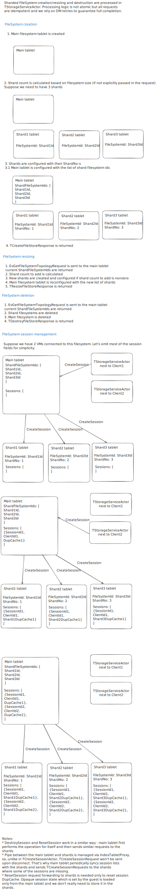
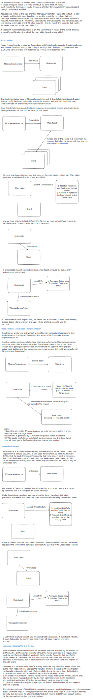
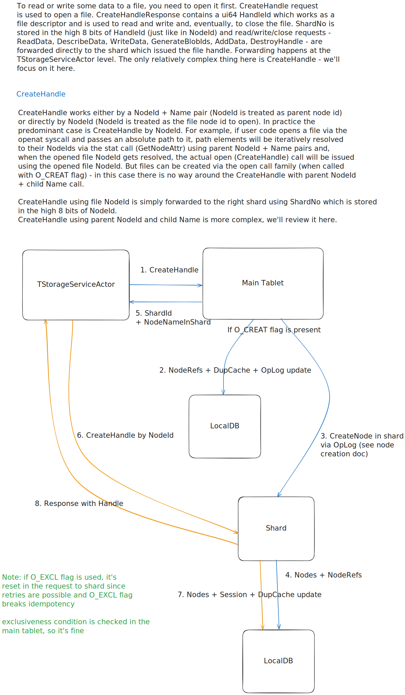

# Filestore Sharding

## CRUD and Session Management

## Node creation, unlink, rename

## Reading and writing

## Metrics aggregation
`GetStorageStats` requests are sent to all shards from the main tablet, the results are cached and aggregated.
The following aggregate metrics are exported:
* AggregateUsedBytesCount - sum(UsedBytesCount) over all shards

`GetStorageStats` requests are sent to the shards in background each 15 seconds.
Cached shard metrics can be retrieved by using `AllowCache: true` flag in `TGetStorageStatsRequest`.
Shard metrics such as UsedBytesCount, CurrentLoad and Suffer are displayed on the main tablet monpage.
Shard metrics are used by ShardBalancer in the main tablet to pessimize file creation in shards with low free space.

## Main tasks
* Initial sharding implementation: https://github.com/ydb-platform/nbs/issues/1350
* Load balancing by the main tablet: https://github.com/ydb-platform/nbs/issues/2559
* Ability to create directory inodes in shards: https://github.com/ydb-platform/nbs/issues/2674
* Scaling reads and writes within a single file: https://github.com/ydb-platform/nbs/issues/2454

## Known issues
* https://github.com/ydb-platform/nbs/issues/2667
