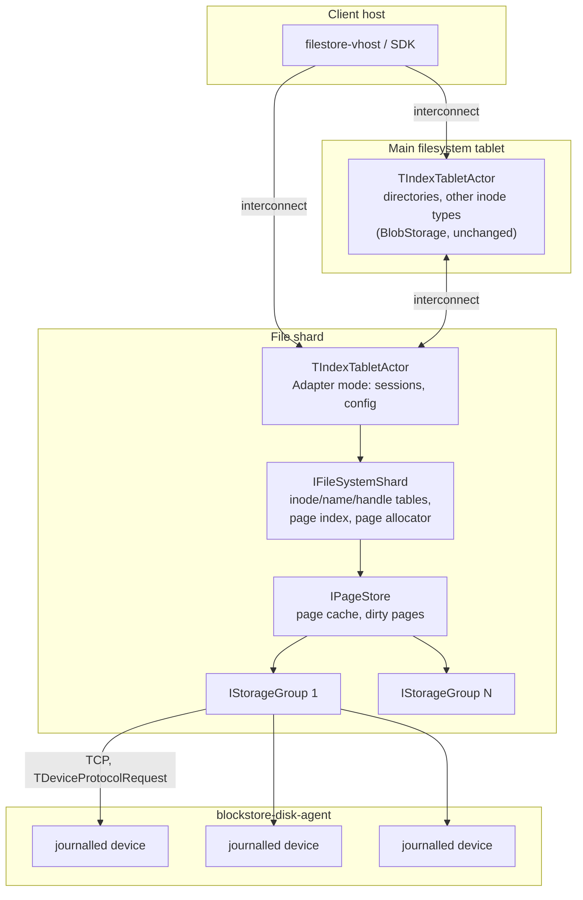

# Fastshard

Fastshard is a filesystem shard implementation that does not use YDB
BlobStorage. It is file-only: it stores regular inodes (files) and nothing
else. Shards that host directories and other inode types keep the existing
`TIndexTabletActor` implementation on top of BlobStorage. Shards that host
files can be implemented via fastshard.

This directory documents the prospective design. The prototype
(`impl/naive_mirrored`) implements a subset of it; every gap between the
prototype and the design is marked in the per-layer documents.

## Position in the current architecture

Fastshard replaces the storage backend of a file shard. Everything around it
stays as is:

* **Bootstrap** - fastshard code is bootstrapped via the tablet
  infrastructure. The tablet actor creates the `IFileSystemShard` instance
  when it loads its state (`tablet_actor_loadstate.cpp`).
* **Integration point** - `TIndexTabletActor`'s Adapter mode
  (`StateAdapter`). In this mode the tablet does not execute local
  transactions against BlobStorage; it forwards session requests to the
  `IFileSystemShard` interface and keeps handling sessions, configuration
  and counters itself.
* **Inter-shard communication** - unchanged, via the tablet infrastructure
  (interconnect events between tablets).
* **Configuration distribution** - unchanged. `TConfigureAsShardRequest`
  carries `IsFastShard` and `TFastShardConfig`; the per-filesystem config
  reaches the tablet through the regular config pipeline.
* **Devices** - storage devices are hosted by blockstore-disk-agent with a
  journalled device layer on top (`journalled_device_tcp_server`).

In addition to the actor-system path there is a TCP side channel: the tablet
registers its shard in `NFastShard::IServer`, which serves the same
`IFileSystemShard` methods over a length-prefixed protobuf protocol
(`server/protos/fastshard.proto`). The host and port are published through
the filestore backend info.

## What fastshard implements

1. Filesystem data structures: inode table, handle table, name table, page
   index, page allocator.
2. Storage groups: quorum on top of multiple devices, crash recovery,
   replication.

## Layers

```
       shard              filesystem data structures
         |
     page store           page cache, dirty pages, request forwarding
         |
  [storage groups]        quorum, recovery, Lsn ordering
         |
   storage nodes          journalled devices in blockstore-disk-agent
```

Each shard works on top of multiple storage groups. The data and metadata of
a single inode are co-located inside one storage group. A file that does not
fit into a single group spans several groups; writes to multiple groups are
coordinated via 2PC.

> **TBD**: detailed description of cross-group 2PC.

## High-level diagram



## Reused and new components

| Component | Status |
|-----------|--------|
| `TIndexTabletActor` bootstrap, sessions, config pipeline | reused |
| Interconnect between shards | reused |
| blockstore-disk-agent | reused, extended with the journalled device layer |
| `journalled_device_tcp_server` (`cloud/storage/core/libs`) | new |
| `IFileSystemShard` and its data structures | new |
| `IPageStore` | new |
| `IStorageGroup` | new |
| `IStorageNode` client/server stack (`sn/`) | new |
| silk fiber runtime (`contrib/libs/silk`) | new dependency |

## Per-layer documents

* [storage-node.md](storage-node.md) - journalled storage node.
* [storage-group.md](storage-group.md) - quorum, crash recovery, Lsn
  advancement.
* [page-store.md](page-store.md) - page cache and dirty page tracking.
* [shard.md](shard.md) - shard data structures and on-disk layout.
* [silk.md](silk.md) - the async framework.
