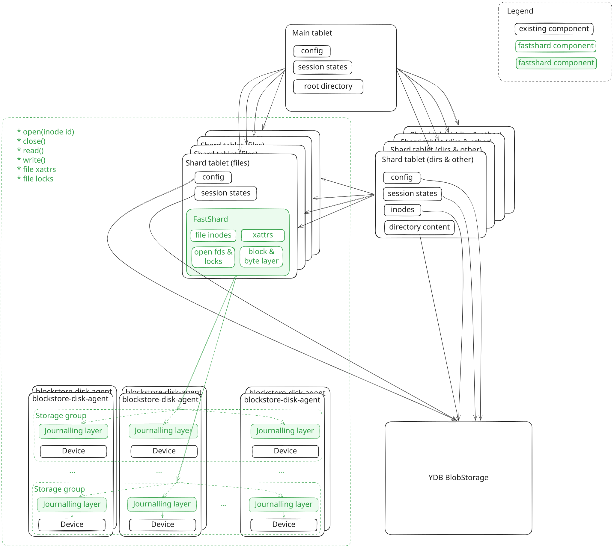

# Fastshard

Fastshard is a filesystem shard implementation that does not use YDB
BlobStorage. It is file-only: it stores regular inodes (files) and nothing
else. Shards that host directories and other inode types keep the existing
`TIndexTabletActor` implementation on top of BlobStorage. Shards that host
files can be implemented via fastshard.

This directory documents the prospective design. The prototype
(`impl/naive_mirrored`) implements a subset of it; every gap between the
prototype and the design is marked in the per-layer documents.

## Motivation

Our current file storage architecture stores the data in YDB BlobStorage as
immutable blobs up to 4MiB each. The inode table and block index are stored in
the same storage layer as an LSM database. The blobs comprising this LSM
database are stored in channels 0, 1 and 2 of the tablet and the data blobs are
stored in the remaining channels. Actor system is used as the async framework on
which everything is built. This architecture works more or less okay for some
workloads (preferably highly parallel, preferably large requests) but doesn't
work good enough in the other important workloads - mostly the workloads for
which low latency for small requests is critical. The main issues are:
* the blobs are immutable which leads to the need to modify both the index and
 the data every time we need to rewrite a portion of the file even if that
 portion is already allocated
* even though we have some complex features that allow us to do index updates
 and data blob writing in parallel it's still not 100% parallel - there're
 still more than 1 round-trips between the client and the implementation of
 the shard
* it's impossible to implement true direct client<->storage group writes because
 the index needs to be updated every time
* the blobs are pretty small which leads to needing a large index - it's
 different from what most filesystems do which is being able to allocate large
 consecutive extents and indexing each extent with a single index entry (the
 index is usually implemented as some kind of a tree with large fanout - e.g.
 extent tree, b-tree, radix tree) - a large index doesn't fit into RAM which
 drastically increases both read and write latency
* the inode, index and data are scattered across multiple storage groups which
 makes tail latency upon each read and write worse
* actor system is pretty expensive because a lot of calls which could've been
 implemented via a lock-free op or a very short-term spinlock require creating
 an actor

## Fastshard position in the current architecture

We want to be able to plug in a new solution right into the current architecture
and would like to deliver the first version as soon as possible. That's why we
strive to reuse most of the current components that are not 100% critical for
achieving our latency goals for the most latency-critical operations:
* `open(inode_id) -> handle_id`
* `write(handle_id, offset, data)`
* `read(handle_id, offset, len) -> data`
* `close(handle_id)`

Fastshard replaces the storage backend of a file shard. Everything around it
stays as is:

* **Bootstrap** - fastshard code is bootstrapped via the tablet
  infrastructure. The tablet actor creates the `IFileSystemShard` instance
  when it loads its state (`tablet_actor_loadstate.cpp`).
* **Integration point** - `TIndexTabletActor`'s Adapter mode
  (`StateAdapter`). In this mode the tablet does not execute local
  transactions against BlobStorage; it forwards session requests to the
  `IFileSystemShard` interface and keeps handling sessions, configuration
  and counters itself.
* **Inter-shard communication** - unchanged, via the tablet infrastructure
  (interconnect events between tablets).
* **Configuration distribution** - unchanged. `TConfigureAsShardRequest`
  carries `IsFastShard` and `TFastShardConfig`; the per-filesystem config
  reaches the tablet through the regular config pipeline.
* **Devices** - storage devices are hosted by blockstore-disk-agent with a
  journalled device layer on top (`journalled_device_tcp_server`).

In addition to the actor-system path there is a TCP side channel: the tablet
registers its shard in `NFastShard::IServer`, which serves the same
`IFileSystemShard` methods over a length-prefixed protobuf protocol
(`server/protos/fastshard.proto`). The host and port are published through
the filestore backend info.

## What fastshard implements

1. Filesystem data structures: inode table, handle table, name table, page
   index, page allocator.
2. Storage groups: quorum on top of multiple devices, crash recovery,
   replication.

## Layers

```
       shard              filesystem data structures
         |
     page store           page cache, dirty pages, request forwarding
         |
  [storage groups]        quorum, recovery, Lsn ordering
         |
   storage nodes          journalled devices in blockstore-disk-agent
```

Each shard works on top of multiple storage groups. The data and metadata of
a single inode are co-located inside one storage group. A file that does not
fit into a single group spans several groups; writes to multiple groups are
coordinated via 2PC.

> **TBD**: detailed description of cross-group 2PC.

## High-level diagram



## Reused and new components

| Component | Status |
|-----------|--------|
| `TIndexTabletActor` bootstrap, sessions, config pipeline | reused |
| Interconnect between shards | reused |
| blockstore-disk-agent | reused, extended with the journalled device layer |
| `journalled_device_tcp_server` (`cloud/storage/core/libs`) | new |
| `IFileSystemShard` and its data structures | new |
| `IPageStore` | new |
| `IStorageGroup` | new |
| `IStorageNode` client/server stack (`sn/`) | new |
| silk fiber runtime (`contrib/libs/silk`) | new dependency |

## Per-layer documents

* [storage-node.md](storage-node.md) - journalled storage node.
* [storage-group.md](storage-group.md) - quorum, crash recovery, Lsn
  advancement.
* [page-store.md](page-store.md) - page cache and dirty page tracking.
* [shard.md](shard.md) - shard data structures and on-disk layout.
* [silk.md](silk.md) - the async framework.
