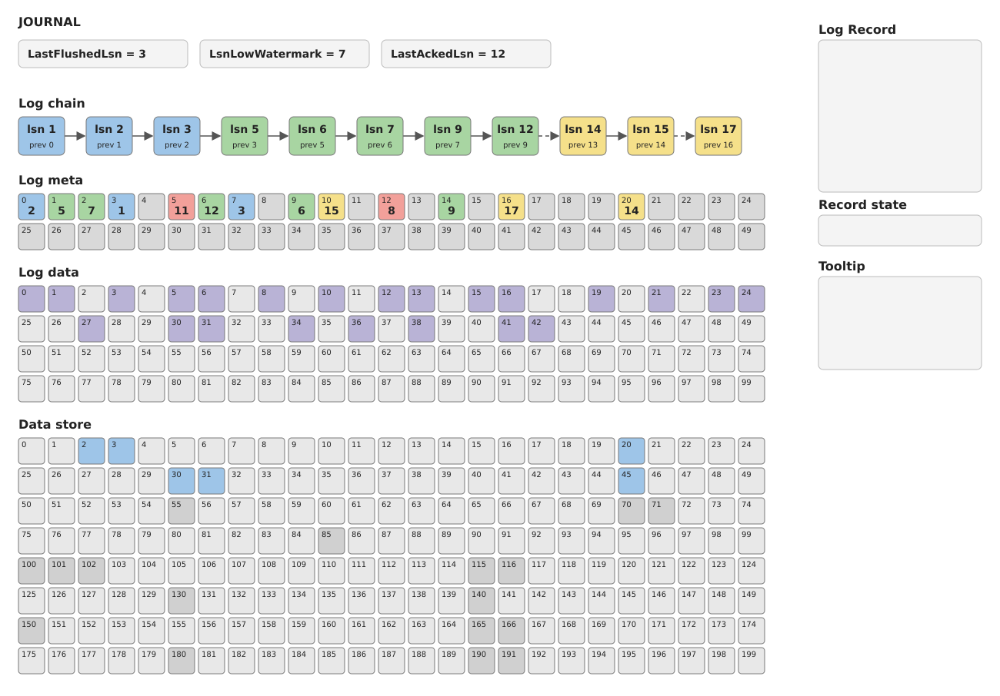
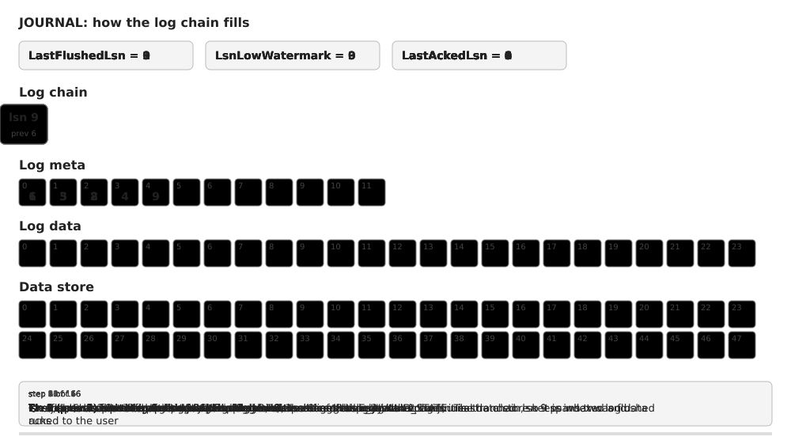

# Journal

The journal is the write-ahead log that the journalled device (see
[storage-node.md](storage-node.md)) keeps in front of a raw storage device. The
code lives in `cloud/fastshard/journal/impl`; the entry point is
`CreateJournalledDeviceV2`. The v1 device (`CreateJournalledDevice`) is a
pass-through without a journal and is what the prototype still uses.

The problem it solves: a device is one replica of a storage group (see
[storage-group.md](storage-group.md)), and each log record has to be applied
to it atomically - after a crash the record is either there as a whole or not
at all. After a crash the group also has to find out which records every
replica holds and bring the replicas back in sync, so a device must be able to
hand back the records it has written. So the writes go into the journal first,
are acknowledged from there, and are copied to their final location in the
background once the writer says it no longer needs them kept.

The implementation is being merged in pieces
([#6956](https://github.com/ydb-platform/nbs/issues/6956)); a method that is
not merged yet answers `E_NOT_IMPLEMENTED`.

## Interface

`IJournalledDevice` (`iface/journalled_device.h`) is what the stack exposes:

| method | meaning |
| --- | --- |
| `WriteLogRecord` | write a record - a set of page groups tagged with an `Lsn` and the `PrevLsn` it chains from |
| `ReadPages` | read pages, newest content wins, whether it is still in the journal or already on the device |
| `ReadJournalTail` | the records the journal still holds past a given lsn, in chain order - how a writer that restarts finds out what has been written |
| `AdvanceLsnLowWatermark` | the writer no longer needs the records up to and including this lsn - they may be flushed to the data device and dropped |

Every request must carry the `deviceUUID` the device was built with, and the
page ranges of a single request must not intersect.

## Layout

```
                  IJournalledDevice  (journalled_device_v2.cpp)
                  - splits reads between the journal and the data device
                  - runs the background flush cycle
                           |
              +------------+-----------------------------+
              |                                          |
          IJournal  (journal.cpp)                    IDevice
          - record chain, page index                 "data device":
          - restore, tail, watermark                 where the pages
              |                                      finally live
      +-------+---------------------+
      |                             |
IKeyBufferStore              IDevicePageStore
(key_buffer_store.cpp)       (device_page_store.cpp)
"log meta": one entry        "log data": page allocator
per record, keyed by         over a device, holds the
PrevLsn                      record payloads
      |                             |
   IDevice                       IDevice
```

Three page ranges, then: the log metadata, the log data, and the data itself.
They can be three areas of one physical device or three separate ones - the
stack only cares that they do not overlap.

## Records, the chain and the index

A **record** says "these pages now hold this content" and chains to its
predecessor through `PrevLsn`. The lsns are the writer's, the journal never
invents them; it only requires `PrevLsn < Lsn`. Once the journal knows where in
the log data the payload landed, the record carries the **page mappings**
(page number to log location), and that is what is stored in the log metadata -
the payload itself stays in the log data.

The **chain** (`log_chain.h`) holds the in-flight records keyed by `PrevLsn`,
which is what makes out-of-order arrival work: a record can be inserted before
the one it chains from has shown up, leaving a gap. The records that follow each
other unbroken form the *chained run*; only records in that run can be served,
flushed or erased.

The **page index** (`log_index.h`) maps a page number to the log location
holding its newest content, along with the lsn that wrote it. Applying a record
to the index is what makes it visible to readers; a record is applied only if
it continues the chain from the last indexed one.

Three lsn marks describe the state of the journal:

* `LastIndexedLsn` - the end of the chained run applied to the index. Every
  record up to it is acknowledged to the writer and readable from the journal.
  Reads report it to the writer as `LastAckedLogSequenceNumber`.
* `LsnLowWatermark` - the writer no longer needs the records up to it. It is
  persisted in the journal metadata, and only records at or below it are
  flushed.
* `LastFlushedLsn` - the records up to it are on the data device already. It
  is a barrier: a read pins it, so the records past it stay in the journal
  until the read is done.

A record is therefore in one of four states: **pending** (durable, waiting for
its predecessor), **indexed**, **flushed**, or **stranded** - ready, but
chaining from an lsn the chain has already skipped, so it can never join. A
stranded record is answered with an error once the watermark passes it.



The diagram is interactive: hover a record to see its mappings and the pages
it occupies in the log data and on the data device.

## Stores

### Log metadata

`IKeyBufferStore` (`key_buffer_store.h`) is a small persistent map of `ui64`
key to buffer: restore everything, upsert a key, erase every key below a bound.
The journal keeps one entry per record under its `PrevLsn` and the journal
metadata (format version and `LsnLowWatermark`) under a reserved key.

On the device the map is laid out so that no write can corrupt what is already
stored:

* two **superblock** pages are written alternately and carry the erased-below
  bound; the intact one with the highest sequence number wins, so an
  interrupted erase leaves the previous bound in place;
* every other page is an **entry** page: a checksummed header (key, sequence
  number, chunk index and count) followed by a chunk of the value. A value
  larger than one chunk spans several pages, which need not be contiguous;
* restore scans every page, groups the intact ones by key and sequence number,
  and keeps the newest *complete* value of each key. A torn write is simply an
  incomplete candidate that loses to the previous one;
* a write that supersedes an entry frees the pages of the older one only after
  the new one is durable.

### Log data

`IDevicePageStore` (`device_page_store.h`) is a page allocator over a device:
allocate, allocate specific pages, free, and page-granular read and write. The
allocation state is not persisted - restore rebuilds it from the records, so
pages orphaned by a crash mid-write come back as free.

## Algorithms

### Write

1. Validate the request: the page groups must sit inside the data device and
   must not intersect. A record at or below `LastIndexedLsn` is answered
   `S_ALREADY`.
2. Insert the record into the chain. A record overlapping one already held is
   rejected; an exact duplicate (a retry) gets the held record's future
   instead of being written again.
3. Allocate pages in the log data (`E_REJECTED` when the journal is full) and
   write the payload.
4. The page mappings are now known, so serialize the record and write it to
   the log metadata under the key `PrevLsn`. The payload is written first and
   the record second: the record is what a restore finds, so it may only point
   at pages that are already written.
5. Mark the record ready and walk forward from it, applying every ready record
   that continues the chain to the page index and completing each one's promise
   as it goes.

A record that does not continue the chain stays pending at the last step - its
promise is completed when the missing predecessor arrives. If anything fails,
the record is removed from the chain and its pages are freed.



The diagram is animated and shows how the chain fills as records arrive out of
order.

### Read

The journal pins the flushed barrier, looks the ranges up in the page index,
and returns the mapped pages from the log data - only the pages it actually
has, and only those written after the flushed lsn.

The device pins the indexed barrier, asks the journal, reads the missing pages
from the data device, and stitches the two responses together in the shape of
the request. A page missing from both is an error.

### Tail

`ReadJournalTail` pins the flushed barrier at no less than the requested lsn,
starts at the later of that and the watermark, and walks the chained run
forward, reading each record's payload back out of the log data. A record
count limit may be given.

### Watermark

`AdvanceLsnLowWatermark` accepts a watermark up to `LastIndexedLsn`, persists
it in the journal metadata, and only then moves the in-memory mark. Until the
writer moves the watermark past a record, it stays in the journal and the data
device is left untouched.

### Flush cycle

The device runs the cycle in the background, rescheduling it every 100 ms:

1. Take the next record after the flushed barrier, provided it is at or below
   both the watermark and the indexed barrier (what in-flight readers have
   seen).
2. Write its page groups to the data device at their real page numbers and
   advance the flushed barrier. A record that maps no pages is a chain link
   and nothing more, so it is marked flushed without a device request.
3. When nothing is left to flush - or a flush failed and will be retried on the
   next cycle - clean up: erase the metadata entries below the barrier, drop
   the index mappings, remove the records from the chain and free their log
   pages. Stranded records below the barrier have their promises failed.

### Restore

`Start` restores the journal before serving anything:

1. read every entry back from the log metadata and sort by key (`PrevLsn`);
2. take `LsnLowWatermark` from the journal metadata entry;
3. deserialize the records in chain order and initialize the chain, the index
   and the flushed barrier from the first one;
4. re-claim each record's pages in a freshly built page store, so the
   allocation state is derived from the records;
5. insert each record, mark it ready and apply it to the index.

The result is `LastIndexedLsn`, which the device uses to initialize the indexed
barrier, and then the flush cycle starts.

### Barriers

`TLsnBarrier` (`lsn_barrier.h`) is a monotonically advancing lsn with
reference-counted guards: a guard pins the value, and the effective barrier is
the lower of the current value and the lowest pinned one. Two of them guarantee
that a reader sees a consistent state:

* the journal's **flushed barrier** - a read, a tail read and the flush loop
  each pin it, so cleanup cannot free the pages they are still reading;
* the device's **indexed barrier** - a read pins it, and the flush cycle
  refuses to flush past the pinned value, so a reader that took its journal
  pages at one lsn cannot then see device pages from a later one.

## Threading

The device runs the work of every public call on the coroutine `TExecutor`, so
both it and the journal run on executor threads and may block on futures there.
`Start` and `Stop` block the calling thread until that work is done. The stores
are free-threaded: their state is under a lock and the device requests are
issued outside of it. The chain, the index and the barriers each guard
themselves with a spinlock.
