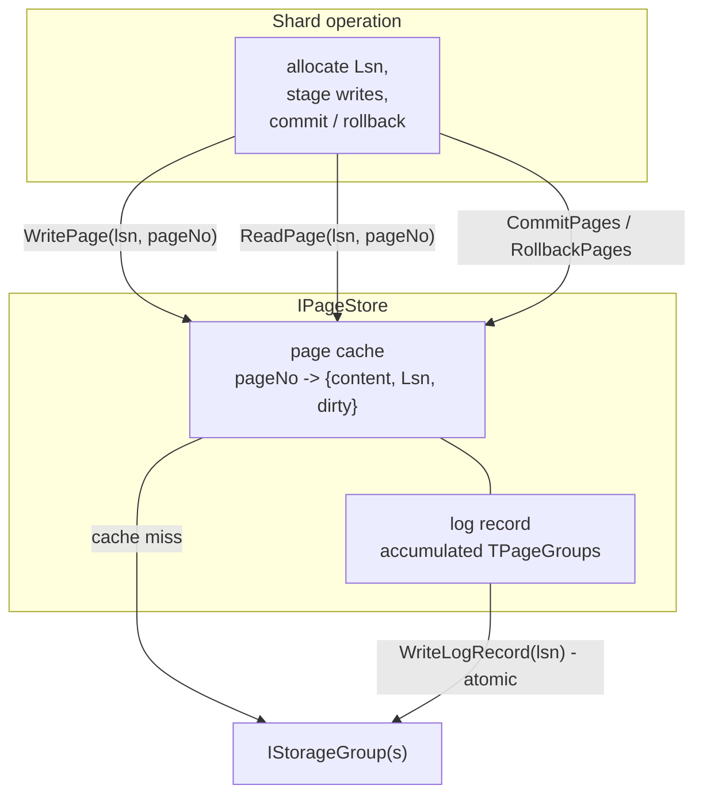

# Page store

The page store (`IPageStore`, `impl/naive_mirrored/page_store.h`) is the
layer between the shard's data structures and the storage groups. The shard
never talks to a group directly; every page it reads or writes goes through
the page store.

## Responsibilities

* **Request forwarding** - translating page reads and writes into
  `ReadPages` / `WriteLogRecord` calls on the storage group.
* **Page cache** - an in-memory cache of recently used pages.
* **Dirty page tracking** - pages staged by an uncommitted operation are
  marked dirty and tagged with the operation's Lsn.

## Interface

```
ui64  AllocateLsn();
TError WritePage(lsn, pageNo, page, &logRecord);
TError ReadPage(lsn, pageNo, &page);
void  CommitPages(pages);
void  RollbackPages(pages);
```

A shard operation allocates an Lsn, stages its writes via `WritePage`
(which accumulates `TPageGroup` entries into one log record), sends the log
record to the storage group as a single atomic `WriteLogRecord`, then
commits or rolls back the staged pages in the cache.

## Dirty page discipline

The Lsn tag on dirty pages isolates concurrent operations:

* `WritePage` on a page that is dirty under a different Lsn returns
  `E_REJECTED`;
* `ReadPage` on a page that is dirty under a different Lsn returns
  `E_REJECTED`;
* `CommitPages` clears the dirty flag, `RollbackPages` drops the cache
  entry.

The caller must treat `E_REJECTED` as a retryable conflict, distinct from
`E_FS_NOENT` and other domain errors.

## Differences from the planned production implementation

* The interface will carry explicit storage group numbers, so the shard can
  co-locate the data and metadata of a single inode inside the same storage
  group.
* Cross-group 2PC support - for the files that do not fit into a single
  storage group.

> **TBD**: detailed description of cross-group 2PC.

## Diagram


