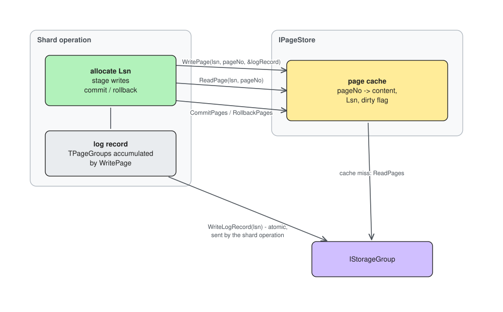

# Page store

The page store (`IPageStore`, `impl/naive_mirrored/page_store.h`) is the
layer between the shard's data structures and the storage groups. The shard
generally avoids talking to a group directly; every page it reads or writes goes
through the page store.

## Responsibilities

* **Request forwarding** - translating cache-missing page reads into
  `ReadPages` calls on the storage group. Writes are not forwarded by the
  page store: `WritePage` only stages the page and accumulates the log
  record; the shard operation itself sends the record via `WriteLogRecord` after
  all the pages it wants to modify are staged.
* **Page cache** - an in-memory cache of recently used pages.
* **Dirty page tracking** - pages staged by an uncommitted operation are
  marked dirty and tagged with the operation's LSN.

## Interface

```
ui64  AllocateLsn();
TError WritePage(lsn, pageNo, page, &logRecord);
TError ReadPage(lsn, pageNo, &page);
void  CommitPages(pages);
void  RollbackPages(pages);
```

A shard operation allocates an LSN, stages its writes via `WritePage`
(which accumulates `TPageGroup` entries into one log record), sends the log
record to the storage group as a single atomic `WriteLogRecord`, then
commits or rolls back the staged pages in the cache.

## Dirty page tracking

The LSN tag on dirty pages isolates concurrent operations:

* `WritePage` on a page that is dirty under a different LSN returns
  `E_REJECTED`;
* `ReadPage` on a page that is dirty under a different LSN returns
  `E_REJECTED`;
* `CommitPages` clears the dirty flag, `RollbackPages` drops the cache
  entry.

The caller must treat `E_REJECTED` as a retriable conflict, distinct from
`E_FS_NOENT` and other domain errors. If such coarse conflict resolution turns
out to be too bad for our performance, we can support staging of multiple page
versions at once and queueing of the incoming requests.

## Differences from the planned production implementation

* The interface will carry explicit storage group numbers, so the shard can
  co-locate the data and metadata of a single inode inside the same storage
  group.
* The prototype doesn't implement page eviction - we need to implement it and
  probably it should be smarter than just plain LRU or CLOCK - e.g. prioritizing
  the pages backing the metadata to evict them only as our last resort seems
  reasonable.
* Minor: probably making `WriteLogRecord` a part of `PageStore` implementation
  is reasonable - this way we can encapsulate all the retry/rollback logic
  inside `PageStore`. This will require getting rid of custom caches in the data
  structures on top of page store (which is probably also good).

## Diagram


