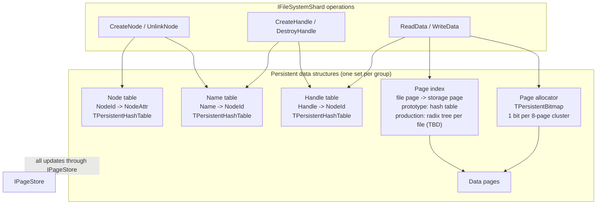

# Shard data structures

The shard (`IFileSystemShard`) owns five persistent data structures. All of
them live in pages managed by the page store and are updated through the
page store's Lsn/commit discipline, so every filesystem operation is applied
atomically.

## Tables

### Node table (TNodeTable)

Stores the `NodeId -> NodeAttr` mapping and allocates `NodeId`s. The shard
number occupies the high bits of every allocated `NodeId`. Implemented via
`TPersistentHashTable`.

### Name table

Stores the `Name -> NodeId` mapping. Implemented via
`TPersistentHashTable`.

### Handle table

Stores the `Handle -> NodeId` mapping and allocates `Handle`s (shard number
in the high bits as well). Implemented via `TPersistentHashTable`.

`TPersistentHashTable` is an open-addressed hash table with linear probing
and batch tombstone cleanup upon element deletion. The node table and the
name table will generally stay as they are implemented in the prototype.

### Page index

Maps file pages to storage pages. Allocation is done in page clusters -
groups of 8 consecutive pages.

* Prototype: `TPersistentHashTable` with `<NodeId, PageClusterNo>` keys and
  `StoragePageClusterNo` values.
* Production: a radix tree per file.

> **TBD**: per-file radix tree design.

### Page allocator

Tracks which page clusters are free. Implemented via `TPersistentBitmap`:
one bit per page cluster, stored in page-sized chunks (with
PageSize == 4KiB each chunk stores 2^15 bits), plus an in-memory stack of
chunks that have zero bits. Production keeps this design.

Always allocating in multiples of 32KiB (8 pages) may waste too much space;
a more sophisticated allocator is a possible future change. Large files
will also need to address storage pages from other groups.

## Per-group layout

Offsets are in bytes; the implementation rounds each region up to PageSize.
N - node slots per group, M - page clusters per group.

```
Offset 0: --------------------------------------------- Node Table - 100 bytes per slot, N slots
Offset 100 * N: --------------------------------------- Name Table - 32 bytes per slot, N slots
Offset 100 * N + 32 * N: ------------------------------ Handle Table - 16 bytes per slot, 10 * N slots
Offset 100 * N + 32 * N + 160 * N: -------------------- Page Index - 24 bytes per slot, M slots
Offset 100 * N + 32 * N + 160 * N + 24 * M ------------ Page Allocator Bitmap - M bits, M / 2^15 pages
Offset 100 * N + 32 * N + 160 * N + 24 * M + M / 8 ---- Data Pages
```

For N == 100'000 (100k files per storage group), M == 3'000'000 (3m page
clusters, i.e. 3m x 32KiB = 91.5GiB of space) and a hash table load factor
of 0.5, the metadata takes:

```
(100000 * 100 + 100000 * 32 + 10 * 100000 * 16 + 3000000 * 24 + 3000000 / 8)
    / 1024 / 1024 / 0.5 = 194MiB
```

## Multiple groups

Each shard works on top of multiple storage groups. The data and metadata
of one inode are co-located inside a single group. Files that do not fit
into one group span several; writes to multiple groups are coordinated via
2PC.

> **TBD**: detailed description of cross-group 2PC.

## Diagram


