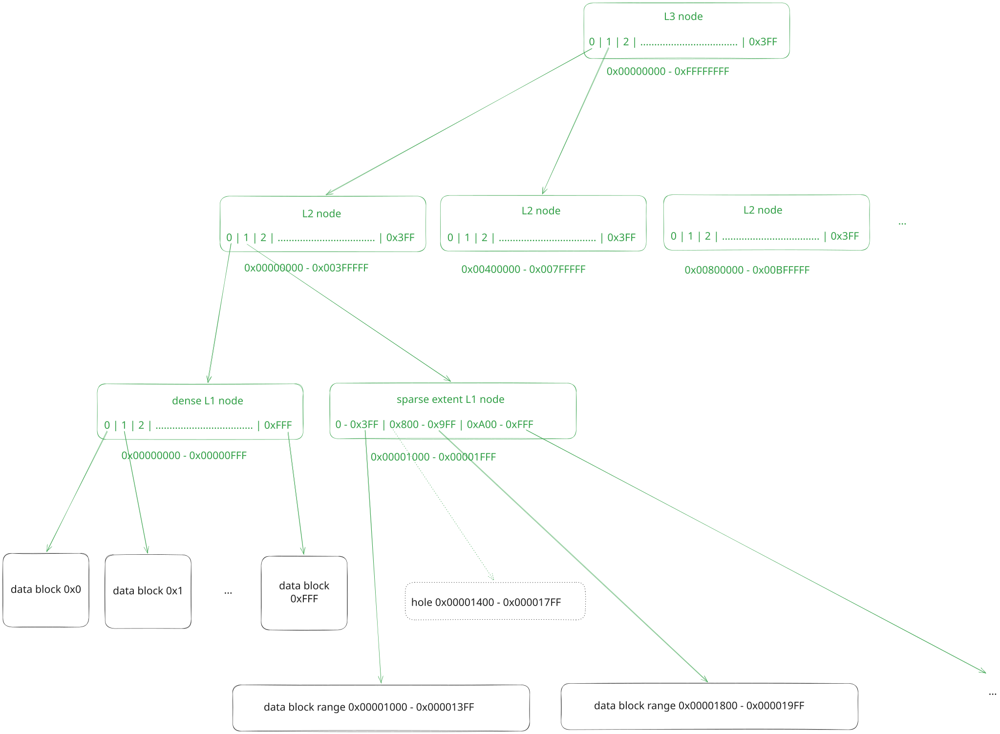
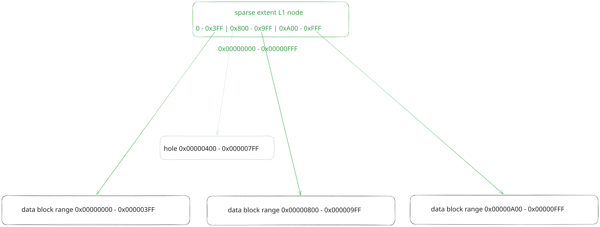
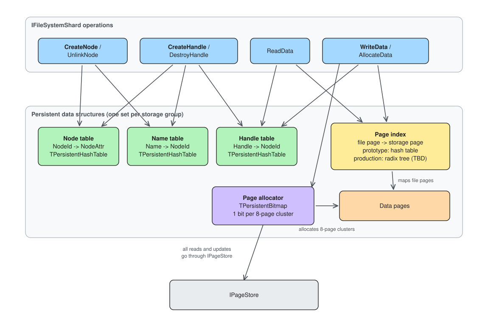

# Shard data structures

The shard (`IFileSystemShard`) owns five persistent data structures. All of
them live in pages managed by the page store and are updated through the
page store's LSN/commit logic, so every filesystem operation is applied
atomically.

## Tables

### Persistent hash table

The main building block for the key-value structures in the shard, implemented
in the `TPersistentHashTable` class. It is an open-addressed hash table with
linear probing and batch tombstone cleanup upon element deletion.

### Node table

Stores the `NodeId -> NodeAttr` mapping and allocates `NodeId`s. The shard
number occupies the high bits of every allocated `NodeId`. Implemented via
`TPersistentHashTable`.

The implementation of the node table can stay almost the same in the production
version of the shard implementation.

### Name table

Stores the flat `Name -> NodeId` mapping. Implemented via `TPersistentHashTable`
with fixed-size buffers for `Name`.

The implementation of the name table can stay almost the same in the production
version of the shard implementation.

### Handle table

Stores the `Handle -> NodeId` mapping and allocates `Handle`s (shard number
in the high bits as well). Implemented via `TPersistentHashTable`. In our
production implementation we might also need to add session ids to the keys.

### Page index

Maps file pages to storage pages. Allocation is done in page clusters -
groups of 8 consecutive pages.

* Prototype: `TPersistentHashTable` with `<NodeId, PageClusterNo>` keys and
  `StoragePageClusterNo` values.
* Production: an extent tree / a radix tree hybrid per file.

#### Page index tree

The current plan is to use a radix tree data structure as the foundation and
enhance it with the ability to store extents instead of just individual block
numbers. The advantages of radix trees compared to b-trees are:
1. simplicity - down-pointer lookup is just a lookup in an array; growth doesn't
 require splits - we just need to add a new parent whose first down-pointer
 would point to the current block
2. lookup performance - because of the same reasons the performance is expected
 to be higher (but most probably both extent b-trees and extent radix trees
 should be good enough so this is probably not the main selling point)

A radix tree for a large file might look like this:


For small files most of the paths will collapse and the tree might look similar
to a plain array:


Down-pointers at the L1 level of the tree can point to the blocks local to the
inode's storage-group and can also point to the blocks in other storage-groups.
This is needed for the files which don't fit into a single storage-group. The
size of such "remote" down-pointers will be larger but each L1 node would still
fit into a single 16KiB physical page.

### Page allocator

Tracks which pages are free. Implemented via `TPersistentBitmap` in the
prototype: one bit per 8-page cluster, stored in page-sized chunks (with
`PageSize == 4KiB` each chunk stores `2^15 bits`), plus an in-memory stack of
chunks that have zero bits.

Production mostly keeps this design - but the allocation logic will probably be
smarter. Always allocating in multiples of 32KiB (8 pages) may waste too much
space; a more sophisticated allocator is a possible future change. Large files
will also need to address storage pages from other groups.

## Per-group layout

Offsets are in bytes; the implementation rounds each region up to `PageSize`.
N - node slots per group, M - page clusters per group. This is the storage group
layout for the prototype.

```
Offset 0: --------------------------------------------- Node Table - 100 bytes per slot, N slots
Offset 100 * N: --------------------------------------- Name Table - 32 bytes per slot, N slots
Offset 100 * N + 32 * N: ------------------------------ Handle Table - 16 bytes per slot, 10 * N slots
Offset 100 * N + 32 * N + 160 * N: -------------------- Page Index - 24 bytes per slot, M slots
Offset 100 * N + 32 * N + 160 * N + 24 * M ------------ Page Allocator Bitmap - M bits, M / 2^15 pages
Offset 100 * N + 32 * N + 160 * N + 24 * M + M / 8 ---- Data Pages
```

For N == 100'000 (100k files per storage group), M == 3'000'000 (3m page
clusters, i.e. 3m x 32KiB = 91.5GiB of space) and a hash table load factor
of 0.5, the metadata takes:

```
(100000 * 100 + 100000 * 32 + 10 * 100000 * 16 + 3000000 * 24 + 3000000 / 8)
    / 1024 / 1024 / 0.5 = 194MiB
```

## Multiple groups

Each shard works on top of multiple storage groups. The data and metadata
of one inode are co-located inside a single group. Files that do not fit
into one group span several; writes to multiple groups are coordinated by the
shard in the following manner:
0. Choose the page ranges to allocate from other storage groups (in-memory
  operation in the shard)
1. Write a log-record to the journal of the group holding the inode stating the
  intent to allocate those page ranges.
2. Write the data to the selected page ranges marking them as allocated - one
  log-record per storage group, all sent in parallel. In the majority of the
  cases we'll only need to write to a single external group.
3. In parallel with the previous step: write a log-record to the storage group
  holding the inode to update the page index of this inode.
4. After steps 2 and 3 are done - ack to the client and schedule a background
  log-record to the storage group holding the inode to mark this write as
  committed. If the shard is restarted before completing this step then it
  should find the log-record written at step 1 in the log and either commit the
  operation (if it finds out that steps 2 and 3 have been completed) or rollback
  the operation and write a log-record stating that this operation was
  cancelled.

Steps 0 and 1 can be thought of as the "prepare" stage of a 2PC transaction.
Steps 2 and 3 can be thought of as the "commit" stage of a 2PC transaction.

## Diagram


