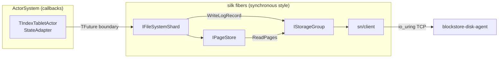

# Async framework: silk

Fastshard uses `contrib/libs/silk` as its async framework. Silk is a
cooperative fiber scheduler for Linux: per-CPU scheduler threads pinned to
cores, io_uring-based async IO, work stealing, and fiber synchronization
primitives (futures, events, mutexes, sequencers).

## Why fibers

Fibers make most of the code look as though it is synchronous. A shard
operation reads a page, waits for the storage group, writes a log record -
each step is a plain function call that suspends the fiber instead of
blocking a thread. The equivalent future-plus-callback code fragments the
same logic across continuations and explicit state objects; the fiber
version is much simpler to read and to reason about.

The interfaces below the shard are therefore synchronous by design and
documented as "must be called from a fiber":

* `IStorageNode` / `IStorageGroup` - synchronous methods; a slow
  implementation cooperatively suspends the calling fiber;
* `ipc` (`RecvAll` / `SendAll`) - TCP IO via silk's non-blocking poll;
* `sn/client` - one in-flight exchange per connection, serialized with a
  fiber mutex.

## Runtime boundaries

Silk is initialized once per process by `bootstrap/core.cpp`
(`NFastShard::Init`: `silk::initialize` + `silk::FiberScheduler::initialize`).

The actor system stays callback-based. The boundary is the
`IFileSystemShard` interface: its methods return `NThreading::TFuture`, the
tablet actor subscribes to them from `StateAdapter`, and inside the shard
the work runs on silk fibers. Threads that do not belong to silk (actor
system threads) interact with the fiber world through silk's proxy-fiber
support.

