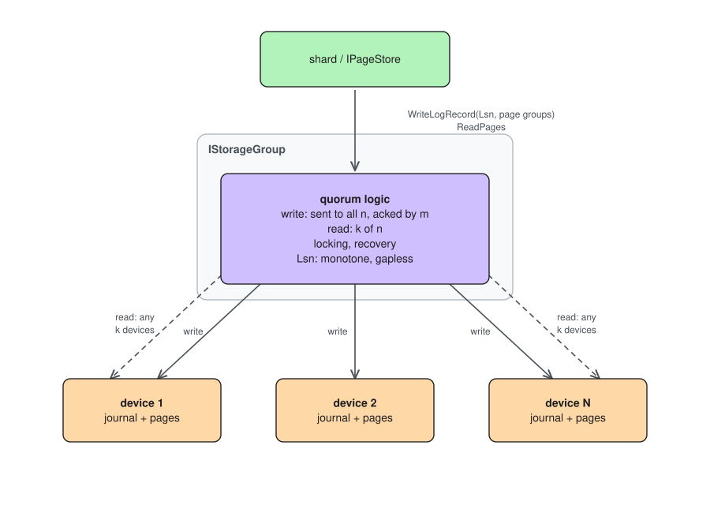

# Storage group

A storage group is N storage devices treated as one replicated unit. The
shard's page store addresses a group, never an individual device. The
interface is `IStorageGroup` (`sn/quorum/storage_group.h`): `AcquireDevices`,
`ReleaseDevices`, `WriteLogRecord`, `ReadPages` - synchronous, called from
silk fibers.

## Responsibilities

* **Data redundancy** - every log record is replicated across the group's
  devices. Write quorum m/n, read quorum k/n.
* **Device locking** - the group acquires its devices before serving
  traffic; the lease carries the writer's `Generation`, which fences stale
  writers. *Missing in the prototype.*
* **Recovery** - after a crash the group replays the tail of the log,
  bringing all devices to a consistent state before accepting new writes.
  *Missing in the prototype.*
* **Retries and ordering** - the group retries per-device failures and
  guarantees that the Lsn moves forward monotonically and without gaps.
  *Missing in the prototype.*

## Lsn advancement

Every `WriteLogRecord` carries an Lsn. The group is the layer that
guarantees the Lsn sequence observed by every device is monotone and
gapless: a device that has applied Lsn X has applied every record below X.
This property is what makes tail replay after a crash well-defined: the
recovery procedure finds the highest Lsn present on a quorum of devices and
completes or discards records above it.

The Lsn low watermark - the boundary below which journal records may be
applied to their final locations - is moved by the shard and forwarded by
the group to every device (see
[storage-node.md](storage-node.md)).

## Prototype

`CreateNaiveMirroredStorageGroup` is a happy-path implementation:

* writes are mirrored to all devices, n/n - no write quorum;
* reads go to one device selected round-robin, 1/n;
* no locking, no recovery, no Lsn enforcement, no retries.

## Diagram

