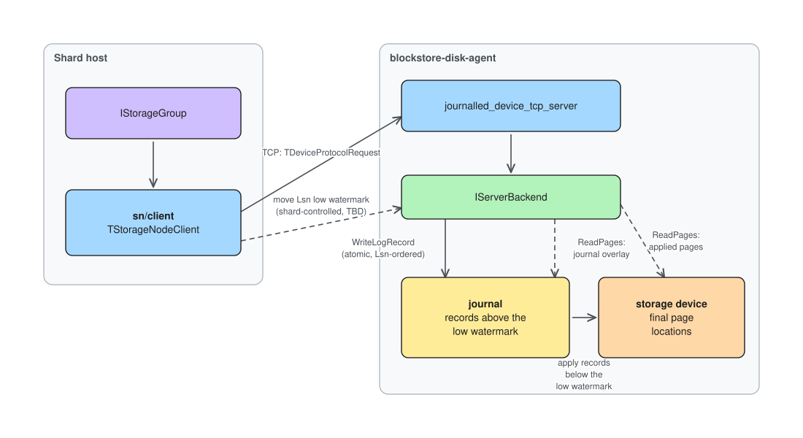

# Journalled storage node

A storage node is a single journalled device hosted by blockstore-disk-agent.
The journalled device layer sits on top of a raw storage device and exposes a
page-oriented protocol with a write-ahead journal.

## Interface

The protocol is defined in `cloud/storage/core/protos/device.proto` and
served over TCP by `cloud/storage/core/libs/journalled_device_tcp_server`.
Each message is a `TDeviceProtocolRequest` / `TDeviceProtocolResponse` pair
matched by `RequestId`. Four methods:

| Method | Purpose |
|--------|---------|
| `AcquireDevices` | Lock devices for a writer. |
| `ReleaseDevices` | Release the writer's lock. |
| `ReadPages` | Read page groups (`FirstPageNo`, `PageCount`, `PageSize`). |
| `WriteLogRecord` | Write one log record: several page groups plus a `LogSequenceNumber`. |

On the shard side the same four methods form the `IStorageNode` interface
(`sn/iface/storage_node.h`); `sn/client` speaks the TCP protocol from silk
fibers, `sn/server` and `sn/impl` provide an in-process implementation for
tests.

## Responsibilities

* **Atomicity** - all page groups of a single `WriteLogRecord` are applied
  atomically, via the journal. A crash either preserves the whole record or
  none of it.
* **LSN ordering** - writes are applied in `LogSequenceNumber` order. A
  write whose LSN is not properly ordered is rejected.
  *Missing in the prototype.*
* **Writer fencing** - a writer whose lease has been invalidated by another
  writer with a newer `Generation` is rejected.
  *Missing in the prototype.*
* **Reads** - serving `ReadPages` with the latest data: a page whose newest
  record is still in the journal is served from the journal, the rest from
  the final locations.

## Journal application (checkpointing)

Each write lands in the journal first. Moving pages from the journal to
their final locations is triggered by the LSN low watermark: the shard moves
the watermark, the storage node applies every journal record below it. The
shard only moves the watermark; the physical page movement happens entirely
on the storage node side.

In the production implementation the journal will most probably be separate for
each device and will probably be organized as a ring buffer located in the first
couple GiBs of the device. That's not that big of an overhead if we expect the
devices to be of around 100GiB each. There's also an option to write the data
directly to the final locations and use the journal only for the metadata -
like ext4 does by default - but this option requires some extra resync-like
logic at the shard level to make sure that the devices inside a single storage
group stay consistent.

The prototype does not physically have a journal: `WriteLogRecord` writes
the page groups in place.

## Diagram

