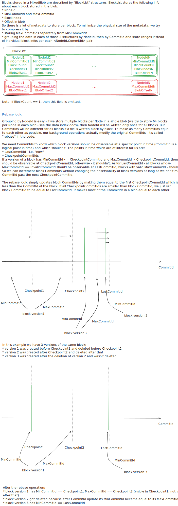

# Block List format and Rebase logic

[MixedBlocks](data_index.md#mixedblocks) stores block metadata for each blob in the form of [BlockLists](https://github.com/ydb-platform/nbs/blob/main/cloud/filestore/libs/storage/tablet/model/block_list.h). BlockLists have complex binary format and are encoded by [this code](https://github.com/ydb-platform/nbs/blob/main/cloud/filestore/libs/storage/tablet/model/block_list_encode.cpp). CommitIds of the blocks described by BlockLists can be changed by the [rebase logic](https://github.com/ydb-platform/nbs/blob/main/cloud/filestore/libs/storage/tablet/rebase_logic.cpp) to improve metadata grouping and decrease BlockList size.

Deletions in BlockList code simply mean block MaxCommitIds and are not directly related to DeletionMarkers.

