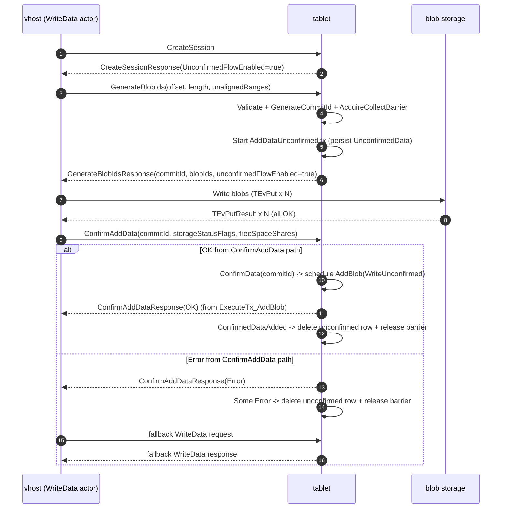
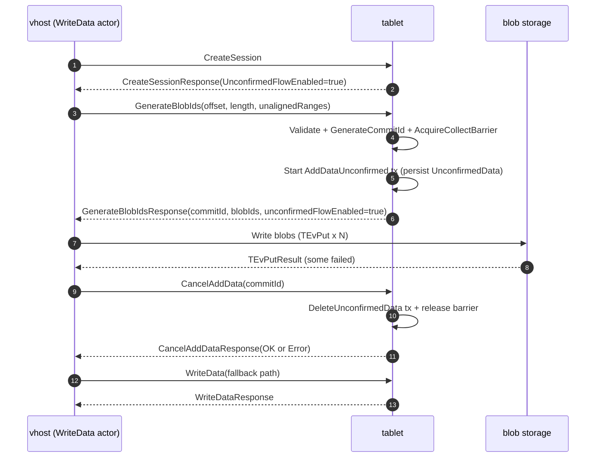
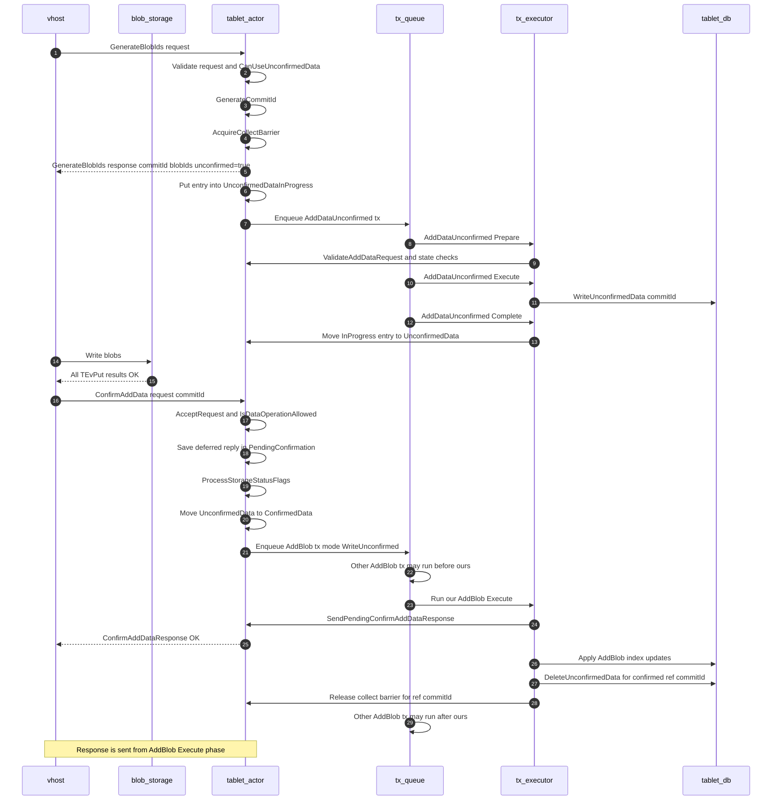
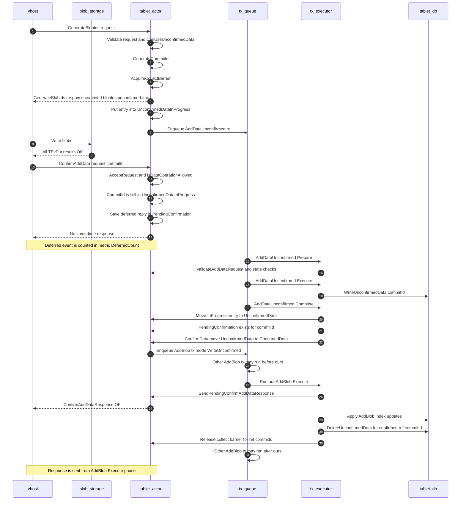
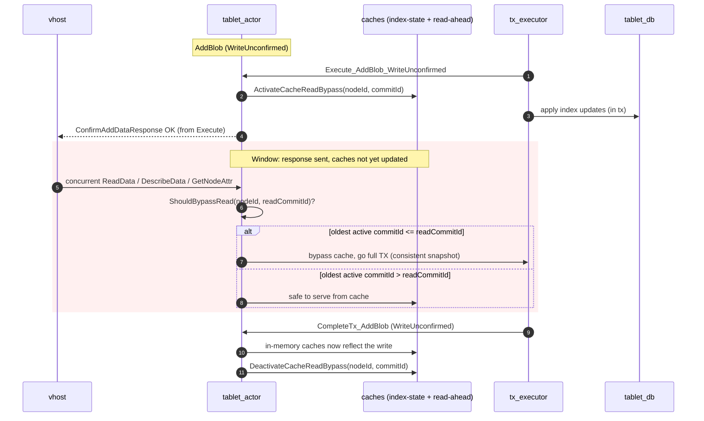
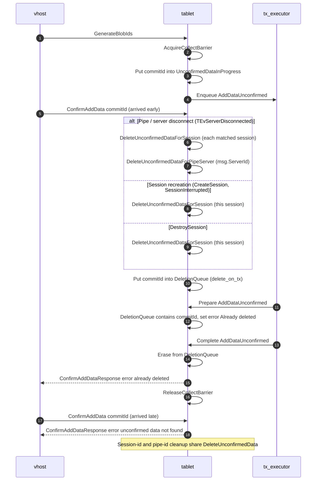
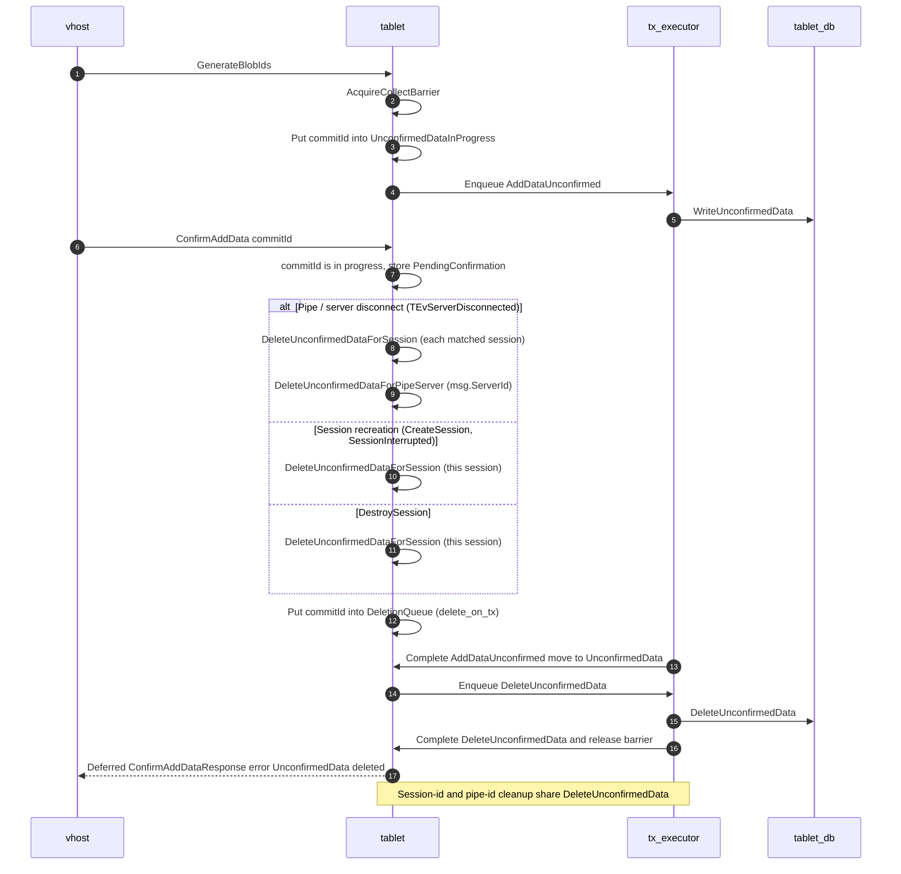
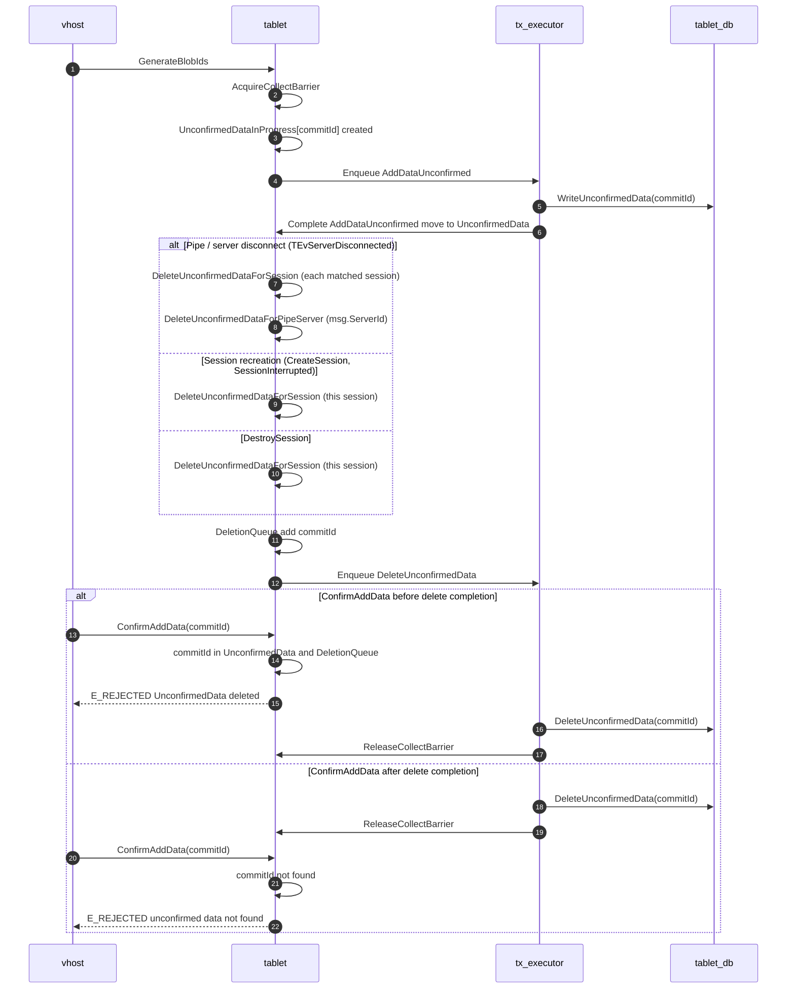
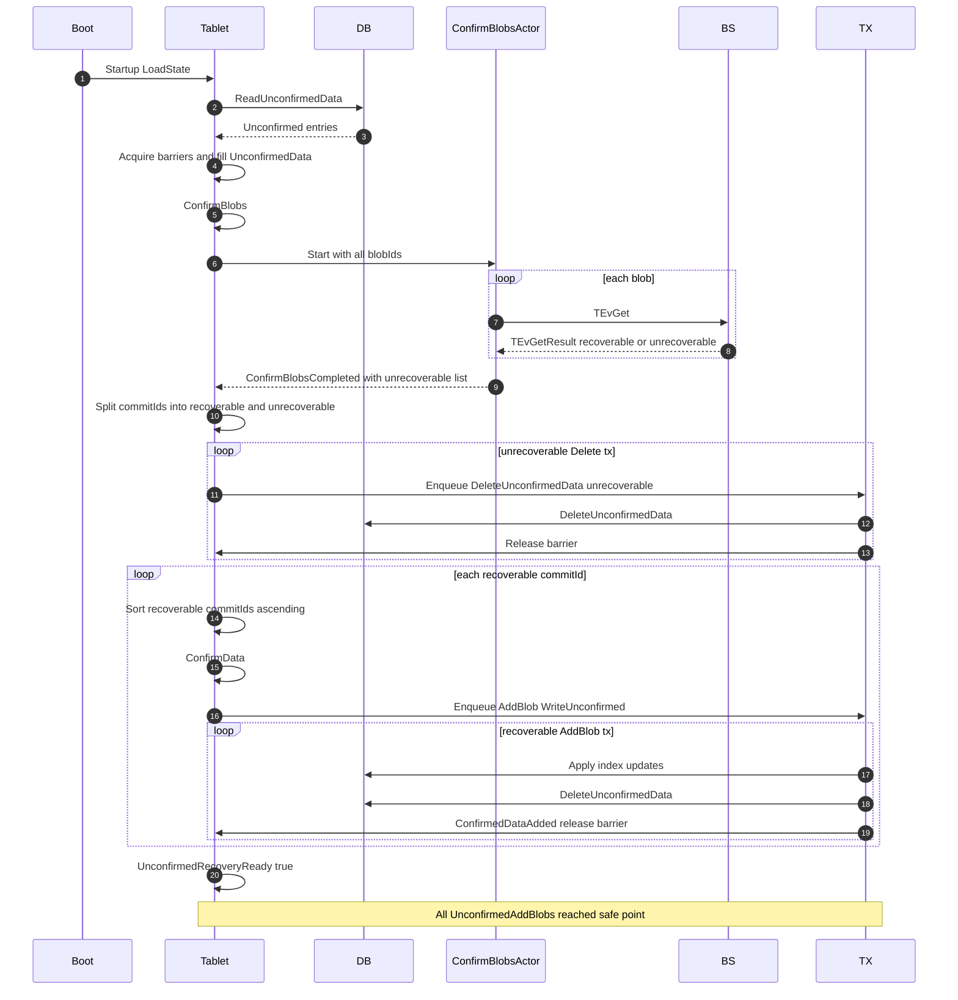
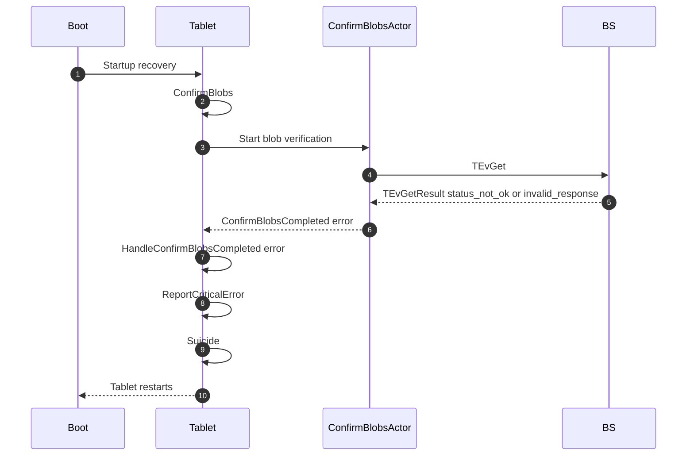

## Idea

The idea of this feature is to make large writes faster by writing blobs in
parallel and separating index updates into stages:
`GenerateBlobIds + (BlobWrite + AddDataToPersistentStorage) +`
`ConfirmAddData(trigger reliable addition to index) /`
`CancelAddData(removes from persistent storage)`.

- Instead of sending a full `AddData` request after blob write, the tablet
  stores a lightweight persisted `UnconfirmedData` record created from the
  `GenerateBlobIds` request. This allows correct recovery after an unexpected
  restart while preserving write ordering. After confirmation, we trigger the
  data-to-index phase and respond from the point where we can guarantee that
  data will not be lost and will have correct visibility.

If blob writes succeed, `ConfirmAddData` commits metadata/index updates. If
they fail, `CancelAddData` removes the staged record and releases barriers.

The flow is also adaptive: `UseUnconfirmedFlow` is enabled only when both the
service and the tablet allow it, and the tablet can disable it dynamically.

Both aligned and unaligned data are supported.

The current version of the feature relies on ordering guarantees, so reads can
proceed safely at any moment without interruption.

## High level overview from vhost side

From the vhost perspective, we have the same number of tablet calls as before.
Previously, the flow was `GenerateBlobIds + AddData`; now it is
`GenerateBlobIds + ConfirmAddData/CancelAddData`, and the actual payload is
sent in `GenerateBlobIds`.

It is important that `ConfirmAddData` and `CancelAddData` are delivered to the
tablet unless the tablet is dead. Because of this, vhost retries these
requests until it receives any response that is not a TabletProxy-origin
error.

Write blob success scenario:

Write blob fail scenario:

## Tablet side flows

**Success:**

For happy path we have 2 possible scenarios:

1. ConfirmAddData comes **after** AddDataUnconfirmed finishes (means that
   adding to index faster than writing to blob storage). In that case we
   immediately Enqueue AddBlob transaction and Response will be sent during its
   Execute phase.
2. ConfirmAddData comes **before** AddDataUnconfirmed finishes (means that
   adding to index slower than writing to blob storage). In that case we wait
   until AddDataUnconfirmed finishes and upon completion schedule AddBlob. We
   monitor such cases with separate metric `DeferredCount`.

Notes:

We sending response to the client from Execute phase to ensure that transaction
will not be reordered because of page fault. In reality, under normal
conditions we should not receive page faults because we always load needed data
during AddDataUnconfirmed transaction that runs right before AddBlob.

For flow when we receive ConfirmAddData after AddDataUnconfirmed we reuse
deffereMap for the sake of simplicity. In the future we can remove it at all,
after supporting out of order insertion for page fault cases. Task for that
improvement:
[Filestore] Support immediate response to ConfirmAddData in UnconfirmedData flow
- [Issue #5353](https://github.com/ydb-platform/nbs/issues/5353)

ConfirmAddData after AddDataUnconfirmed completion:

ConfirmAddData before AddDataUnconfirmed completion:

## Cache reads during the Execute→Complete window

As noted above, for unconfirmed writes we answer the client from the `AddBlob`
**Execute** phase. The in-memory caches, however, are only updated in the
**Complete** phase. This opens a window where:

- `AddBlob` Execute has already applied the new index data inside the
  transaction and the client has received its `OK`, but
- `CompleteTx_AddBlob` has not run yet, so the in-memory caches still hold the
  pre-write view.

A concurrent request served *from cache* during this window can observe **stale**
metadata. Two caches are affected:

- the in-memory index-state cache (`ReadNode` / `ReadNodeAttr`);
- the read-ahead cache served by `DescribeData`
  (`TryFillDescribeResult`). Here the danger is twofold: a concurrent *older*
  `DescribeData` could even re-populate the read-ahead cache with the **old**
  blob mapping inside this window.

To close the window both caches share a single **cache read bypass**
(`TCacheReadBypass`, in `tablet_cache_read_bypass.{h,cpp}`). The lifecycle is
keyed by `(nodeId, commitId)`:

- on `AddBlob` Execute for `WriteUnconfirmed` we
  `ActivateCacheReadBypass(nodeId, commitId)` — registering the in-flight write
  under its node;
- on `CompleteTx_AddBlob` for `WriteUnconfirmed` we
  `DeactivateCacheReadBypass(nodeId, commitId)`.

While a node has active in-flight commit ids, a clashing cache read is forced to
**bypass the cache** and go through the full DB transaction path. The decision
is made by `ShouldBypassRead(nodeId, commitId)`:

- recovery not finished (`!UnconfirmedRecoveryReady`) → always bypass;
- no active commit ids for `nodeId` → read from cache;
- otherwise compare the **oldest** active commit id for that node with the read
  snapshot. Commit ids are generated monotonically and the per-node queue is
  activated/deactivated in the same order, so the front item is the oldest write
  that may still be missing from cache. A read at `commitId` can only observe
  writes with commit id `<= commitId`, hence:
  - `frontCommitId <= commitId` (or `frontCommitId == InvalidCommitId`, which
    covers the commit-id-overflow case) → a visible write is still in flight →
    **bypass**;
  - otherwise the oldest in-flight write is newer than the read snapshot, so the
    cache cannot be missing any data visible to this read → serve from cache.

This keeps the read snapshot consistent without blocking: only clashing reads
take the slower full-transaction path, and only for the short Execute→Complete
window. Today this is a coarse "bypass and go full TX" approach; it can be
replaced by a waiting queue that resumes the read once the write completes. See:
[Filestore] use a waiting queue instead of going full TX flow for cache bypass
- [Issue #5912](https://github.com/ydb-platform/nbs/issues/5912).

## Session interuption

Session interruptions during vhost (client) <-> tablet communication can happen
for several reasons. Because this flow depends on strict message ordering, we
cannot allow stale `UnconfirmedData` records to remain stale. Each record must
eventually be finalized by either `ConfirmAddData` or `CancelAddData`.

When the connection is stable, we rely on vhost (client) to send one of these
requests. If a session is interrupted, the tablet treats all unconfirmed
records from that session as orphaned, marks them for deletion, and schedules
cleanup.

As a result, those records are either deleted before subsequent writes, or, if
a crash happens before cleanup completes, they are handled by the recovery flow
(which replays remaining unconfirmed records into the index with new commit
IDs).

For such cases we return errors to client even if client somehow managed to
receive response.

### Cleanup by both session id and pipe server id

A pipe disconnect arrives as `TEvServerDisconnected` and is handled by
`HandleSessionDisconnectedInWork`. Cleanup is driven by **two** keys, because a
single key is not sufficient:

- **By session id.** From the disconnected pipe server we resolve the matching
  session ids (`FindSessionIdsByPipeServer`) and call
  `DeleteUnconfirmedDataForSession` for each.
- **By pipe server id.** We additionally call
  `DeleteUnconfirmedDataForPipeServer(msg.ServerId)`.

Deletion by **session id** is not limited to the disconnect path.
`DeleteUnconfirmedDataForSession` is also called when:

- a session is **recreated/restored** — `CompleteTx_CreateSession` with
  `SessionInterrupted` set (a client `CreateSession` that recovers an existing
  session, by seqNo or via `RestoreClientSession`);
- a session is **destroyed** — `CompleteTx_DestroySession`.

So a session recreation still drops that session's unconfirmed data. Deletion by
**pipe server id** is the part that is specific to the disconnect path.

The pipe-server-id path matters for the **sharded WriteData** case. There,
`GenerateBlobIds` can reach the shard through a *direct write pipe* created by
the service write actor — **not** through the pipe that created the shard
session. When such a direct write pipe disconnects, the shard cannot resolve it
back to a session, so deleting by session id alone would leave the unconfirmed
record behind. To cover this, `HandleGenerateBlobIds` stores the pipe server id
(`ev->Recipient`) in each `TTrackedUnconfirmedData` entry (alongside
`SessionId`), and on disconnect we also delete every entry owned by that pipe.

Both paths funnel through the same `DeleteUnconfirmedData` helper (it just takes
a different `shouldDelete` predicate), so they share the ordering guarantee
described below: once commit ids are placed into the `DeletionQueue`, the
`DeleteUnconfirmedData` tx must run before any later `AddBlob` execute, which is
why it is kept page-fault-free.

Some scenarios with such interruptions can be observed below. `CancelAddData`,
generally speaking, has the same situation but in comparison with
`ConfirmAddData` it schedules "delete" in all cases if it is not already
scheduled and responds immediately, because of order guarantee.

## Recovery

Due to the crash or graceful shutdown when we were not able to finish all
in-flight AddBlobs for UnconfirmedData, we add them to index upon recovery.
During this procedure system blocks all attempts to write to the same nodes.
We can improve this situation in the future with some optimization that
described in this ticket:
[Filestore] Make unconfirmed blobs confirmation async during CompactionStateLoad
- [Issue #5376](https://github.com/ydb-platform/nbs/issues/5376).

Blobs that can't be recovered scheduled for deletion. Upon successful recovery
(when all recovered blobs reached safe point) we unblock data modification
operations. Delete operation can't be rescheduled and this gives us freedom not
to wait safe point. Recovery flow can be observed below:

Recovery flow:

In case of invalid or error answer from blob storage during recovery we Report
Critical error and Die.

Recovery error path:

## Writes after restart

In normal flow we restrict data modifications (except regular WriteData) on
start until CompactionMap is loaded. With Unconfirmed flow we extend this time
until recovery is ready. Currently it leads to increasing delay upon restarts.
It can be eliminated after implementation of:
[Filestore] Make unconfirmed blobs confirmation async during CompactionStateLoad
- [Issue #5376](https://github.com/ydb-platform/nbs/issues/5376).

For WriteData we have separate mechanic during compaction load procedure and
allow writes for ranges that already loaded. In this place we restrict writing
only for those nodes and ranges which intersect with UnconfirmedData in
recovery phase.

## Reads after restart

Because after restart we can't guarantee that read from the client will be
executed sequentially after blobs in recovery, we reject reads that intersect
with unconfirmed data by nodeid+range. Currently it can decrease read speed
upon restart, but can be eliminated with rescheduling tx mechanic in the
future. See task:
[Filestore] add pending/queued reads for unconfirmed data overlaps during
restart - [Issue #5397](https://github.com/ydb-platform/nbs/issues/5397).
